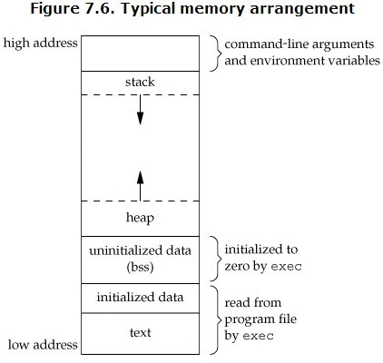

# 9内存模型和名称空间（4）
**原来的**程序分为三个部分
1. 头文件：包含结构声明和使用这些结构的函数的原型//结构声明与函数原型
2. 源代码文件：包含与结构有关的函数代码         //函数
3. 源代码文件：包含调用与结构相关的函数的代码   //调用函数

这种组织方式也与oop方式一致。
1. 一个文件（头文件）包含用户定义类型的定义；
2. 另外一个文件包含操纵用户定义类型的函数代码；
> 这两个文件组成了一个软件包，可用于各种程序中。

* 请不要将**函数定义**或**变量声明**放在头文件中，如果其他文件都包含这个头文件，那么同一个函数就会有多次定义，变量也同理，会出错。

## 头文件中常包含的内容：
* 函数原型。
* 使用#define或const定义的符号常量（头文件中不可以创建变量）
* 结构声明=>因为它们不创建变量
* 模板声明=>模板声明不是将被编译的代码，他们指示编译器如何生成源代码中的函数调用相匹配的函数定义。
* 内联函数-->只有**它**可以在头文件定义函数。

被声明为**const的数据**和**内联函数**有特殊的链接属性

注意：在IDE中
1. 不要将头文件加入到项目列表中
2. 也不要在源代码文件中使用#include来包含其他源代码文件

在同一文件中只能将同一个头文件包含一次。-->**使用预编译指令**
```C++
#ifndef COORDIN_H_
...

#endif
```
* **但是**这种方法并不能防止编译器将头文件包含两次，而只是让它忽略第一次包含之外的所有内容。大多数标注C和C++头文件都是用各种防护(guarding)方案。否则，可能在一个文件中定义同一个结构两次，这将导致编译错误。

## 编译
### 在UNIX系统中编译由多个文件组成的C++程序
1. 编译两个源代码文件的UNIX命令： CC file1.cpp file2.cpp
2. 预处理将包含的文件与源代码文件合并：

临时文件： temp1.cpp temp2.cpp

3. 编译器创建每个源代码文件的目标代码文件：file1.o file2.o
4. 链接程序将目标代码文件(file1.o file2.o)、库代码(Library code)和启动代码(startup code)合并，生成可执行文件：a.out
### 多个库的链接
* 由不同编译器创建的二进制模块（对象代码文件）很可能无法正确地链接。
* 原因：两个编译器为同一个函数生成不同的**名称修饰**
* 名称的不同将使链接器无法将一个编译器生成的函数调用与另外一个编译器生成的函数定义匹配。在链接编译模块时，请确保**所有对象文件**或**库**都是由同一编译器生成的。
* 链接错误解决的方法：如果有源代码，通常可以用自己的编译器重新编译来消除错误。
## 存储持续性，作用域与和链接性
C++中的四种存储方案
1. **自动存储持续性** :在函数定义中声明的变量（包括函数参数）的存储持续性为自动的。它们在程序开始执行其所属的函数或代码块时被创建，在执行完函数或代码块时，它们使用的内存被释放。
2. **静态存储持续性** :在函数定义外定义的变量和使用关键字static定义的变量的存储持续性都为静态。（请注意）它们在整个运行过程中都存在。
3. **线程存储持续性(C++11)** :当前，多核处理器很常见，这些CPU可同时处理多个执行任务。这让程序能够将计算放在可并行处理的不同线程中。如果变量是使用关键字thread_local声明的，则**其生命周期与所属的线程一样长**。
4. **动态存储持续性** :用new运算符分配的内存将一直存在，直到使用delete运算符将其释放或程序结束为止。这种内存的存储持续性为动态，有时被称为自由存储(free store)或堆(heap)。

作用域和链接性
* **作用域(scope)** 描述了名称在文件的多大范围内可见。例如，函数中定义的变量可在该函数中使用，但不能在其他函数中使用；而在文件中的函数定义之前定义的变量则可在所有函数中使用。
* 作用域：**局部与全局**-->(代码块/文件)
1. 作用域为**局部**的变量只在定义它的代码块中可用。（代码块：由花括号括起的一系列语句，比如：函数体）
2. 做英语为全局（也叫**文件作用域**）的变量在定义位置到文件结尾都可以用。


* **链接性(linkage)** 描述了名称如何在不同单元间共享。链接性为外部的名称可在文件间共享，链接性为内部的名称只能由一个文件中的函数共享，自动变量的名称没有链接性，因为它们不能共享。

### C++内存空间分布


1.命令行参数和环境变量

shell在执行程序的时候调用exec函数将命令行参数传递给要执行的程序。

使程序了解进程环境，在执行时分配空间。

2.bss段（Block Start by Symbol）

存放未初始化的全局变量或者静态变量。

3.data段

存放具有明确初始值的全局变量或者静态变量。

存在于程序镜像文件中，由 exec 函数从程序镜像文件中读入内存。

4.text段

CPU执行的机器指令。

堆栈简要概述
栈：系统自动开辟空间，自动分配自动回收，在作用域运行完成后（函数返回时）就会被回收。

堆：由程序员自己申请空间，释放空间，不释放会出现内存泄漏。

栈

1.栈是连续的向下扩展的数据结构，总共只有1M或者2M的空间。空间不足就会异常提示栈溢出。

2.存储自动变量, 函数调用者信息, 包括函数参数(可变参数列表的压栈方向是从右向左), 函数内局部变量, 函数返回值, 函数调用时的返回地址。

堆

1.堆是不连续的向上扩展的数据结构，大小受限于计算机系统虚拟内存的大小。

2.操作系统有一个记录空闲内存地址的链表，当系统收到程序的申请时，会遍历该链表，寻找第一个空间大于所申请空间的堆结点，然后将该结点从空闲结点链表中删除，并将该结点的空间分配给程序。

对于大多数系统，会在这块内存空间中的首地址处（一般为一个字节的大小）记录本次分配的大小，这样，代码中的 delete语句才能正确的释放本内存空间。

由于找到的堆结点的空间大小可能大于申请的大小，系统会自动的将多余的那部分（即内存碎片）重新放入空闲链表中。这就涉及到申请效率的问题。

## 引入名称空间之前

**下面列出5种变量存储方式（引用名称空间之前）**

| 存储描述 | 持续性 | 作用域 | 链接性 | 如何声明 |
| ------ | ------ | ------ | ------ | ------ |
| 自动 | 自动 | 代码块 | 无 | 在代码块中 |
| 寄存器 | 自动 | 代码块 | 无 | 在代码块中，使用关键字register |
| 静态,无链接性 | 静态 | 代码块 | 无 | 在代码块中，使用关键字static |
| 静态,外部链接性 | 静态 | 文件 | 外部 | 不在任何函数内 |
| 静态,内部链接性 | 静态 | 文件 | 内部 | 不在任何函数内，使用关键字static|

1. 自动存储持续性

在默认情况下，在函数中声明的函数参数和变量的存储持续性为自动，作用域为局部，没有链接性（自动变量不能共享）。
* 自动变量的初始化：可以使用任何声明时其值已知的表达式来初始化自动变量`int x=5;int y=2*x;`
* 自动变量和栈：自动变量的数目随函数的开始和结束而增减，因此程序必须在运行是对自动变量进行管理。常用方法是流出一段内存，并将其视为栈。程序使用两个指针来跟踪栈，一个指向**栈底**，栈的开始位置。另外一个指针指向栈顶，下一个可用内存单元。栈是LIFO（后进先出）的，即最后加入到栈中的变量首先被弹出。

2. 寄存器变量-->旨在提高访问变量的速度

关键字**register**最初由C语言引入的，它建议编译器使用CPU寄存器来存储自动变量
```C++
register int count_fast;//request for a register variable
```
鉴于关键字register只能用于原来就是自动的变量，使用它的唯一原因是，**指出程序员想使用一个自动变量，这个变量名可能与外部变量相同**

3. 静态持续变量

C++也为静态存储持续性提供了**三种链接性**
* 1.外部链接性（可在其他文件中访问）
* 2.内部链接性（只能在当前文件中访问）
* 3.无链接性（只能在当前函数或代码块中访问）

这三种链接性都在整个程序执行期间一直存在，与自动变量相比，他们的寿命更长。**由于静态变量的数目在程序运行期间是不变的，因此程序不需要使用特殊的装置（如栈）来管理它们，编译器将分配固定的内存块来存储所有的静态变量，这些变量在整个程序执行期间一直存在。另外，如果没有显示地初始化静态变量，编译器将把它设置为0。在默认情况下，静态数组和结构将每个元素或成员的所有位都设置为0。**被称为0初始化

* 例子：
```C++
int  NUM_ZDS_GLOBAL = 80;                              //#1
static  int NUM_ZDS_ONEFILE = 50;                      //#2
int  main(){
…
}
void  fun1(int n){
static int  nCount = 0;                                   //#3
int  nNum = 0;                                             //#4
}
void  fun2(int q){
         …
}
```
#1、#2、#3在整个程序运行期间都存在。在fun1中声明的#3的作用域为局部，没有链接性，这意味着只能在fun1函数中使用它，就像自动变量#4一样。但是，与#4不同的是，即使在fun1没有被执行的时候，#3也保留在内存中。

静态变量初始化
```C++
#include<cmath>
int x;                //零初始化 
int y=5;              //常量表达式初始化
long z=13*13;         //常量表达式初始化
const double pi=4.0*atan(1.0);//动态初始化，要初始化pi，必须调用函数atan()，这需要等到函数被链接上且程序执行时。（这也是常量表达式初始化）
//C++新增关键字constexpr，这增加了创建常量表达是的方式
```
## 1.静态持续性，外部链接性==>普通全局变量

链接性为外部的变量通常称为**外部变量**，它们的**存储持续性为静态**，作用域为整个文件。

**外部变量**是函数外部定义的，因此对所有函数而言都是外部的。

例如，可以在main()前面或头文件中定义他们。可以在文件中位于外部定义后面的任何函数中使用它。

因此**外部变量**也称为**全局变量**。

**全局变量**是在所有函数体的外部定义的，程序的所在部分（甚至其它文件中的代码）都可以使用。全局变量不受作用域的影响（也就是说，全局变量的生命期一直到程序的结束）。如果在一个文件中使用extern关键字来声明另一个文件中存在的全局变量，那么这个文件可以使用这个数据。

## 单定义规则
一方面，在每个使用外部变量的文件中，都必须**声明**它；另外一方面，C++有“单定义规则”，该规则指出，变量只有一次定义。
> 为满足这种需求，C++提供了两种变量声明。
* 1. 一种是定义声明（defining declaration）或简称为定义（definition），它给变量分配存储空间。
* 2. 一种是引用声明（referencing declaration）或简称为声明（declaration），它不给内存变量分配存储空间。

**引用声明**使用关键字extern，且不进行初始化；否则，声明未定义，导致分配内存空间：例
```C++
double up;//definition,up is 0 定义
extern int bllem;//blem defined elsewhere 声明，blem变量在某处定义了
extern char gr = 'z';//definition because initialized 定义
```
### 注意：
1. 单定义规则并非意味着不能有多个变量名称相同
2. 如果函数中声明了一个与外部变量同名的变量，结果将如何呢？
```C++
//external1.cpp 文件1
double warning=0.3;//warning defined 定义
//support.cpp 文件2
extern double warning;//use warning from another file 使用外部定义的变量warning
......
void update(double dt)
{
extern double warning;//optional redeclaration
......
}
void local()
{
//定义域全局变量名相同的局部变量都，局部变量将隐藏全局变量
double warning=0.8;//new variable hides external one
......
}
```
通常情况下，应使用局部变量，然而全局变量也有它们的用处。例如，可以让多个函数可以使用同一个数据块（如月份，名数组或原子量数组）。外部存储尤其适用于表示常量数据，因为这样可以使用关键字const来防止数据修改。

## 2.静态持续性，内部链接性==>Static全局变量
* 全局变量（外部变量）的说明之前再冠以static就构成了静态的全局变量。全局变量本身就是静态存储方式，静态全局变量当然也是静态存储方式。
* 这两者在存储方式上并无不同。这两者的区别在于非静态全局变量的作用域是整个源程序，当一个源程序由多个原文件组成时，非静态的全局变量在各个源文件中都是有效的。**而静态全局变量则限制了其作用域，即只在定义该变量的源文件内有效，在同一源程序的其它源文件中不能使用它。**
* 由于静态全局变量的作用域限于一个源文件内，只能为该源文件内的函数公用，因此**可以避免在其他源文件中引起错误**。
*　static全局变量与普通的全局变量的区别是static全局变量只初始化一次，防止在其他文件单元被引用。

## 3.静态持续性，无链接性==>静态局部变量
这种变量是这样创建的，将static限定符用于代码块中定义的变量。

在两次函数调用之间，**静态局部变量**的值将保持不变，它同时拥有静态变量和局部变量的特性，即：
1. 编译时自动初始化
2. 会被放到静态内存的静态区
3. 只能在局部被访问
### 作用：
有时候我们需要在两次调用之间对变量进行保存，通常的想法是定义一个全局变量来实现。但这样一来变量就不属于函数本身了，而受全局变量的控制。**静态局部变量正好可以解决这个问题，静态局部变量保存在全局数据区，而不是保存在栈中，每次的值保持到下一次调用，直到下一次赋新值**

## 说明符和限定符
### 存储说明符(storage class specifier)
* auto(在C++11中不再是说明符)：**在C++11之前，可以在声明中使用关键字auto来指出变量为自动变量**；但在C++11中，auto用于自动类型推断。
* register：用于在声明中指示寄存器存储，在C++11中，它只是显式地指出变量是自动的。
* static:关键字static被用在作用域为整个文件的声明中时，表示内部**链接性**；被用于局部声明中，表示局部变量的**存储持续性**为静态的。
* thread_local(C++11新增)：可以用static或extern结合使用，关键字thread_local指出变量持续性与其所属的持续性相同。thread_local变量之于线程，由于常规静态变量至于整个程序。
* mutable：关键字mutable的含义根据const来解释

mutable:可以用来指出，即使结构（或类）变量为const，其某个成员也可以被修改。
```C++
struct data
{
char name[30];
mutable int accesses;
...
}

const data veep={"claybourne clodde",0,...};
strcpy(veep.name,"ytttt"); //not allowed
veep.accessses++;          //allowed
```
### CV限定符（cv-qualifier）
* const:它表明，内存被初始化后，程序便不能再对他进行修改。
* volatile: volatile 关键字是一种类型修饰符，用它声明的类型变量表示可以被某些编译器未知的因素更改，比如：操作系统、硬件或者其它线程等遇到这个关键字声明的变量，编译器对访问该变量的代码就不再进行优化，从而可以提供对特殊地址的稳定访问
##### 再谈const
* const限定对默认存储类型稍有影响。**在默认情况下，全局变量的链接性为外部的，但const全局变量的链接性为内部的**
```C++
const int fingers = 10;//same as static const init fingers=10;
int main(){
...
}
```
* 原因：C++这样子修改了常量类型的规则，让程序员更轻松
* 假如，假设将一组常量放在头文件中，并在同一程序的多个文件中使用该头文件。**那么预处理器将头文件中的内容包含到每个源文件后，所有的源文件都将包含类似下面的定义：**
```C++
const int fingers=10;
const char* warning ="wak!";
```

* **如果全局const声明的链接性像常规变量那样是外部的，则根据单定义规则，这将出错（二义性）。**也就是说只能有一个文件可以包含前面的声明，而其他文件必须使用extern关键字来提供引用声明。另外只有未使用extern关键字的生命才能进行初始化。
* 然而，由于外部定义的const数据的链接性为内部的，因此可以在所有文件中使用相同的声明。
* **内部链接性意味着每个文件都有自己一组常量，而不是所有文件共享一组常量。每个定义都是其所属文件所私有的，这就是能够将常量定义放在头文件中的原因。**

## 函数和链接性
* 和C语言一样，C++不允许在一个函数中定义另外一个函数=>因此所有函数的存储持续性都自动为**静态的**，即整个程序执行期间都一直存在。
* 在默认情况喜爱，函数的链接性为**外部的**，即**可以在文件间共享**。
1. 实际上可以使用**extern关键字**来指出函数是在另外一个文件中定义的，不过这是可选的。
2. 使用**关键字static**将函数链接性改为内部链接性，使其只能在本文件中使用，**必须在原型和函数定义中同时使用该关键字**。

* **单定义规则**也适用于非内联函数，因此对于每个非内联函数，程序只能包含一个定义。对于链接性味外部的函数来说，这意味着在多文件程序中，只能有一个文件包含该函数的定义，但使用该函数的每个文件都应包含其函数原型。

* **内联函数**不受这种规则的约束，这允许程序员能够将内联函数的定义放在头文件中，这样包含了头文件的每个文件都有内联函数的定义。然而，C++要求同一个函数的所有内联定义都必须相同。


## C++在哪里寻找函数？
假设在程序的某个文件中调用一个函数，C++将到哪里寻找函数定义？

1. 如果该文件中的函数原型指出该函数是静态的，则编译器将只在该文件中查找函数定义；
2. 否则，编译器（包括链接程序）将在所有文件中查找。
3. 如果在程序文件中找不到，编译器将在库中搜索。这意味着，如果定义了一个与库函数同名的函数，编译器将使用程序员定义的版本，而不是库函数。

## 语言链接性
链接程序要求每个不同的函数都有不同的符号名。在C语言中，一个名词只对应一个函数，因此这很容易实现。为满足内部需要，C语言编译器可能将spiff这样的函数名翻译为_spiff。这种方法称为C语言链接性（C language linkage）。但在C++中，同一个名称可能对应多个函数，必须将这些函数翻译为不同的符号名称。因此，C++编译器执行名称纠正或名称修饰，为重载函数生成不同的符号名称。例如，spiff（int）转换为`—_spiff_i`，而将spiff(double, double)转换为_spiff_d_d。这种方法称为C++语言的链接性（C++ language linkage）。

如果要在C++程序中使用C语言预编译的函数，将出现什么情况呢？例如，假设有如下代码：spiff(22);它在C库文件中的符号名称为_spiff,但对于我们的C++链接程序来说，C++查询约定是查找符号民称_spiff_i。为解决这样的问题，可以用函数原型来指出要使用何种约定：
```C++
extern “C” void spiff(int);//使用C语言链接性
extern void spoff(int);//使用C++语言的链接性(通过默认方式指出)
extern “C++” void spaff(int);//使用C++语言的链接性（通过显式指出）
```
C和C++链接性是C++标准制定的说明符，但实现可以提供其他语言链接性说明符。

##  存储方案和动态分配
使用C++运算符new（或C函数malloc()）分配的内存，这种内存被称为**动态内存**，**动态内存由运算符new和delete控制，而不是由作用域和链接性规则控制。因此，可以在一个函数中分配动态内存，而在另外一个函数中将其释放。**其分配方式要取决于new和delete在何时以何种方式被使用。通常编译器使用三块独立的内存：
1. 一块用于静态变量（可能再细分）
2. 一块用于自动变量
3. 另外一块用于动态存储
* 虽然存储方案概念不是用于动态内存，但适用于用来跟踪动态内存的自动和静态**指针变量**（自动指针变量，静态指针变量），**指针变量还是有作用域和链接性的**

### new运算符
如果要为内置的标量类型（int、double）分配存储空间并初始化，可在类型名后面加上初始值，并将其用括号括起。
```C++
int *pi = new int(6);
```
要初始化常规结构或数组，需要使用大括号的列表初始化，这要求编译器支持C++11。
```C++
struct where{double x, double y, double z};
where *one = new where{2.5, 5.3, 7.2};
int *ar = new int[4] {2, 4, 7, 6};
```
在C++11中，还可将初始化列表用于单值变量：
```C++
int *pin = new int {6};
```
#### new失败时
* 在最初的10年中，C++让new失败时返回空指针，但现在将引发std::bad_alloc异常。
#### new：运算符、函数和替换函数
运算符与函数：
```C++
//分配函数（allcation function）；
void *operator new(std::size_t);//函数
void *operator new[](std::size_t);//函数
//释放函数（deallocation function）；
void *operator delete(void *);//函数
void *operator delete[](void *);//函数

int *pi=new int;//运算符
int *pi=new(sizeof(int));//函数
int *pi=new int[40];//运算符
int *pi=new(40*sizeof(int));//函数
```
替换函数：
* 有趣的是，C++**将这些函数（分配函数，释放函数）**称为可替换的（replaceable）。这意味着如果您有足够的知识和意愿，可为new和delete提供替换函数，并根据需要对其进行定制。例如，可定义作用域为类的替换函数，并对其进行定制，以满足该类的内存分配需求。在代码中，仍将使用new运算符，但它将调用您定义的new()函数。

### 定位new运算符
**通常，new负责在堆（heap）中找到一个足以能够满足要求的内存块**。new运算符还有另一种变体，被称为**定位（placement）new运算符，它让您能够指定要使用的位置**。程序员可能使用这种特性来设置其内存管理规程、处理需要通过特定地址进行访问的硬件或在特定位置创建对象。

要使用定位new特性，首先需要**包含头文件new**，它提供了这种版本的new运算符的原型；然后将new运算符用于提供了所需地址的参数。除需要指定参数外，句法与常规new运算符相同。具体地说，使用定位new运算符时，变量后面可以有方括号，也可以没有。下面的代码段演示了new运算符的4种用法：
```C++
#include <new>
char buffer1[50];//静态数组
char buffer2[500];
struct chaff
{
char dross[20];
int slag;
};
chaff *p1, *p2;
int *p3, *p4;
p1=new chaff;  //place structure in heap
p3=new int[20];  //place int array in heap
p2=new (buffer1) chaff;  //place structure in buffer1
p4=new (buffer2) int[20];  //place int array in buffer2
```
上述代码从buffer1中分配空间给结构chaff，从buffer2中分配空间给一个包含20个元素的int数组。

* 定位new运算符的其他形式
就像常规new调用一个接受一个参数的new函数一样，**标准定位new调用一个接收两个参数的new函数。**
```C++
int * p1=new int;//调用 new(sizeof(int))
int * p2=new(buffer) int;//调用 new(sizeof(int),buffer)
int * p3=new(buffer) int[40];//调用new(40*sizeof(int),buffer)
```
* 定位new运算符不可替换，但可重载。至少需要接收两个参数，其中第一个总是std::size_t，指定了请求的字节数。这样的重载函数都被定义为new。

## 名称空间
在C++中，名称可以是变量，函数，结构，枚举，类以及类的结构成员

### 两个概念：声明区域、潜在作用域
**声明区域(declaration region)**

可以在其中进行声明的区域
* 在函数外面声明全局变量=>对这种变量，其声明区域为**其声明所在的文件**。对于在函数声明的变量=>其声明区域为其声明所在的**代码块**。

**潜在作用域（potential scope）**

变量潜在作用域从声明点开始，到其声明区域的结尾。因此潜在作用域比声明区域小，**这是由于变量必须定义后才能使用**。
* 变量并非在其潜在作用域的任何位置都是可见的。
1. 例如，它可能被另外一个嵌套声明区域中声明的同名变量隐藏
2. 例如，在函数声明的局部变量（对于这种变量，声明区域为整个函数）将隐藏在同一文件中声明的全局变量（对于这种变量，声明区域为整个文件）。

* 变量对程序而言可见的范围被称为作用域（scope）。
### 新的名称空间(命名的名称空间)
即通过**定义一种新的声明区域来创建命名的名称空间**，这样做的目的之一是提供一个声明名称的区域。一个名称空间中的名称不会和另一个名称空间中的名称发生冲突，同时允许程序的其他部分使用该名称空间中声明的东西。
* 关键字**namespace**
* 名称空间可以是全局的，也可以位于另一个名称空间中，但是不能位于代码块中。因此在默认情况下，**在名称空间中声明的名称的链接性为外部的（除非它引用了常量）。**
* 除用户定义的名称空间，还存在另外一个名称空间**全局名称空间(global namespace)**。它对应文件级声明区域，因此前面所说的全局变量现在被描述为位于全局名称空间中

### using 声明和using编译指令
* using声明使特定的标识符可用:
```C++
  using std::cout;//将cout添加到它所属的声明区域中，即使得cout能够在main函数中直接使用
```
* using编译指令使整个名称空间可用：
```C++
  using namespace std;//使得std空间中所有的名称都可以直接使用
```


### using编译指令和using声明之比较
* 使用using声明时，就好像声明了相应的名称一样，如果某个名称已经在函数中声明了，则不能用using声明导入相同的名称。
* 然而，使用using编译指令时，将进行名称解析，就像在包含using声明和名称空间本身的最小声明区域中声明了名称一样。如果使用using编译指令倒入一个已经在函数中声明的名称，则局部名称将隐藏名称空间名，就像隐藏同名的全局变量一样。

> 一般来说，使用using声明要比使用using编译指令更加安全，这是由于它只能导入指定的名称，如果该名称与局部名称发生冲突，编译器将发出指示。

> using编译指令导入所有的名称，包括可能并不需要的名称，如果与局部名称发生冲突，则局部名称将覆盖名称空间版本而编译器不发出警告！  另外，名称空间的开放性意味着名称空间的名称可能分散在多个地方，这使得难以准确知道添加了哪些名称。所以我们平时自己写程序时先怼一个using namespace std;上去可能并不是一个很好的决定。

***
