# C++光速入门

```

```
入门前提:C语言  
环境:DEV C++ / Clion
配置环境
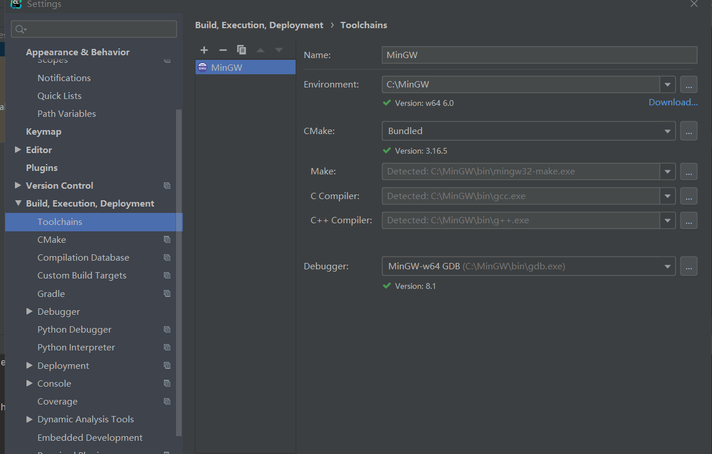  
新建项目就自带了cmakelists.txt了.那就开始吧 

markdown环境 vscode

## 1 Hello World

 ```cpp
#include<iostream> //输入输出头文件
using namespace std; //使用标准命名空间 记得分号

int main(){ //主函数
	cout<<"hello world!"<<endl;//输出
	return 0; //返回0 程序正常结束
}
 ```

```cpp
#include<iostream>
using namespace std;

namespace A{
  int  i=10;
}

namespace B{
	int  i=20;
	namespace C{//命名空间的定义可以嵌套
       int i=30;
	}
	int n=i+C::i;
}

int main(){
    cout<<A::i<<endl;   //或者using namespace A;
    cout<<B::i<<endl;
    cout<<B::n<<endl;
    return 0;
}

```

## 2 数据类型及表达范围
使用编程语言进行编程时，需要用到各种变量来存储各种信息。变量保留的是它所存储的值的内存位置。这意味着，当您创建一个变量时，就会在内存中保留一些空间。  

您可能需要存储各种数据类型（比如字符型、宽字符型、整型、浮点型、双浮点型、布尔型等）的信息，操作系统会根据变量的数据类型，来分配内存和决定在保留内存中存储什么。  

类型	关键字  
布尔型	bool  
字符型	char  
整型	int  
浮点型	float  
双浮点型	double  
无类型	void  
宽字符型	wchar_t  


|类型|位|范围 |
|--|---|------|
|char|	1 个字节|	-128 到 127 或者 0 到 255  |
unsigned char|	1 个字节|	0 到 255  
signed char	|1 个字节|	-128 到 127  
int	|4 个字节|	-2147483648 到 2147483647  
unsigned int|	4 个字节|	0 到 4294967295  
signed int	|4 个字节|	-2147483648 到 2147483647  
short int	|2 个字节|	-32768 到 32767  
unsigned short int	|2 个字节|	0 到 65,535  
signed short int	|2 个字节|	-32768 到 32767  
long int	|8 个字节|	-9,223,372,036,854,775,808 到 9,223,372,036,854,775,807  
signed long int	|8 个字节|	-9,223,372,036,854,775,808 到 9,223,372,036,854,775,807  
unsigned long int	|8 个字节|	0 到 18,446,744,073,709,551,615  
float	|4 个字节|	精度型占4个字节（32位）内存空间，+/- 3.4e +/- 38 (~7 个数字)  
double	|8 个字节|	双精度型占8 个字节（64位）内存空间，+/- 1.7e +/- 308 (~15 个数字)  
long double	|16 个字节|	长双精度型 16 个字节（128位）内存空间，可提供18-19位有效数字。  
wchar_t	|2 或 4 个字节|	1 个宽字符  


## 3 输入输出
C++ 标准库提供了一组丰富的输入/输出功能，我们将在后续的章节进行介绍。本章将讨论 C++ 编程中最基本和最常见的 I/O 操作。  

C++ 的 I/O 发生在流中，流是字节序列。如果字节流是从设备（如键盘、磁盘驱动器、网络连接等）流向内存，这叫做输入操作。如果字节流是从内存流向设备（如显示屏、打印机、磁盘驱动器、网络连接等），这叫做输出操作。  

```cpp
#include<iostream>//输入输出头文件 
//i=input 输入
//o=output 输出
//stream 流
using namespace std;//命名空间 
//std=standard 标准的

int main(){//主函数	
	const double pi=3.14159;
	double r, c, s;
	cout<<"输入圆的半径：";
	cin>>r;
	c=2.0*pi*r;
	s=pi*r*r;
	cout<<"圆的周长为："<<c<<endl;
	cout<<"圆的面积为："<<s<<endl;
	
//	int a=10,*p;
//	int &b=a;
//	p=&a;
//	string s="C++";
//	string *ps=&s;
//	cout<<p<<endl;  //输出结果是指针p的值，a变量的地址
//	cout<<b<<endl;  //输出结果是b的值10
//	cout<<*p<<endl; //输出结果是指针p指向的变量的值，即a的值10
//	cout<<ps<<endl; //输出结果是指针ps的的值，s变量的地址
//	cout<<*ps<<endl; //输出结果是指针ps指向的变量的值，即s的值”C++”
//	a=20;
//	cout<<a<<endl;  
//	cout<<b<<endl;  
//	b=30;
//	cout<<a<<endl;  
//	cout<<b<<endl;

	//cout<<"hello world!"<<endl;//输出 
//	char c1,c2;
//	cin>>c1>>c2;
//	cout<<c1<<" "<<c2;
	//cout<<10<<endl;
	//cout<<'a'<<endl;
	//cout<<"C++"<<endl;
//	int a=10;
//	string s="C++";
//	float f=1.2;
//	cout<<a<<endl;  //输出int类型的变量
//	cout<<s<<endl;  //输出string类型的变量
//	cout<<f<<endl;  //输出float类型的变量

//	int n;
//	string s;
//	float f;
//	cin>>n>>s>>f;
//	cout<<n<<" "<<s<<" "<<f<<endl;
	return 0;//返回0 
 } 

```
### I/O 库头文件
下列的头文件在 C++ 编程中很重要。

|头文件	|函数和描述|
|---|---|
|iostream|	该文件定义了 cin、cout、cerr 和 clog 对象，分别对应于标准输入流、标准输出流、非缓冲标准错误流和缓冲标准错误流。
|iomanip|	该文件通过所谓的参数化的流操纵器（比如 setw 和 setprecision），来声明对执行标准化 I/O 有用的服务。
|fstream	|该文件为用户控制的文件处理声明服务。我们将在文件和流的相关章节讨论它的细节。

### 标准输出流（cout）
预定义的对象 cout 是 iostream 类的一个实例。cout 对象"连接"到标准输出设备，通常是显示屏。cout 是与流插入运算符 << 结合使用的，如下所示：  

```cpp
#include <iostream>
 
using namespace std;
 
int main( )
{
   char str[] = "Hello C++";
 
   cout << "Value of str is : " << str << endl;
}
```
当上面的代码被编译和执行时，它会产生下列结果：

`Value of str is : Hello C++`
C++ 编译器根据要输出变量的数据类型，选择合适的流插入运算符来显示值。<< 运算符被重载来输出内置类型（整型、浮点型、double 型、字符串和指针）的数据项。  

流插入运算符 << 在一个语句中可以多次使用，如上面实例中所示，endl 用于在行末添加一个换行符。  

### 标准输入流（cin）
预定义的对象 cin 是 iostream 类的一个实例。cin 对象附属到标准输入设备，通常是键盘。cin 是与流提取运算符 >> 结合使用的，如下所示：

```cpp
#include <iostream>
 
using namespace std;
 
int main( )
{
   char name[50];
 
   cout << "请输入您的名称： ";
   cin >> name;
   cout << "您的名称是： " << name << endl;
 
}
```
当上面的代码被编译和执行时，它会提示用户输入名称。当用户输入一个值，并按回车键，就会看到下列结果：  
```
请输入您的名称： cplusplus
您的名称是： cplusplus
```
C++ 编译器根据要输入值的数据类型，选择合适的流提取运算符来提取值，并把它存储在给定的变量中。  

流提取运算符 >> 在一个语句中可以多次使用，如果要求输入多个数据，可以使用如下语句：

`cin >> name >> age;`
这相当于下面两个语句：

```cpp
cin >> name;
cin >> age;
```
### 标准错误流（cerr）
预定义的对象 cerr 是 iostream 类的一个实例。cerr 对象附属到标准错误设备，通常也是显示屏，但是 cerr 对象是非缓冲的，且每个流插入到 cerr 都会立即输出。  

cerr 也是与流插入运算符 << 结合使用的，如下所示：

```cpp
#include <iostream>
 
using namespace std;
 
int main( )
{
   char str[] = "Unable to read....";
 
   cerr << "Error message : " << str << endl;
}
```

### 标准日志流（clog）
预定义的对象 clog 是 iostream 类的一个实例。clog 对象附属到标准错误设备，通常也是显示屏，但是 clog 对象是缓冲的。这意味着每个流插入到 clog 都会先存储在缓冲区，直到缓冲填满或者缓冲区刷新时才会输出。  

clog 也是与流插入运算符 << 结合使用的，如下所示：

```cpp
#include <iostream>
 
using namespace std;
 
int main( )
{
   char str[] = "Unable to read....";
 
   clog << "Error message : " << str << endl;
}
```

### 模板
输入输出流中的函数（模板）：

```cpp
#include <iostream>
#include <iomanip>
using namespace std;
int main()
{
    cout<<setiosflags(ios::left|ios::showpoint);  // 设左对齐，以一般实数方式显示
    cout.precision(5);       // 设置除小数点外有五位有效数字 
    cout<<123.456789<<endl;
    cout.width(10);          // 设置显示域宽10 
    cout.fill('*');          // 在显示区域空白处用*填充
    cout<<resetiosflags(ios::left);  // 清除状态左对齐
    cout<<setiosflags(ios::right);   // 设置右对齐
    cout<<123.456789<<endl;
    cout<<setiosflags(ios::left|ios::fixed);    // 设左对齐，以固定小数位显示
    cout.precision(3);    // 设置实数显示三位小数
    cout<<999.123456<<endl; 
    cout<<resetiosflags(ios::left|ios::fixed);  //清除状态左对齐和定点格式
    cout<<setiosflags(ios::left|ios::scientific);    //设置左对齐，以科学技术法显示 
    cout.precision(3);   //设置保留三位小数
    cout<<123.45678<<endl;
    return 0; 
}
```

测试输出结果：
```
123.46
****123.46
999.123
1.235e+02
```
其中 cout.setf 跟 setiosflags 一样，cout.precision 跟 setprecision 一样，cout.unsetf 跟 resetiosflags 一样。  


```
setiosflags(ios::fixed) 固定的浮点显示 
setiosflags(ios::scientific) 指数表示 
setiosflags(ios::left) 左对齐 
setiosflags(ios::right) 右对齐 
setiosflags(ios::skipws 忽略前导空白 
setiosflags(ios::uppercase) 16进制数大写输出 
setiosflags(ios::lowercase) 16进制小写输出 
setiosflags(ios::showpoint) 强制显示小数点 
setiosflags(ios::showpos) 强制显示符号 
```

## 4 if-else
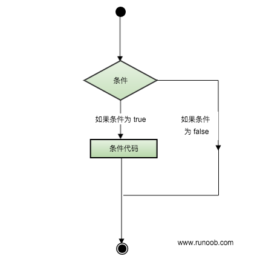  

### 判断语句
C++ 编程语言提供了以下类型的判断语句。点击链接查看每个语句的细节。

|语句	|描述|
|----|----|
if 语句|	一个 if 语句 由一个布尔表达式后跟一个或多个语句组成。
if...else 语句|	一个 if 语句 后可跟一个可选的 else 语句，else 语句在布尔表达式为假时执行。
嵌套 if 语句|	您可以在一个 if 或 else if 语句内使用另一个 if 或 else if 语句。
switch 语句|	一个 switch 语句允许测试一个变量等于多个值时的情况。
嵌套 switch 语句|	您可以在一个 switch 语句内使用另一个 switch 语句。

### ? : 运算符
我们已经在前面的章节中讲解了 条件运算符 ? :，可以用来替代 if...else 语句。它的一般形式如下：  

`Exp1 ? Exp2 : Exp3;`  

其中，Exp1、Exp2 和 Exp3 是表达式。请注意，冒号的使用和位置。  

? 表达式的值是由 Exp1 决定的。如果 Exp1 为真，则计算 Exp2 的值，结果即为整个 ? 表达式的值。如果 Exp1 为假，则计算 Exp3 的值，结果即为整个 ? 表达式的值。  

```cpp
#include<iostream>
using namespace std;

int main(){
	float score;
	cin>>score;
	cout<<score;
	if(score>=60)
		cout<<"及格！"<<endl; 
	else
		cout<<"不及格！"<<endl; 
	return 0;
}

```

```cpp
#include<iostream>
using namespace std;

int main(){
	float score;
	cin>>score;
	if(score>=70)
		if(score<80) 
			cout<<"中等"<<endl; 
		else if(score<90)
				cout<<"良好"<<endl; 
			else
				cout<<"优秀"<<endl; 
	else if(score>=60)
			cout<<"及格！"<<endl; 
		else
			cout<<"不及格！"<<endl; 
	return 0;
}

```

```cpp
#include <iostream>
using namespace std;

int main(){
    int num,a,b,c;
	cin>>num;
	a=num%10;  //个位数字
	b=(num/10)%10; //十位数字
	c=num/100;     //百位数字
	if(num==(a*a*a+b*b*b+c*c*c))
		cout<<num<<"是水仙花数"<<endl;
    else
        cout<<num<<"不是水仙花数"<<endl;
    return 0;
}

```

```cpp
#include<iostream>
using namespace std;

int main(){
    int month,season=0;
    cin>>month;
    if(3<=month&&month<=5)
        season=1;
    else if(6<=month&&month<=8)
           season=2;
        else if(9<=month&&month<=11)
               season=3;
            else if((1<=month&&month<=2)||(month==12))
                   season=4;
    switch(season){
	    case 1:
	        cout<<"春季"<<endl;
	        break;
	    case 2:
	        cout<<"夏季"<<endl;
	        break;
	    case 3:
	        cout<<"秋季"<<endl;
	        break;
	    case 4:
	        cout<<"冬季"<<endl;
	        break;
	    default:cout<<"输入的月份不对！"<<endl;
    }
    return 0;
}

```


## 5 for/while
有的时候，可能需要多次执行同一块代码。一般情况下，语句是顺序执行的：函数中的第一个语句先执行，接着是第二个语句，依此类推。  

编程语言提供了允许更为复杂的执行路径的多种控制结构。  

循环语句允许我们多次执行一个语句或语句组，下面是大多数编程语言中循环语句的一般形式：  

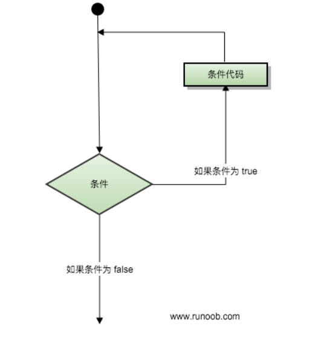  

### 循环类型
C++ 编程语言提供了以下几种循环类型。点击链接查看每个类型的细节。  

|循环类型	|描述|
|----|----|
while 循环|	当给定条件为真时，重复语句或语句组。它会在执行循环主体之前测试条件。
for 循环|	多次执行一个语句序列，简化管理循环变量的代码。
do...while 循环|	除了它是在循环主体结尾测试条件外，其他与 while 语句类似。
嵌套循环|	您可以在 while、for 或 do..while 循环内使用一个或多个循环。

### while循环

语法  
C++ 中 while 循环的语法：  
```cpp
while(condition)
{
   statement(s);
}
```
在这里，statement(s) 可以是一个单独的语句，也可以是几个语句组成的代码块。condition 可以是任意的表达式，当为任意非零值时都为真。当条件为真时执行循环。  

当条件为假时，程序流将继续执行紧接着循环的下一条语句。  
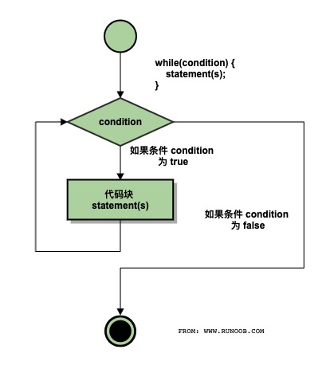  

```cpp
#include <iostream>
using namespace std;
 
int main ()
{
   // 局部变量声明
   int a = 10;

   // while 循环执行
   while( a < 20 )
   {
       cout << "a 的值：" << a << endl;
       a++;
   }
 
   return 0;
}
```

### for循环

C++ 中 for 循环的语法：

```cpp
for ( init; condition; increment )
{
   statement(s);
}
```
下面是 for 循环的控制流：

init 会首先被执行，且只会执行一次。这一步允许您声明并初始化任何循环控制变量。您也可以不在这里写任何语句，只要有一个分号出现即可。  
接下来，会判断 condition。如果为真，则执行循环主体。如果为假，则不执行循环主体，且控制流会跳转到紧接着 for 循环的下一条语句。
在执行完 for 循环主体后，控制流会跳回上面的 increment 语句。该语句允许您更新循环控制变量。该语句可以留空，只要在条件后有一个分号出现即可。  
条件再次被判断。如果为真，则执行循环，这个过程会不断重复（循环主体，然后增加步值，再然后重新判断条件）。在条件变为假时，for 循环终止。  

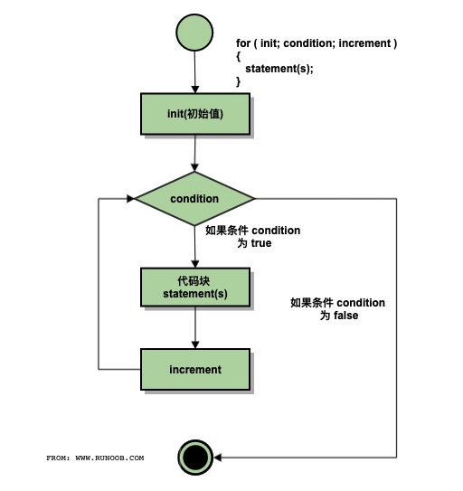  

```cpp
#include <iostream>
using namespace std;
 
int main ()
{
   // for 循环执行
   for( int a = 10; a < 20; a = a + 1 )
   {
       cout << "a 的值：" << a << endl;
   }
 
   return 0;
}
```

### do...while 循环

不像 for 和 while 循环，它们是在循环头部测试循环条件。do...while 循环是在循环的尾部检查它的条件。  

do...while 循环与 while 循环类似，但是 do...while 循环会确保至少执行一次循环。  

语法  
C++ 中 do...while 循环的语法：  
```cpp
do
{
   statement(s);

}while( condition );
```
请注意，条件表达式出现在循环的尾部，所以循环中的 statement(s) 会在条件被测试之前至少执行一次。  

如果条件为真，控制流会跳转回上面的 do，然后重新执行循环中的 statement(s)。这个过程会不断重复，直到给定条件变为假为止。  

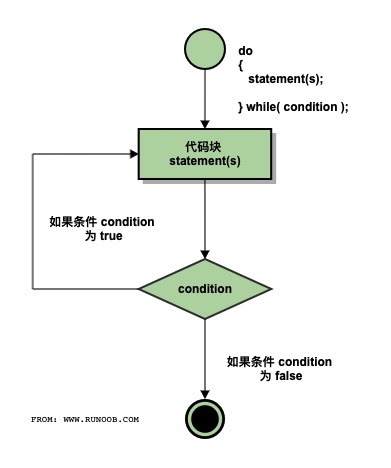  

```cpp
#include <iostream>
using namespace std;
 
int main ()
{
   // 局部变量声明
   int a = 10;

   // do 循环执行
   do
   {
       cout << "a 的值：" << a << endl;
       a = a + 1;
   }while( a < 20 );
 
   return 0;
}
```

### 嵌套循环

一个循环内可以嵌套另一个循环。C++ 允许至少 256 个嵌套层次。  

语法  
C++ 中 嵌套 for 循环 语句的语法：  
```cpp
for ( init; condition; increment )
{
   for ( init; condition; increment )
   {
      statement(s);
   }
   statement(s); // 可以放置更多的语句
}
```
C++ 中 嵌套 while 循环 语句的语法：  
```cpp
while(condition)
{
   while(condition)
   {
      statement(s);
   }
   statement(s); // 可以放置更多的语句
}
```
C++ 中 嵌套 do...while 循环 语句的语法：
```cpp
do
{
   statement(s); // 可以放置更多的语句
   do
   {
      statement(s);
   }while( condition );
 
}while( condition );
```
关于嵌套循环有一点值得注意，您可以在任何类型的循环内嵌套其他任何类型的循环。比如，一个 for 循环可以嵌套在一个 while 循环内，反之亦然。  

```cpp
#include <iostream>
using namespace std;
 
int main ()
{
    int i, j;
    for(i=2; i<100; i++) {
        for(j=2; j <= (i/j); j++) {
            if(!(i%j)) {
                break; // 如果找到，则不是质数
            }
        }
        if(j > (i/j)) {
            cout << i << " 是质数\n";
        }
    }
    return 0;
}
```

### 循环控制语句
循环控制语句更改执行的正常序列。当执行离开一个范围时，所有在该范围中创建的自动对象都会被销毁。  

C++ 提供了下列的控制语句。点击链接查看每个语句的细节。  

|控制语句|	描述|
|---|---|
break 语句|	终止 loop 或 switch 语句，程序流将继续执行紧接着 loop 或 switch 的下一条语句。
continue 语句|	引起循环跳过主体的剩余部分，立即重新开始测试条件。
goto 语句|	将控制转移到被标记的语句。但是不建议在程序中使用 goto 语句。|

### break

C++ 中 break 语句有以下两种用法：  

当 break 语句出现在一个循环内时，循环会立即终止，且程序流将继续执行紧接着循环的下一条语句。  
它可用于终止 switch 语句中的一个 case。  
如果您使用的是嵌套循环（即一个循环内嵌套另一个循环），break 语句会停止执行最内层的循环，然后开始执行该块之后的下一行代码。  

语法  
C++ 中 break 语句的语法：  

break;  

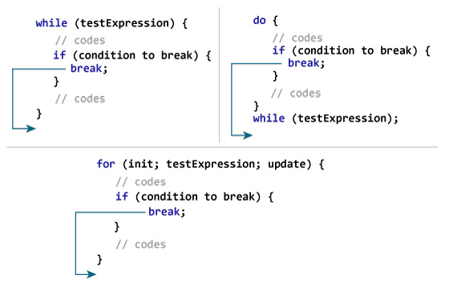

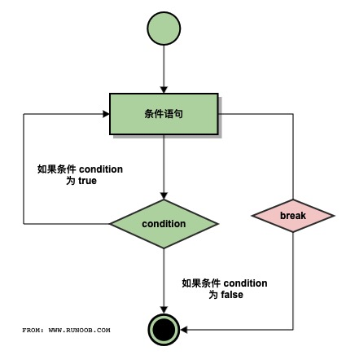  

```cpp
#include <iostream>
using namespace std;
 
int main ()
{
   // 局部变量声明
   int a = 10;

   // do 循环执行
   do
   {
       cout << "a 的值：" << a << endl;
       a = a + 1;
       if( a > 15)
       {
          // 终止循环
          break;
       }
   }while( a < 20 );
 
   return 0;
}
```
### continue语句 
C++ 中的 continue 语句有点像 break 语句。但它不是强迫终止，continue 会跳过当前循环中的代码，强迫开始下一次循环。  

对于 for 循环，continue 语句会导致执行条件测试和循环增量部分。对于 while 和 do...while 循环，continue 语句会导致程序控制回到条件测试上。  

语法  
C++ 中 continue 语句的语法：  

continue;  

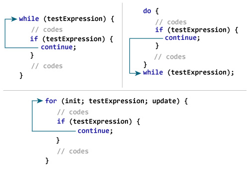  

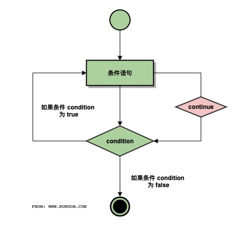  

```cpp
#include <iostream>
using namespace std;
 
int main ()
{
   // 局部变量声明
   int a = 10;

   // do 循环执行
   do
   {
       if( a == 15)
       {
          // 跳过迭代
          a = a + 1;
          continue;
       }
       cout << "a 的值：" << a << endl;
       a = a + 1;
   }while( a < 20 );
 
   return 0;
}
```

### goto语句
goto 语句允许把控制无条件转移到同一函数内的被标记的语句。  

注意：在任何编程语言中，都不建议使用 goto 语句。因为它使得程序的控制流难以跟踪，使程序难以理解和难以修改。任何使用 goto 语句的程序可以改写成不需要使用 goto 语句的写法。  

语法  
C++ 中 goto 语句的语法：  
```cpp
goto label;
..
.
label: statement;

```


在这里，label 是识别被标记语句的标识符，可以是任何除 C++ 关键字以外的纯文本。标记语句可以是任何语句，放置在标识符和冒号（:）后边。  

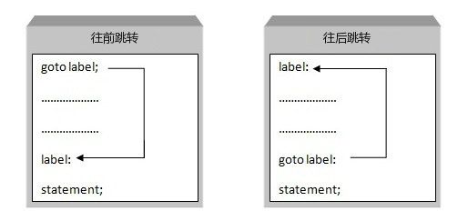  

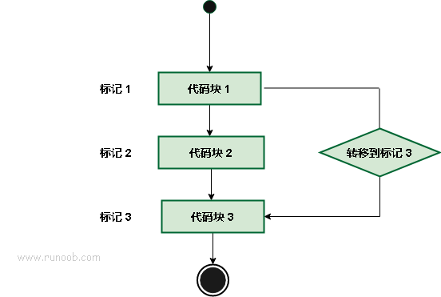  

```cpp
#include <iostream>
using namespace std;
 
int main ()
{
   // 局部变量声明
   int a = 10;

   // do 循环执行
   LOOP:do
   {
       if( a == 15)
       {
          // 跳过迭代
          a = a + 1;
          goto LOOP;
       }
       cout << "a 的值：" << a << endl;
       a = a + 1;
   }while( a < 20 );
 
   return 0;
}
```


### 无限循环
如果条件永远不为假，则循环将变成无限循环。for 循环在传统意义上可用于实现无限循环。由于构成循环的三个表达式中任何一个都不是必需的，您可以将某些条件表达式留空来构成一个无限循环。  

```cpp
#include <iostream>
using namespace std;
 
int main ()
{
 
   for( ; ; )
   {
      printf("This loop will run forever.\n");
   }
 
   return 0;
}
```
当条件表达式不存在时，它被假设为真。您也可以设置一个初始值和增量表达式，但是一般情况下，C++ 程序员偏向于使用 for(;;) 结构来表示一个无限循环。  

注意：您可以按 Ctrl + C 键终止一个无限循环。  

## 6 函数


## 7 递归

## 8 结构体

## 9 数组

## 10 字符串