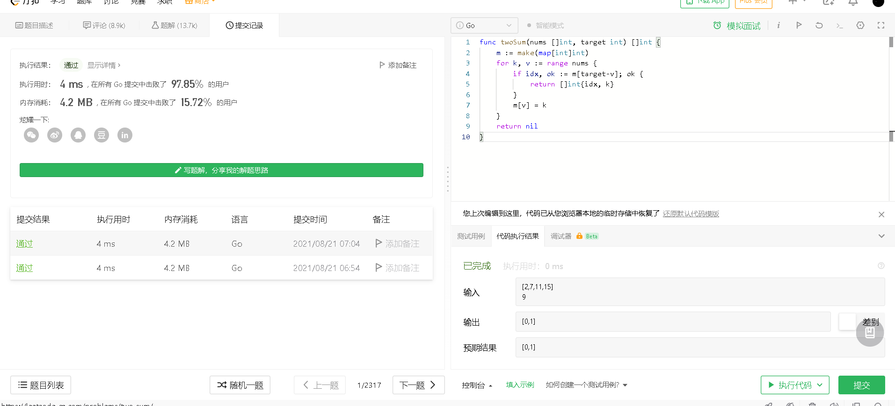

# 001 two sum

https://leetcode-cn.com/problems/two-sum/

go语言:  

```go
func twoSum(nums []int, target int) []int {
	m := make(map[int]int)
	for k, v := range nums {
		if idx, ok := m[target-v]; ok {
			return []int{idx, k}
		}
		m[v] = k
	}
	return nil
}
```

效果:  
  

c++:  