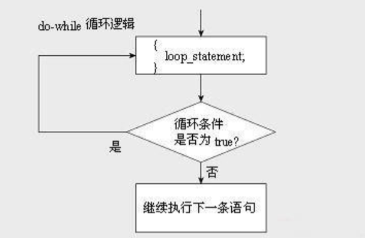

# 阶梯电价

```Cpp
#include <stdio.h>

int main()
{
	int a;
	float b;
	scanf("%d",&a);
	if(a<0)printf("Invalid Value!");
	else if(a<=60){
		b=a*0.55; 
		printf("cost = %.2f",b);
	}else if(a>60){		
	    b=50*0.55+(a-60)*0.56;
	    printf("cost = %.2f",b);
	}
	return 0;
}

```

# 自由落体距离

```cPP
#include<stdio.h>
int main(void)
{
    float a, t, height;
    a=10,t=3;
    height=0.5*a*t*t;
    printf("height = %.2f\n", height);
	
    return 0;
}
```

# 统计学生成绩

```cpp
 
#include <stdio.h>
int main()
{
	int stu[20];           //也可以不用数组
	int i;
	int count1 = 0, count2 = 0, count3 = 0, count4 = 0, count5 = 0;
 
	printf("请输入20位学生的成绩：\n");
	for (i = 0; i < 20; i++)
	{
		scanf("%d", &stu[i]);     //20位学生成绩分别用空格隔开
		if (stu[i] >= 90)
			count1++;
		else if (stu[i] >= 80)
			count2++;
		else if (stu[i] >= 70)
			count3++;
		else if (stu[i] >= 60)
			count4++;
		else
			count5++;
	}
 
	printf("优秀有%d人\n", count1);
	printf("良好有%d人\n", count2);
	printf("中等有%d人\n", count3);
	printf("及格有%d人\n", count4);
	printf("不及格有%d人\n", count5);
 
	return 0;
}
```

# 统计字符

```cpp
#include<stdio.h>
#include<windows.h>
 
int main()
{
	char c;
	int letters = 0;
	int space = 0;
	int digit = 0;
	int others = 0;
	printf("please input a string:>");
	while ((c = getchar()) != '\n')
	{
		//当输入的是英文字母时变量letters加1；
		if (c >= 'a'&&c <= 'z' || c >= 'A'&&c <= 'Z')
		{
			letters++;
		}
		//当输入的是空格时变量space加1；
		else if (c == ' ')
		{
			space++;
		}
		//当输入的是数字时变量digit加1；
		else if (c >= '0'&&c <= '9')
		{
			digit++;
		}
		//当输入的既不是英文字母又不是空格或者数字时变量others加1；
		else
		{
			others++;
		}
	}
	printf("字母=%d 空格=%d 数字=%d 其他=%d\n", letters, space, digit, others);
	system("pause");
	return 0;
}
```


# 求整数均值

```cpp
#include<stdio.h>
int main()
{
	int sum = 0;
	double average = 0;
	int num;
	for(int i=0; i<4; i++)
	{
		scanf("%d",&num);
		sum += num;
		 }
	average = sum/4;
	printf("Sum = %d; Average = %.1f\n", sum, average);
	return 0;	 
}

```

# do-while 逻辑

  


# 三目运算符 

(a/3>0?a/10:a%3))  

C语言中没有单独的冒号运算符，冒号需要与问号合用，形成条件运算符。

C语言中条件运算符是唯一有3个操作数的运算符，所以有时又称为三元运算符。

条件运算符的使用形式为：b ? x : y

其运算过程为：先计算条件b，然后进行判断：如果b的值为true，计算x的值，运算结果为x的值；否则，计算y的值，运算结果为y的值。

如：  

```cpp
int a=5,b;
b=a/3>0?a/10:a%3 ; //此时，b的结果为a/10=0
```
运算过程解析：  
先计算a/3>0 , 因为a=5，所以，a/3=5/3=1 > 0，条件为true  

所以，b=a/10 = 5/10=0  

a%3被略过了。  

条件表达式，可以用if语句来改写，如，上面的例子可改为：  

```cpp
int a=5,b;
if ( a/3 > 0 )
    b=a/10;
else
    b=a%3 ;
```