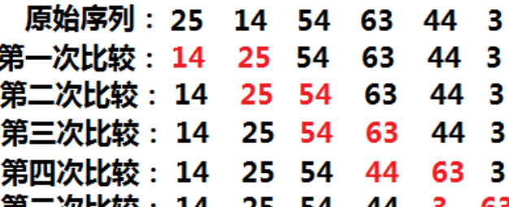
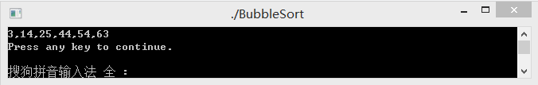
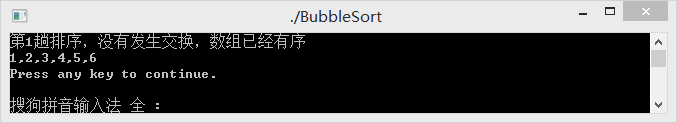
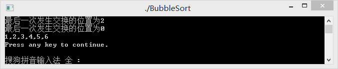

# 单词首字母大写

```CPP
#include <stdio.h>
int main()
{
    int i;
    int word;
    char str[200];
    printf("请输入字符串:");
    while(gets(str)!=NULL)
    {
        printf("修改后的字符串为:");
        word=0;
        for(i=0;str[i]!='\0';i++)
        {
            if(str[i]==' ')
            {
                word=0;
                printf(" ");
            }
            else if(word==0)
            {
                word=1;
                str[i]=str[i]-32;
                printf("%c",str[i]);
            }
            else
                printf("%c",str[i]);
        }
        printf("\n");
    }
	return 0;
}
```

# 计算两数的和与差

```CPP
#include <stdio.h>

void sum_diff( float op1, float op2, float *psum, float *pdiff );

int main()
{
    float a, b, sum, diff;
    
    scanf("%f %f", &a, &b);
    sum_diff(a, b, &sum, &diff);
    printf("%.2f,%.2f\n", sum, diff);
	
    return 0; 
}

/* 你的代码将被嵌在这里 */

```

# 水仙花数

```cpp
#include <stdio.h>
int main()
{
	int start, end, i = 0, a, b, c, size = 0;
	while (scanf("%d %d", &start, &end) == 2)
	{
		for (i = start; i <= end; i++)
		{
			a = i / 100;
			b = i / 10 % 10;
			c = i % 10;
			//total = pow(c, 3) + pow(a, 3) + pow(b, 3);
			if ((a*a*a + b*b*b + c*c*c) == i)  //满足水仙花条件
			{

				if (size == 0)   //size=0输出第一个水仙花数 
				{
					printf("%d", i);
				}
				else     //size++输出第二。。第n个水仙花数
				{
					printf(" %d", i);
				}
				size++;   //个数++；
			}
		}
		if (size == 0)   //范围内个数为0，则说明没有满足条件的
		{
			printf("no");
		}
		printf("\n");
	}
	return 0;
}

```
或者

```cpp

#include<stdio.h>

int main(){
    int m,n;
    while(scanf("%d%d",&m,&n)!=EOF){
            int t=0;
        for(int i=m; i<=n; i++){
            int a=i/100;
            int b=i%100/10;
            int c=i%10;
            
            if(i==a*a*a+b*b*b+c*c*c && t==0){
                printf("%d ",i);
                t++;
            }
            else if(i==a*a*a+b*b*b+c*c*c && t==1){
                printf("%d ",i);
            }
        }
        if(t!=0){ printf("\n"); }
        if(t==0){ printf("no\n"); }
    }
    return 0;
}

```


# 改进冒泡排序

冉冉仙子.这道题应该是先写出书上的经典算法,再对此算法进行改进,不过你的题目说明的改进方法貌似是错的....我按照这几个思路给你写~~   
首先是原版算法:假设有n个数需要排列成非递减数列。冒泡算法的主要思想是  
①比较第一个与第二个数，如果第二个数小于第一个数则交换，否则不交换；然后以同样的规则比较第二第三个数，以此类推，比如  

  

这样就完成了一趟排序，通过不断地交换，第一趟排序进行了n-1次比较就把最大的数交换到了最后。  
②遵循①中的规则进行下一趟排序，由于最后一位已经确定是最大值，则第二次只需要n-2次比较既可以把第二大的数交换到倒数第二个位置。  
③以此类推，第i趟排序需要经过n-i次比较
其算法具体实现如下：  


```cpp
#include <stdio.h>

void sort(int* N,int n){
    int i,j,k;
    // 外循环控制趟数,一共需要n-1趟
    for(i = n - 1; i > 0; i--){
        // 内循环控制每一趟比较的次数
        for(j = 0; j < i; j++){
            // 相邻两个数进行比较，如果前一个数较大则进行交换
            if(N[j] > N[j + 1]){
                k = N[j];
                N[j] = N[j + 1];
                N[j + 1] = k;
            }
        }
    }
}
int main(int argc, char **argv)
{
    int N[6] = {25,14,54,63,44,3};
    int n = 6;
    sort(N,n);
    int i;
    for(i = 0; i < n; i++){
        printf("%d",N[i]);
        if(i != n - 1) printf(",");
    }
    return 0;
}

```
上述运行结果:
   


冒泡算法的改进1(你们的思路//就是错误的思路)   
冒泡算法的算法时间复杂度显然为o(n2)，效率十分低下。在有些情况下，算法执行若干次后，可能已经是有序序列了，但是上面的冒泡算法已经执行后面的比较，知道执行完n-1趟排序，这样显然不是最佳的方式。这时候我们可以设置一个标记，用来判断一趟排序过后有没有发生交换，如果没有发生交换，则说明数组已经有序了，已经不需要再进行余下的比较  

```cpp
#include <stdio.h>

void sort(int* N,int n){
    int i,j,k,l;
    // 外循环控制趟数,一共需要n-1趟
    for(i = n - 1; i > 0; i--){
        // l初始化为0，用于记录每一趟排序的交换次数，
        //如果一趟排序过后交换次数依然是0，则表示数组已经是有序的了
        l = 0;
        // 内循环控制每一趟比较的次数
        for(j = 0; j < i; j++){
            // 相邻两个数进行比较，如果前一个数较大则进行交换
            if(N[j] > N[j + 1]){
                // 如果发生了交换，l自增
                l++;
                k = N[j];
                N[j] = N[j + 1];
                N[j + 1] = k;
            }
            
        }
        if(l != 0) printf("第%d趟排序，发生了%d次交换\n",n - i,l);
        else {
            printf("第%d趟排序，没有发生交换，数组已经有序\n",n - i);
            break;
        }
    }
}
int main(int argc, char **argv)
{
    int N[6] = {1,2,3,4,5,6};
    int n = 6;
    sort(N,n);
    int i;
    for(i = 0; i < n; i++){
        printf("%d",N[i]);
        if(i != n - 1) printf(",");
    }
    return 0;
}

```
上述运行结果:
  


冒泡算法的再改进2  
在某些情况下，如果进行了若干次排序之后，后面的若干个数已经是有序的，那么下一趟排序就只需要比较前面无序的那一段就可以了。所以我们可以设置一个标记用来记录每趟排序最后一个发生交换的位置，下一趟排序值比较到此位置即可。  
虽然以上两种算法对传统的冒泡排序做了一定程度的优化，但是算法复杂度还是o(n2),所以最好的优化方法就是——能不用冒泡算法就不用冒泡算法，改用算法复杂度小的。   

```cpp
#include <stdio.h>


void sort(int* N,int n){
    int i,j,k,flag;
    // 初始化标记为-1
    flag = n - 1;
    while(flag > 0){
        i = flag;
        flag = 0;
        for(j = 0; j < i; j++){
            if(N[j] > N[j + 1]){
                k = N[j];
                N[j] = N[j + 1];
                N[j + 1] = k;
                flag = j;
            }
        }
        printf("最后一次发生交换的位置为%d\n",flag);
    }


}
int main(int argc, char **argv)
{
    int N[6] = {2,1,4,3,5,6};
    int n = 6;
    sort(N,n);
    int i;
    for(i = 0; i < n; i++){
        printf("%d",N[i]);
        if(i != n - 1) printf(",");
    }
    return 0;
}


```
结果
  
这两个都行 你提交那个都行 //这道题不错算是ACM的入门思路了.   

# 在数组中查找指定元素

```cpp
#include<stdio.h>
int search(int list[],int n, int x)
{
    
	for(int i=0;i<n;i++)
	{
    
		if(list[i]==x)
		return i;
	}
	return -1;
}

int main()
{
    
	int repeat,n,x,a[10];
	scanf("%d",&repeat);
	for(int i=0;i<repeat;i++)
	{
    
		scanf("%d",&n);
		for(int j=0;j<n;j++)
		{
    
			scanf("%d",&a[j]);
		}
		scanf("%d",&x);
		if(search(a,n,x)==-1) printf("Not found\n");
		else
		printf("%d\n",search(a,n,x));
	}
}
```

# 循环后移

```cpp
#include "stdio.h"

void main() {
    void move(int *p, int n, int m);
    int arrays[100];
    int amount, position, i;
    //printf("你想输入几个整数:");
    scanf("%d", &amount);
    scanf("%d", &position);
    //printf("你想将上面的数字向后移动几位:");
    //scanf("%d", &position);
    //printf("%d", amount);
    for (i = 0; i < amount; i++) {
        scanf("%d", &arrays[i]);
    }
    move(arrays, amount, position);
    //printf("移动后的结果:");
    for (i = 0; i < amount + position; i++) {
        printf("%d", arrays[i]);
    }

}

void move(int *p, int n, int m) {
    int *first_p;
    int *last_p;
//    指向原数组头部的指针
    first_p = p;
//    指向原数组尾部的指针
    last_p = first_p + n - 1;
//    先做整体移动，从数组尾部开始处理，一个一个向后移动
    while (last_p >= first_p) {
        *(last_p + m) = *last_p;
//        每移动完一个数字，原数组尾部指针向原数组头部方向移动一下，直到指向头部
        last_p--;
    }
//    然后让前面m位等于后面m位 
    while (first_p < (p + m)) {
        *first_p++ = *(first_p + n);
    }
}

```
或者这个 好像上面这个有点问题,用下面这个吧...

```cpp
#include <stdio.h>
int main()
{
	void move(int [20],int,int);
	int number[20],n,m,i;
	//printf("how many numbers?");
	scanf("%d",&n);
    //printf("how many place you want move?");
	scanf("%d",&m);
	printf("input %d numbers:\n",n);
	for(i=0;i<n;i++)
		scanf("%d",&number[i]);

	move(number,n,m);
	//printf("Now,they are:\n");
	for(i=0;i<n;i++)
		printf("%d ",number[i]);
	printf("\n");
	return 0;
}

void move(int array[20],int n,int m)
{
	int *p,array_end;
	array_end=*(array+n-1);
	for(p=array+n-1;p>array;p--)
		*p=*(p-1);
	*array=array_end;
	m--;
	if(m>0)
		move(array,n,m);
}

```
# 字符串排序

```cpp
#include<stdio.h>
#include<string.h>
int main()
{
	char a[5][20], *p[5], *t;
	int i, j;
    //不需要中文的话 就删了就行
	puts("输入五个字符串");
	for (i = 0; i < 5; i++) {
		scanf("%s", a[i]);
		p[i] = a[i];
	}
	for (i = 0; i < 5; i++) {
		for (j = i + 1; j < 5; j++) {
			if (strcmp(p[j] , p[i])>0) {
				t = p[j];
				p[j] = p[i];
				p[i] = t;
			}
		}
	}
	//puts("从大到小顺序为");
    //puts("");
	for (i = 0; i < 5; i++)
		printf("%s\n", p[i]);
	return 0;
}

```

# 选择法排序

```cpp
#include<stdio.h>
int main()
{
	int n, i, j, t;
	int a[11];
	scanf("%d", &n);
	
	for(i = 0;i < n;i++)
		scanf("%d",&a[i]);
		
	for(i = 1;i < n;i++)
	{
		for(j = 0;j < n - i;j++)
		{
			if(a[j] < a[j + 1])
			{
				t = a[j];
				a[j] = a[j + 1];
				a[j + 1] = t;
			}
		}
	}
	for(i = 0;i < n;i++)
	{
		if(i < n - 1)
			printf("%d ", a[i]);
		else
			printf("%d\n", a[n - 1]);
	}
	return 0;
}

```

# 莫名其妙的填空题
# 空心金字塔

`digitalPyramid ( n );`  //第一个空

```cpp
void digitalPyramid ( int n )
{
	int i,j;
	
	for(i=1;i<=n;i++){//i为行数 
		for(j=1;j<=n-1+i;j++){//j为第i行中的第几个 (j的结束条件是本行非空格的后一个数字)
			if(i==n){
				printf("%d",i);
			}else if(i<n){
				if((j==n+1-i)||(j==n-1+i)){
					printf("%d",i);
				}else{
					printf(" ");
				}
			}
		}
		printf("\n");
	}
}

```

# 统计指定数字个数
ps:小仙女,是不是他题目写错了 这哪有d啊 是digit吧 ..怎么就int d了...   

第一部分:
```cpp
scanf("%d %d", &number, &digit);
printf("Number of digit %d in %d: %d\n", digit, number, CountDigit(number, digit));

```
第二部分:
```cpp
int CountDigit( int number, int digit )//定义CountDigit这个计算数字个数的的函数
{
int i, number1;
int n, count = 0;
if(number!=0){
if(number<0){
number = -number; //将负数转为整数
}else{
while(number%10!=0){ //当number为个位数时退出循环
i = number%10; //取出整数的个位数
if(i==digit){ //判断是否为想要寻找的数字
count++; //是的话count+1
}
number = number/10; //去掉最后一个数字
}
return count;
}
}else{ //如果这个整数为0，则0的个数为1
count++; //count自增1
return count;
}
```

如果这个if太麻烦 还是do-while的写法 第二个空就

```cpp
int CountDigit( int number, int digit )
{
    int time=0;
    
    if(number<0) //这里将负数全部转正，方便办事
    {
        number*=-1;
    }
    
    do
   {
     if(number%10==digit)
     {
         time++;
     }
        number/=10;
   }while(number>0);//这里用do whlie，当number==0时也可以让time++
    
    return time;
}

```

# 整数的逆序数

第一个 其中函数reverse须返回用户传入的整型number的逆序数  
`int reverse( int number );`

主函数部分:

```cpp
int reverse(int number) {
	int sum=0,temp=1,i=1;
	if(number<0)
	{number=-number;
	i=-1;
	}
	else i=1;
	while(number)
	{ temp=number%10;
			sum=sum*10+temp;
			number/=10;
	}

		return sum*i;
	}

```