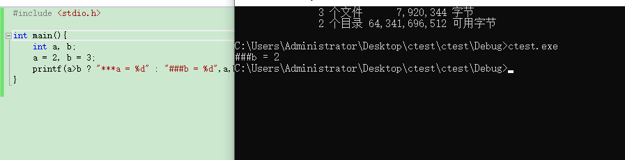

# 循环大作业

# 1. 求交错序列前n项和
计算：1-2/3+3/5-4/7+5/9-6/11+...的前n项（小数点后保留5位）

```cpp
#include <stdio.h>
#include <math.h>
int main()
{
    int n,i;
    double sum=0;
    //printf("Enter n:");
    scanf("%d",&n);
    for(i=1;i<=n;i++)
    {
        sum=sum+pow(-1,i+1)*i/(2*i-1);
    }
    printf("%0.5f\n",sum);
    
    return 0;
}

```


# 2. 反弹
【问题描述】
已知一球从高空落下时，每次落地后反弹至原高度的四分之一再落下。编写一程序，从键盘输入整数n和m，求该球从n米的高空落下后，第m次落地时共经过的路程以及第m次落地后反弹的高度，并输出结果。
【输入形式】
从键盘输入整数n和m，以空格隔开。
【输出形式】
输出两行：
第一行输出总路程，保留小数点后两位；
第二行输出第m次落地后反弹的高度，保留小数点后两位。

```cpp
#include<stdio.h>
#include<math.h>
int main () {
    double n,m,sum,firstn,i;
    int intsum;
    sum=0;
    scanf("%lf %lf",&n,&m);
    firstn=n;
    for(i=1;i<m;i++) {
        n=n/4;
        sum=sum+n;
    }
    sum=2*sum+firstn;
//    intsum=sum*100;
//    if(100*sum>intsum+0.5) intsum++;
//    sum=(double)intsum;
//  本来还以为要四舍五入的。。。结果不要
    printf("%.2lf\n%.2lf",sum,n/4);
}


```

# 3 求公式近似值
【问题描述】

已知ex的近似值可由下面公式计算得出：

ex=1 + x/1! + x2/2! + x3/3! + ...... + xn/n!
给定x和n，利用上述公式求得ex的近似值。

【输入形式】

从控制台输入小数x，和整数n（n>=1），用空格隔开。

【输出形式】

向控制台输出求得的ex 的近似值（小数点后保留6位有效数据）。

```cpp
#include <stdio.h>
#include<math.h>
int main()
{  
int i,j;
     int x,n;
double sum=1,zi=1,mu=1 ;
  scanf("%d %d",&x,&n);
  for(i=1;i<=n;i++)
    {
     zi=pow(x,i);
     for(j=1;j<=i;j++)
       mu=mu*j;
     sum=sum+zi/mu;
     mu=1;
    } 
  printf("%lf",sum);
printf("\n");
}

```
数据二有问题，还没有debug

# 4 最大公约数
```cpp
#include<stdio.h>
int main()
{
    int m, n, temp, i;
    //printf("Input m & n:");
    scanf("%d%d", &m, &n);
    if(m<n)  /*比较大小，使得m中存储大数，n中存储小数*/
    { /*交换m和n的值*/
        temp=m;
        m=n;
        n=temp;
    }
    for(i=n; i>0; i--)  /*按照从大到小的顺序寻找满足条件的自然数*/
        if(m%i==0 && n%i==0)
        {/*输出满足条件的自然数并结束循环*/
            printf("%d ",  i);
            break;
        }
   
    return 0;
}

```
我本地测试一切正常 莫名其妙显示死循环了。数据二  

# 5 求水仙花数
```cpp
#include <stdio.h>
int main()
{
    int i,j,k,n,l;
  	scanf("%d",&l);
    for(i=100;i<l;i++)
    {
        j=i%10;
        k=i/10%10;
        n=i/100;
        if(j*j*j+k*k*k+n*n*n==i)
            printf("%5d\n",i);
    }
    return 0;
}
```
数据三 数据四错误 又不给出为什么错... 我的天啊

```cpp
#include <stdio.h>
int main()
{
    int hun, ten, ind, n, l;
    //printf("result is:");
    scanf("%d",&l);
    for( n=100; n<l; n++ )  /*整数的取值范围*/
    {
        hun = n / 100;
        ten = (n-hun*100) / 10;
        ind = n % 10;
        if(n == hun*hun*hun + ten*ten*ten + ind*ind*ind)  /*各位上的立方和是否与原数n相等*/
            printf("%d  ", n);
    }
    printf("\n");
   
    return 0;
}

```
还是不知道哪里错.... 本地验资一切正常...
okok了 ...我的天 回车的问题...
```cpp
#include <stdio.h>
int main()
{
	int start = 100, end, i = 0, a, b, c, size = 0;
	while (scanf("%d ", &end) == 1)
	{
		for (i = start; i <= end; i++)
		{
			a = i / 100;
			b = i / 10 % 10;
			c = i % 10;
			//total = pow(c, 3) + pow(a, 3) + pow(b, 3);
			if ((a*a*a + b*b*b + c*c*c) == i)  //满足水仙花条件
			{

				if (size == 0)   //size=0输出第一个水仙花数 
				{
					printf("%d\n", i);
				}
				else     //size++输出第二。。第n个水仙花数
				{
					printf(" %d\n", i);
				}
				size++;   //个数++；
			}
		}
		if (size == 0)   //范围内个数为0，则说明没有满足条件的
		{
			printf("no");
		}
		printf("\n");
	}
	return 0;
}

```


# 6 完全数
```cpp
#include <stdio.h>
void main(){
    int i,j;
    int num;//因子之和 
    int m,n;
    int flag = 0;
    scanf("%d %d",&m,&n);
    for(i=m;i<=n;i++){
        num = 0;
        //printf("%d的因子如下：",i);
        for(j=2;j<=i;j++){ //j代表i对应的任何一个可能的因子 
            if(i %j == 0){
                num += i/j;  
            }
        }
        //判断因子之和是否和该数相等
        if(num==i){
            printf("%d ",i);
            flag = 1;
        }     
    }
    printf(" ");
    if(flag == 0){
        printf("No Answer\n");
    }
}
```

# 7 . 素数
```cpp
#include<stdio.h>
void main() { int i,j,k,n,b;
  scanf("%d",&n); b=0;
  for ( i=2;i<=n;i++ ) {// 1不是素数
    k=1; for ( j=2;j<=i/2;j++ ) if ( i%j==0 ) { k=0;break; }
    if ( k ) if ( i%10==1 ) { b=1; printf("%d ",i); }
  }
  if ( b ) printf("\n"); else printf("-1\n");
}
```


# 8 8. 统计那些数
输入一批以-1结束的整数，依次输出它们之中的最大数，最小数，平均数。如果直接输入-1，则输出none

 

【输入】

5 6 4 3 2 1 -1

【输出】

1,6,3.500

【输入】

-1

【输出】

none


【输入】

-4 -1

【输出】

-4,-4,-4.000
```cpp
#include <stdio.h> 
int main(){
	int max, min, first = 1, num;
	printf("请输入若干个整数\n");
    int sum = 0;
    int count =1;
	while (1){
		scanf("%d", &num);
		if (num == -1){
            printf("none");
            break;
        }
        else{ 
		while (first){
			max = min = num;
			--first;
            count++;
            sum = sum + num;
		}
        }
		if (max <= num)  max = num;
		if (min >= num)  min = num;
	}
    double average = 1.0 * sum / count;
	printf("%0.5f %0.5f %0.5f",min,max,average);//题目写错了，这是最小 最大 平均...
	return 0;
}
```


debug版本： 。。。。。。
```cpp
#include <stdio.h>
#include <string.h>
#include <math.h>
#include <stdlib.h>
// // 拷贝到平台的时候把my_fuction_lib.h注释掉.
//#include "my_fuction_lib.h"

//在此下方插入自定义函数对的声明:
void statistics(int n, int s[], int *max, int *min, float *avg)
{

	max[0] = min[0] = s[0];
	float sum = max[0];
	for (int i = 1; i<n; i++)
	{

		if (s[i] > max[0]) max[0] = s[i];
		else if (s[i] <min[0]) min[0] = s[i];
		sum += s[i];
	}
	avg[0] = sum / n;
}
int Input(int s[])
{

	/*
	以下写法不可取,因为scanf里的i++后,回到while的判断中,是s[i]就不是刚才读组的值了
	因此无法判断刚才读到的是否结束标志0.
	int i = 0;
	scanf("%d",&s[i]);
	while(  s[i] != 0)
	{
	scanf("%d",&s[i++]);
	} */
	int i = 0;
	/* 初始化s[0] */
	scanf("%d", &s[i]);
	for (; s[i++] != -1;)
	{
		//printf("123");
		scanf("%d", &s[i]);
	}

	return i - 1;
}
//主函数main
int main()
{

	int s[100];

	int min[1];
	int max[1];
	float avg[1];
	int n;


	int i = 0;


	//while(scanf("%d",&s[i++]) && s[i] != -1);
	n = Input(s);
	statistics(n, s, max, min, avg);
	//printf("Num=%d\n", n);
	// 最大最小调换了啊 。。。。
	printf("%d,", min[0]);
	printf("%d,", max[0]);
	
	printf("%.3f ", avg[0]);


	return 0;
}
```


# 9 崇真尚美数
“尚美数”是指一个 n 位数，它的每个位上的数字的 n 次幂之和等于它本身。（例如：当n为3时，有1^3 + 5^3 + 3^3 = 153，153即是n为3时的一个尚美数） 

纺大数包括： 水仙花数(n=3)、四叶玫瑰数(n=4)、五角星数(n=5)、六合数(n=6)、北斗七星数(n=7)、八仙数(n=8)、九九重阳数(n=9)、十全十美数(n=10)
例如：
n为3时，有4个：153，370，371，407； 
n为4时，有3个：1634，8208，9474；
...
输入一个整数n(3-8),输出以一个空格隔开的所有n位尚美数
例如：
【输入】3
【输出】153 37 371 407
```cpp
#include<stdio.h>
#include<stdlib.h>
void main()
{
	int n;         //位数，需要输入
	int min, max; //n位数的最小、最大数，当n确定后，如n=5：则min是10000，max是99999
	int data;      //要判断的数据，循环取从min到max的数，循环体内判断data是不是水仙花数
				   //  判断n位数data是否水仙花数，即判断data的每位数的n次幂的和是否等于data本身。
	int temp, d;    //取组成data的每位数所需的变量。
					//  data分解成（其他位+最低位），temp是取掉最低位的其他位，d是取到的最低位，如12345：temp=1234时d=5
	int pow, i;     //pow是d的n次幂，以循环变量i控制d乘以自身n次得到pow
	int sum;       //所有数位的n次幂的和，即pow的累加和

	//printf("请输入所求水仙花数的位数（3-7之间）:\n");
	scanf("%d", &n);

	//根据输入的位数n，求出min：min=10的(n-1)次幂，1循环乘以n-1次10就可以得到
	min = 1;
	for (i = 1; i<n; i++)
	{
		min = min * 10;
	}
	//根据min求出max：max=min*10-1
	max = min * 10 - 1;

	//从min到max，遍历每个n位数 
	for (data = min; data <= max; data++)
	{
		//对temp取最低位d，计算其n次幂pow，累加到sum，去掉最低位的其他位赋给temp再次循环
		sum = 0;
		temp = data;
		while (temp>0) //只要temp>0，就还有数位要处理
		{
			d = temp % 10;
			//计算d的n次幂给pow
			pow = 1;
			for (i = 1; i <= n; i++)
			{
				pow = pow * d;
			}
			//将本次循环所取到的数位d的n次幂pow累加到sum
			sum = sum + pow;
			//去掉最低位的数据参加下次循环，当temp是个位整数，temp/10=0 会结束循环
			temp = temp / 10;
		}
		if (sum == data)//每位数n次幂的和sum等于data本身，则data是水仙花数
		{
			printf("%d ", data); // 空格划分
		}
	}
	system("pause");
}
```


# 练习1 
# 选择题 
1 B   
```
int a=-1,b=4,k;   //声明变量并赋值
k=(++a<0)&&!(b--<=0);   
//a先自加1在判断是否小于0,b先判断是否小于等于0再取反再自减1，
//然后两次判断结果取与运算,左边为真，右边也为真，取与为真，k=1
printf("%d,%d,%d\n",k,a,b) //k=1, a=0, b=3
```

2 B  

有：a=(--x=y++)?--x;++y 可知--x=y++这是一个正确的命题，同时x此时为9，y仍然为9.然后再执行肯定语句即 ---x此时x为8.跳出这个语句【以分号间隔】y加1等于10.然后。将x=8赋给b，在x加1为9.所以a=8b=8c=10.   

3 sb 吧   

4 B   

5 
  

```
结果是####b=2。 ###b = 2 没有这个答案啊.......  这是在乱出题么 ！！！
a>b?+后面的：是个条件句
如果a>b成立则输出****a=
如果 不成立则输出####b=
但是不管成不成立都会默认输出第一个输出量也就是a的值
#include <stdio.h>
// Main function
int main(int argc, char* argv[])
{
int a=2,b=3;
printf(a>b?"***a=%d":"####b=%d",a>b?a:b);
}
改成这样就好了

```


6 A

表达式i+++i+++i 实际上就是 表达式i++ + i++ + i

9

```
#include <stdio.h>

int main() {
	int i = 3,a,b,c,d;
	//c = i++; 3
	//b = i+++i++; 6
	//d = i++ + i++ + i++; 9
	a = i+++i+++i; //9
	printf("%d", a);
}
```

自增和自减表达式阅读技巧（贪心法）  

- 编译器处理的每个符合应该尽可能多的包含字符
- 编译器从左向右的顺序一个一个尽可能多的读入字符
- 当读入的字符不可能和已读入的字符组成合法符号为止
- 空格可以作为C语言中一个完整符号的休止符，编译器读入空格后立即对之前读入的符号进行处理   


7 C   
这个y-4等于3  
但是x/3就是  
因为整型变量所以等于2  

8 B    

(x=y)&&(x!=0)语句中间的&&是不可以达到与的目的的,选B.
正确的写法应该是if(x=y&&x!=0).AC都对着的.

# 填空题

1 5
```
int
a=2,b=7
没什么作用，迷惑你的
a=4,b=1,a>b?++a:++b;
a>b
为真
那么就是
++a=5
结果就为5  
```

2, x=10,y=30   
```
#include <stdio.h>

int main() {
	int a = 10, b = 4, c = 5, x, y;
	x = ++a - c + b++;  //11 - 5 + 4 ++a a=a+1 
	y = 18 + (b = 4) * 3; // 18+ 12
	printf("x=%d,y=%d\n", x, y);
}
```

3，1

4，1 2 0
```
首先我要知道a<b<c先算a<b 然后再把a<b的值在和c比较！！
第一次循环a<b成立为1，然后1<c也成立，循环的条件成立 那么执行循环体后a=2,b=1,c=1
第二次循环a<b成立为0，然后1<c也成立，循环的条件成立 那么执行循环体后a=1,b=2,c=0；
第三次循环a<b成立为1，然后1<c不成立，循环的条件不成立，退出循环，输出 1 2 0
```

5, B,B   

|| - 判断(执行)到真为止. | - 完全判断(执行). 因为OR只要执行一个表达式,就为真.执行当然是从左开始咯,所以(x='B')执行了,而y='C'没执行.   

6, 6   

```
(a=w>x)&&(b=y>z)的值为0  a为0   b为6

&&  与操作是从左至右

而 a=w>x 中，由于w<x，所以a=0

&& 与运算见0为0，所以右边b的那一块压根就么参加计算

```

7，18 2

```
https://baike.baidu.com/item/%E8%BF%90%E7%AE%97%E7%AC%A6%E4%BC%98%E5%85%88%E7%BA%A7/4752611?fr=aladdin#3

运算符优先级：


a=10
a+=a-=a/a

-=和+=是从右到左运算的，/优先级最高

1、乘除优先，所有a/a先算，a这个时候变成1，
2、a-=a等价于a=10-a;a这是为9；
3.a+=a等价于a=9+(9);这时a=18;
结果为19；

a+=a %= 2+ a/a 

先算 乘除法   
再 加减法
再算 从右到左  取余 加等于 
a+=a%=3;
a %=3 ==> a%3 = 1 
a+=   ==> a+a = 1+1 =2
```

# 编程题

# 1. 计算平均值
【问题描述】
从键盘输入三个整数，分别存入x,y,z三个整型变量中，计算并输出三个数的和以及平均值。
【输入形式】
从键盘输入三个整数，整数之间以空格隔开。

```cpp
#include<stdio.h>
#include<stdlib.h>
int main()
{
	int x, y, z;
	scanf("%d %d %d", &x, &y, &z);
	printf("%d\n%.2lf\n", x + y + z, (x + y + z) / 3.0);
	return 0;
}

```


# 2，数值变换
【问题描述】
编写一程序，从键盘输入输入一个三位正整数，然后反向输出对应的数，如果输入的数不是三位正整数，则输出－1

```cpp
#include <stdio.h>

void main(){
	int num,i=0,rnum;
	int s[3];
	//printf("请输入一个三位数：");
	scanf("%d",&num);
	if(num>=100&&num<=999){
		do{
			s[++i]=num%10;		
			printf("s[]=%d\n",s[i]);
			}while((num=num/10)>0);
		rnum=s[3]+s[2]*10+s[1]*100;
		printf("rnum=%d\n",rnum);
	}else{
		printf("-1\n");
	}
}

```
数组会溢出  
```CPP
#include <stdio.h>
int main()
{
	int a, b, c, d;
	scanf("%d", &a);
	if (a >= 100 && a<1000)
	{
		b = a / 100;
		c = a % 100 / 10;
		d = a % 10;
		if (d == 0 && c == 0)
			printf("%d", b);
		else if (d == 0)
			printf("%d%d", c, b);
		else
			printf("%d%d%d", d, c, b);
	}
	else
		printf("-1");
}

```

# 3 前驱、后继字符
【问题描述】
从键盘输入一个字符，求出它的前驱和后继字符（按照ASCII码值排序），并按照从小到大的顺序输出这三个字符和对应的ASCII值。

```cpp
#include <stdio.h>

void main(){
	char c;
	printf("请输入字符c:");
	scanf("%c",&c);
	printf("c-1,c,c+1的ASCII码为：%d,%d,%d\n",c-1,c,c+1);
	printf("c-1,c,c+1为：%c,%c,%c\n",c-1,c,c+1);
}

```
# 4 编写一个程序，当用户输入一个小数（正值浮点数）后，将小数转化为最近的整数输出（四舍五入）。
```cpp
#include <stdio.h>

void main(){
	float f;
	//printf("请输入f：");
	scanf("%f",&f);
	int a;
	a=f+0.5;
	printf("%d\n",a);

}


```
# 5 正整数的打印
【问题描述】

给出一个不多于5位的正整数，要求：
1.求出它是几位数。
2.分别打印出每一位数字。
3.按照逆序打印出每一位数字。
```cpp
#include <stdio.h>
int getlen(char s[]);
void reverse(char rs[],char s[]);

int num=0;
void main(){
	char s[5],rs[5];
	printf("请输出一个小于五位数的正整数：");
	scanf("%s",&s);
	num=getlen(s);
	reverse(rs,s);
	printf("%d %s %s\n",num,s,rs);
	
}


int getlen(char s[]){
	int i;
	for(i=0;i<5;i++){
		if(s[i]=='\0'){
			break;
		}
	}
	return i;
}

void reverse(char rs[],char s[]){
	int i;
	for(i=0;i<num;i++){
		rs[i]=s[num-i-1];
	}
	rs[i]='\0';
}

```
# 6 整数组合
【问题描述】
假设unsigned short类型占16位，x、y、z都是short类型。编写一程序，从键盘输入x,y的值（十进制形式），然后将x的高8位作为z的高8位，y的高8位作为z的低8位，最后输出z的值（十进制形式）。
```cpp
#include <stdio.h>
void main(){
	unsigned short int x,y,z;
	printf("请输入x,y：");
	scanf("%hu%hu",&x,&y);
	y=y>>8;
	x=x>>8;
	x=x<<8;
	z=x+y;
	printf("%hu\n",z);
}


```
# 7 整数合并
【问题描述】
编写一函数int comb(int a,int b)，将两个两位数的正整数a、b合并形成一个整数并返回。合并的方式是：将a的十位和个位数依次放在结果的十位和千位上， b的十位和个位数依次放在结果的个位和百位上。例如，当a＝45，b=12。调用该函数后，返回5241。要求在main函数中调用该函数进行验证：从键盘输入两个整数，然后调用该函数进行合并，并输出合并后的结果。

```cpp
#include <stdio.h>

int comb(int a,int b);

int main()

{

    int a,b;

    scanf("%d %d",&a,&b);

    printf("%d",comb(a,b));

    return 0;

}

int comb(int a,int b)

{

    int q,w,e,r,s;

    q=a%10;

    w=a/10%10;

    e=b%10;

    r=b/10%10;

    s=1000*q+100*e+10*w+r;

    return s;

}

```
# 8 sinx计算公式
【问题描述】

已知sinx的近似计算公式如下：

 sin x = x - x3/3! + x5/5! - x7/7! + ... + (-1)n-1x2n-1/(2n-1)!

 其中x为弧度，n为正整数。编写程序根据用户输入的x和n的值，利用上述近似计算公式计算sinx的近似值，要求输出结果小数点后保留8位。
```cpp

#include<stdio.h> 
#include<math.h> 
void main(){ 
float a,b=1;  
float i,sinx,x;
printf("请输入通项：");
scanf("%f",&x); 
a=x;  
sinx=0;  
	for(i=1;fabs(a/b)>=1e-6;i++){  
		sinx+=a/b;   
		a=-a*x*x;   
		b=b*2*i*(2*i+1); 
	}  
	printf("sin%g的近似值为：%f",x,sinx); 
}

```

# 9  统计输入中空格、制表符及回车符的个数（cexam3a.c）
【问题描述】

分别统计标准输入中空格、制表符及回车符的个数（输入以Ctrl-Z结束）。
```cpp
 #include <stdio.h>
  
  int main()
  {
      int c,m,n,l;
      m=n=l=0;
      /* m代表空格个数，n代表制表符个数，l代表换行符个数 */
      int flag=0;//表示是否遇到换行符 
      while((c = getchar()) != EOF)
     {
         if(c == '\n')
         {
             ++l;
             flag = 1;
             continue;
         }
         else if(flag == 0)
         {
             if(c == ' ')
             {
                 ++m;
             }
             if(c == '\t')
             {
                 ++n;
             }
         }
     }
     printf("%d\t%d\t%d",m,n,l);
     
     return 0;
 }
```

# 10 整数三位分节
【问题描述】

编写一个程序，将某个位数不确定的正整数进行三位分节后输出。
```cpp
#include<stdio.h>
#include<stdlib.h>
#include<string.h>
int main()
{
    char a[1000];
    int i, j, k, t;
    scanf("%s", &a);
    i = strlen(a) - 1;
    j = i / 3;
    k = i % 3;
    a[k + 4 * j + 1] = '\0';
    while (j > 0)
    {
        for (t = k + 3 * j; t >= k + 3 * j - 2; t--)
        {
            a[t + j] = a[t];
            a[t] = ',';
        }
        j--;
    }
    printf("%s", a);
    return 0;
}

```
# 11 . 人民币兑换
【问题描述】

输入一个人民币的整数值（100以内以元为单位），编程找到用10元、5元、2元、1元表示的总数量的最小组合方式。
```cpp
#include <stdio.h>
int main()
{
	int n;
	scanf("%d", &n);
	printf("%d %d %d %d", n / 10, n % 10 / 5, n % 5 / 2, n %5%2);
}
```

# 12 摄氏华氏温度转换
【问题描述】

假如用C表示摄氏温度，F表示华氏温度，则有：F=C*9/5+32。输入一整数表示摄氏温度，根据该公式编程求对应的华氏温度，结果小数点后保留一位有效数字。


```cpp
#include<stdio.h>
int main(){
float C, F;

scanf("%f", &C);//输入华氏度

//C = 5.0 / 9.0*(F - 32);//换算公式
F = C * 9 / 5 + 32;

printf("%.1f\n", F);//输出结果

}
```


# 13  求三角形面积
【问题描述】

若已知三角形三个边的长度分别为a,b,c（并假设三个边长度的单位一致，在本编程题中忽略其单位），则可以利用公式:

    

求得三角形的面积，其中：s=(a+b+c)/2。编程实现从控制台读入以整数表示的三个边的长度（假设输入的长度肯定可以形成三角形），然后利用上述公式计算面积并输出，结果小数点后保留3位有效数字。

```cpp
#include <stdio.h>
int main(void)
{
    float a,b,c,s;
    //printf("请输入三角形三边长：(以逗号隔开)\n");
    scanf("%f,%f,%f",&a,&b,&c);
    if(a+b>c&&a+c>b&&b+c>a)
    {
        s=sqrt(((a+b+c)/2)*(((a+b+c)/2)-a)*(((a+b+c)/2)-c)*(((a+b+c)/2)-b));
        printf("该三角形的面积S=%.3f\n",s);
    }
    else
    {
        printf("该三角形不存在\n");
    }
    return 0;
}

```
# 14 14. 最大数
【输入形式】

从键盘输入三个整数，以空格间隔
```cpp
#include <stdio.h>
#include <stdlib.h>
int main()
{
	int a, max, i;
	//scanf("%d", &n);
	scanf("%d", &max);
	for (i = 1; i<3; i++)
	{
		scanf("%d", &a);
		if (a>max)max = a;
	}
	printf("%d", max);
	return 0;
}

```
# 15 公式计算π
【问题描述】

已知可以用下列公式计算π的近似值。给定一个π的近似值e，编程利用下列公式求得最接近e的近似值π，以及迭代次数n（大于等于1）。
π/2 = (2/1 x 2/3) x (4/3 x 4/5) x (6/5 x 6/7) x ... x [2n/(2n-1)x2n/(2n+1)]


```cpp
#include<stdio.h>
#include<math.h>
int main() {
	double e = 0;//局部变量注意初始化
	double pi = 0;//当前循环中的pi
	double pi1 = 0;//上一次循环的pi
	double pi_2 = 1;// 二分之一pi
	int num;//迭代次数
	scanf_s("%lf", &e);
	double FABS1 = 0;//上一次循环中的pi，e之差的绝对值
	double FABS2 = 0;//本次循环中的pi，e之差的绝对值
	double FABS = 0;//最后输出的pi，e之差的绝对值
	for (int n = 1; ; n++) {
		//printf("%d",n);
		pi_2 = pi_2 * (2 * n)*(2 * n) / ((2 * n - 1)*(2 * n + 1));
		pi = pi_2 * 2;
		FABS2 = fabs((pi - e));
		if (pi > e) {
			if (FABS2 < FABS1) {
				FABS = FABS2;
				num = n;
			}
			else if (FABS2 > FABS1) {
				FABS = FABS1;
				num = n - 1;
				pi = pi1;//前一次循环计算出的pi值更接近，采取上一pi值
			}
			break;
		}
		//printf("%lf",pi_2*2);
		FABS1 = FABS2;
		pi1 = pi;
	}
	printf("%.9f %d", pi, num);
	return 0;
}
```

# 16 16. 求三角形面积
【问题描述】

若已知三角形三个边的长度分别为a,b,c（并假设三个边长度的单位一致，在本编程题中忽略其单位），则可以利用公式S=s(s-a)(s-b)(s-c)求得三角形的面积，其中：s=(a+b+c)/2。编程实现从控制台读入以整数表示的三个边的长度（假设输入的长度肯定可以形成三角形），然后利用上述公式计算面积并输出，结果小数点后保留3位有效数字。

【输入形式】

从控制台输入三个整数表示三角形三个边的长度，以空格分隔三个整数。

【输出形式】

向控制台输出求得的三角形的面积，小数点后保留三位有效数字。

【输入样例】

4 4 6
【输出样例】

7.937


```cpp
# include <stdio.h>
# include <stdlib.h>
# include <math.h>

int main() {
	int a, b, c;
	scanf("%d %d %d", &a, &b, &c);
	double area, perimeter, s;
	// 能构成三角形的条件
	if (a + b > c && a + c > b && b + c > a) {
		s = (a + b + c) / 2.0;
		area = sqrt(s * (s - a) * (s - b) * (s - c));
		perimeter = 2 * s;
		printf("%.3f", area);
	}
	else {
		printf("These sides do not correspond to a valid triangle");
	}
	return 0;
}


```
# 7. 计算公式a
【问题描述】

输入整数n（0<=n<=30），计算公式 1 + 1/1! + 1/2! + ... + 1/n!的值。

【输入形式】

从控制台输入整数n（0<=n<=30）。

【输出形式】

控制台输出公式结果：小数点后保留10位。

【样例输入1】

12
【样例输出1】

2.7182818283

```cpp
#include <stdio.h>
int fun(int n) {
	int i = 0;
	int flag = 1; //存返回值
	if (0 == n || 1 == n) {
		return 1;
	}
	else {
		for (i = 2; i <= n; i++) {
			flag *= i;
		}
		return flag;
	}
}
double sum(int n) {//求和函数
	int i;
	double sum = 0;
	for (i = 1; i <= n; i++) {
		sum += 1.0 / fun(i);
	}
	return sum;
}
void main() {
	int n;
	double a;
	//printf("请输入项数");
	scanf("%d", &n);
	a = sum(n);
	//printf("sum = %.10lf", sum(n));
	printf("%.10lf",a);
}

```


# 18. 求A、Ba
【问题描述】
输入三位数字N，求两位数AB（其中个位数字为B，十位数字为A，且有0 < A < B < 9）。使得下列等式成立：
 AB x BA = N
其中BA是把AB中个、十位数字交换所得的两位数。
编写程序，接收控制台输入的三位整数N，求解A，B并输出。
如果没有解则输出"No Answer"。

```cpp
#include <stdio.h>
int main() {
	int N, A, B, d;
	scanf("%d", &N);
	for (A=1; A <= 9; A++)
	{
		for(B=1;B<=9;B++)
		{
			if ((A * 10 + B)*(B * 10 + A) == N&&B > A)
			{
				printf("A=%d,B=%d", A, B);
				d = 0;
			}
		}
	}
	if (d!=0)
	{
		printf("NO ANswer");
	}
}
```


# 19. 计算公式：求cos(x)的近似值
【问题描述】

给定一个精度值e，用下列公式计算cos(x)的近似值，要求前后两次迭代之差的绝对值小于e，给出相应的最小迭代次数n和最后一次计算的cos(x)值。
cos(x)=x0/0!-x2/2!+x4/4!-x6/6!+......+(-1)n*x2n/((2n)!)  


```cpp
#include <stdio.h>
#include <math.h>


/* 你的代码将被嵌在这里 */
double funcos(double e, double x)
{
	double tmp1 = 1, tmp2 = 1, tmp3 = 1, sum = 1;
	int i, k = -1;

	for (i = 2; tmp1 > e; i += 2)
	{
		tmp2 = tmp2 * x * x;
		tmp3 = tmp3 * i *(i - 1);
		tmp1 = tmp2 / tmp3;
		sum = sum + k * tmp1;
		k = -k;
		//printf("%d ", i);
	}
	printf("%d ", i / 2 -1);
	return sum;
}

double fact(int n) {
	if (n == 0) return 1;
	else return n*fact(n - 1);
}

int main()
{
	double e, x;
	//int i;

	scanf("%lf %lf", &x, &e);
	printf("%.7f\n", funcos(e, x));
	//printf("%d", i, funcos(e,x));
	return 0;
}
```
没有写完 目前遇到的问题是迭代的n 不知道怎么求 好像是n(n-1) 放在for循环体里面，看进行了多少次 可是还是有问题...，...s

PS：应该可以了。。。。。   

# 20. 计算公式：求平方根
【问题描述】

已知求x平方根近似值的迭代公式为：x n+1=(x n+ x / x n)/2。这里x 1为x，当n为1时，迭代一次求得的平方根近似值为x 2；n为2时，求得的近似值为x 3，依次类推。输入正整数x和整数n(n大于等于1，且x和n都不会出现溢出情况)，求利用上述公式迭代n次后的平方根近似值。

【输入形式】
```cpp
#include <stdio.h>
//#include <gmp.h>

#define PROC 1000000
#define ROOT_A 2

int main() {

	double x =1.0;
	int n,k,i;
	scanf("%d %d", &k, &n);
	for (i = 0; i < n; ++i) {
		//x = 1.0 / 2.0 * (x + 2.0 / x);
		x = 1.0 / 2.0*(x + k / x);
		//printf("%.5lf\n", x);
	}
	printf("%.5lf\n", x);
}


```
ok

# 21. 正整数的打印
【问题描述】

给出一个不多于5位的正整数，要求：
    1.求出它是几位数。
    2.分别打印出每一位数字。
    3.按照逆序打印出每一位数字。
【输入形式】


最傻的办法 
```cpp
#include <stdio.h>
#include <stdlib.h>
int main()
{
	int x, a, b, c, d, e;
	//输入一个整数
	//printf("Please enter number: ");
	scanf("%d", &x);
	//以下是判断整数是否多于5位，多于判断出错，重新输入
	while (x < 0 || x > 99999) {
		printf("Error! Retry!\nPlease enter number: ");
		scanf("%d", &x);
	}
	//以下判断出该数是几位数
	a = x / 10000;
	b = x / 1000;
	c = x / 100;
	d = x / 10;
	e = x - d * 10;
	if (a >= 1 && a <= 9) {
		printf("5\n", x);
		printf("%d%d%d%d%d\n", a, b - a * 10, c - b * 10, d - c * 10, e);
		printf("%d%d%d%d%d\n", e, d - c * 10, c - b * 10, b - a * 10, a);
	}
	else if (b >= 1 && b <= 9) {
		printf("4\n", x);
		printf("%d%d%d%d\n", b, c - b * 10, d - c * 10, e);
		printf("%d%d%d%d\n", e, d - c * 10, c - b * 10, b);
	}
	else if (c >= 1 && c <= 9) {
		printf("3\n", x);
		printf("%d%d%d\n", c, d - c * 10, e);
		printf("%d%d%d\n", e, d - c * 10, c);
	}
	else if (d >= 1 && d <= 9) {
		printf("2\n", x);
		printf("%d%d\n", d, e);
		printf("%d%d\n", e, d);
	}
	else {
		printf("1\n", x);
		printf("%d\n", x);
	}
	system("pause");
	return 0;
}

```

for循环的办法
```cpp
#include <stdio.h>
#include <stdlib.h>
int main()
{
	int n, i, j, k, b[5];
	printf("Please enter number: ");
	for (i=0; ; i++){
		scanf("%d", &n);
		if (n<100000) break;
		else printf("Error!\nPlease enter number: ");
	}
	for (i=1, j=1; i<=10000; i*=10, j++)
		if (n/i>0&&n/i<10){
			printf("Bit=%d\n", j);
			break;
		}
	for (k=0; i>=1; b[k++]=n/i, n%=i, i/=10);
	for (i=0; i<j; printf("%d ", b[i++]));
	printf("\n");
	for (i=j-1; i>=0; printf("%d ", b[i--]));
	printf("\n");
	system("pause");
	return 0;
}

```
switch的办法 
```cpp
#include <stdio.h>
#include <stdlib.h>
#include <math.h>
int main()
{
	int num, i, j, bit, c[7], n[7];
	printf("Please enter number: ");               //输入一个整数
	scanf("%d", &num);
	//判断整数是否多于5位，报错，重新输入
	while (num >= 100000){
		printf("Error!\nPlease enter number: ");
		scanf("%d", &num);
	}
	//判断整数是几位数
	for (i = 1; i < 1000000 && j != 0; i *= 10)
		j = num / i;
	i /= 100;
	switch(i){
	case 1: bit = 1; break;
	case 10: bit = 2; break;
	case 100: bit = 3; break;
	case 1000: bit = 4; break;
	case 10000: bit = 5; break;
	default: break;
	}
	printf("%d is %d bits!\n", num, bit);
	//此处是一个为输出数字的中间模块
	for (i = 0; i <= bit; i++)
		c[i] = num / pow(10, bit-i);
    //分别输出整数的每位数字
	for (i = 0; i < bit; i++){
		n[i] = c[i+1] - c[i] * 10;
		printf("%d ", n[i]);
	}
	printf("\n");
	//逆序输出每位数字
	for (i = bit-1; i >= 0; i--)
		printf("%d ", n[i]);
	printf("\n");
	system("pause");
	return 0;
}

```

模块写法
```cpp
#include <stdio.h>
#include <stdlib.h>
#include <math.h>
void input();                       //定义输入函数
void bits(int x);                   //定义数字位数函数
void output(int x);                 //定义数字输出函数
void re_output(int x);              //定义数字逆序输出函数
void error();                       //定义报错函数
int num, i, bit, c[7], n[7];        //定义全局变量
int main()
{
	input();                        //调用输入函数
	bits(num);                      //调用数字位数函数
	output(num);                    //调用数字输出函数
	re_output(num);                 //调用数字逆序输出函数
	system("pause");
	return 0;
}
//输入函数
void input()
{
	printf("Please enter number: ");
	scanf("%d", &num);
	//一旦数字超过5位，调用报错函数并递归调用本函数
	while (num >= 100000){
		error();
		input();
	}
}
//数字位数函数
void bits(int x)
{
	int j;
	for (i = 1; i < 1000000 && j != 0; i *= 10)
		j = x / i;
	i /= 100;
	switch(i){
	case 1: bit = 1; break;
	case 10: bit = 2; break;
	case 100: bit = 3; break;
	case 1000: bit = 4; break;
	case 10000: bit = 5; break;
	default: break;
	}
	printf("%d is %d bits!\n", x, bit);
}
//数字输出函数
void output(int x)
{
	for (i = 0; i <= bit; i++)
		c[i] = x / pow(10, bit-i);
	for (i = 0; i < bit; i++){
		n[i] = c[i+1] - c[i] * 10;
		printf("%d ", n[i]);
	}
	printf("\n");
}
//数字逆序输出函数
void re_output(int x)
{
	for (i = bit-1; i >= 0; i--)
		printf("%d ", n[i]);
	printf("\n");
}
//报错函数
void error()
{
	printf("Error!\n");
}


```

DP的方法

```cpp
#include <stdio.h>
#include <stdlib.h>
void input(int *n);
void bits(int n);
void output(int n);
void reverse(int n);
int main()
{
	int *num=(int*)malloc(sizeof(int));
	input(num);
	bits(*num);
	output(*num);
	reverse(*num);
	system("pause");
	return 0;
}
void input(int *n)
{
	printf("Enter number: ");
	scanf("%d", n);
	while(*n>10000){
		printf("Error! Enter number: ");
		scanf("%d", n);
	}
}
void bits(int n)
{
	int i, g;
	for(i=1, g=n/i; i<=1000&&g>10; i*=10, g=n/i);
	switch(i){
	case 1: printf("%d is 1 bits.\n", n); break;
	case 10: printf("%d is 2 bits.\n", n); break;
	case 100: printf("%d is 3 bits.\n", n); break;
	case 1000: printf("%d is 4 bits.\n", n); break;
	default: break;
	}
}
void output(int n)
{
	int mod, i;
	for(i=1000, mod=i; i>=1; i/=10){
		mod=n/i;
		if(mod!=0)
			printf("%d ", mod);
		n=n%i;
	}
	printf("\n");
}
void reverse(int n)
{
	int mod, i;
	for(i=10; n!=0; n/=i){
		mod=n%i;
		printf("%d ", mod);
	}
	printf("\n");
}

```


# 22 计算公式b
【问题描述】

输入整数n（1<=n<=10000），计算公式1+1/(1+2)+...1/(1+2+...+n)的值。

```cpp
#include "stdio.h"
int main(int argc, char *argv[]) {
	int n;
	//printf("Please enter n(int 0<n<10001)...\nn=");
	if (scanf("%d", &n) != 1 || n<1 || n>10000) {
		printf("Input error, exit...\n");
		return 0;
	}
	printf("%.4f\n", 2 - 2.0 / (n + 1));
	return 0;
}

```
# 23 求公式近似值2
【问题描述】

已知x的立方根的近似值可由下面的迭代公式计算得出：

yn+1=yn*2/3 + x/(3*yn2)

其中y0取值为x。给定x和n，利用上述公式求得x的立方根的近似值。

【输入形式】

从控制台输入整数x（x>=0），和整数n（n>=0），用空格隔开。

【输出形式】

向控制台输出求得的x的立方根的近似值（小数点后保留6位有效数据）。

【样例输入】

3000000   28
【样例输出】

144.224957
【样例说明】


```cpp
#include <stdio.h>
#include <math.h>
double diedai(double x, double y) {

	y = (2 * y + x / pow(y, 2)) / 3;
	return y;
}
int main() {
	double  c;
	int a, b;
	scanf("%d %d", &a, &b);
	c = a;
	for (int i = 0; i < b; i++) {
		c = diedai(a, c);
	}


	printf("%.6f", c);
	return 0;
}

```
