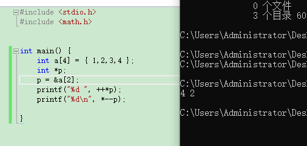

# 统一作业 指针 

1 B  

2 A   
a 是个常量，不能变化，但是p是个指针变量，可以加减，p的加减与p的类型有关，如果p是个int 则，每次加四个字节，就是int 型的长度，其它的也是相同的。char 每次加一个字节。
p+5代表第六个数值的地址。即*(p+5)=a[5];   

3 D  

数组名为首地址，是常量不能自加 运算也不行。如果是指针就可以。    


4  C   

定义一个指针变量*p,指向普通变量就是把普通变量的地址赋给它 float d,*p=&d    

5 C

a的值为11 *p相当于变量a, *p的值为10   

6 4 2  

     

p指向了a的下标为2的元素，C语言的数组下标是从0开始的，下标为2指的是第三个元素，2，++（*p）将该元素增加1,3+1=4  3-1=2    

# 编程题 
# 1. 拆分实数的整数与小数部分
【问题描述】

拆分实数的整数与小数部分：要求自定义一个函数 void splitfloat(float x, int *intpart, float *fracpart)，其中 x 是被拆分的实数，*intpart 和*fracpart 分别是将实 数 x 拆分出来的整数部分与小数部分。编写主函数，并在其中调用函数 splitfloat()。试 编写相应程序。（保留2位小数）

【输入形式】
【输出形式】
【样例输入】

3.65
【样例输出】

3 0.65

```CPP
#include<stdio.h>
void splitfloat(float x, int *intpart, float *fracpart);
int main(void)
{
	float x, fracpart;
	int intpart;
	scanf("%f", &x);
	splitfloat(x, &intpart, &fracpart);
	printf("%d ", intpart);
	printf("%.2f\n", fracpart);
}
void splitfloat(float x, int *intpart, float *fracpart)
{
	*intpart = (int)x;
	*fracpart = x - *intpart;
}

```

# 2. 字符串排序
【问题描述】读入5个字符串，按由大到小的顺序输出。

【输入形式】输入为由空格分隔的5个非空字符串，每个字符串不包括空格、制表符、换行符等空白字符，长度小于80。

【输出形式】排序后的字符串每个占一行
【样例输入】

red yellow blue black white

【样例输出】

yellow

white

red

blue

black

```CPP
#include<stdio.h>
#include<string.h>
int main()
{
	char a[5][20], *p[5], *t;
	int i, j;
	//不需要中文的话 就删了就行
	puts("输入五个字符串");
	for (i = 0; i < 5; i++) {
		scanf("%s", a[i]);
		p[i] = a[i];
	}
	for (i = 0; i < 5; i++) {
		for (j = i + 1; j < 5; j++) {
			if (strcmp(p[j], p[i])>0) {
				t = p[j];
				p[j] = p[i];
				p[i] = t;
			}
		}
	}
	//puts("从大到小顺序为");
	//puts("");
	for (i = 0; i < 5; i++)
		printf("%s\n", p[i]);
	return 0;
}


```

# 循环后移：
【问题描述】

循环后移：有 n 个整数，使前面各数顺序向后移 m 个位置，移出的数再从开头移入。编 写一个函数实现以上功能，在主函数中输入 n 个整数并输出调整后的 n 个数。试编写相应程 序。【输入形式】
【输出形式】
【样例输入】
5 2

1 2 3 4 5

【样例输出】

4 5 1 2 3
【样例说明】

有5个元素的数组，后移2个位置

```CPP
#include <stdio.h>
int main()
{
	void move(int [20],int,int);
	int number[20],n,m,i;
	//printf("how many numbers?");
	scanf("%d",&n);
    //printf("how many place you want move?");
	scanf("%d",&m);
	printf("input %d numbers:\n",n);
	for(i=0;i<n;i++)
		scanf("%d",&number[i]);

	move(number,n,m);
	//printf("Now,they are:\n");
	for(i=0;i<n;i++)
		printf("%d ",number[i]);
	printf("\n");
	return 0;
}

void move(int array[20],int n,int m)
{
	int *p,array_end;
	array_end=*(array+n-1);
	for(p=array+n-1;p>array;p--)
		*p=*(p-1);
	*array=array_end;
	m--;
	if(m>0)
		move(array,n,m);
}


```