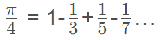
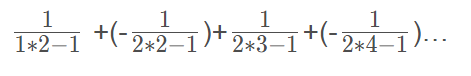

# 大胃王伟伟无无无无无无无无无无无无无无无无无无无无无无无无无无无无无无无无无无无无无无无无无无无无无无无无无无无无无无无无无无无

# 选择题填上去了

# 1. 整数合并
【问题描述】
编写一函数int comb(int a,int b)，将两个两位数的正整数a、b合并形成一个整数并返回。合并的方式是：将a的十位和个位数依次放在结果的十位和千位上， b的十位和个位数依次放在结果的个位和百位上。例如，当a＝45，b=12。调用该函数后，返回5241。要求在main函数中调用该函数进行验证：从键盘输入两个整数，然后调用该函数进行合并，并输出合并后的结果。
【输入形式】
输入两个两位数的正整数，以空格隔开。

【输出形式】

输出合并后的正整数。
【输入样例】

45 12
【输出样例】

5241

```cpp
#include <stdio.h>

int comb(int a,int b);

int main()

{

    int a,b;

    scanf("%d %d",&a,&b);

    printf("%d",comb(a,b));

    return 0;

}

int comb(int a,int b)

{

    int q,w,e,r,s;

    q=a%10;

    w=a/10%10;

    e=b%10;

    r=b/10%10;

    s=1000*q+100*e+10*w+r;

    return s;

}
```

2. 计算并输出如图所示的杨辉三角形
1

1  1

1  2  1

1  3  3  1

1  4  6  4  1

【要求打印出6行，数字之间空2格】

```cpp
#include<stdio.h>
void main()
{
	int a[6][6]={1};
	int i,j;
	for(i=1;i<6;i++)
	{
		a[i][0]=1;
	for (j=1;j<=i;j++)
		a[i][j]=a[i-1][j-1]+a[i-1][j];
	}
	for(i=0;i<6;i++)
	{
	for(j=0;j<=i;j++)
		printf("%-3d",a[i][j]);
	printf("\n");
	}
}
// 我不知道错在哪里 %- 的输出也不行 直接用空格也不行 这他妈是傻逼么 


```


# 3. 时间换算：
【问题描述】

时间换算：用结构类型表示时间内容（时间以时、分、秒表示），输入一个时间数值， 再输入一个秒数 n（n<60），以 h:m:s 的格式输出该时间再过 n 秒后的时间值(超过 24 点就 从 0 点开始计时)。试编写相应程序。

【输入形式】

时：分：秒

间隔秒数
【输出形式】

时：分：秒


【样例输入】

11:10:10

10

【样例输出】

11:10:20

【样例说明】


【评分标准】

```cpp
#include <stdio.h>

struct time {
	int hour;
	int minute;
	int second;
};

void add(struct time *p, int s) {
	int ho, mi, se;
	ho = p->hour;
	mi = p->minute;
	se = p->second;
	se = se + s;
	if (se<60) { p->second = se; return; }
	else {
		mi = p->minute = mi + se / 60;
		se = p->second = se % 60;
		if (mi<60) { return; }
		else {
			mi = p->minute = mi % 60;
			ho = ho + mi / 60;
			mi = p->hour = mi % 60;
		}
		if (ho<24) { return; }
		else mi = p->hour = mi % 24;
		return;
	}
}

int main(int argc, const char * argv[]) {
	struct time c;
	int n;
	//printf("请输入时间：");
	scanf("%d:%d:%d", &c.hour, &c.minute, &c.second);
	//printf("请输入秒数：");
	scanf("%d", &n);
	add(&c, n);
	printf("%d:%d:%d", c.hour, c.minute, c.second);
	return 0;
}
```
##### 不知道哪里错了 一直测试正常 

#### OK了


```cpp
#include<stdio.h>
 
struct time{
    int hour;
    int minute;
    int second;
};
 
int main()
{
    struct time time_1;
    int n;
    scanf("%d:%d:%d",&time_1.hour,&time_1.minute,&time_1.second);
    scanf("%d",&n);
    time_1.second = time_1.second + n;
    if(time_1.second >= 60){
        time_1.second = time_1.second % 60;
        time_1.minute = time_1.minute + 1;
        if(time_1.minute >= 60){
            time_1.hour = time_1.hour + 1;
            time_1.minute = time_1.minute % 60;
            if(time_1.hour >= 24) time_1.hour = time_1.hour % 24;
        }
    }
    printf("%02d:%02d:%02d\n",time_1.hour,time_1.minute,time_1.second);
}
```


# 4. 判断素数
【问题描述】
编写一个函数isprime(n)，判断整数n是否为素数。
在main()函数中测试此函数：从键盘输入一个整数，然后调用该函数进行判断，当为素数时，输出1，否则，输出0。

【输入形式】
从键盘输入一个整数。
【输出形式】
在屏幕上输出判断结果0或者1。
【输入样例】

45
【输出样例】

0
【样例说明】
 45非素数，故输出为0。

```cpp
#include <stdio.h>
int isprime(int n)
{
	int i;
	for (i = 2; i <= n - 1; i++) { if (n %i == 0) return 0; }
	return 1;
}
int main()
{
	int x, y;
	//printf("请输λ一个整数: ");
	scanf("%d", &x);
	y = isprime(x);
	if (y == 0)
		printf("0\n");
	else
		printf("1\n");
}

```


# 5. 整数各位数字求和
【问题描述】
编写函数int sum(int x)，求整数x的各位数字之和。
在main函数中测试该函数：从键盘输入一非负整数，然后调用sum函数计算各位数字之和并输出结果。
【输入形式】
输入一个正整数。
【输出形式】

输出该整数各位数字之和。
【样例输入】

58
【样例输出】

13
【样例说明】

输入整数58，其各位数字之和为：5+8 = 13。

```cpp
#include <stdio.h>

int i = 0;
unsigned n;
int sum(int n)
{
	while (n != 0)
	{
		i += (n % 10);
		n = n / 10;
	}
	return i;
}
int main()
{

	//cin >> n;
	scanf("%d", &n);
	printf("%d", sum(n));
	//cout << sum(n) << endl;
	return 0;
}
```


# 6. 回文数A
【问题描述】

所谓"回文数"是指具有如下性质的整数：一个整数，当它的各位数字逆序排列，形成的整数与原整数相同，这样的数称为回文数。例如，素数11，373，其各位数字对换位置后仍然为11，373，因此这两个整数均为回文数。编写函数int loop(int x)，判断一个整数是否为回文数，如果x是回文数则返回1，否则返回0。编写程序loop.c，接收控制台输入的两个整数a，b。调用loop函数输出a到b之间（包括a和b）的所有为偶数的回文数。
【输入形式】

控制台输入两个整数a和b（必有a<b），以空格分隔。
【输出形式】

输出有若干行，每行有一个a和b之间的回文数。输出各行上的数字不重复，且从小至大依次按序输出。
【样例输入】

3 120
【样例输出】

4
6
8
22
44
66
88
【样例说明】

输入整数a=3，b=120，要求输出所有[3, 120]之间的为偶数的回文数。按升序分行输出所有符合题意的整数。

```cpp
#include<stdio.h>

int loop(int num)
{

	int s, y = 0;
	s = num;
	while (s>0) {

		y = y * 10 + s % 10;//构造一个新数等于原数的数字逆序排列
		s = s / 10;
	}
	if (y == num) {
		//倒置的数等于原数
		return 1;
	}
	else {

		return 0;
	}
}


int main()
{

	int a, b;
	scanf("%d%d", &a, &b);//获取上下限
	for (int i = a; i <= b; i++)
	{

		if (loop(i) == 1 && (i % 2 == 0))//是回文数且为偶数
			printf("%d\n", i);
	}
	return 0;
}
```


# 7 统计那些数
输入一批以-1结束的整数，依次输出它们之中的最大数，最小数，平均数。如果直接输入-1，则输出none

 

【输入】

5 6 4 3 2 1 -1

【输出】

1,6,3.500

【输入】

-1

【输出】

none


【输入】

-4 -1

【输出】

-4,-4,-4.000


格式说明：输出的三个数以逗号隔开，平均数保留3位小数。

```cpp
#include <stdio.h>
#include <string.h>
#include <math.h>
#include <stdlib.h>
// // 拷贝到平台的时候把my_fuction_lib.h注释掉.
//#include "my_fuction_lib.h"

//在此下方插入自定义函数对的声明:
void statistics(int n, int s[], int *max, int *min, float *avg)
{

	max[0] = min[0] = s[0];
	float sum = max[0];
	for (int i = 1; i<n; i++)
	{

		if (s[i] > max[0]) max[0] = s[i];
		else if (s[i] <min[0]) min[0] = s[i];
		sum += s[i];
	}
	avg[0] = sum / n;
}
int Input(int s[])
{

	/*
	以下写法不可取,因为scanf里的i++后,回到while的判断中,是s[i]就不是刚才读组的值了
	因此无法判断刚才读到的是否结束标志0.
	int i = 0;
	scanf("%d",&s[i]);
	while(  s[i] != 0)
	{
	scanf("%d",&s[i++]);
	} */
	int i = 0;
	/* 初始化s[0] */
	scanf("%d", &s[i]);
	for (; s[i++] != -1;)
	{
		//printf("123");
		scanf("%d", &s[i]);
	}

	return i - 1;
}
//主函数main
int main()
{

	int s[100];

	int min[1];
	int max[1];
	float avg[1];
	int n;


	int i = 0;


	//while(scanf("%d",&s[i++]) && s[i] != -1);
	n = Input(s);
	statistics(n, s, max, min, avg);
	//printf("Num=%d\n", n);
	// 最大最小调换了啊 。。。。
	printf("%d,", min[0]);
	printf("%d,", max[0]);
	
	printf("%.3f ", avg[0]);


	return 0;
}
```


# 8. 求交错序列前n项和
计算：1-2/3+3/5-4/7+5/9-6/11+...的前n项（小数点后保留5位）

```cpp
#include <stdio.h>
#include <math.h>
int main()
{
    int n,i;
    double sum=0;
    //printf("Enter n:");
    scanf("%d",&n);
    for(i=1;i<=n;i++)
    {
        sum=sum+pow(-1,i+1)*i/(2*i-1);
    }
    printf("%0.5f\n",sum);
    
    return 0;
}
```


# 9. 求三角形面积
【问题描述】

若已知三角形三个边的长度分别为a,b,c（并假设三个边长度的单位一致，在本编程题中忽略其单位），则可以利用公式S=s(s-a)(s-b)(s-c)求得三角形的面积，其中：s=(a+b+c)/2。编程实现从控制台读入以整数表示的三个边的长度（假设输入的长度肯定可以形成三角形），然后利用上述公式计算面积并输出，结果小数点后保留3位有效数字。

【输入形式】

从控制台输入三个整数表示三角形三个边的长度，以空格分隔三个整数。

【输出形式】

向控制台输出求得的三角形的面积，小数点后保留三位有效数字。

【输入样例】

4 4 6
【输出样例】

7.937
【样例说明】

输入的三角形三个边的长度分别为4、4、6，利用上述计算公式可以求得三角形的面积为7.937，小数点后保留三位有效数字。

提示：可以使用求平方根的库函数，见教科书的附录B.4，使用前应包含头文件<math.h>。

```cpp
#include <stdio.h>
#include <math.h>

int main()
{
	//a，b，c分别为三角形三边长，d为三角形中a边所对角 的 cos值，e为sin值。
	float a, b, c, cosA, sinA;
	//输入三角形三边的长度
	scanf("%f%f%f", &a, &b, &c);
	//利用余弦定理计算d的值
	cosA = (b * b + c * c - a * a) / (2 * c * b);
	//计算sin的值
	sinA = sqrt(1 - (cosA * cosA));
	//area为三角形面积
	float area = b * c * sinA * 0.5;
	printf("%.3f", area);
	return 0;
}
```
不要判断三角形成立与否 因为这是傻逼出的题 

# 公式计算2：求π
【问题描述】

有公式 π/4 = 1-1/3+1/5-1/7+1/9-...1/(2n-1)，利用该公式可以计算π的近似值。给定一个精度值e，求前后两次迭代之差的绝对值小于e时相应的最小迭代次数n（n大于等于2）。提示：请用double类型的变量进行计算。

【输入形式】

从标准输入中读入e(e>=0.00001)的值。

【输出形式】

在标准输出上输出迭代次数n。

【输入样例】

0.1
【输出样例】

21
【样例说明】

输入的精度为0.1。利用上述计算公式求π值，当n为19时，求得的π的近似值为3.194188；当n为20时，求得的π的近似值为3.091624，两者之差的绝对值为0.102564，大于要求的精度0.1，所以应继续迭代计算。当n为21时，求得的π的近似值为3.189185，与n为20求得的近似值之差的绝对值是0.097561，小于要求的精度，所以满足精度要求的最小迭代次数为21

```cpp
#include<stdio.h>
int main(void)
{
	int i = 2, f = 1, count = 1;
	double pi, sum = 0, t = 1;
	double ee;
	scanf("%lf", &ee);
	while (t >= ee)
	{
		sum = sum + f*t;
		t = 1.0 / (2 * i - 1);
		i++;
		f = -f;
		count++;
	}
	pi = sum * 4;
	//printf("pi=%lf\ncount=%d\n", pi, count);
	printf("%d",count);
	return 0;
}

```

首先 这道题是是可以转换为
  
通过公式，我们知道，公式左边是一个Pi/4的值，右边可以看做是一个不断累加的和，只不过这个累加的量，每间隔一个会是一个负值，如果右边的值我们看做是n个数的累加和，当n=1时是1，当n=2时是1-1/3，当n=3时是1-1/3+1/5，依次类推，我们可以这么来看：  

   

无论当前是第几个数，他的值就是flag*(1/2*i-1)。根据这个思路，我们的程序可以做出如下的设计：  
```cpp
	while (t >= ee)
	{
		sum = sum + f*t;
		t = 1.0 / (2 * i - 1);
		i++;
		f = -f;
		count++;
	}
	pi = sum * 4;
```
ee 作为精确度 count计数循环次数n

好像不行 我换个思路 公式不变 

```cpp
#include <stdio.h>
int main()
{
    //我们将第一轮迭代的结果作为初始值，从第二轮开始迭代（因为题目说了至少2轮）
    double e, a = 1, b = 1, cur = 1, prev;
    //cur代表本轮迭代pi/2的近似值，prev代表上一轮的计算结果
    int i, n = 1;
    scanf("%lf", &e);
    do
    {
        //n是本轮是第几轮迭代
        n++;
        //就像我们分析的那样做
        a = a * (n - 1);
        b = b * (2 * n - 1);
        //对于这一轮来说，上一轮的结果是计算之前的cur的值
        prev = cur;
        //计算这一轮的近似结果
        cur = prev + a / b;
    } while (cur - prev >= e / 2);//因为我们近似的是pi/1，所以实际上要求的精度是2*cur - 2*prev < e
    printf("%d %.7f", n, 2 * cur);
    return 0;
}
```


# 11. 回文数
【问题描述】

所谓"回文数"是指具有如下性质的整数：一个整数，当它的各位数字逆序排列，形成的整数与原整数相同，这样的数称为回文数。例如，素数11，373，其各位数字对换位置后仍然为11，373，因此这两个整数均为回文数。编写函数int loop(int x)，判断一个整数是否为回文数，如果x是回文数则返回1，否则返回0。编写程序loop.c，接收控制台输入的两个整数a，b。调用loop函数输出a到b之间（包括a和b）的所有回文数
【输入形式】

控制台输入两个整数a和b（必有a<b），以空格分隔。
【输出形式】

输出有若干行，每行有一个a和b之间的回文数。输出各行上的数字不重复，且从小至大依次按序输出。
【样例输入】

3 120
【样例输出】

3
4
5
6
7
8
9
11
22
33
44
55
66
77
88
99
101
111
【样例说明】

输入整数a=3，b=120，要求输出所有[3, 120]之间的回文数。按升序分行输出所有符合题意的整数。

```cpp
#include<stdio.h>
int loop(int num)
{    
    int s,y=0;
    s=num;
    while(s>0)
    {    
        y=y*10+s%10;//构造一个新数等于原数的数字逆序排列
        s=s/10;
    }
    if(y==num)//倒置的数等于原数
    {   
        return 1;
    }
    else
    {
        return 0;
    }
}
int main()
{
    int a,b,i;
    scanf("%d%d",&a,&b);//获取上下限
    for (i=a;i<=b;i++)
    {   
        if (loop(i)==1)
            printf("%d\n",i);
    }
    return 0;
}

```


# 12. 日期天数转换
【问题描述】

编写一个程序，用户输入日期，计算该日期是这一年的第几天。
【输入形式】

用户在第一行输入一个日期（年 月 日,中间以空格分割）
【输出形式】

程序在下一行输出一个整数
【样例输入】

2006 2 21
【样例输出】

52
【样例说明】

用户以年月日的格式输入，中间以空格分割，程序计算出该天是输入年份的第几天并输出该天数。另外还需要判断这一年是否为闰年。

```cpp
#include <stdio.h>
int main()
{
int a,b,c,day,e;
scanf("%d %d %d",&a,&b,&c);
e=b-1;
switch(e)
{
    case 1:day=31;break;
    case 2:day=59;break;
    case 3:day=90;break;
    case 4:day=120;break;
    case 5:day=151;break;
    case 6:day=181;break;
    case 7:day=212;break;
    case 8:day=243;break;
    case 9:day=273;break;
    case 10:day=304;break;
    case 11:day=334;break;
    default:day=0;break;
}
    if(b>2)
    {
        if((a%400==0)||(a%4==0&&a%100!=0))    
            day=day+1+c;
        else 
            day=day+c;
    }
    else day=day+c;
    printf("%d",day);
    return 0;
}

```


# 13. 找最大最小整数
【问题描述】

编写一个程序，用户输入若干整数，试找出其中的最大数和最小数。
【输入形式】

用户在第一行待输入数据个数，在第二行输入数据。
【输出形式】

程序在下一行输出数据的最大值和最小值
【样例输入】

 5
 89 62 96 74 52
【样例输出】

96 52
【样例说明】

用户第一次输入的为数据个数，在下一行依次输入数据。输出为5个数中的最大值和最小值，输出时候两个数之间用空格分隔。

```cpp
#include <stdio.h>


int main()
{
	int n = 0, op1 = 0, op2 = 0, cmax, cmin, temp;
	//cin >> n;
	scanf("%d", &n);
	//cin >> op1 >> op2;
	scanf("%d %d", &op1, &op2);
	if (op1>op2) {
		cmax = op1;
		cmin = op2;
	}
	else {
		cmax = op2;
		cmin = op1;
	}
	for (int i = 0; i<n - 2; i++) {
		//cin >> temp;
		scanf("%d", &temp);
		if (temp>cmax)
			cmax = temp;
		else if (temp<cmin)
			cmin = temp;
	}
	//cout << cmax << " " << cmin << endl;
	printf("%d %d", cmax, cmin);
	return 0;
}
```

5 0 错误 期望 5 5 

重新debug一下 

```cpp
#include <stdio.h>

main()
{
    int n,max,min,i;
    int num[1024];
    scanf("%d\n",&n);
    max=0;
    min=9999;
    for(i=0;i<=n-1;i++){
        
        scanf("%d ",&num[i]);
        
        if(max<=num[i]){
            max=num[i];
        }
        if(min>=num[i]){
            min=num[i];
        }
    }
    printf("%d %d\n",max,min);
}
```
不应该想这么深 直接用最简单的办法AC就行了 


# 14. 计算空格、换行个数
【问题描述】
编写一程序，分别计算所输入的字符串中空格，换行符的个数。
【输入形式】
输入可以是键盘上的任意字符。
【输出形式】
分别输出空格，换行符的个数，输出的结果一行显示，数字之间以空格格开。
【输入样例】

bb  ss  pp=
fz
【输出样例】

2 1
【样例说明】
字符b与s之间有一个空格，s与p之间有一个空格，=与f之间有一个换行。

注意：fz之前没有空行。

```cpp
#include <stdio.h>
int main() {
	int c;
	int n = 0;
	int m = 0;
	while ((c = getchar()) != EOF)
	{
		if (c == ' ') ++n;
		if (c == '\n') ++m;
	}
	printf("%d %d\n", n, m+1);
	return 0;
}
```


# 15. 前驱、后继字符
【问题描述】
从键盘输入一个字符，求出它的前驱和后继字符（按照ASCII码值排序），并按照从小到大的顺序输出这三个字符和对应的ASCII值。
【输入形式】
从键盘输入一个字符
【输出形式】
按两行输出：
第一行按照从小到大的顺序输出这三个字符，并以一个空格隔开；
第二行按照从小到大的顺序输出三个字符对应的ASCII值，并以一个空格隔开。
【输入样例】

b
【输出样例】

a b c
97 98 99
【样例说明】
输入字符b，b的前驱字符是a，后继字符是c，第一行按照从小到大的顺序输出a b c；第二行输出对应的ASCII值97 98 99

```cpp
#include <stdio.h>

void main(){
	char c;
	//printf("请输入字符c:");
	scanf("%c",&c);
	printf("%c %c %c\n",c-1,c,c+1);
	printf("%d %d %d\n",c-1,c,c+1);
	
}
```


# 16. 计算两个复数之积：
【问题描述】

计算两个复数之积：编写程序，利用结构变量求解两个复数之积。 提示：求解(a1+a2i)×(b1+b2i)，乘积的实部为c1：a1×b1 - a2×b2，虚部为c2：a1×b2 + a2×b1。

【输入形式】

a1 a2 b1 b2
【输出形式】

c1+c2i
【样例输入】

3 6 2 4
【样例输出】

-18+24i
【样例说明】
【评分标准】

```cpp
#include<stdio.h>
void main()
{
    struct stu{
        int real;
        int imag;
    };
    struct stu s[2];
    int i,pr_real=0,pr_imag=0;
    //printf("Please Input 2 plural number real and imag:\n");   //plural：复数
    for(i=0;i<2;i++)
        scanf("%d%d",&s[i].real,&s[i].imag);
    pr_real=s[0].real*s[1].real-s[0].imag*s[1].imag;
    pr_imag=s[0].real*s[1].imag+s[0].imag*s[1].real;
    //printf("(%d+(%d)i)*(%d+(%d)i)=%d+(%d)i\n",s[0].real,s[0].imag,s[1].real,s[1].imag,pr_real,pr_imag);
	printf("%d+%di\n",pr_real,pr_imag);
//控制为格式化输出

}

```

