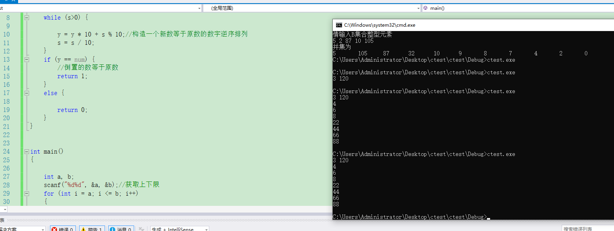

# 人工智能2班练习
作业时间： 2021-12-01 12:34:00 至 2021-12-07 23:55:00

# 1. 删除子串
【问题描述】

编写一个程序，当在一个字符串中出现子串时就删除它。
【输入形式】

用户在第一行输入一个字符串，用户在第二行输入一个子串。
【输出形式】

程序在下一行输出删除其中所有子串后的字符串。如果字符串不包含子串则输出原字符串本身。
【样例输入】

 I am a boy!
 a
【样例输出】

 I m  boy!   
【样例说明】

```cpp
#include <stdio.h>
#include <string.h>

int main() {
    char a[20],b[200],c[20];
    int num,tol,i=0,j,k=0;

    gets(b);
    gets(a);

    num=strlen(a);
    tol=strlen(b);

    while(i<tol){

        for(j=i;j<(num+i);j++){
            c[k]=b[j];
            k++;
        }
        c[k] = '\0';
        if(!stricmp(a,c)){//Linux下的命令strcasecmp  win用stricmp
            i+=num;
            k=0;

        }else{
            printf("%c",b[i]);
            k=0;
            i++;
        }
    }

    return 0;
}

```

# 2. 公式计算1：求π
【问题描述】

有公式 π/2 = (2/1 x 2/3) x (4/3 x 4/5) x (6/5 x 6/7) x ... x [2n/(2n-1)x2n/(2n+1)]，利用该公式可以计算π的近似值。给定一个精度值e，求前后两次迭代之差的绝对值小于e时相应的最小迭代次数n（n大于等于2）。提示：请用double类型的变量进行计算。
【输入形式】

从标准输入中读入e(e>=0.000001)的值。

【输出形式】

在标准输出上输出迭代次数n。

【输入样例】

0.01
【输出样例】

9
【样例说明】
```cpp
#include<stdio.h>
double fun(int n)
{
	int i;
	double num;
	num = 1;
	for (i = 1; i <= n; i++)
	{
		num = num*(2 * i*1.0 / (2 * i - 1) * 2 * i*1.0 / (2 * i + 1));
	}
	return 2 * num;
}
int main()
{
	double m, e, u;
	int n, count = 0, i;
	scanf("%lf", &e);
	for (i = 1; i<10000; i++)
	{
		u = fun(i + 1) - fun(i);
		//printf("%lf ",u);

		if (u<e) break;

	}
	printf("%d", i + 1);
	return 0;
}
```

# 3. 求三角形面积
【问题描述】

若已知三角形三个边的长度分别为a,b,c（并假设三个边长度的单位一致，在本编程题中忽略其单位），则可以利用公式S=s(s-a)(s-b)(s-c)求得三角形的面积，其中：s=(a+b+c)/2。编程实现从控制台读入以整数表示的三个边的长度（假设输入的长度肯定可以形成三角形），然后利用上述公式计算面积并输出，结果小数点后保留3位有效数字。

【输入形式】

从控制台输入三个整数表示三角形三个边的长度，以空格分隔三个整数。

【输出形式】

向控制台输出求得的三角形的面积，小数点后保留三位有效数字。

【输入样例】

4 4 6
【输出样例】

7.937


```cpp
# include <stdio.h>
# include <stdlib.h>
# include <math.h>

int main() {
	int a, b, c;
	scanf("%d %d %d", &a, &b, &c);
	double area, perimeter, s;
	// 能构成三角形的条件
	if (a + b > c && a + c > b && b + c > a) {
		s = (a + b + c) / 2.0;
		area = sqrt(s * (s - a) * (s - b) * (s - c));
		perimeter = 2 * s;
		printf("%.3f", area);
	}
	else {
		printf("These sides do not correspond to a valid triangle");
	}
	return 0;
}

```

# 4. 计算n个a相减
【问题描述】

输入两个整数a（大于等于1且小于等于9）和n（大于等于1且小于等于80），编程求得并输出下面等式的值：

22.jpg

例如：若输入的a为5，n为6，则要计算下面公式的值：

555555-55555-5555-555-55-5。

【输入形式】

从标准输入读入整数a和n，两者之间以一个空格分隔。

【输出形式】

在标准输出上输出公式的计算结果。

【样例1输入】

5 6
【样例1输出】

493830
【样例1说明】

输入的a为5，n为6，按照上述公式计算的结果为493830。

【样例2输入】

5 20
【样例2输出】

49382716049382716060
【样例2说明】

输入的a为5，n为20，按照上述公式计算的结果为49382716049382716060。

```cpp
#include <stdio.h>
//using namespace std;
int a[1000], b[1000];
int x, n;
int main()
{
	//cin >> x >> n;
	scanf("%d %d", &x, &n);
	for (int i = 0; i < n; i++)
	{
		a[i] = b[i] = x; //a是被减数,b是用来减的
	}
	int t = n - 1; //记录b中x的个数，就是看看减几个x
				   //b不变 a变
	for (int i = 0; i < n; i++) //一共减n次
	{
		for (int j = 0; j < t; j++) //控制b的数量
		{
			if (a[j] - b[j] < 0) //稍微难点的是会有借位
			{
				a[j] = a[j] + 10 - b[j];
				int p = 1;
				while (a[j + p] == 0) //注意可能不只是向前一位借 ，我第一次就是被坑了这
				{
					a[j + p] = 9;
					p++;
				}
				a[j + p]--; //最后借的就是前面第一个不是0的数的它
			}
			else
			{
				a[j] = a[j] - b[j];
			}
		}

		// cout << endl;
		t--;
	}
	//防止最前的是0做的标记
	int k = 0;
	for (int i = n - 1; i >= 0; i--)
	{
		if (a[i] != 0)//标记
			k = 1;
		if (k == 0 && a[i] == 0)
			continue;
		//cout << a[i];
		printf("%d", a[i]);
	}
	return 0;
}

```

# 5. 阶乘和数2
【问题描述】

一个正整数如果等于组成它的各位数字的阶乘之和，则该正整数称为阶乘和数。例如正整数145，1!+4!+5!等于145，因此145就是一个阶乘和数。输入一个正整数，计算它的各位数字的阶乘之和，并判断它是否是一个阶乘和数。注意：输入的正整数，以及组成它的各位数字的阶乘之和都不会超过int类型的表示范围，并且输入的正整数的最高位不为0。

【输入形式】

从控制台输入一个正整数。

【输出形式】

先输出输入的正整数和一个逗号","，并从个位开始输出组成该正整数的各位数字的阶乘（阶乘计算结果）相加的形式，然后输出等号"="和各位数字阶乘之和，最后在下一行输出字符串"Yes"表示该正整数是阶乘和数，否则输出字符串"No"表示该正整数不是阶乘和数。

【输入样例1】

145
【输出样例1】

145,120+24+1=145
Yes
【输入样例2】

1400
【输出样例2】

1400,1+1+24+1=27
No
【输入样例3】

4
【输出样例3】

4,24=24
No
【样例说明】

样例1中输入的正整数为145，其个位为5，5的阶乘为120，十位为4，4的阶乘为24，百位为1，1的阶乘为1，这些阶乘之和为145，所以145为阶乘和数。样例2中输入的正整数为1400，组成它的各位数字的阶乘之和为27，所以1400不是阶乘和数。样例3中输入的正整数为4，组成它的只有一位数字，其阶乘为24，也不是阶乘和数。


```cpp
#include <stdio.h>
#include <string.h>
#include <stdlib.h>
int main() {
    char str[10];
    int i, j, sum = 0, num[10], tmp = 0;
    gets(str);
    printf("%s,", str);
    for (i = 0; i<strlen(str); i++) {
        num[i] = str[i] - '0';
    }
    for (i = strlen(str) - 1; i >= 0; i--) {
        j = 1;
        if (num[i]>1) {
            while (num[i]--) {
                j = j * (num[i] + 1);
            }
            sum = sum + j;
        }
        else {
            sum = sum + 1;
        }
        if (i == 0) {
            printf("%d=%d\n", sum - tmp, sum);

            tmp = atoi(str);
            if (tmp == sum) {
                puts("Yes");
            }
            else {
                puts("No");
            }
        }
        else {
            printf("%d+", sum - tmp);
        }
        tmp = sum;
    }

    return 0;
}

```


# 6. 整数各位数字求和
【问题描述】
编写函数int sum(int x)，求整数x的各位数字之和。
在main函数中测试该函数：从键盘输入一非负整数，然后调用sum函数计算各位数字之和并输出结果。
【输入形式】
输入一个正整数。
【输出形式】

输出该整数各位数字之和。
【样例输入】

58
【样例输出】

13
【样例说明】

输入整数58，其各位数字之和为：5+8 = 13。


```cpp
#include <stdio.h>

int i = 0;
unsigned n;
int sum(int n)
{
	while (n != 0)
	{
		i += (n % 10);
		n = n / 10;
	}
	return i;
}
int main()
{

	//cin >> n;
	scanf("%d", &n);
	printf("%d", sum(n));
	//cout << sum(n) << endl;
	return 0;
}

```


# 7. 求最大公因子
【问题描述】

用递归方法编写求最大公因子程序。两个正整数x和y的最大公因子定义为：如果y<=x且x mod y＝0时，gcd(x,y)=y;如果y>x时，gcd(x,y)=gcd(y,x);其他情况，gcd(x,y)=gcd(y,x mod y)
【输入形式】

用户在第一行输入两个数字，数字之间用空格分割。
【输出形式】

程序在下一行输出前面输入的两个数字的最大公因子。
【样例输入】

36 24
【样例输出】

12
【样例说明】

用户输入36，24，程序输出它们的最大公因子12


```cpp
#include <stdio.h>

int gcd(int a, int b)
{
	if (a <= 0 || b <= 0) return 0;    //如果传进来的参数小于0则返回0
	if (a%b == 0) return b;           //如果b能被a整除则b就是最大公约数
	else gcd(b, a%b);                //递归 调用函数本身

}

int main()
{
	int a, b, c;
	//printf("请输入两个数:\n");
	scanf("%d %d", &b, &c);
	a = gcd(b, c);
	printf("%d", a);
}
```


# 8. 判断素数
【问题描述】
编写一个函数isprime(n)，判断整数n是否为素数。
在main()函数中测试此函数：从键盘输入一个整数，然后调用该函数进行判断，当为素数时，输出1，否则，输出0。

【输入形式】
从键盘输入一个整数。
【输出形式】
在屏幕上输出判断结果0或者1。
【输入样例】

45
【输出样例】

0
【样例说明】
 45非素数，故输出为0。


```cpp
#include <stdio.h>
int isprime(int n)
{
	int i;
	for (i = 2; i <= n - 1; i++) { if (n %i == 0) return 0; }
	return 1;
}
int main()
{
	int x, y;
	//printf("请输λ一个整数: ");
	scanf("%d", &x);
	y = isprime(x);
	if (y == 0)
		printf("0\n");
	else
		printf("1\n");
}


```


# 9. 矩阵求和
【问题描述】
对于一个N阶矩阵，分别按行、按列、按两对角线计算元素之和。
【输入形式】
先输入矩阵的阶数（不超过50），然后输入一个n阶矩阵。
【输出形式】
第一行输出按行计算出的元素之和，以一个空格分隔；
第二行输出按列计算出的元素之和，以一个空格分隔；
第三行、第四行分别输出左、右对角线计算出的元素之和。
【输入样例】

3
1 2 3
4 5 6
7 8 9
【输出样例】

6 15 24                     (行之和)
12 15 18                   （列之和）
15                        （左对角线和）
15                        （右对角线和）
【样例说明】
输入一个3阶矩阵，分别计算输出它的行，列和对角线的和


```cpp
#include<stdio.h>
int main()
{
	int k[5][5];
	int a[5]={0,0,0,0,0},b[5]={0,0,0,0,0},c=0,d=0;
	int i,j,n;
	scanf("%d",&n);
 
	for(i=0;i<n;i++)
		for(j=0;j<n;j++)
			scanf("%d",&k[i][j]);
	for(i=0;i<n;i++)
		for(j=0;j<n;j++)
			a[i]=k[i][j]+a[i];
 
	for(j=0;j<n;j++)
		for(i=0;i<n;i++)
			b[j]=k[i][j]+b[j];
 
	for(i=0;i<n;i++)
		c=k[i][i]+c;
	for(i=0;i<n;i++)
		d=k[i][n-i-1]+d;
 
	for(i=0;i<n;i++)
		printf("%d ",a[i]);
	printf("\n");
	for(i=0;i<n;i++)
		printf("%d ",b[i]);
	printf("\n");
	printf("%d",c);
	printf("\n");
	printf("%d",d);
	return 0;
}
```


# 10 公式计算2：求π
【问题描述】

有公式 π/4 = 1-1/3+1/5-1/7+1/9-...1/(2n-1)，利用该公式可以计算π的近似值。给定一个精度值e，求前后两次迭代之差的绝对值小于e时相应的最小迭代次数n（n大于等于2）。提示：请用double类型的变量进行计算。

【输入形式】

从标准输入中读入e(e>=0.00001)的值。

【输出形式】

在标准输出上输出迭代次数n。

【输入样例】

0.1
【输出样例】

21
【样例说明】

输入的精度为0.1。利用上述计算公式求π值，当n为19时，求得的π的近似值为3.194188；当n为20时，求得的π的近似值为3.091624，两者之差的绝对值为0.102564，大于要求的精度0.1，所以应继续迭代计算。当n为21时，求得的π的近似值为3.189185，与n为20求得的近似值之差的绝对值是0.097561，小于要求的精度，所以满足精度要求的最小迭代次数为21


```cpp
#include<stdio.h>
//sum = sum + 1 / (4 * i - 3) - 1 / (4 * i - 1);
double fun(int n)
{
	int i;
	double num;
	num = 1;
	for (i = 1; i <= n; i++)
	{
		//num = num*(2 * i*1.0 / (2 * i - 1) * 2 * i*1.0 / (2 * i + 1));
		//num = num - ((double)1 / (2 * i + 1));
		//double num = 1.0 / (i * 2 + 1);
		//num = num+(1 / (2 * i + 1));
		num = num + 1 / (4 * i - 3) - 1 / (4 * i - 1);
	}
	return 2*num;
}
int main()
{
	double m, e, u;
	int n, count = 0, i;
	scanf("%lf", &e);
	for (i = 1; i<10000; i++)
	{
		u = fun(i) - fun(i-1);
		//printf("%lf ",u);

		if (u<e) break;

	}
	printf("%d", i);
	return 0;
}


```
还没做对 公式化的不对...


正确AC代码:

```cpp
#include<stdio.h>
#include<stdlib.h>
#include<math.h>
double pi(double e);
int main()
{
	double e;
	//int n = 1;
	scanf("%lf", &e);
	//printf("pi = %f", 4 * pi(e));
	pi(e);
	//system("pause");
}
double pi(double e)
{
	double sum = 0, part = 1.0;
	int n = 1;
	do
	{
		part = pow(-1, n + 1)*1.0 / (2 * n - 1);
		sum += part;
		n++;
		//printf("%d", n-1);
	} while (fabs(4 * part) >= e);
	printf("%d", n - 1);
	return sum;
}

```

# 11. 判断两个数据集是否相同
【问题描述】

从标准输入中读入两个整数集，整数集中数据无序，且可能有重复数据。当两个数据集中数据完全相同（数据相同，数据若重复，重复个数也相同，顺序不一定相同），则两个数据集相同。编写一程序判断输入的两数据集是否相同：用1表示相同，用0表示不同。

【输入形式】

先输入第一组整数集的个数（大于等于1，小于等于20），然后输入第一组整数（以一个空格分隔）；再输入第二组整数集的个数（大于等于1，小于等于20），并输入第二组整数（以一个空格分隔）。

【输出形式】

若两数据集相同，则输出1，否则输出0，然后按照从小到大的顺序分行输出第一个数据集中的数据及重复个数（以一个空格分隔数据和重复个数）。

【样例输入1】

10
100 56 7 89 -12 100 7 -12 100 56
10
-12 7 7 56 100 -12 100 56 89 100
【样例输出1】

1
-12 2
7 2
56 2
89 1
100 3
【样例输入2】

10
56 70 -12 100 7 89 -12 100 56 1001
9
1001 56 70 89 -12 100 7 -12 100
【样例输出2】

0
-12 2
7 1
56 2
70 1
89 1
100 2
1001 1
【样例说明】


```cpp
#include <stdio.h>
#include<malloc.h>
//using namespace std;

typedef struct Node {//定义节点
	int num;//数值
	int counts;//数量
	Node* next;
}*node, MyNode;

void insertNode(int tem, node head) { //插入函数
	node last_node = head;
	node next_node = head->next;
	if (next_node != NULL) { //判断链表是否为空
		while (next_node != NULL) {//不为空时，遍历链表，找到合适的插入位置
			if (next_node->num > tem) { //当找到第一个大于待插入节点时，即插在该节点前面
				node tem_node = (node)malloc(sizeof(MyNode));
				tem_node->num = tem;
				tem_node->counts = 1;
				tem_node->next = next_node;
				last_node->next = tem_node;
				break;
			}
			else if (next_node->num == tem) {//当找到值相同的节点时，直接将该节点的值加1
				next_node->counts = next_node->counts + 1;
				break;
			}
			last_node = next_node;
			next_node = next_node->next;
		}
		if (next_node == NULL) { //若循环结束未找到大于待插值的节点，则插在链表末端
			node tem_node = (node)malloc(sizeof(MyNode));
			tem_node->num = tem;
			tem_node->counts = 1;
			tem_node->next = next_node;
			last_node->next = tem_node;
		}
	}
	else { //若链表为空，则直接将该值插在头节点之后
		node tem_node = (node)malloc(sizeof(MyNode));
		tem_node->num = tem;
		tem_node->counts = 1;
		tem_node->next = NULL;
		last_node->next = tem_node;
	}

}

int main()
{
	int n1, n2;
	//cin >> n1;
	scanf("%d", &n1);
	node head1 = (node)malloc(sizeof(MyNode));
	node head2 = (node)malloc(sizeof(MyNode));
	node tem_node1;
	node tem_node2;
	head1->next = NULL;
	head2->next = NULL;
	int i;
	int tem;
	int flag = 1;//标志两组数是否相同
	for (i = 0; i<n1; i++) {//构建两链表
		//cin >> tem;
		scanf("%d", &tem);
		insertNode(tem, head1);
	}
	//cin >> n2;
	scanf("%d", &n2);
	for (i = 0; i<n2; i++) {
		//cin >> tem;
		scanf("%d", &tem);
		insertNode(tem, head2);
	}
	tem_node1 = head1->next;
	tem_node2 = head2->next;
	if (n1 != n2) {//若两组数数量不等，则直接输出0 
		flag = 0;
	}
	else {
		while (tem_node1 != NULL && tem_node2 != NULL) {
			if (tem_node1->num != tem_node2->num || tem_node1->counts != tem_node2->counts) {//判断是否每个数和数量均相同
				flag = 0;
				break;
			}
			tem_node1 = tem_node1->next;
			tem_node2 = tem_node2->next;
		}

	}
	//cout << flag;
	printf("%d", flag);
	tem_node1 = head1->next;
	while (tem_node1 != NULL) { //输出链表1
		//cout << endl << tem_node1->num << ' ' << tem_node1->counts;
		printf("%d %d", tem_node1, tem_node1->counts);
		tem_node1 = tem_node1->next;
	}
	return 0;
}


```
直接用cpp版本的 


```cpp
#include <iostream>
#include<malloc.h>
using namespace std;

typedef struct Node{//定义节点
    int num;//数值
    int counts;//数量
    Node* next;
}*node,MyNode;

void insertNode(int tem,node head){ //插入函数
    node last_node = head;
    node next_node = head->next;
    if(next_node != NULL){ //判断链表是否为空
        while(next_node != NULL){//不为空时，遍历链表，找到合适的插入位置
            if(next_node->num > tem){ //当找到第一个大于待插入节点时，即插在该节点前面
                node tem_node = (node)malloc(sizeof(MyNode));
                tem_node->num = tem;
                tem_node->counts = 1;
                tem_node->next = next_node;
                last_node->next = tem_node;
                break;
            }
            else if(next_node->num == tem){//当找到值相同的节点时，直接将该节点的值加1
                next_node->counts = next_node->counts+1;
                break;
            }
            last_node = next_node;
            next_node = next_node->next;
        }
        if(next_node == NULL){ //若循环结束未找到大于待插值的节点，则插在链表末端
            node tem_node = (node)malloc(sizeof(MyNode));
            tem_node->num = tem;
            tem_node->counts = 1;
            tem_node->next = next_node;
            last_node->next = tem_node;
        }
    }
    else{ //若链表为空，则直接将该值插在头节点之后
        node tem_node = (node)malloc(sizeof(MyNode));
        tem_node->num = tem;
        tem_node->counts = 1;
        tem_node->next = NULL;
        last_node->next = tem_node;
    }

}

int main()
{
    int n1,n2;
    cin>>n1;
    node head1 = (node)malloc(sizeof(MyNode));
    node head2 = (node)malloc(sizeof(MyNode));
    node tem_node1;
    node tem_node2;
    head1->next = NULL;
    head2->next = NULL;
    int i;
    int tem;
    int flag=1;//标志两组数是否相同
    for(i=0;i<n1;i++){//构建两链表
        cin>>tem;
        insertNode(tem,head1);
    }
    cin>>n2;
    for(i=0;i<n2;i++){
        cin>>tem;
        insertNode(tem,head2);
    }
    tem_node1 = head1->next;
    tem_node2 = head2->next;
    if(n1 != n2){//若两组数数量不等，则直接输出0 
        flag = 0;
    }
    else {
        while(tem_node1 != NULL && tem_node2 !=NULL){ 
            if(tem_node1->num != tem_node2->num || tem_node1->counts != tem_node2->counts){//判断是否每个数和数量均相同
                flag=0;
                break;
            }
            tem_node1 = tem_node1->next;
            tem_node2 = tem_node2->next;
        }

    }
    cout<<flag;
    tem_node1 = head1->next;
    while(tem_node1 != NULL){ //输出链表1
        cout<< endl<<tem_node1->num<<' '<<tem_node1->counts;
        tem_node1 = tem_node1->next;
    }
    return 0;
}


```


# 12. 合并字符串
【问题描述】
编写一个函数void  str_bin(char str1[ ], char str2[ ])， str1、str2是两个有序字符串（其中字符按ASCII码从小到大排序），将str2合并到字符串str1中，要求合并后的字符串仍是有序的，允许字符重复。在main函数中测试该函数：从键盘输入两个有序字符串，然后调用该函数，最后输出合并后的结果。
【输入形式】
分行从键盘输入两个有序字符串（不超过100个字符）
【输出形式】
输出合并后的有序字符串
【输入样例】

aceg
bdfh
【输出样例】

abcdefgh
【样例说明】
输入两个有序字符串aceg和bdfh，输出合并后的有序字符串abcdefgh


```cpp
#include<stdio.h>
#include<string.h>
#include<math.h>

void  str_bin(char str1[ ], char str2[ ])
{
    strcat(str1,str2);
    int len;
    len=strlen(str1);
    int i,j;
    for(i=0;i<len;i++)
    {
        for(j=i+1;j<len;j++)
        {
            if(str1[i]>str1[j])
            {
                char c;
                c=str1[i];
                str1[i]=str1[j];
                str1[j]=c;
            }
        }
    }
    puts(str1);
}

int main()
{
    char str1[100],str2[100];
    scanf("%s",&str1);
    scanf("%s",&str2);
    str_bin(str1,str2);

    return 0;
}
```


# 13. 矩阵运算
【问题描述】

编写一个程序，输入两个矩阵AN*N与BN*N（2≤N≤10）进行如下运算：
1.        加
2.        减
3.        乘
【输入形式】
标准输入上依次输入以下内容：
1.         输入第一个矩阵AN*N。形式是N个输入行，每行有分别N个整数（可能为负数），代表矩阵AN*N的所有元素。各整数之间以一个或多个空格分隔。
2.        输入运算符，是一个字符，可以是"+"、"-"、"*"，分别代表加、减、乘三种操作。
3.        输入第二个矩阵BN*N。形式与AN*N相同。
4.        以空行表示所有输入的结束。
【输出形式】

在标准输出上打印运算结果，同样是输出N行，每行分别输出该行的N个元素。每个整数占据5个字符宽度（包括负号），向右对齐，不足部分补以空格。
【样例输入】
（下图中"#"代表一个空格）

5##7#12
3###-15# 4
2#6#7
+
41#8#9
7#6#12
2#4#6
【样例输出】

##46##15##21
##10##-9##16
###4##10##13


```cpp
#include<stdio.h>
#define N 20
int main()
{
	int a[N][N],b[N][N];
 
	int i,j,n;
	
	char op;
 
	scanf("%d",&n);
 
	for(i=0;i<n;i++)
		for(j=0;j<n;j++)
			scanf("%d",&b[i][j]);//先读入一个数组
	
		scanf("%c",&op);
	
	while(op!='#')
	{
	
		for(i=0;i<n;i++)
			for(j=0;j<n;j++)
				scanf("%d",&a[i][j]);
 
		switch(op)
		{
 
		case'+':	for(i=0;i<n;i++)
						for(j=0;j<n;j++)
							b[i][j]=b[i][j]+a[i][j];//进行矩阵加减运算
						break;
		case'-':	for(i=0;i<n;i++)
						for(j=0;j<n;j++)
							b[i][j]=b[i][j]-a[i][j];
						break;
		case'*':	for(i=0;i<n;j++)
						for(j=0;j<n;j++)
							b[i][j]=b[i][j]*a[i][j];
		}
 
		scanf("%c",&op);
 
	}
		
	for(i=0;i<n;i++)
		
	{	
		for(j=0;j<n;j++)	
			printf("%5d",b[i][j]);
		
		printf("\n");
	}
 
	return 0;
}
```
没写完 ...。 报错

# 14. 比较两组整数
【问题描述】
比较两组整数是否有相同的元素，不考虑元素的顺序，并忽略元素重复的情况，每组元素个数不超过100。例如：

2 5 10 17 10 8 5 10 12
与下列一组整数：

12 8 10 17 5 2
相同。
【输入形式】
首先输入第一组整数的个数，再输入第一组整数，以空格分割；然后输入第二组整数的个数，再输入第二组整数，以空格分割。
【输出形式】
打印两组整数中相同的元素，顺序以第一组的整数输入顺序为准,如果没有相同元素，打印"No Answer"
【输入样例】

9
2 5 10 17 10 8 5 10 12
6
12 8 10 17 5 2
【输出样例】

"#"代表空格

2#5#10#17#8#12#
【样例说明】

输入两组整数

2 5 10 17 10 8 5 10 12
12 8 10 17 5 2
由于这两个数组具有相同的元素，顺序打印第一行与第二行相同的元素


```cpp
#include <stdio.h>
int main()
{
	int a[20], b[20], c[20];

	int i, j, q, k = 1, t = 1, z = 0;

	int tag = 0;
	int aa;
	scanf("%d", &aa);
	for (i = 0; i<20; i++)
	{
		scanf("%d", &a[i]);
		if (getchar() == '\n')
			break;
		else
			k++;
	}
	int bb;
	scanf("%d", &bb);
	for (i = 0; i<20; i++)
	{
		scanf("%d", &b[i]);
		if (getchar() == '\n')
			break;
		else
			t++;
	}
	for (i = 0; i<k - 1; i++)//最后一个数不能比
	{
		for (j = i + 1; j<k; j++)//找同一行里重复的
			if (a[i] == a[j])
			{
				//	z--;
				for (q = j; q<k; q++)
					a[q] = a[q + 1];
				k--;
				j--;//why
			}
	}
	for (i = 0; i<t - 1; i++)//最后一个数不能比
	{
		for (j = i + 1; j<t; j++)//找同一行里重复的
			if (a[i] == a[j])
			{
				//	z--;
				for (q = j; q<t; q++)
					b[q] = b[q + 1];
				t--;
				j--;//why
			}
	}

	for (i = 0; i<k; i++)
	{
		for (j = 0; j<t; j++)
		{
			if (a[i] == b[j])
			{
				c[z] = a[i];
				z++;
				tag = 1;
			}
		}
	}

	if (tag == 1)
	{
		for (i = 0; i<z; i++)
			printf("%d ", c[i]);
	}
	else if (tag == 0)
		printf("No Answer");
	printf("\n");
	return 0;
}

```


# 15 15. 求矩阵各行元素之和。
【问题描述】

求矩阵各行元素之和。输入 2 个正整数 m 和 n (1≤m, n≤6)，然后输入该 m 行 n 列矩阵 a 中的元素，分别求出各行元素之和，并输出。试编写相应程序。

【输入形式】
【输出形式】
【样例输入】

3 4

1 2 3 4

1 2 3 4

1 2 3 4
【样例输出】

10 10 10


```cpp
#include<stdio.h>
int main(){
    int m,n,i,j,c;
    scanf("%d %d",&m,&n);
    int a[m][n];
    for(i=0;i<m;i++){
        for(j=0;j<n;j++)
            scanf("%d",&a[i][j]);
    }
    
    for(i=0;i<m;i++){
        c=0;
        for(j=0;j<n;j++)
            c+=a[i][j];
        printf("%d ",c);
    }
    return 0;
}
```


# 16. 在数组中查找指定元素：
【问题描述】

 在数组中查找指定元素：输入一个正整数 n (1<n<=10)，然后输入 n 个整数存入数组 a

中，再输入一个整数 x，在数组 a 中查找 x，若找到则输出相应的下标，否则显示“Not found”。

要求定义和调用函数 search(int list[ ]，int n，int x)，在数组 list 中查找元素 x，

若找到则返回相应下标，否则返回-1，参数 n 代表数组 list 中元素的数量。试编写相应程

序。


【输入形式】
【输出形式】
【样例输入】

5

12 32 54 14 15

15
【样例输出】

4
【样例说明】
【评分标准】


```cpp
#include <stdio.h>
#define MAXN 10

int search( int list[], int n, int x );

int main()
{
    int i, index, n, x;
    int a[MAXN];

    scanf("%d", &n);
    for( i = 0; i < n; i++ )
        scanf("%d", &a[i]);
    scanf("%d", &x);
    index = search( a, n, x );
    if( index != -1 )
        printf("%d\n", index);
    else
        printf("Not found\n");

    return 0;
}

/* 你的代码将被嵌在这里 */
int search( int list[], int n, int x ){
    if (n == 0){
        return -1;
    } 
    else 
        {
    for (int i = 0; i <= n; ++i) {
        if (list[i] == x){
            return i;
        }
        else if (i == n){
            return -1;
        }
    }
        }
}

```


# 17. 求两组整数的并集1
【问题描述】

从标准输入中输入两组整数(每组不超过20个整数，每组整数中元素不重复)，合并两组整数，重复的整数只出现一次，并按从大到小顺序排序输出（即两组整数集的"并集"）。

【输入形式】

首先输入第一组整数的个数，然后在下一行输入第一组整数，以一个空格分隔各个整数；再在新的一行上输入第二组整数的个数，然后在下一行输入第二组整数，以一个空格分隔。

【输出形式】

按从大到小顺序排序输出合并后的整数集（以一个空格分隔各个整数，最后一个整数后的空格可有可无）。

【样例输入】

8
5  105  4  32  8  7  9  -60
5
5  2  87  10  105

【样例输出】

105   87   32   10   9   8   7   5   4   2   -60
【样例说明】

第一组整数有8个，分别为5   105   4   32   8   7   9   -60，第二组整数有5个，分别为5   2   87   10   105。将第一组和第二组整数合并（在两组整数中都出现的整数5和105只出现一次），并按从大到小顺序排序后结果为105   87   32   10   9   8   7   5   4   2   -60。


```cpp
#include <iostream>
#include <cmath>
using namespace std;

void input(int[], int[], int, int);
void mixture(int[], int[], int, int);

int main(void)
{
	int size_a, size_b;
	cout << "请输入A集合和B集合的大小" << endl;
	cin >> size_a >> size_b;
	//int a[size_a], b[size_b];
	//int* a = new int[num];
	int *a = new int[size_a];
	int *b = new int[size_b];
	input(a, b, size_a, size_b);
	cout << "并集为" << endl;
	mixture(a, b, size_a, size_b);
	return 0;
}

void input(int a[], int b[], int size_a, int size_b)
{
	int i, j;
	cout << "请输入A集合整型元素" << endl;
	for (i = 0; i<size_a; i++)
	{
		cin >> a[i];
	}
	cout << "情输入B集合整型元素" << endl;
	for (j = 0; j<size_b; j++)
	{
		cin >> b[j];
	}
}

void mixture(int a[], int b[], int size_a, int size_b)
{
	int i, j, result[100] = { -1 }, flag = 0;
	for (i = 0; i<size_a; i++)
	{
		result[i] = a[i];
	}
	for (j = 0; j<size_b; j++)
	{
		for (i = 0; i<size_a; i++)
		{
			if (result[i] == b[j])
				break;
		}
		if (i >= size_a)
		{
			result[(size_a + flag)] = b[j];
			flag++;
		}
	}
	int t;
	for (i = 1; i <= size_a + flag; i++)   //非优化的冒泡排序 
	{
		for (j = 1; j <= size_a + flag; j++)
		{
			if (result[j]<result[j + 1])
			{
				t = result[j + 1];
				result[j + 1] = result[j];
				result[j] = t;
			}
		}
	}
	for (i = 0; i<size_a + flag; i++)
		cout << result[i] << '\t';
}


```


# 18. 回文数A
【问题描述】

所谓"回文数"是指具有如下性质的整数：一个整数，当它的各位数字逆序排列，形成的整数与原整数相同，这样的数称为回文数。例如，素数11，373，其各位数字对换位置后仍然为11，373，因此这两个整数均为回文数。编写函数int loop(int x)，判断一个整数是否为回文数，如果x是回文数则返回1，否则返回0。编写程序loop.c，接收控制台输入的两个整数a，b。调用loop函数输出a到b之间（包括a和b）的所有为偶数的回文数。
【输入形式】

控制台输入两个整数a和b（必有a<b），以空格分隔。
【输出形式】

输出有若干行，每行有一个a和b之间的回文数。输出各行上的数字不重复，且从小至大依次按序输出。
【样例输入】

3 120
【样例输出】

4
6
8
22
44
66
88
【样例说明】

输入整数a=3，b=120，要求输出所有[3, 120]之间的为偶数的回文数。按升序分行输出所有符合题意的整数


```cpp
#include<stdio.h>

int loop(int num)
{

	int s, y = 0;
	s = num;
	while (s>0) {

		y = y * 10 + s % 10;//构造一个新数等于原数的数字逆序排列
		s = s / 10;
	}
	if (y == num) {
		//倒置的数等于原数
		return 1;
	}
	else {

		return 0;
	}
}


int main()
{

	int a, b;
	scanf("%d%d", &a, &b);//获取上下限
	for (int i = a; i <= b; i++)
	{

		if (loop(i) == 1 && (i % 2 == 0))//是回文数且为偶数
			printf("%d\n", i);
	}
	return 0;
}
```
   


# 19. 求数组的差集
【问题描述】
从标准输入中输入两行整数(每行不超过20个整数),将第一组中所有出现在第二组中的数字删除（即两整数集相减）。并从小到大排序输出。
【输入形式】
首先输入第一组整数的个数，再输入第一组整数，以空格分隔；然后输入第二组整数的个数，再输入第二组整数，以空格分隔。
【输出形式】
将第一组中所有出现在第二组中的数字删除，按从小到大顺序排序输出，输出整数中间用一个空格隔开。
【样例输入】

8
5 1 4 3 8 7 9 6 
4
5 2 8 10
【样例输出】

1 3 4 6 7 9
【样例说明】
第一组整数个数为8，分别为5 1 4 3 8 7 9 6，第二组整数个数为4，分别为5 2 8 10。将第一组中所有出现在第二组中的数字（即数字5和8）删除后结果1 3 4 6 7 9（按从小到大顺序排序）。每个数字中间用一个空格分隔。


```cpp
#include <stdio.h>
int main()
{
	int a[20] = { 0 };
	int b[20] = { 0 };
	int c[40] = { 0 };
	char ch = 0;
	int i = 0, j = 0;
	//赋值
	int z;
	scanf("%d", &z);
	while (ch != '\n')
	{
		scanf("%d", &a[i++]);
		ch = getchar();
	}
	ch = 0;
	int y;
	scanf("%d", &y);
	while (ch != '\n')
	{
		scanf("%d", &b[j++]);
		ch = getchar();
	}
	//两序列合并
	int count = 0, x;
	for (x = 0; x < j; x++)
	{
		c[count] = b[x];
		count++;
	}
	for (x = 0; x < i; x++)
	{
		c[count] = a[x];
		count++;
	}

	//冒泡排序
	for (i = 0; i < count; i++)
	{
		for (j = 0; j < count - 1 - i; j++)
		{
			if (c[j] > c[j + 1])
			{
				int t = c[j];
				c[j] = c[j + 1];
				c[j + 1] = t;
			}
		}
	}
	//输出
	for (i = 0; i < count; i++)
	{
		if (c[i] == x)
			continue;
		if (c[i] == c[i + 1] && i < count - 1)
		{
			x = c[i];
			continue;
		}
		printf("%d ", c[i]);
	}
	return 0;
}
```


# 20. 正数的倒序
【问题描述】

编写一个程序，用户输入一个正整数，把它的各个数字前后颠倒一下，并输出颠倒后的结果。
【输入形式】

用户输入一个整数。
【输出形式】

程序在下一行输出颠倒后的数字。另外，如果整数以0结尾，颠倒后0也应该输出。如果要处理很大的整数，可以声明成long型。
【样例输入】

123000
【样例输出】

000321
【样例说明】

用户输入一个整数，输出颠倒后的结果。


```cpp
#include <stdio.h>
#include <string.h>
void main()
{
	int n, i;
	char s[20];
	scanf("%d", &n);
	sprintf(s, "%d", n);
	//printf("%d\n", strlen(s));
	for (i = strlen(s) - 1; i >= 0; i--) {
		printf("%c", s[i]);
	}
	printf("\n");
}
```


# 


```cpp

```


# 


```cpp

```


# 


```cpp

```


# 


```cpp

```


# 


```cpp

```


# 


```cpp

```


# 


```cpp

```


# 


```cpp

```


# 


```cpp

```


# 


```cpp

```


# 


```cpp

```


# 


```cpp

```


# 


```cpp

```


# 


```cpp

```


# 


```cpp

```


# 


```cpp

```


# 


```cpp

```


# 


```cpp

```


# 


```cpp

```


# 


```cpp

```


# 


```cpp

```


# 


```cpp

```


# 


```cpp

```


# 


```cpp

```


# 


```cpp

```


# 


```cpp

```


# 


```cpp

```


# 


```cpp

```


# 


```cpp

```


# 


```cpp

```


# 


```cpp

```


# 


```cpp

```


# 


```cpp

```


# 


```cpp

```


# 


```cpp

```


# 


```cpp

```


# 


```cpp

```


# 


```cpp

```


# 


```cpp

```


# 


```cpp

```


# 


```cpp

```


# 


```cpp

```


# 


```cpp

```


# 


```cpp

```


# 


```cpp

```


# 


```cpp

```


# 


```cpp

```


# 


```cpp

```


# 


```cpp

```


# 


```cpp

```


# 


```cpp

```


# 


```cpp

```


# 


```cpp

```


# 


```cpp

```


# 


```cpp

```


# 


```cpp

```


# 


```cpp

```


# 


```cpp

```


# 


```cpp

```


# 


```cpp

```


# 


```cpp

```


# 


```cpp

```

