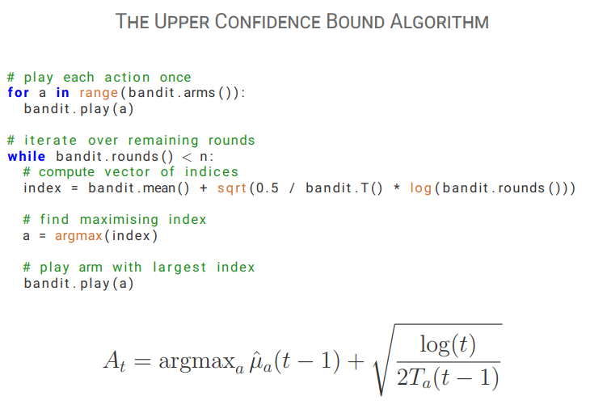
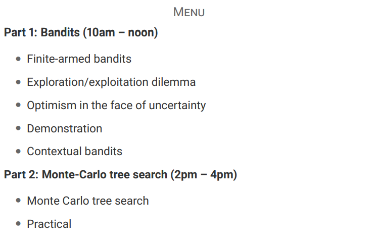

# 蒙特卡洛树搜索

  

  

代码实现  
Monte Carlo Tree Search  

```python
# encoding: utf-8
from __future__ import print_function
import numpy
import random
try:
  from colors import red, blue
except:
  print("Install 'colors' module for color")
  def red(s): return s
  def blue(s): return s

class Game:
  ROWS = 6
  COLS = 7

  def __init__(self):
    self.board = numpy.zeros((self.COLS, self.ROWS), dtype = 'i')
    self.heights = numpy.zeros(self.COLS, dtype = 'i')
    self.turn = 1 
    self.history = []

  # is x, y on the board 
  def on_board(self, x, y):
    return x >= 0 and x < self.COLS and y >= 0 and y < self.ROWS

  # count the number of pieces that match the piece on (x, y) 
  # in direction (dx, dy)
  def scan(self, x, y, dx, dy):
    c = 0
    p = self.board[x, y]
    while self.on_board(x, y) and self.board[x, y] == p:
      c+=1
      x+=dx
      y+=dy
    return c
 
  # check whether or not the game is over
  def check_win(self, x):
    y = self.heights[x] - 1
    if self.scan(x, y, 0, -1) >= 4: return True
    if self.scan(x, y, 1, 1) + self.scan(x, y, -1,-1) - 1 >= 4: return True
    if self.scan(x, y, 1,-1) + self.scan(x, y, -1, 1) - 1 >= 4: return True
    if self.scan(x, y, 1, 0) + self.scan(x, y, -1, 0) - 1 >= 4: return True
    return False
      
  # make a move in column x
  def make_move(self, x):
    self.board[x, self.heights[x]] = self.turn
    self.heights[x]+=1
    self.turn*=-1
    self.history.append(x)
    return self.check_win(x)

  # unmake the last move in column x
  def unmake_move(self):
    x = self.history.pop()
    self.heights[x]-=1
    self.board[x,self.heights[x]] = 0
    self.turn*=-1

  # return a list of available moves
  def moves(self):
    return [x for x in range(self.COLS) if self.heights[x] < self.ROWS]

  # print the board
  def show(self):
    print("Player one: ●           Player two: △")
    for y in range(self.ROWS):
      print('|', end = '')
      for x in range(self.COLS):
        if self.board[x, self.ROWS - y - 1] == 1:
          print(red('●') + '|', end = '')
        elif self.board[x, self.ROWS - y -  1] == -1:
          print(blue('△') + '|', end = '')
        else:
          print(' |', end = '')
      print('')
    print('+-+-+-+-+-+-+-+')
    if len(self.history) > 0:
      print(' ', end = '')
      last_move = self.history[-1]
      for x in range(self.COLS):
        if last_move == x:
          print('^', end = '')
        else:
          print('  ', end = '')
      print('')
```

Alpha-beta search

```python
class AlphaBeta:
  def __init__(self, depth = 8):
    self.game = Game()
    self.depth = depth

  # returns a move based on an alpha-beta search
  def act(self):
    depth = 9 
    move = self.search()
    return move

  # update the internal board state for the class
  def feed(self, move):
    self.game.make_move(move)

  # the root node of an alpha-beta search
  def search(self):
    print("AlphaBeta searching")
    moves = self.game.moves()

    # a list to store the values associated with each move
    scores = []      
    alpha = -10
    for move in moves:
      res = self.game.make_move(move)
      # if the move wins the game, play it immediately
      if res:                     
        self.game.unmake_move()
        return move
      val = -self.alpha_beta(-10, -alpha, self.depth - 1)
      self.game.unmake_move()
      scores.append((val, move))

    # the algorithm randomises between moves that have the same value 
    random.shuffle(scores)
    scores.sort(key = lambda x: -x[0])
    print("AlphaBeta score: " + str(scores[0][0]))
    return scores[0][1]

 

  def alpha_beta(self, alpha, beta, depth):
    if depth == 0: return 0 
    moves = self.game.moves()
    # check whether or not the game is drawn
    if len(moves) == 0: return 0 
    for move in moves:
      res = self.game.make_move(move)
      # if the move wins the game, return a winning score
      if res:
        self.game.unmake_move()
        return 1 + 0.01 * depth
      val = -self.alpha_beta(-beta, -alpha, depth - 1)
      self.game.unmake_move()

      # check for alpha node
      if val >= alpha:
        alpha = val

      # check for beta cut
      if val >= beta:
        return val
    return alpha 
```

MCTS search

```python
# the node class stores a list of available moves
# and the associated play counts and scores for
# each move. 

class Node():
  # by default, nodes are initialised as leaves and as non-terminal states
  def __init__(self):
    self.leaf = True
    self.terminal = False

  # A node is expanded using a list of moves.
  # The node is terminal if there are no moves (game drawn).
  # Otherwise, the scores for the moves are initialised to zero
  # and the counters to a small number to avoid division by zero.
  # One child is created for each move.
  def expand(self, moves):
    m = len(moves)
    if m == 0:
      self.terminal = True
    else:
      # S stores the cumulative reward for each of the m moves 
      self.S = numpy.zeros(m)

      # T stores the number of plays for each of the m moves
      self.T = numpy.full(m, 0.001)

      # moves stores the list of moves available in this node
      self.moves = moves

      self.children = [Node() for a in range(m)]
      self.leaf = False

  # when the move associated with idx is played
  # and a score obtained, this function should
  # be used to update the counts (T) and scores (S)
  # associated with the idx
  def update(self, idx, score):
    self.S[idx]+=score
    self.T[idx]+=1

  # THIS FUNCTION NEEDS IMPLEMENTING
  # This function decides which node to search using a bandit algorithm
  # Notes:
  # (1) self.S stores the cumulative returns of each available move at this node
  # (2) self.T stores the number of times each available move has been explored
  # (3) numpy.argmax(v) returns the coordinate the maximises vector v.
  # (4) numpy is quite permissive about operations on vectors. When v and w have the same size, then v/w divides
  # coordinatewise. Similarly, numpy.sqrt(v) is a coordinate-wise operation.
  # (5) You might like experimenting with this function
  def choose(self):
    idx = numpy.argmax(self.S / self.T + numpy.sqrt(2.0 / self.T * numpy.log(1 + self.T.sum())))
    return idx


class MCTS():
  def __init__(self, iterations = 5000):
    self.game = Game()
    self.iterations = iterations

  def act(self):
    move = self.search() 
    return move

  def feed(self, move):
    self.game.make_move(move)

  def search(self):
    print("MCTS searching")

    # create the root note
    node = Node() 

    # repeat a number of iterations of MCTS
    for t in range(self.iterations):
      self.mcts(node)

    # find the index of the most played move at the root node and associated move
    idx = numpy.argmax(node.T)
    move = node.moves[idx]

    # print the average return of this move and return the move
    print("MCTS score: " + str(node.S[idx] / node.T[idx]))
    return move


  def mcts(self, node):
    # if the node is a leaf, then expand it
    if node.leaf:
      node.expand(self.game.moves())
      rollout = True
    else:
      rollout = False

    if node.terminal:
      return 0

    # choose a move 
    idx = node.choose()
    move = node.moves[idx]
    if self.game.make_move(move): # if the move wins, the value is 1
      val = 1
    elif rollout:                 # if we just expanded a node, then get value from rollout
      val = -self.rollout()
    else:                         # otherwise continue traversing the tree
      val = -self.mcts(node.children[idx])
    self.game.unmake_move()

    # update the value of the associated move
    node.update(idx, val)
    return val

  # THIS FUNCTION NEEDS IMPLEMENTING
  # returns the result of a Monte-Carlo rollout from the current game state
  # until the game ends. After the function has returned, the game-state should
  # not be different than it was at the start.
  # The value should be from the perspective of the player currently to move:
  # (1) If the player wins, it should be 1
  # (2) If the player loses, it should be -1
  # (3) If the game was drawn, it should be 0
  # Note:
  # self.game.moves() returns the moves available in the current position
  # self.game.make_move(move) makes move on self.game and returns True if that move won the game
  # self.game.unmake_move() unmakes the last move in self.game
  # Be care that rollout should return the score from the perspective of the player currently to move
  def rollout(self):
    moves = self.game.moves()
    if len(moves) == 0:         # game is drawn
      return 0
    move = random.choice(moves)
    if self.game.make_move(move): # current player won
      val = 1
    else:
      val = -self.rollout()       # otherwise take the negative of a rollout continuing from here
    self.game.unmake_move()
    return val

  # You can call this function to test your rollout function
  # Running it should give results of about 0.1 +- 0.05 and -0.03 +- 0.01
  def test_rollout(self):
    assert(len(self.game.history) == 0)
    n = 5000
    res = 0.0
    for t in range(n):
      res+=self.rollout()
      assert(len(self.game.history) == 0)
    print("average result from start with random play: " + str(res / n)) 
    self.game.make_move(0)
    res = 0.0
    for t in range(n):
      res+=self.rollout()
      assert(len(self.game.history) == 1)
    print("average result after first player moves 0: " + str(res / n))
```
Run a competition between agents

```python
# create a connect4 game
game = Game()

# create an MCTS and AlphaBeta player
player1 = AlphaBeta(depth = 8)
player2 = AlphaBeta(depth = 8)

# UNCOMMENT THIS TO TEST YOUR PLAYER
#player1 = MCTS(iterations = 20000)

# UNCOMMENT THIS TO TEST YOUR ROLLOUT FUNCTION
#player1 = MCTS(iterations = 20000)
#player1.test_rollout()
#exit(0)

# loop until the game is drawn
while len(game.moves()) > 0:
  game.show()

  # reverse these if you want MCTS to go first
  if game.turn == 1:
    move = player1.act()
  else:
    move = player2.act()

  # update the internal state of both players
  player1.feed(move)
  player2.feed(move)

  # if the move wins the game, then break
  if game.make_move(move):
    break
game.show() 

```
