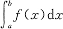
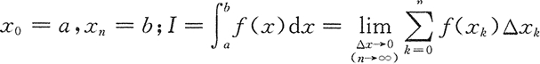
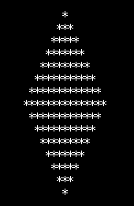
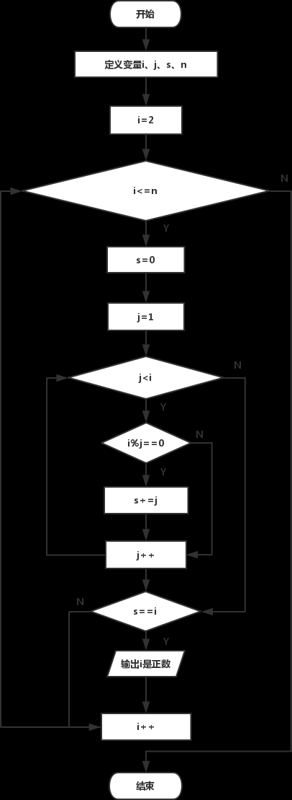
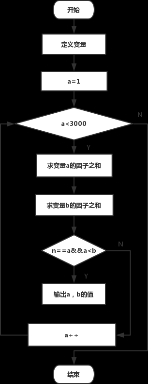
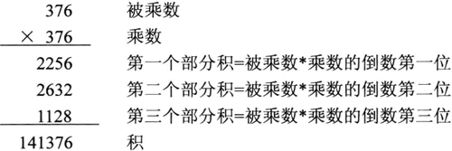
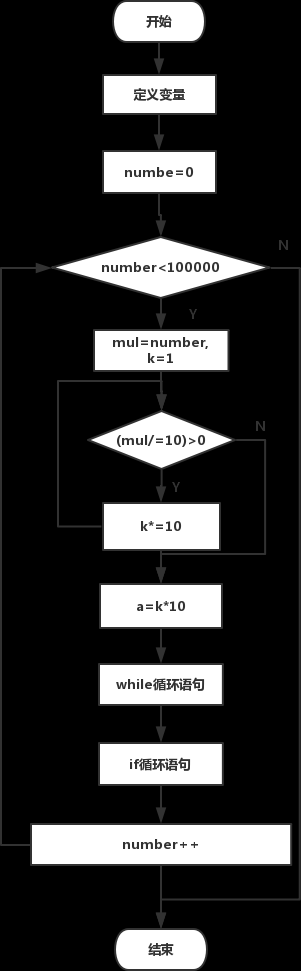
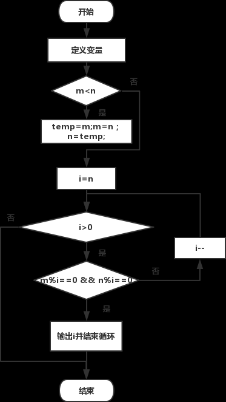

# c编程思想
# thinking of C 

## 预先完成上一部分 选择 循环 函数 数组的编程练习

[TOC]  

## 1 C语言三个数从小到大排序/输出

任意输入 3 个整数，编程实现对这 3 个整数由小到大进行排序。  
实现过程：  
(1)定义数据类型，本实例中 a、b、c、t 均为基本整型。  

(2) 使用输入函数获得任意 3 个值赋给 a、b、c。  

(3) 使用 if 语句进行条件判断，如果 a 大于 b，则借助于中间变量 t 互换 a 与 b 值， 依此类推比较 a 与 c、b 与 c，最终结果即为 a、b、c 的升序排列。  

(4) 使用输出函数将 a、b、c 的值依次输出。  

(5) 程序的代码如下：  

```cpp
#include <stdio.h>
int main()
{
    int a,b,c,t;    /*定义4个基本整型变量a、b、c、t*/
    printf("Please input a,b,c:\n");    /*双引号内的普通字符原样输出并换行*/
    scanf("%d,%d,%d",&a,&b,&c);    /*输入任意3个数*/
    if(a>b)    /*如果a大于b,借助中间变量t实现a与b值的互换*/
    {
        t = a;
        a = b;
        b = t;
    }
    if(a>c)    /*如果a大于c,借助中间变景t实现a与c值的互换*/
    {
        t = a;
        a = c;
        c = t;
    }
    if(b>c)    /*如果b大于c,借助中间变量t实现b与c值的互换*/
    {
        t = b;
        b = c;
        c = t;
    }
    printf("The order of the number is:\n");
    printf("%d,%d,%d",a,b,c);    /*输出函数顺序输出a、b、c的值*/
    return 0;
}
```
运行结果：  
```
Please input a,b,c:
5,3,9
The order of the number is:
3,5,9
```

本实例使用 scanf("%d%d%d",&a,&b,&c); 从键盘中获得任意 3 个数。在输入数据时，在两个数据之间以一个或多个空格间隔，也可以用 Enter 健、Tab 键，不能用逗号作为两个数据间的分隔符。 如果用格式输入函数 scanf("％d,％d,%d",&a,&b,&c) 输入数据，两个数据之间要用“,”做间隔。  


## 2 猴子吃桃问题

猴子吃桃问题：猴子第一天摘下若干个桃子，当即吃了一半，还不过瘾，又多吃了一个。第二天早上又将第一天剩下的桃子吃掉一半，有多吃了一个。以后每天早上都吃了前一天剩下的一半零一个。到第 10 天早上想再吃时，发现只剩下一个桃子了。编写程序求猴子第一天摘了多少个桃子。  
实现过程：  
(1) 定义 day、x1、x2 为基本整型，并为 day 和 x2 赋初值 9 和 1。  

(2) 使用 while 语句由后向前推出第一天摘的桃子数。  

(3) 输出结果。  

(4) 程序代码如下：  

```cpp
#include <stdio.h>
int main()
{
    intday,x1,x2;    /*定义 day、x1、x2 3 个变董为基本整型*/
    day=9;
    x2=1;
    while(day>0)
    {
        x1=(x2+1)*2;    /*第一天的桃子数是第二天桃子数加1后的2倍*/
        x2=x1;
        day--;    /*因为从后向前推所以天数递减*/

    }
    printf("the total is %d\n",x1);    /* 输出桃子的总数*/
    return 0;
}
```

运行结果：  
the total is 1534   

本实例的思路基本上是先找出变量间的关系，也就是要明确第一天桃数和第二天桃子数之间的关系，即第二天桃子数加 1 的 2 倍等于第一天的桃子数。  

## 3 百钱买百鸡（百钱百鸡，百鸡问题）  

中国古代数学家张丘建在他的《算经》中提出了一个著名的“百钱买百鸡问题”，鸡翁一，值钱五，鸡母一，值钱三，鸡雏三，值钱一，百钱买百鸡，问翁、母、雏各几何？  
实现过程：  
(1) 使用 for 语句对 3 种鸡的数嫌在事先确定好的范围内进行穷举并判断，对满足条件的 3 种鸡的数量按指定格式输出，否则进行下次循环。  

(2) 程序代码如下：  

```cpp
#include <stdio.h>
int main()
{
    int cock,hen,chick;   /*定义变童为基本整型*/

    for(cock=0;cock<=20;cock++)   /*公鸡范围在 0~20 之间*/

    for(hen=0;hen<=33;hen++)   /*母鸡范围在 0~33 之间*/

    for(chick=3;chick<=99;chick++)   /*小鸡范围在 3~99 之间*/

    if(5*cock+3*hen+chick/3==100)   /*判断钱数是否等于 100*/

    if(cock+hen+chick==100)   /*判断购买的鸡数是否等于 100*/

    if(chick%3==0)   /*判断小鸡数是否能被 3 整除*/

    printf("公鸡：%d，母鸡：%d，小鸡：%d\n",cock,hen,chick);

    return 0;
}
```

运行结果：  
```
公鸡：0，母鸡：25，小鸡：75
公鸡：4，母鸡：18，小鸡：78
公鸡：8，母鸡：11，小鸡：81
公鸡：12，母鸡：4，小鸡：84
```

根据题意设公鸡、母鸡和雏鸡分别为 cock、hen 和 chick，如果 100 元全买公鸡，那么最多能买 20 只，所以 cock 的范围是大于等于 0 且小于等于 20；如果全买母鸡，那么最多能买 33 只，所以 hen 的范围是大于等于 0 且小于等于 33；如果 100 元钱全买小鸡，那么最多能买 99 只（根据题意小鸡的数量应小于 100 且是 3 的倍数）。  

在确定了各种鸡的范围后进行穷举并判断，判断的条件有以下 3 点：  
(1) 所买的 3 种鸡的钱数总和为 100。  
(2) 所买的 3 种鸡的数量之和为 100。  
(3) 所买的小鸡数必须是 3 的倍数。  

## 4 渔夫打鱼晒网问题

如果一个渔夫从 2011 年 1 月 1 日开始每三天打一次渔，两天晒一次网，编程实现当输入 2011 1 月 1 日以后的任意一天，输出该渔夫是在打渔还是在晒网。  
实现过程：  
(1) 自定义函数 leap()，用来判断输入的年份是否是闰年。  

(2) 自定义函数 number()，用来计算输入日期距 2011 年 1 月 1 日共有多少天。  

(3) main() 函数作为程序的入口函数，在 main() 函数中调用上面两个函数。程序代码如下：  

```cpp
#include <stdio.h>
int leap(int a) /*自定义函数leap()用来指定输入的年份是否为闰年*/
{
    if (a%4==0&&a%100!=0||a%400==0)    /* 闰年判定条件 */
        return 1;    /*是闰年返回1*/
    else
        return 0;    /*不是闰年返回O*/
}

int number(int year,int month,int day)    /*自定义函数 number() 计算输入日期距2011年1月1日共有多少天*/
{
    int sum = 0, i, j, k;
    int a[12]={31,28,31,30,31,30,31,31,30,31,30,31};    /*数组a存放平年每月的天数*/
    int b[12]={31,29,31,30,31,30,31,31,30,31,30,31};    /*数组b存放闰年每月的天数*/

    if(leap(year)==1)    /*判断是否为闰年*/
        for(i=0;i<month-1;i++)
        sum+=b[i];    /*是闰年，累加数组b前m-1个月份的天数*/
    else
        for(i=0;i<month-1;i++)
        sum+=a[i];    /*不是闰年，累加数组a前m-1个月份的天数*/
    for(j=2011;j<year;j++)
    if (leap(j)==i)
        sum+=366;    /*2011年到输入的年份是闰年的加366*/
    else
        sum+=365;    /*2011年到输入的年份不是闰年的加365*/
    sum+=day;    /*将前面累加的结果加上日期，求出总天数*/
    return sum;    /*返回计算的天数*/
}

int main()
{
    int year,month,day,n;
    printf("请输入年月日\n");
    scanf("%d%d%d",&year,&month,&day);    /*输入年月日*/
    n=number(year,month,day);    /*调用函数 number()*/
    if((n%5)<4&&(n%5)>0)    /*余数是1或2或3时说明在打渔，否则在晒网*/
        printf("%d：%d：%d 打鱼\n",year,month,day);
    else
        printf("%d：%d：%d 晒网\n",year,month,day);
    return 0;
}
```
运行结果：  
```
请输入年月日
2011 1 4
2011：1：4 晒网
```

技术要点：  
本实例主要有以下两个技术要点：  

(1) 判断输入的年份（2011 年以后包括 2011 年）是否为闰年，这里自定义函数 leap() 来进行判断。该函数的核心内容就是闰年的判断条件即能被 4 整除但不能被 100 整除，或能被 400 整除。  

(2) 求输入日期距 2011 年 1 月 1 日有多少天。首先判断 2011 年距输入的年份有多少年，这其中有多少年是闰年就将 sum 加多少个 366，有多少年是平年便将 sum 加上多少个 365。  

其次要将 12 个月每月的天数存到数组中，因为闰年 2 月份的天数有别于平年，故采用两个数组 a 和 b 分别存储。若输入年份是平年，月份为 m 时就在前面累加日期的基础上继续累加存储着平年每月天数的数组的前 m-1 个元素，将累加结果加上输入的日期便求出了最终结果。闰年的算法类似。  

## 5 希尔排序算法

用希尔排序法对一组数据由小到大进行排序，数据分别为 69、56、12、136、3、55、46、 99、88、25。  
实现过程：  
(1)自定义函数 shsort()，实现希尔排序。  

(2) main() 函数作为程序的入口函数。程序代码如下：  

```cpp
#include <stdio.h>
int shsort(int s[], int n)    /* 自定义函数 shsort()*/
{
    int i,j,d;
    d=n/2;    /*确定固定增虽值*/
    while(d>=1)
    {
        for(i=d+1;i<=n;i++)    /*数组下标从d+1开始进行直接插入排序*/
        {
            s[0]=s[i];    /*设置监视哨*/
            j=i-d;    /*确定要进行比较的元素的最右边位置*/
            while((j>0)&&(s[0]<s[j]))
            {
                s[j+d]=s[j];    /*数据右移*/
                j=j-d;    /*向左移d个位置V*/
            }
            s[j + d]=s[0];    /*在确定的位罝插入s[i]*/
        }
        d = d/2;    /*增里变为原来的一半*/
    }
return 0;
}

int main()
{
    int a[11],i;    /*定义数组及变量为基本整型*/
    printf("请输入 10 个数据：\n");
    for(i=1;i<=10;i++)
    scanf("%d",&a[i]);    /*从键盘中输入10个数据*/
    shsort(a, 10);    /* 调用 shsort()函数*/
    printf("排序后的顺序是：\n");
    for(i=1;i<=10;i++)
    printf("%5d",a[i]);    /*输出排序后的数组*/
    printf("\n");
    return 0;
}
```

运行结果：  
```
请输入 10 个数据：
69 56 12 136 3 55 46 99 88 25
排序后的顺序是：
    3   12   25   46   55   56   69   88   99  136
```
技术要点：  
希尔排序是在直接插入排序的基础上做的改进，也就是将寒排序的序列按固定增量分成若干组，等距者在同二组中，然后再在组内进行直接插入排序。这里面的固定增量从 n/2 开始，以后每次缩小到原来的一半。  

## 6 冒泡排序算法

用冒泡排序法对任意输入的 10 个数按照从小到大的顺序进行排序。  
实现过程：  
(1) 通过两个 for 循环实现冒泡排序的全过程，外层 for 循环决定冒泡排序的趟数，内层 for 循环决定每趟所进行两两比较的次数。  

(2) 程序代码如下：  
```cpp
#include <stdio.h>
int main()
{
    int i,j,t,a[11];    //定义变量及数组为基本整型
    printf("请输入10个数：\n");
    for(i=1;i<11;i++)
        scanf("%d",&a[i]);    //从键盘中输入10个数
    for(i=1;i<10;i++)    //变量i代表比较的趟数
        for(j=1;j<11-i;j++)    //变最j代表每趟两两比较的次数
            if(a[j]>a[j+1])
            {
                t=a[j];    //产利用中间变童实现两值互换
                a[j]=a[j+1];
                a[j+1]=t;
            }
            printf("排序后的顺序是：\n");
            for(i=1;i<=10;i++)
                printf("%5d",a[i]);    //将胃泡排序后的顺序输出
        printf("\n");
    return 0;
}
```
运行结果：
```
请输入10个数：
66 32 23 45 25 5 15 69 46 37
排序后的顺序是：
    5   15   23   25   32   37   45   46   66   69
```
技术要点：  
本实例要求用冒泡法对 10 个数由小到大进行排序，冒泡法的基本思路是，如果要对 n 个数进行冒泡排序，那么要进行 n-1 趟比较，在第 1 趟比较中要进行 n-j 次两两比较，在第 j 趟比较中要进行 n-j 次两两比较。从这个基本思路中就会发现，趟数决定了两两比较的次数，这样就很容易将两个 for 循环联系起来了。  

## 7 直接插入排序算法
插入排序是把一个记录插入到已排序的有序序列中，使整个序列在插入该记录后仍然有序。插入排序中较简单的种方法是直接插入排序，其插入位置的确定方法是将待插入的记录与有序区中的各记录自右向左依次比较其关键字值的大小。本实例要求使用直接插入排序法将数字由小到大进行排序。  
实现过程：  
(1) 自定义一个函数，实现直接插入排序，在本实例中，我们自定义该函数为 insort()。  

(2) main() 函数为程序的入口函数。程序代码如下：  

```cpp
#include <stdio.h>
int insort(int s[], int n)    /* 自定义函数 insort()*/
{
    int i,j;
    for(i=2;i<=n;i++)    //数组下标从2开始，s[0]做监视哨，s[1]一个数据无可比性
    {
        s[0]=s[i];    //给监视哨陚值
        j=i-1;    //确定要比较元素的最右边位黄
        while(s[0]<s[j])
        {
            s[j+1]=s[j];    //数据右移
            j--;    //产移向左边一个未比较的数
        }
        s[j+1]=s[0];    //在确定的位置插入s[i]
    }
    return 0;
}

int main()
{
    int a[11],i;    //定义数组及变量为基木整甩
    printf("请输入10个数据：\n");
    for (i =1;i<=10;i++)
        scanf("%d",&a[i]);    //接收从键盘输入的10个数据到数组a中
    printf("原始顺序：\n");
    for(i=1;i<11;i++)
        printf("%5d",a[i]);    //将未排序前的顺序输出
    insort(a,10);    //调用自定义函数 insort()
    printf("\n 插入数据排序后顺序：\n");
    for(i=1;i<11;i++)
        printf("%5d",a[i]); //将排序后的数组输出
    printf("\n");
    return 0;
}
```

运行结果：  
```
请输入10个数据：
25 12 36 45 2 9 39 22 98 37
原始顺序：
   25   12   36   45    2    9   39   22   98   37
插入数据排序后顺序：
    2    9   12   22   25   36   37   39   45   98
```

技术要点：  
本实例算法过程如表 1 所示。  

原始顺序：25 12 36 45 2 9 39 27 98 37  

  

本算法中使用了监视哨，主要是为了避免数据在后移时丢失。  

## 8 快速排序算法

用快速排序法对一组数据由小到大进行排序，数据分别为 99、45、12、36、69、22、62、 796、4、696。  
实现过程：  
(1)自定义一个函数 qusort()，实现快速排序。  

(2) main() 函数为程序的入口函数。程序代码如下：  

```cpp
#include <stdio.h>
int qusort(int s[],int start,int end)    //自定义函数 qusort()
{
    int i,j;    //定义变量为基本整型
    i=start;    //将每组首个元素赋给i
    j = end;    //将每组末尾元素赋给j
    s[0]=s[start];    //设置基准值
    while(i<j)
    {
        while(i<j&&s[0]<s[j])
        j--;    //位置左移
        if(i<j)
        {
            s[i]=s[j];    //将s[j]放到s[i]的位置上
            i++;    //位置右移
        }
        while(i<j&&s[i]<=s[0])
            i++;    //位置左移
        if(i<j)
        {
            s[j]=s[i];    //将大于基准值的s[j]放到s[i]位置
            j--;    //位置左移
        }
    }
    s[i]=s[0];    //将基准值放入指定位置
    if (start<i)
        qusort(s,start,j-1);    //对分割出的部分递归调用qusort()函数
    if (i<end)
        qusort(s,j+1,end);
    return 0;
}

int main()
{
    int a[11], i;    //定义数组及变量为基本整型
    printf("请输入10个数：\n");
    for(i=1;i<=10;i++)
        scanf("%d",&a[i]);    //从键盘中输入10个要进行排序的数
    qusort(a,1,10);    //调用qusort()函数进行排序
    printf("排序后的顺序是：\n");
    for(i=1;i<=10;i++)
        printf("%5d",a[i]);    //输出排好序的数组
    printf("\n");
    return 0;
}
```

运行结果：  
```
请输入10个数：
99 45 12 36 69 22 62 796 4 696
排序后的顺序是：
    4   12   22   36   45   62   69   99  696  796
```

技术要点：  
快速排序是冒泡排序的一种改进，主要的算法思想是在待排序的 n 个数据中取第一个数据作为基准值，将所有记录分为 3 组，使第一组中各数据值均小于或等于基准值，第二组做基准值的数琚，第三组中各数据值均大于或等于基准值。这便实现了第一趟分割，然后再对第二组和第兰组分别重复上述方法，依次类推，直到每组中只有一个记录为止。  

## 9 选择排序算法

用选择排序法对一组数据由小到大进行排序，数据分别为 526、36、2、369、56、45、78、92、125、52。  
实现过程：  
(1) 程序中用到T两个 for 循环语句。第一个 for 循环是确定位置的，该位置是存放每次从待排序数列中经选择和交换后所选出的最小数。第二个 for 循环是实现将确定位置上的数与后面待排序区间中的数进行比较的。  

(2) 程序代码如下：  

```cpp
#include <stdio.h>
int main()
{
    int i,j,t,a[11];    //定义变量及数组为基本整型
    printf("请输入10个数：\n");
    for(i=1;i<11;i++)
        scanf("%d",&a[i]);    //从键盘中输入要排序的10个数字
    for(i=1;i<=9;i++)
        for (j=i+1;j<=10;j++)
            if(a[i]>a[j])    //如果前一个数比后一个数大，则利用中间变量t实现两值互换
            {
                t=a[i];
                a[i]=a[j];
                a[j]=t;
            }
    printf("排序后的顺序是：\n");
    for(i=1;i<=10;i++)
        printf("%5d", a[i]);    //输出排序后的数组
    printf("\n");
    return 0;
}
```

运行结果：  
```
请输入10个数：
526 36 2 369 56 45 78 92 125 52
排序后的顺序是：
    2   36   45   52   56   78   92  125  369  526
```
技术要点：  
选择排序的基本算法是从待排序的区间中经过选择和交换后选出最小的数值存放到 a[0] 中，再从剩余的未排序区间中经过选择和交换后选出最小的数值存放到 a[1] 中，a[1] 中的数字仅大于 a[0]，依此类推，即可实现排序。  

## 10 归并排序算法

用归并排序法对一组数据由小到大进行排序，数据分别为 695、458、362、789、12、 15、163、23、2、986。  
实现过程：  
(1) 自定义函数 merge()，实现一次归并排序。  

(2) 自定义函数 merge_sort()，实现归并排序。  

(3) 程序代码如下：  

```cpp
#include <stdio.h>
int merge(int r[],int s[],int x1,int x2,int x3)    //自定义实现一次归并样序的函数
{
    int i,j,k;
    i=x1;    //第一部分的开始位置
    j=x2+1;  //第二部分的开始位置
    k=x1;
    while((i<=x2)&&(j<=x3))    //当i和j都在两个要合并的部分中时
        if(r[i]<=r[j])    //筛选两部分中较小的元素放到数组s中
        {
            s[k] = r[i];
            i++;
            k++;
        }
        else
        {
            s[k]=r[j];
            j++;
            k++;
        }
        while(i<=x2)    //将x1〜x2范围内未比较的数顺次加到数组r中
            s[k++]=r[i++];
        while(j<=x3) //将x2+l〜x3范围内未比较的数顺次加到数组r中
            s[k++]=r[j++];
    return 0;
}

int merge_sort(int r[],int s[],int m,int n)
{
    int p;
    int t[20];
    if(m==n)
        s[m]=r[m];
    else
    {
        p=(m+n)/2;
        merge_sort(r,t,m,p);    //递归调用merge_soit()函数将r[m]〜r[p]归并成有序的t[m]〜t[p]
        merge_sort(r,t,p+1,n);    //递归一调用merge_sort()函数将r[p+l]〜r[n]归并成有序的t[p+l]〜t[n]
        merge(t,s,m,p,n);    //调用函数将前两部分归并到s[m]〜s[n】*/
    }
    return 0;
}

int main()
{
    int a[11];
    int i;
    printf("请输入10个数：\n");
    for(i=1;i<=10;i++)
        scanf("%d",&a[i]);    //从键盘中输入10个数
    merge_sort(a,a,1,10);    //调用merge_sort()函数进行归并排序
    printf("排序后的顺序是：\n");
    for(i=1;i<=10;i++)
        printf("%5d",a[i]);    //输出排序后的数据
    printf("\n");
    return 0;
}
```

运行结果：  
```
请输入10个数：
695 458 362 789 12 15 163 23 2 986
排序后的顺序是：
    2   12   15   23  163  362  458  695  789  986
```

技术要点：  
归并是将两个或多个存序记录序列合并成一个有序序列。归并方法有多种，一次对两个有序记录序列进行归并，称为路归并排序，也有三路归并排序及多路归并排序。本实例是二路归并排序，基本方法如下：  

(1) 将 n 个记录看成是 n 个长度为 1 的有序子表。  

(2) 将两两相邻时有序无表进行归并。  

(3) 重复执行步骤 (2) 直到归并成一个长度为 n 的有序表。  

## 11 二分查找算法，折半查找算法

本实例采用二分查找法查找特定关键字的元素。要求用户输入数组长度，也就是有序表的数据长度，并输入数组元素和査找的关键字。程序输出查找成功与否，以及成功时关键字在数组中的位置。例如，在有序表 11、13、18、 28、39、56、69、89、98、122 中査找关键字为 89 的元素  
实现过程：  
(1) 自定义函数 binary_search()，实现二分査找。  

(2) main() 函数作为程序的入口函数。程序代码如下：  

```cpp
#include <stdio.h>
int binary_search(int key,int a[],int n) //自定义函数binary_search()
{
    int low,high,mid,count=0,count1=0;
    low=0;
    high=n-1;
    while(low<high)    //査找范围不为0时执行循环体语句
    {
        count++;    //count记录査找次数
        mid=(low+high)/2;    //求中间位置
        if(key<a[mid])    //key小于中间值时
            high=mid-1;    //确定左子表范围
        else if(key>a[mid])    //key 大于中间值时
            low=mid+1;    //确定右子表范围
        else if(key==a[mid])    //当key等于中间值时，证明查找成功
        {
            printf("查找成功!\n 查找 %d 次!a[%d]=%d",count,mid,key);    //输出査找次数及所査找元素在数组中的位置
            count1++;    //count1记录查找成功次数
            break;
        }
    }
    if(count1==0)    //判断是否查找失敗
        printf("查找失敗!");    //査找失敗输出no found
    return 0;
}

int main()
{
    int i,key,a[100],n;
    printf("请输入数组的长度：\n");
    scanf("%d",&n);    //输入数组元素个数
    printf("请输入数组元素：\n");
    for(i=0;i<n;i++)
        scanf("%d",&a[i]);    //输入有序数列到数组a中
    printf("请输入你想查找的元素：\n");
    scanf("%d",&key);    //输入要^找的关键字
    binary_search(key,a,n);    //调用自定义函数
    printf("\n");
    return 0;
}
```
运行结果：  
```
请输入数组的长度：
10
请输入数组元素：
11 13 18 28 39 56 69 89 98 122
请输入你想查找的元素：
89
查找成功!
查找 2 次!a[7]=89
```

技术要点：  
二分査找就是折半查找，其基本思想是：首先选取表中间位置的记录，将其关键字与给定关键字 key 进行比较，若相等，则査找成功；若 key 值比该关键字值大，则要找的元素一定在右子表中，则继续对右子表进行折半查找：若 key 值比该关键宇值小，则要找的元素一定在左子表中，继续对左子表进行折半査找。如此递推，直到査找成功或査找失败（或査找范围为 0）。  

## 12 分块查找算法，索引顺序查找算法
例如，采用分块查找法在有序表 11、12、18、28、39、56、69、89、96、122、135、146、156、256、298 中查找关键字为 96 的元素。  

査找特定关键字元素个数为 15，要求用户输入有序表各元素，程序输出査找成功与否，若成功，还显示元素在有序表中的位罝。  
实现过程：  
(1)定义结构体 index，用于存储块的结构，并定义该结构体数组 index_table。  

(2)自定义函数 block_search()，实现分块查找。  

(3) main() 函数作为程序的入口函数。程序代码如下：  

```cpp
#include <stdio.h>
struct index    //定义块的结构
{
    int key;    //块的关键字
    int start;    //块的起始值
    int end;    //块的结束值
}index_table[4];    //定义结构体数组

int block_search(int key,int a[])    //自定义实现分块查找
{
    int i,j;
    i=1;
    while(i<=3&&key>index_table[i].key)    //确定在哪个块中
        i++;
    if(i>3)    //大于分得的块数，则返回0
        return 0;
    j=index_table[i].start;    //j等于块范围的起始值
    while(j<=index_table[i].end&&a[j]!=key)    //在确定的块内进行顺序查找
        j++;
    if(j>index_table[i].end)    //如果大于块范围的结束值，则说明没有要査找的数，j置0
        j = 0;
    return j;
}

int main()
{
    int i,j=0,k,key,a[16];
    printf("请输入15个数：\n");
    for(i=1;i<16;i++)
        scanf("%d",&a[i]);    //输入由小到大的15个数
    for(i=1;i<=3;i++)
    {
        index_table[i].start=j+1;    //确定每个块范围的起始值
        j=j+1;
        index_table[i].end=j+4;    //确定每个块范围的结束值
        j=j + 4;
        index_table[i].key=a[j];    //确定每个块范围中元素的最大值
    }
    printf("请输入你想査找的元素：\n");
    scanf("%d",&key);    //输入要查询的数值
    k=block_search(key,a);    //调用函数进行杳找
    if(k!=0)
        printf("查找成功，其位置是：%d\n",k);    //如果找到该数，则输出其位置
    else
        printf("查找失败!");    //若未找到，则输出提示信息
    return 0；
}

```
运行结果：  
```
请输入15个数：
11 12 18 28 39 56 69 89 96 122 135 146 156 256 298
请输入你想査找的元素：
96
查找成功，其位置是：9
```

技术要点：  
分块査找也称为索引顺序査找，要求将待查的元素均匀地分成块，块间按大小排序，块内不排序，所以要建立一个块的最大（或最小）关键字表，称为索引表。  

本实例中将给出的 15 个数按关键字大小分成了 3 块，这 15 个数的排列是一个有序序列，也可以给出无序序列，但必须满足分在第一块中的任意数都小于第二块中的所有数，第二块中的所有数都小于第三块中的所有数。当要査找关键字为 key 的元素时，先用顺序杳找在已建好的索引表中查出 key 所在的块中，再在对应的块中顺序查找 key，若 key 存在，则输出其相应位置，否则输出提示信息。  

## 13 求n的阶乘（n!）

从键盘输入一个数，求出这个数的阶乘，即 n!。
算法思想  
首先要清楚阶乘定义，所谓 n 的阶乘，就是从 1 开始乘以比前一个数大 1 的数，一直乘到 n，用公式表示就是：1×2×3×4×…×(n-2)×(n-1)×n=n!  

具体的操作:利用循环解决问题，设循环变量为 i，初值为 1，i 从 1 变化到 n；依次让 i 与 sum 相乘，并将乘积赋给 sum。  
① 定义变量 sum，并赋初值 1。  
② i 自增 1。  
③ 直到 i 超过 n。  
程序代码  

```cpp
#include <stdio.h>
int main()
{
    int i,n;
    double sum=1;
    scanf("%d",&n);
    for(i=1;i<=n;i++)
        sum=sum*i;
    printf("%d!=%lf",n,sum);
    printf("\n");
    return 0;
}
```

调试运行结果  
输入 5，对应的阶乘输出情况如下所示；  
```
5
5!=120.000000
```

输入20，对应的阶乘输出情况如下所示：  
```
20
20!=2432902008176640000.000000
```

总结  
① 由于阶乘一般较大，会超出整型甚至是长整型所能表示的范围，因此定义变量时就不能定义为整型，而应该考虑双精度数。  

② 实训中定义了一个双精度型的变量，用来存放结果。因此在输出时应注意双精度数的输出格式。  

## 14 判断三角形的类型

根据输入的三角形的三条边判断三角形的类型，并输出其面积和类型。   
算法思想  
首先判断其两边之和是否大于第三边，若大于则判断可以构成三角形，再进一步判断该三角形是什么三角形，并计算这个三角形的面积；否则不能构成三角形。  

① 从键盘输入三角形的三条边。  
  
② 判断两边之和是否大于第三边。  

③ 若条件成立则判断可构成三角形，计算其面积，并判断其类型；否则判断其不能构成三角形。  

④ 在类型判断中首先判断其是否三边相等，条件成立则判断其为等边三角形；否则判断其是否有两边相等，条件成立则判断其为等腰三角形；否则判断其是否有两边的平方和等于第三边的平方，条件成立则判断其为直角三角形；否则判断其为普通三角形。  
程序代码  

```cpp
#include <stdio.h>
#include <math.h>
int main()
{
    float a,b,c;
    float s,area;
    printf("请输入三角形的三条边:\n");
    scanf("%f,%f,%f",&a,&b,&c);
    if(a+b>c&&b+c>a&&a+c>b)
    {
        s=(a+b+c)/2;
        area=(float)sqrt(s*(s-a)*(s-b)*(s-c));
        printf("三角形的面积是：%f\n" ,area);
        if(a==b&&a==c)
            printf("三角形是等边三角形\n");
        else if(a==b||a==c||b==c)
            printf("三角形是等腰三角形\n");
        else if((a*a+b*b==c*c)||(a*a+c*c==b*b)||(b*b+c*c==a*a))
            printf("三角形是直角三角形\n");
        else
            printf("三角形是普通三角形\n");
    }
    else
        printf("不能构成三角形\n");
    return 0;
}
```

调试运行结果  
输入为 3，3，3 时，对应的输出情况如下所示：  
```
请输入三角形的三条边:
3,3,3
三角形的面积是：3.897114
三角形是等边三角形
```

输入为 3，4，5 时，对应的输出情况如下所示：  
```
请输入三角形的三条边:
3,4,5
三角形的面积是：6.000000
三角形是直角三角形
```

## 15 水仙花数，阿姆斯特朗数

阿姆斯特朗数也就是俗称的水仙花数，是指一个三位数，其各位数字的立方和等于该数本身。例如：153=13+53+33，所以 153 就是一个水仙花数。求出所有的水仙花数。  
算法思想  
对于阿姆斯特朗数问题，根据水仙花数的定义，需要分离出个位数、十位数和百位数。然后按其性质进行计算并判断，满足条件则打印输出，否则不打印输出。  

因此，阿姆斯特朗数问题可以利用循环语句解决。设循环变量为 i，初值为 100，i 从 100 变化到 1000；依次判断条件是否成立，如果成立则输出，否则不输出。  

算法思想具体如下：  
① 分离出个位数，算术表达式为：j=i%10。  
② 分离出十位数，算术表达式为：k=i/10%10。  
③ 分离出百位数，算术表达式为：n=i/100。  
④ 判断条件是否成立。若是，执行步骤 ⑤；若不是，执行步骤 ⑥。  
⑤ 打印输出结果。  
⑥ i 自增 1。  
⑦ 转到 ① 执行，直到 i 等于 1000。  

其判断的条件为：j*j*j+k*k*k+n*n*n==i。  
程序代码  

```cpp
#include <stdio.h>
int main()
{
    int i,j,k,n;
    for(i=100;i<1000;i++)
    {
        j=i%10;
        k=i/10%10;
        n=i/100;
        if(j*j*j+k*k*k+n*n*n==i)
            printf("%5d\n",i);
    }
    return 0;
}
```

调试运行结果  
所有的阿姆斯特朗数，如下所示：  
```
  153
  370
  371
  407
```
总结  
实训中需注意的是在分离个位数、十位数和百位数时，算术运算符的选择。要清楚每一种算术运算符的运算规则和结合性，再根据题意选择合适的算术运算符进行运算。在本实例中使用了除法运算符“/”和求余运算符（模运算符）“％”。  

在程序中由于循环体的语句不止一句，因此我们在使用时必须用“{}”括起来，组成复合语句进行使用。在程序中应把复合语句看成是单条语句而不是多条语句，复合语句内的各条语句都必须以分号“;”结尾；此外，在括号“}”外不能加分号。一般复合语句用于要执行某段特殊功能的程序如 for 语句、if 语句或 while 语句等。  

## 16 最大公约数和最小公倍数

从键盘输入两个正整数 a 和 b，求其最大公约数和最小公倍数。  
算法思想  
利用格式输入语句将输入的两个数分别赋给 a 和 b，然后判断 a 和 b 的关系，如果 a 小于 b，则利用中间变量 t 将其互换。再利用辗转相除法求出最大公约数，进而求出最小公倍数。最后用格式输出语句将其输出。  
程序代码  

```cpp
#include <stdio.h>
int main()
{
    int a,b,c,m,t;
    printf("请输入两个数:\n");
    scanf("%d%d",&a,&b);
    if(a<b)
    {
        t=a;
        a=b;
        b=t;
    }
    m=a*b;
    c=a%b;
    while(c!=0)
    {
        a=b;
        b=c;
        c=a%b;
    }
    printf("最大公约数是:\n%d\n",b);
    printf("最小公倍数是:\n%d\n",m/b);
}
```

调试运行结果  
当输入的两个数为 15 和 65 时，打印出的结果如下所示：  
```
请输入两个数:
15 65
最大公约数是:
5
最小公倍数是:
195
```

当输入的两个数为 16 和 72 时，打印出的结果如下所示：  
```
请输入两个数:
16 72
最大公约数是:
8
最小公倍数是:
144
```

总结  
实例中用到了辗转相除法来求最大公约数。在求最小公倍数时要清楚最大公约数和最小公倍数的关系，即两数相乘的积除以这两个数的最大公约数就是最小公倍数。  

## 17 求自然底数e，求自然对数的底e

自然底数 e=2.718281828…，e 的计算公式如下：
e=1+1/1!+1/2!+1/3!+…  
要求当最后一项的值小于 10-10 时结束。  
算法思想  
使用循环实现累加求和，并在求和后计算下一项所对应的阶乘。  

① 用循环语句 while 进行循环控制。判断条件为 1/n>10-10；条件成立则执行 ②，条件不成立执行 ⑤；  
② 计算求和 e+=1/n；  
③ i 自增 1；  
④ 计算下一项所对应的阶乘：n=i*n；  
⑤ 结束循环，打印输出结果。  
程序代码  

```cpp
#include <stdio.h>
int main()
{
    float e=1.0,n=1.0;
    int i=1;
    while(1/n>1e-10)
    {
        e+=1/n;
        i++;
        n=i*n;
    }
    printf("e的值是：%f\n",e);
    return 0;
}
```

调试运行结果   
自然底数 e 的计算调试运行结果如下所示：  
`e的值是：2.718282`


## 18 小写转大写，小写字母转换成大写字母

在 C 语言中区分字母的大小写，利用 ASCII 码中大写字母和小写字母之间的转换关系（差值为 32），可以将小写字母转换为大写字母。编写程序实现，从键盘上输入一个小写字母，按回车键，程序将该小写字母转换为大写字母，并输出其 ASCII 值。  
算法思想  
由于大写字母与小写字母之间的差值为 32，因此小写字母转换为大写字母的方法就是将小写字母的 ASCII 码值减去 32，便可得到与之对应的大写字母。  

利用 getchar 函数从键盘上输入一个小写字母，并将其赋给一个字符变量 a；然后将 a—32 的值赋给字符变量 b；最后进行输出，输出时先输出字母，再将字母以整数形式输出。其具体步骤如下：  

① 定义两个字符变量 a、b；  
② a=get char()；  
③ b=a—32；  
④ 打印输出。  
程序代码  

```cpp
#include <stdio.h>
int main()
{
    char a,b;
    printf("输入一个小写字母:\n");
    a=getchar();
    b=a-32;
    printf("转换后的字母为：%c，%d\n",b,b);
    return 0;
}
```

调试运行结果  
输入小写字母 c 时，转换后的大写字母及所对应的 ASCII 值如下所示：  
```
输入一个小写字母:
c
转换后的字母为：C，67
```

输入小写字母 m 时，转换后的大写字母及所对应的 ASCII 值如下所示：  
```
输入一个小写字母:
m
转换后的字母为：M，77
```
总结  
① 实例内容要求对 ASCII 码有所了解。知道小写字母和大写字母之间的差值为 32。  

② getchar 函数的功能是从键盘上输入一个字符。其一般形式为“getchar()”。通常把输入的字符赋予一个字符变量，构成赋值语句，如：char c;或c=getchar();  

③ 使用 getchar 函数还应注意几个问题：
getchar 函数只能接收单个字符，输入数字也按字符处理。输入多于一个字符时，只接收第一个字符。  
使用 getchar 函数前必须包含文件“stdio.h”。  

## 19 回文素数

任意的整数，当从左向右读与从右向左读是相同的，且为素数时，称为回文素数。求 1000 以内的所有回文素数。    
算法思想  
实例的重点是判断一个数是否是回文素数。要输出 1000 以内的所有回文素数，首先应判断这个数是否是素数；如果是，再进一步判断这个数是两位数还是三位数，若是两位数，则需判断个位数和十位数是否相同；若是三位数，则需判断个位数和百位数是否相同。若相同，则判断为回文素数，否则继续下次判断。  

① 定义一个函数 sushu，其作用是判断一个数是否是素数。  
② 对判断为素数的数，再判断其是否是两位数。
    若是两位数，再判断其个位数和十位数是否相同，若相同则打印输出；若不相同，则执行④；若不是两位数，则执行③。  
③ 若是三位数，则判断其个位数和百位数是否相同。若相同，则打印输出；若不相同，则执行 ④。  
④ 循环控制变量 i 自增 1。  
⑤ 直到 i 自增至 1000 结束。  
程序代码   

```cpp
#include <stdio.h>
int sushu(int i)
{
    int j;
    if(i<=1)
        return 0;
    if(i==2)
        return 1;
    for(j=2;j<i;j++)
    {
        if(i%j==0)
            return 0;
        else if(i!=j+1)
            continue;
        else
            return 1;
    }
}

int main()
{
    int i;
    for(i=10;i<1000;i++)
        if(sushu(i)==1)
            if(i/100==0)
            {
                if(i/10==i%10)
                    printf("%5d",i);
                if(i%5==0)
                    printf("\n");
            }
            else
                if(i/100==i%10)
                    printf("%5d",i);
                if(i%5==0)
                    printf("\n");
    return 0;
}
```

调试运行结果  
1000 以内所有的回文素数调试运行结果如下所示：  
```
  11  101  131  151  181  191  313  353  373  383  727  757  787  797  919  929
```
总结  
① 程序由 main() 函数和 sushu() 函数组成，main() 函数调用 sushu() 函数，整型变量 i 为函数参数。当 sushu () 执行完后，返回到主函数中继续执行被调函数后面的语句。  

② 函数调用语句由函数名、实际参数加上分号“;”组成。其一般形式为“函数名(实际参数表);”。执行函数语句就是调用函数体并把实际参数赋予函数定义中的形式参数，然后执行被调函数体中的语句，求取函数值。  

## 20 判断闰年，即判断年份是否为闰年

实例要求从键盘输入任意年份的整数 N，通过程序运行判断该年份是否为闰年。  
算法思想  
判断任意年份是否为闰年，需要满足以下条件中的任意一个：  
① 该年份能被 4 整除同时不能被 100 整除；  
② 该年份能被400整除。  

本实例中使用嵌入式 if-else 语句。  
程序代码  

```cpp
#include <stdio.h>
int main()
{
    int year,a;
    printf("请输人年份：\n");
    scanf("%d",&year);
    if(year%400==0)
        a=1;
    else
    {
        if(year%4==0&&year%100!=0)
            a=1;
        else
            a=0;
    }
    if(a==1)
    {
        printf("%d 此年是闰年\n",year);
    }
    else
    {
        printf("%d 此年非闰年\n",year);
    }
    return 0;
}
```

调试运行结果  
提示输入年份，如果该年份满足上述条件，则系统输出“此年是闰年”，反之输出“此年非闰年”。  

在本实例中，输入年份为 1995 时，因为是非闰年，所以输出的下一行为“1995此年非闰年”，如下所示：  
```
请输人年份：
1995
1995 此年非闰年
```

输入年份为 1996 时，因为是闰年，所以输出的下一行为“1996此年是闰年”，如下所示：  
```
请输人年份：
1996
1996 此年是闰年
```


## 21 矩阵转置

本实例是利用数组解决线性代数中的矩阵转置问题。  

设有一矩阵为 m×n 阶（即 m 行 n 列），第 i 行 j 列的元素是 a(i,j)，需要将该矩阵转置为 n×m 阶的矩阵，使其中元素满足 b(j,i)=a(i,j)。  
算法思想  
由数学知识可知，将第一个矩阵的所有元素绕着一条从第一行第一列出发的右下角 45° 的射线做镜面反转，即可得到该矩阵的转置。
程序代码  

```cpp
#include <stdio.h>
int main()
{
    int i,j,i1,j1,a[101][101],b[101][101];
    printf("please input the number of rows(<=100)\n");
    scanf("%d",&i1);
    printf("please input the number of columns(<=100)\n");
    scanf("%d",&j1);
    printf("please input the element\n");
    for(i=0;i<i1;i++)
        for(j=0;j<j1;j++)
            scanf("%d",&a[i][j]);
    printf("array a：\n");
    for(i=0;i<i1;i++)
    {
        for(j=0;j<j1;j++)
            printf("\t%d",a[i][j]);
        printf("\n");
    }
    for(i=0;i<i1;i++)
        for(j=0;j<j1;j++)
            b[j][i]=a[i][j];
    printf("array b：\n");
    for(i=0;i<j1;i++)
    {
        for(j=0;j<i1;j++)
            printf("\t%d",b[i][j]);
        printf("\n");
    }
    return 0;
}
```

调试运行结果  
在本实例中，需要自定义第一个数组（程序中的数组即代表数学中的矩阵），也就是需要转置运算的数组 A，定义分三个步骤进行:第一步，定义该数组的行数；第二步，定义该数组的列数；第三步，定义该数组的元素，然后被定义的数组经过程序的运算，输出转置后的数组 B。程序的运行结果如下所示：  
```
please input the number of rows(<=100)
3
please input the number of columns(<=100)
4
please input the element
1 2 3 4 5 6 7 8 9 10 11 12
array a：
        1       2       3       4
        5       6       7       8
        9       10      11      12
array b：
        1       5       9
        2       6       10
        3       7       11
        4       8       12
```
总结  
在本实例中，主要运用了二维数组，二维数组的使用说明如下：  

① 二维数组的第一个下标表示行数，第二个下标表示列数，每个下标都是从 0 开始；  

② 类型说明符、数组名和常量表达式的意义与一维数组相同；  

③ 二维数组的元素在内存中是“按行存放”，即在内存中先顺序存放第一行的元素，再存放第二行的元素，以此类推；  

④ 可以把二维数组看作一种特殊的一维数组，其特殊之处在于它的每一个元素又是一维数组。  

## 22 兔子生兔子问题

假设一对兔子的成熟期是一个月，即一个月可长成成兔，那么，如果每对成兔每个月都生一对小兔，一对新生的小兔从第二个月起就开始生兔子，试问从一对兔子开始繁殖，以后每个月会有多少对兔子？  
程序代码  

```cpp
#include <stdio.h>
int main()
{
    int i,tu1,tu2,tu3,m;
    tu1=1;
    tu2=1;
    printf("请输入月份数\n");
    scanf("%d",&m);
    if(m==1||m==2)
    {
        printf("有一对兔子");
    }
    else if(m>2)
    {
        for(i=3;i<=m;i++)
        {
            tu3=tu1+tu2;
            tu1=tu2;
            tu2=tu3;
        }
        printf("%d 月的兔子数为：%d\n",m,tu3);
    }
    return 0;
}
```

调试运行结果  
执行程序时，会提示输入月份，当输入 12 时，显示这个月的兔子数目，运行结果如下所示：  
```
请输入月份数
12
12 月的兔子数为：144
```

总结  
(1) 实例分析  
循环的嵌套是指在一个循环体内又包含了另一个完整的循环。循环的嵌套执行过程是外循环执行一次，内循环执行一次，在内循环结束后，再执行下一次外循环，如此反复，直到外循环结束。  

(2) 循环的嵌套注意事项：  
① 循环必须完全包含内循环，不能交叉；  
② 在多重循环中，各层循环的循环控制变量不能同名；  
③ 在多重循环中，并列循环的循环控制变量名可以相同，也可以不同。  

## 23 狼追兔子问题

一只兔子躲进了 10 个环形分布的洞的某一个，狼在第一个洞没有找到兔子，就隔一个洞，到第三个洞去找，也没有找到，就隔两个洞，到第六个洞去找，以后每次多隔一个洞 去找兔子……这样下去，结果一直找不到兔子，请问：兔子可能躲在哪个洞中？  
算法思想  
对于本实例中提到的问题，虽然是“兔子可能躲在哪个洞中”，但是在考虑算法时，需要知道的是狼会去哪个洞找兔子，狼第一次去的洞是第一个（表示为 pos1），第二次去的是第三个（pos3），把它去的洞的代码用数字表示出来，可以推导出狼去的洞的代码是： `pos(i+1)=pos(i)+i+1`。  

由题目可知，狼没有找到兔子，因此该算法会一直持续下去。除此之外，还需要注意的是，在 10 个洞之后，比如狼去找第十五个洞，但第十五个洞是不存在的，因此我们用 15 对 10 求余，得到的数字才是洞的标示。  
程序代码  

```cpp
#include <stdio.h>
int main()
{
    int i;
    bool pos[10]={0};
    int lang=0;
    for(i=0;i<100;i++)
    {
        pos[lang]=true;
        lang++;
        lang+=i;
        lang=lang%10;
    }
    for(i=0;i<10;i++)
        if(!pos[i])
            printf("兔子可能在第%d洞中\n",i+1);
    return 0;
}
```

调试运行结果  
通过上面的算法分析，狼在找兔子的过程中，为了达到找到兔子的目的，同时为了设计需要，增加了循环次数，最终程序的结果如下所示：  
```
兔子可能在第3洞中
兔子可能在第5洞中
兔子可能在第8洞中
兔子可能在第10洞中
```

总结  
(1) 一维数组定义时需要注意的规则：  
     ① 数组名的命名规则遵守标识符的命名规则。  
     ② 常量表达式指出数组的长度，当长度为 n 时，即数组为 n 个元素，数组元素下标范围只能是 0~（n—1），即数组中第一个元素的下标为 0，数组中最后一个元素的下标应该是（n—1）。  
     ③ 常量表达式可以包含常量和符号常量，但是不能包含变量。  
     ④ 在定义数组的说明中，可以有多个数组说明符，用逗号隔开即可。  

(2) 一维数组的引用说明：  
     ① 数组下标可以是整型常量、整型变量或者整型表达式，初始值为 0。  
     ② 一个数组元素引用的实质就是一个变量名的引用，每一个数组元素代表内存中的一个存储单元，具有与相同类型单个变量一样的属性，可以对它进行赋值且参与各种运算，一个数组占有一段连续的存储单元。  
     ③ 在 C 语言中，数组不能作为一个整体参加数据运算，只能对单个元素进行计算。  


## 24 谁家孩子跑得最慢

张、王、李三家各有三个小孩。一天，三家的九个孩子在一起比赛短跑，规定不分年龄大小，跑第一得 9 分，跑第二得 8 分，依次类推。比赛结果显示各家的总分相同，且这些孩子没有同时到达终点的，也没有一家的两个或三个孩子获得相连的名次。已知获第一名的是李家的孩子，获第二名的是王家的孩子。获得最后一名的是谁家的孩子？  
算法思想  
按题目的条件，共有 1+2+3+…+9=45 分，每家孩子的得分应为 15 分。根据题意可知，获第一名的是李家的孩子，获第二名的是王家的孩子，则可推出：获第三名的一定是张家的孩子。由“这些孩子没有同时到达终点的”可知：名次不能并列，由“没有一家的两个或三个孩子获得相连的名次”可知：第四名不能是张家的孩子。  
程序代码  

```cpp
#include <stdio.h>
int score[4][4];
int main()
{
    int i,j,k,who;
    score[1][1]=7;
    score[2][1]=8;
    score[3][1]=9;
    for(i=4;i<6;i++)
        for(j=4;j<7;j++)
            for(k=4;i!=j&&k<7;k++)
                if(k!=i&&k!=j&&15-i-score[1][1]!=15-j-score[2][1]
                             &&15-i-score[1][1]!=15-k-score[3][1]
                             &&15-j-score[2][1]!=15-k-score[3][1])
                {
                    score[1][2]=i;score[1][3]=15-i-7;
                    score[2][2]=j;score[2][3]=15-j-8;
                    score[3][2]=k;score[3][3]=15-k-9;
                }
                for(who=0,i=1;i<=3;i++,printf("\n"))
                    for(j=1;j<=3;j++)
                    {
                        printf("%d",score[i][j]);
                        if(score[i][j]==1)
                            who=i;
                    }
                    if(who==1)
                        printf("最后一名是张家孩子\n");
                    else if(who==2)
                        printf("最后一名是王家孩子\n");
                    else
                        printf("最后一名是李家孩子\n");
                    return 0;
}
```

调试运行结果  
根据算法思想，通过程序的运行得到结果如下所示：  
```
753
861
942
最后一名是王家孩子
```

总结  
本实例主要运用了二维数组的引用和循环的嵌套。二维数组元素的引用形式为“数组名[下标1][下标2]”。例如“a[1][2]”其下标是可以大于或者等于 0 的整型常量、整型变量或者整型表达式。  

引用二维数组元素时，下标不要越界，也就是说下标值需要从 0 开始，但不要超过行、列的范围。  

## 25 获取矩阵的最大值及其下标

本实例要求使用二维数组将一个 3×4 的矩阵中所有元素的最大值及其下标获取，通过该程序，掌握二维数组的引用知识。  
算法思想  
针对本实例，有两个步骤需要编写程序完成：第一个步骤是求矩阵元素的最大值，可以通过相邻的元素大小比较，最终获取最大值；第二个步骤是针对获取到的元素最大值，求该元素的下标。  

二维数组元素的一般表示方法为：“数组名[下标][下标]”。对于二维数组，下标变量和数组说明在表示形式上是一样的，比如在本例中，有语句：int a[3][4]; a[3][4]=2/3;  

上述语句中“a[3][4]”是完全不同的两个概念，第一个语句中的“a[3][4]”用来定义一个数组，而第二个语句中的“a[3][4]”是一个双下标变量。  

程序代码  

```cpp
#include <stdio.h>
int main()
{
    int a[3][4],i,j,max,max_i=0,max_j=0;
    for(i=0;i<3;i++)
        for(j=0;j<4;j++)
            scanf("%d",&a[i][j]);
    max=a[0][0];
    for(i=0;i<3;i++)
        for(j=0;j<4;j++)
            if(a[i][j]>max)
            {
                max=a[i][j];
                max_i=i;
                max_j=j;
            }
            printf("max=a[%d][%d]=%d\n",max_i,max_j,max);
            return 0;
}
```

调试运行结果  

本实训的程序主要完成了两个功能：一是通过一个二次循环输入该二维数组的所有元素；二是将输入元素按照相邻关系进行比较，最终得到最大值和这个最大值的下标。如果输入数组是：1 2 3 4 5 6 7 99 9 10 11 12。则最终输出结果如下所示：  
```
1 2 3 4 5 6 7 99 9 10 11 12
max=a[1][3]=99
```

## 26 统计单词个数，单词个数算法

在实际生活中经常会遇到一个问题：写英语作文时，常常要求满足一定的字数。在以往，要么我们一个一个地数；要么我们估算一行的单词数，然后用行数进行估算。  

第一种方法太费时，若是长篇大论，那几乎是不可能统计的；而第二种方法不太准确。这就给我们留下了一个问题：如何又快、又准确地统计一篇英文文章中的单词数？  
算法思想  
要解决这个问题，最自然的算法是，读取文章的所有内容，然后一个单词一个单词地统计，然而，我们在这里遇到了一个难题：程序看不懂英文，如何知道什么是一个单词，什么不是一个单词呢？似乎在这里遇到了障碍，可是，如果换个角度思考问题，也许会柳暗花明又一村：文章中的单词都是用空格间隔开的，换句话说，单词数=空格数+1。  

程序不认识单词，但是程序认识空格啊！这样，整个问题实际上转换成了统计文章中的空格数。  

有了这样的问题转换思路，整个问题就简单多了。可以先按照这个思路自己实现，也可以直接看下面的代码实现。  
程序代码  

```cpp
#include <stdio.h>
int main()
{
    printf("输入一行字符：\n");
    char ch;
    int i,count=0,word=0;
    while((ch=getchar())!='\n')
        if(ch==' ')
            word=0;
        else if(word==0)
        {
            word=1;
            count++;
        }
    printf("总共有 %d 个单词\n",count);
    return 0;
}
```

调试运行结果  
根据程序提示，分别输入“I love China”和“I love Xichang College”两个字符串代码， 程序统计单词后输出结果分别如下所示：  
```
输入一行字符：
I Love China
总共有 3 个单词

输入一行字符：
I Love Xichang College
总共有 4 个单词
```
总结  
本实例展示了如何对字符数组进行操作，类型为字符型的数组称为字符数组，C 语言中没有专门的字符串变量，但是有字符数组串常量，所以字符串常量的存储是通过对字符数组的操作来完成的。

## 27 字符串加密和解密算法

在本实例中要求设计一个加密和解密算法。在对一个指定的字符串加密之后，利用解密函数能够对密文解密，显示明文信息。加密的方式是将字符串中每个字符加上它在字符串中的位置和一个偏移值 5。以字符串“mrsoft”为例，第一个字符“m”在字符串中的位置为 0，那么它对应的密文是“'m'+0+5"，即 r。  
算法思想  
在 main() 函数中使用 while 语句设计一个无限循环，并定义两个字符数组，用来保存，明文和密文字符串，在首次循环中要求用户输入字符串，进行将明文加密成密文的操作， 之后的操作则是根据用户输入的命令字符进行判断，输入 1 加密新的明文，输入 2 对刚加密的密文进行解密，输入 3 退出系统。  
程序代码  

```cpp
#include <stdio.h>
#include <string.h>
int main()
{
    int result=1;
    int i;
    int count=0;
    char Text[128]={'\0'};
    char cryptograph[128]={'\0'};
    while(1)
    {
        if(result==1)
        {
            printf("请输入要加密的明文：\n");
            scanf ("%s",&Text);
            count=strlen(Text);
            for(i=0;i<count;i++)
            {
                cryptograph[i]=Text[i]+i+5;
            }
            cryptograph[i]='\0';
            printf("加密后的密文是：%s\n",cryptograph);
        }
        else if(result==2)
        {
            count=strlen(Text);
            for(i=0;i<count;i++)
            {
                Text[i]=cryptograph[i]-i-5;
            }
            Text[i]='\0';
            printf("解密后的明文是：%s\n",Text);
        }
        else if(result==3)
        {
            break;
        }
        else
        {
            printf("请输入正确的命令符：\n");
        }
        printf("输入1加密新的明文，输入2对刚加密的密文进行解密，输入3退出系统：\n");
        printf("请输入命令符：\n");
        scanf("%d",&result);
    }
    return 0;
}
```

调试运行结果  
本实例中，输入了 I love Xichang College 字符串作为例证，因此输出是多个加密后的字符串，结果如下所示：  
```
请输入要加密的明文：
I Love Xichang College
加密后的密文是：N
输入1加密新的明文，输入2对刚加密的密文进行解密，输入3退出系统：
请输入命令符：
请输入要加密的明文：
加密后的密文是：Qu}m
输入1加密新的明文，输入2对刚加密的密文进行解密，输入3退出系统：
请输入命令符：
请输入要加密的明文：
加密后的密文是：]ojpjxr
输入1加密新的明文，输入2对刚加密的密文进行解密，输入3退出系统：
请输入命令符：
请输入要加密的明文：
加密后的密文是：Hustnqp
输入1加密新的明文，输入2对刚加密的密文进行解密，输入3退出系统：
请输入命令符：
```

总结   
字符串的加密和解密方法一直被广泛应用，最常见的无非是 MD5 散列函数。本实例中的算法比较简单，只是在原值基础上相加对应值即可。MD5 略微复杂，是为了确保信息传输完整、一致而设计的杂凑算法之一，是杂凑算法的基本原理。   

## 27 输出等腰三角形

本实例要求从键盘输入任意整数 n，通过程序运行输出对应高度为 n 的等腰三角形。    
算法思想  
① 设计以高度 n 为参数的一个函数，函数返回值为空，在函数体中实现等腰三角形的打印；图形的最终打印需要利用二层循环设计实现。  

② 图形共输出 n 行，外循环变量 i 表示 n 行的输出，循环变量的变化范围为 `0~(n—1)`。  

③ 循环变量 j 表示每一行的“*”号输出。由于每一行的输出不同，第 j 行输出空格的个数为 (n—i)，第 j 行输出“*”号的个数为`（2*i+1)`。控制“*”号输出的内循环变量 j 的变化范围为 `0~(2*i)`。  

④ 在主函数中输入 n 作为实参，调用定义函数，打印等腰三角形。  

程序代码  

```cpp
#include <stdio.h>
int trangle(int n)
{
    int i,j;
    for(i=0;i<n;i++)
    {
        for(j=0;j<=n-i;j++)
            putchar(' ');
        for(j=0;j<=2*i;j++)
            putchar('*');
        putchar('\n');
    }
    return 0;
}

int main()
{
    int n;
    printf("Enter n：");
    scanf("%d",&n);
    printf("\n");
    trangle(n);
    return 0;
}
```

调试运行结果  
当 n 取值为 8 时，打印出的等腰三角形如下所示： 

```
Enter n：8

         *
        ***
       *****
      *******
     *********
    ***********
   *************
  ***************
当 n 取值为 20 时，打印出的等腰三角形如下所示：
Enter n：20

                     *
                    ***
                   *****
                  *******
                 *********
                ***********
               *************
              ***************
             *****************
            *******************
           *********************
          ***********************
         *************************
        ***************************
       *****************************
      *******************************
     *********************************
    ***********************************
   *************************************
  ***************************************

```

## 28 约瑟夫环问题

编号为 1，2，3，…，n 的 n 个人围坐一圈，任选一个正整数 m 作为报数上限值，从第一个人开始按顺时针方向报数，报数到 m 时停止，报数为 m 的人出列。从出列人的顺时针方向的下一个人开始又从 1 重新报数，如此下去，直到所有人都全部出列为止。  
算法思想  
每个人的编号存放在一个数组 a 中，主函数中决定人数的个数以及报数的上限值 m，设计一个函数实现对应的操作。函数的形参有整型数组 a、整数 n 和 m，n 用来接收传递的人数，m 用来接收报数上限，函数的返回值为空；函数体中输出出列人的顺序。  

函数中利用循环访问数组中 n 个元素，每次访问元素，设定内循环连续访问 m 个元素，元素访问的下标为 k，访问到第 m 个元素时，如果元素不是 0，此时输出元素 a[k]，再设定 a[k] 为 0，继续访问后面的元素。  

主函数中设定数组 a，从键盘输入 n 和 m，利用循环产生 n 的位置序号存放到数组 a 中，调用函数实现相应的操作。  
程序代码  

```cpp
#include <stdio.h>
#define N 100
int josef(int a[],int n,int m)
{
    int i,j,k=0;
    for(i=0;i<n;i++)
    {
        j=1;
        while(j<m)
        {
            while(a[k]==0)
            k=(k+1)%n;
            j++;
            k=(k+1)%n;
        }
        while(a[k]==0)
        k=(k+1)%n;
        printf("%d ",a[k]);
        a[k]=0;
    }
    return 0;
}

int main()
{
    int a[100];
    int i,j,m,n;
    printf("input n and m：");
    scanf("%d%d",&n,&m);
    for(i=0;i<n;i++)
        a[i]=i+1;
    printf("\n output：\n");
    josef(a,n,m);
    printf("\n");
    return 0;
}
```

调试运行结果  
15 个人围坐在一起，报数上限为 4 时的出列顺序如下所示：  
```
input n and m：15 4

output：
4 8 12 1 6 11 2 9 15 10 5 3 7 14 13

100 个人围坐在一 起，报数上限为 9 时的出列顺序如下所示：
input n and m：100 9

output：
9 18 27 36 45 54 63 72 81 90 99 8 19 29 39 49 59 69 79 89 100 11 22 33 44 56 67
78 91 2 14 26 40 52 65 77 92 4 17 32 47 61 75 88 5 21 37 53 70 85 1 20 38 57 74
94 12 31 51 73 95 15 41 62 84 7 34 60 86 13 43 71 98 30 66 97 35 76 10 50 93 42
83 28 87 48 6 68 46 23 3 96 16 25 64 55 58 24 80 82
```

总结  

① 程序由 main() 函数和 josef() 函数组成，main() 函数调用 josef() 函数，用数组名作为函数参数，在主函数和被调用函数中分别定义数组。主函数执行到 josef(a，n，m) 语句时，将数组 a 的首元素的地址传递给形参数组 a，程序转去执行 josef()，形参数组 a 中的元素发生逆序排列，则实参数组 a 也随之改变，当 josef() 执行完后，返回到主函数中继续执行被调函数后面的语句。  

② 实例中定义函数 josef() 解决问题的难点有两个:一是如何求下一个出圈的人的位置；二是此人出圈后对这个人的位置如何处理。从第一个人开始报数，报到 m 时，此人出圈，设定变量 j，每次统计出圈的人数，当出圈人数到 m 时，重新开始统计。n 个人围坐一圈，可看作环状，设定 k 表示出圈人的下标，则出圈人的下标的计算可用“(k+l)%n”表示。对于第二个问题，首先将出圈人的位置打印输出，然后将其位置元素设置为 0。  

③ 数组名作函数参数时，要求在被调用函数和调用函数中分别定义数组，且形参和实参必须是类型相同的数组。实参和形参数组是指向同一段地址空间的，当主函数执行时，这段空间由实参数组控制，当被调用函数执行时，这段空间由形参数组使用，被调函数执行结束后，该空间又交回给实参数组。  

用数组名作为函数参数时，形参与实参之间的传递方式为地址传递，因此，形参数组的改变会影响实参数组的内容。  

C 编译系统对形参数组的大小不做检查，只是将实参数组的首地址传给形参数组，所以形参数组可以不用指定大小。如实例中被调用函数的首部定义为 void josef(int a[]， int n，int m)，其中的整型数组 a 的定义为 int a[]，没有给出数组的具体大小。  

④ 一维数组名、多维数组名都可以作为函数的参数，进行地址传递。  

## 30 整数逆序输出

将一个从键盘输入的整数存放到一个数组中，通过程序的运行按照数组中的逆序输出该整数，利用递归的方法解决问题。  
算法思想  
设计函数实现数据的逆序存放，设定形参数组接收实参数组的地址，来存储数据的每一位。函数体采用递归的方式解决问题，因此考虑递归进行的条件。例如，把数据 n 存放到数组 s 中，若 n 是一位数，则存放 n 到数组中；若 n 不是一位数，则存放 n/10 到数组中。  

问题解决的难点在于找到数据的存放地址，通过不断地取余和整除 10 来得到数据的每一位。为了实现数据的逆序存放，每一次整除 10 的时候，同时把存放数据的数组地址后移，这样得到的第一位数存放在数组的最后一位……通过依次前移，即递归的回归，实现整个数据的存放。通过函数 convert() 实现字符串中的数字的逆序转换。  
程序代码  

```cpp
#include <stdio.h>
int convert(char s[],int n)
{
    int i;
    if((i=n/10)!=0)
         convert(s+1,i);
    *s=n%10+'0';
    return 0;
}

int main()
{
    int num;
    char str[10]=" ";
    printf("input integer data：");
    scanf("%d",&num);
    convert(str,num);
    printf("output string：\n");
    puts(str);
    return 0;
}
```

调试执行结果  
当输入整数为 123456789 时，其程序运行结果如下所示：  
```
input integer data：123456789
output string：
987654321
```

当输入整数为 654321789 时，逆序转换输出结果如下所示：  
```
input integer data：654321789
output string：
987123456
```
总结  

数组名代表数组中第一个元素的地址，数组的地址就是数组的指针，每个元素的地址就是每个元素的指针。数组元素在内存中是连续存放的，相对于普通变量，用指针指向数据元素操作更简便。  

一维数组的数组名代表了数组的首地址，即数组的指针，但数组名是常量指针，其值是不可改变的，可以定义一个指针变量指向数组名。当定义了指针后，对于数组元素的引用既可以使用下标，又可以使用指针。  

## 31 三色旗问题

有一根绳子，上面有红、白、蓝三种颜色的旗子。绳子上旗子的颜色并没有顺序，现在要对旗子进行分类，按照蓝色、白色、红色的顺序排列。只能在绳子上进行移动，并且一次只能调换两面旗子，怎样移动才能使旗子移动的次数最少？  
算法思想  
旗子在绳子上移动，而且一次只能调换两面旗子，因此只要保证在移动旗子时，从绳子的开头开始，遇到蓝色旗子向前移动，遇到白色旗子则留在中间，而遇到红色的旗子则向后移动。要使移动次数最少，可以使用三个指针 b、w、r 分别作为蓝旗、白旗和红旗的指针。  

若 w 指针指向的当前旗子为白色，则 w 指针增加 1，表示白旗部分增加一面。若 w 指针指向的当前旗子为蓝色，则将 b 指针与 w 指针所指向的旗子交换，同时 b 指针与 w 指针都增加 1，表示蓝旗和白旗部分都多了一个元素。若 w 指针指向的当前旗子为红色，则将 w 指针与 r 指针所指向的旗子交换，同时 r 指针减 1，即 r 指针向前移动，未处理的部分减 1。刚开始时，r 指向绳子中最后一个旗子，之后 r 指针不断前移，当其位于 w 指针之前，即 r 的值小于 w 的值时，全部旗子处理完毕，可以结束比较和移动旗子操作。  

在程序中通过宏定义用大写字母 'B' 'W' 'R' 分别代表蓝色、白色和红色；字符数组 “char color[]”表示绳子上的各种颜色的旗子；旗子移动时通过一个 while 循环判断移动过程是否结束，在 while 循环中根据旗子的不同颜色进行不同的处理。  
程序代码  

```cpp
#include <stdio.h>
#include <stdlib.h>
#include <string.h>
#define BLUE 'B'
#define WHITE 'W'
#define RED 'R'
#define swap(x,y){char temp;\
        temp=color[x];\
        color[x]=color[y];\
        color[y]=temp;}

int main()
{
    char color[]={'R','W','B','W','W','B','R','B','W','R','\0'};
    int w=0;
    int b=0;
    int r=strlen(color)-1;
    int i;

    for(i=0;i<strlen(color);i++)
        printf("%c ",color[i]);
    printf("\n");
    while(w<=r)
    {
        if(color[w]==WHITE)
            w++;
        else
        {
            if(color[w]==BLUE)
            {
                swap(b,w);
                b++;
                w++;
            }
            else
            {
                while(w<r&&color[r]==RED)
                    r--;
                swap(r,w);
                    r--;
            }
        }
    }
    for(i=0;i<strlen(color);i++)
        printf("%c ",color[i]);
    printf("\n");
    return 0;
}
```

调试运行结果  
交换前旗子颜色排列顺序及按顺序最少次数移动旗子后的排列顺序如下所示：  
```
R W B W W B R B W R
B B B W W W W R R R
```

总结   
在该实例中，分别用语句“int w=0;”“int b = 0;”“int r=strlen(color)-1;”定义并初始化白旗、蓝旗、红旗的指针 w、b、r。在交换不同颜色旗子时，通过旗子的指针实现交换函数 swap 的功能。  


## 32 求定积分

利用梯形法计算定积分  
  
其中， f(x)=x3+3x2-x+2。  

算法思想  
根据定积分的定义分析可得：`[x0,x1]，[x1,x2]，···，[xn-1,xn]`，将定积分的区间 [a,b] 分成 n 个子区间，其中：  

  

若右边的极限存在，其极限值即为定积分的值。理论上区间分得越细，越逼近定积分实际的值，一般采用梯形法近似计算定积分的值，把区间 [a,6] 划分成 n 等份，则任意第 f 个小梯形的面积为 `(上底+下底)×高/2`，`si=H×[f(xi)-1)+f(xi)]/2`，其中 `xi+1=a+(i+1)×H；xi=a+i×H；H=(b-a)/n`。该实例问题实际上转换为求 n 等份梯形的面积累计和。  
程序代码  

```cpp
#include <stdio.h>
#include <math.h>

float collect(float s,float t,int m,float (*p)(float x));
float fun1(float x);
float fun2(float x);
float fun3(float x);
float fun4(float x);

int main()
{
    int n,flag;
    float a,b,v=0.0;
    printf("Input the count range(from A to B)and the number of sections.\n");
    scanf("%f%f%d",&a,&b,&n);
    printf("Enter your choice：'1' for fun1,'2' for fun2,'3' for fun3,'4' for fun4==>");
    scanf("%d",&flag);
    if(flag==1)
        v=collect(a,b,n,fun1);
    else if(flag==2)
        v=collect(a,b,n,fun2);
    else if(flag==3)
        v=collect(a,b,n,fun3);
    else
        v=collect(a,b,n,fun4);
    printf("v=%f\n",v);
    return 0;
}

float collect(float s,float t,int n,float (*p)(float x))
{
    int i;
    float f,h,x,y1,y2,area;
    f=0.0;
    h=(t-s)/n;
    x=s;
    y1=(*p)(x);
    for(i=1;i<=n;i++)
    {
        x=x+h;
        y2=(*p)(x);
        area=(y1+y2)*h/2;
        y1=y2;
        f=f+area;
    }
    return (f);
}

float fun1(float x)
{
    float fx;
    fx=x*x-2.0*x+2.0;
    return(fx);
}

float fun2(float x)
{
    float fx;
    fx=x*x*x+3.0*x*x-x+2.0;
    return(fx);
}

float fun3 (float x)
{
    float fx;
    fx=x*sqrt(1+cos(2*x));
    return(fx);
}

float fun4(float x)
{
    float fx;
    fx=1/(1.0+x*x);
    return(fx);
}
```

调试运行结果  
程序运行结果如下所示：  
```
Input the count range(from A to B)and the number of sections.
0 1 100
Enter your choice：'1' for fun1,'2' for fun2,'3' for fun3,'4' for fun4==>2
v=2.750073
```

总结  
① 定义 collect() 函数时，函数的首部 “float collect(float s,float t,int n,float (*p)(float x))” 中的 “float (*p)(float x)” 表示 p 是指向函数的指针变量，该函数的形参为实型。在 main() 函数的 if 条件结构中调用 collect() 函数时，除了将 a，b，n 作为实参传给 collect 的形参 s，n，t 外，还必须将函数名 fun1，fun2，fun3，fun4 作为实参将其入口地址传递给 collect() 函数中的形参 p。  

② 函数也是有地址的，函数名作为函数的首地址。可以定义一个指向函数的指针变量，将函数入口地址赋予指针变量，然后通过指针变量调用函数，这样的指针变量即称为指向函数的指针。  

③ 函数指针也是指针变量，可以实现指针变量的运算，但不能进行算术运算，因为函数指针的移动是毫无意义的，不同于数组指针变量，加减一个整数可以使指针指向后面或前面的数组元素。  

④ 在函数调用中 “(* 指针变量名)” 两边的括号不可少，其中此处为一种表示符号，而不是求值运算。  

## 33 求空间两点之间的距离

定义一个表示三维空间点坐标的结构类型，通过函数求空间上任意两点之间的距离。  
算法思想  
空间内任意点的坐标有三个，分别为 x 轴方向、y 轴方向、z 轴方向，设定结构体 point，包括三个成员 x、y、z，都为双精度类型。  

定义一个函数 dist 用于计算空间上两点的距离，函数返回值也为 double 类型，函数的参数为结构体 point 的两个变量。  
程序代码  

```cpp
#include <stdio.h>
#include <math.h>
struct point
{
    float x;
    float y;
    float z;
};

float dist(struct point p1,struct point p2)
{
    float x,y,z;
    float d;
    x=fabs(p1.x-p2.x);
    y=fabs(p1.y-p2.y);
    z=fabs(p1.z-p2.z);
    d=sqrt(x*x+y*y+z*z);
    return d;
}

int main()
{
    struct point p1,p2;
    printf("Enter point1：");
    scanf("%f,%f,%f",&p1.x,&p1.y,&p1.z);
    printf("Enter point2：");
    scanf("%f,%f,%f",&p2.x,&p2.y,&p2.z);
    printf("distance: %f\n",dist(p1,p2));
    return 0;
}
```

调试运行结果  
空间上两点的坐标分别为 `(1.26,3.54,4.6)，(3.21,3.54,7.2)`，通过程序运行得到该两点之间的距离为 3.25，运行结果如下所示：  

```
Enter point1：1.26,3.54,4.6
Enter point2：3.21,3.54,7.2
distance: 3.250000
```

## 34 日期函数，日期处理函数

定义一个表示日期的结构体类型，再分别定义函数完成下列功能：计算某一天是对应年的第几天，这一年一共多少天；计算两个日期之间相隔的天数。两个日期由键盘输入。  
算法思想  
设定结构体类型表示日期类型名为 Date，利用 typedef 将其定义为日期型类型名，有三个整型类型的成员分别表示年、月、日。  

设定函数计算输入的日期是这一年的第几天。函数的形参为日期型变量，函数体中设定整型数组存放每个月的天数，二月份的天数为 28 天；设定函数判断年份是否为闰年以决定二月份的天数。根据输入的日期月份，在数组中将相应的月份天数求和，假日曰期即为天数。  

设定函数完成两个日期的比较，比较形参 d 和 s 两个日期的大小。首先比较年，同年的比较月，同月的比较日。变量 start 保存输入的小的日期年份，end 保存输入日期大的年份，然后计算两个日期之间的天数。  

程序由 6 个函数构成，`yearday()` 函数计算某年的天数，`monthday()` 函数计算某年二月份的天数，`dayofyeaK()` 函数计算某日期是某年的第几天，`cmpdate()` 函数比较两个日期的大小，`interday()` 函数计算两个日期之间的天数；`dayofyear()` 函数调用 `monthday()` 函数，`interday()` 函数调用 `cmpdate()` 函数、`yearday()` 函数、`dayofyear()` 函数；主函数调用 `yearday()` 函数、`dayofyear()` 函数、`interday()` 函数。  
程序代码  

```cpp
#include <stdio.h>
#include <math.h>
typedef struct
{
    int year,month,day;
}Date;

int yearday(int year)
{
    int yday;
    if(year%4==0&&year%100!=0||year%400==0)
        yday=366;
    else
        yday=365;
    return yday;
}

int monthday(int year)
{
    int mday;
    if(year%4==0&&year%100!=0||year%400==0)
        mday=29;
    else
        mday=28;
    return mday;
}

int dayofyear(Date d)
{
    int i,total=0;
    int months[13]={0,31,28,31,30,31,30,31,31,30,31,30,31};
    months[2]=monthday(d.year);
    for(i=1;i<d.month;i++)
        total=total+months[i];
    total=total+d.day;
    return total;
}

int cmpdate(Date d,Date s)
{
    int result;
    if(d.year==s.year)
    {
        if(d.month==s.month)
        {
            if(d.day==s.day)
            result=0;
            else result=d.day-s.day;
        }
        else result=d.month-s.month;
    }
    else result=d.year-s.year;
    return result;
}

int interday(Date d,Date s)
{
    int result,te,ts,total;
    int year,start,end,day;
    int i;
    result=cmpdate(d,s);
    if(result>0)
    {
        start=s.year;
        end=d.year;
        te=dayofyear(d);
        ts=dayofyear(s);
    }
    else if(result<0)
    {
        start=d.year;
        end=s.year;
        ts=dayofyear(d);
        te=dayofyear(s);
    }
    else return 0;
    if(start==end)
        return abs(te-ts);
    else
    {
        total=0;
        for(i=start;i<=end;i++)
        {
            day=yearday(i);
            if(i==start)
                total=total+day-ts;
            else if(i==end)
                total=total+te;
            else
                total=total+day;
        }
    }
    return total;
}

int main()
{
    Date d1,d2;
    int y,n;
    printf("input date：");
    scanf("%d%d%d",&d1.year,&d1.month,&d1.day);
    scanf("%d%d%d",&d2.year,&d2.month,&d2.day);
    y=yearday(d1.year);
    n=dayofyear(d1);
    printf("%d days %d\n",d1.year,y);
    printf("%d-%d-%d is the %d day.\n",d1.year,d1.month,d1.day,n);
    n=interday(d1,d2);
    printf("%d-%d-%d and %d-%d-%d distance ",d1.year,d1.month,d1.day,d2.year,d2.month,d2.day);
    printf("%d days\n",n);
    return 0;
}
```

调试运行结果  
输入 2009 年 2 月 1 日和 2015 年 2 月 1 日，程序运行结果如下所示：  
```
input date：2009 2 1 2015 2 1
2009 days 365
2009-2-1 is the 32 day.
2009-2-1 and 2015-2-1 distance 2191 days
```

总结  
结构体变量作为函数参数可以有以下两种形式。  

① 结构体变量的成员作为函数的实参，则对应定义函数的形参为普通变量或数组。如实例程序代码中的“y=yearday(d1.year);”“months[2]=monthday(d.year);”两条语句，调用函数的实参分别为结构体变量 d1 和 d 的成员 year；对应的被调用函数 yearday()、monthday() 的形参都为 int year，是普通的整型变量。  

② 函数的实参为结构体变量，则对应函数的形参应该也是结构体变量，其传递方式和普通变量一样，采用的是值传递方式。如程序代码中的 dayofyear()、cmpdate() 和 interday() 函数的形参均为结构体 Date 的变量，在程序调用时实参也为结构体 Date 的变量。  

## 35 汉诺塔问题

汉诺塔问题是指：一块板上有三根针 A、B、C。A 针上套有 64 个大小不等的圆盘，按照大的在下、小的在上的顺序排列，要把这 64 个圆盘从 A 针移动到 C 针上，每次只能移动一个圆盘，移动过程可以借助 B 针。但在任何时候，任何针上的圆盘都必须保持大盘在下，小盘在上。从键盘输入需移动的圆盘个数，给出移动的过程。  
算法思想  
对于汉诺塔问题，当只移动一个圆盘时，直接将圆盘从 A 针移动到 C 针。若移动的圆盘为 n(n>1)，则分成几步走：把 (n-1) 个圆盘从 A 针移动到 B 针（借助 C 针）；A 针上的最后一个圆盘移动到 C 针；B 针上的 (n-1) 个圆盘移动到 C 针（借助 A 针）。每做一遍，移动的圆盘少一个，逐次递减，最后当 n 为 1 时，完成整个移动过程。  

因此，解决汉诺塔问题可设计一个递归函数，利用递归实现圆盘的整个移动过程，问题的解决过程是对实际操作的模拟。  
程序代码  
```cpp
#include <stdio.h>
int main()
{
    int hanoi(int,char,char,char);
    int n,counter;
    printf("Input the number of diskes：");
    scanf("%d",&n);
    printf("\n");
    counter=hanoi(n,'A','B','C');
    return 0;
}

int hanoi(int n,char x,char y,char z)
{
    int move(char,int,char);
    if(n==1)
        move(x,1,z);
    else
    {
        hanoi(n-1,x,z,y);
        move(x,n,z);
        hanoi(n-1,y,x,z);
    }
    return 0;
}

int move(char getone,int n,char putone)
{
    static int k=1;
    printf("%2d:%3d # %c---%c\n",k,n,getone,putone);
    if(k++%3==0)
        printf("\n");
    return 0;
}
```

调试运行结果  
当移动圆盘个数为 3 时，具体移动步骤如下所示：  
```
Input the number of diskes：3

1:  1 # A---C
2:  2 # A---B
3:  1 # C---B

4:  3 # A---C
5:  1 # B---A
6:  2 # B---C

7:  1 # A---C
```

总结  

本实例中定义的 hanoi() 函数是一个递归函数，它有四个形参"n""x""y""z"。"n" 是移动的圆盘个数，"x""y""z" 分别表示三根针，其功能是把 x 上的 n 个圆盘移动到 z 上。当 n=1 时，直接把 x 上的圆盘移到 z 上，输出"x---Z"。当 n!=1 时，则递归调用 hanoi() 函数，把 (n-1) 个圆盘从 x 移到 y，输出"x—-z"；再递归调用 hanoi() 函数，把 (n-1) 个圆盘从 y 移到 z。在递归调用函数的过程中"n=n-1"，n 的值逐次递减，最后 n=1，终止递归调用，逐层返回，移动过程结束。  

## 36 九九乘法表（五种输出形式）

九九乘法表共 9 行 9 列，重点考察 for 循环的掌握情况。  

下面给出了输出完整乘法表、右上、右下、左上、左下乘法表的代码。  

【代码一】输出完整的三角形：  

```cpp
#include <stdio.h>
int main() {
    int i,j;  // i, j控制行或列 
    for(i=1;i<=9;i++) {
        for(j=1;j<=9;j++)
            // %2d 控制宽度为两个字符，且右对齐；如果改为 %-2d 则为左对齐
            // \t为tab缩进
            printf("%d*%d=%2d\t", i, j, i*j);

        printf("\n");
    }

    return 0;
}
```

输出:

```
1*1= 1  1*2= 2  1*3= 3  1*4= 4  1*5= 5  1*6= 6  1*7= 7  1*8= 8  1*9= 9
2*1= 2  2*2= 4  2*3= 6  2*4= 8  2*5=10  2*6=12  2*7=14  2*8=16  2*9=18
3*1= 3  3*2= 6  3*3= 9  3*4=12  3*5=15  3*6=18  3*7=21  3*8=24  3*9=27
4*1= 4  4*2= 8  4*3=12  4*4=16  4*5=20  4*6=24  4*7=28  4*8=32  4*9=36
5*1= 5  5*2=10  5*3=15  5*4=20  5*5=25  5*6=30  5*7=35  5*8=40  5*9=45
6*1= 6  6*2=12  6*3=18  6*4=24  6*5=30  6*6=36  6*7=42  6*8=48  6*9=54
7*1= 7  7*2=14  7*3=21  7*4=28  7*5=35  7*6=42  7*7=49  7*8=56  7*9=63
8*1= 8  8*2=16  8*3=24  8*4=32  8*5=40  8*6=48  8*7=56  8*8=64  8*9=72
9*1= 9  9*2=18  9*3=27  9*4=36  9*5=45  9*6=54  9*7=63  9*8=72  9*9=81
```

【代码二】输出右上三角形和左上三角形：  

```cpp
#include <stdio.h>
int main() {
    int i,j;
    for(i=1;i<=9;i++){
        for(j=1;j<=9;j++){
            if(j<i)
                //打印八个空格，去掉空格就是左上三角形 
                printf("        ");
            else
                printf("%d*%d=%2d  ",i,j,i*j);
        }

        printf("\n");  
    }

    return 0;
}
```

输出:

```
1*1= 1  1*2= 2  1*3= 3  1*4= 4  1*5= 5  1*6= 6  1*7= 7  1*8= 8  1*9= 9
        2*2= 4  2*3= 6  2*4= 8  2*5=10  2*6=12  2*7=14  2*8=16  2*9=18
                3*3= 9  3*4=12  3*5=15  3*6=18  3*7=21  3*8=24  3*9=27
                        4*4=16  4*5=20  4*6=24  4*7=28  4*8=32  4*9=36
                                5*5=25  5*6=30  5*7=35  5*8=40  5*9=45
                                        6*6=36  6*7=42  6*8=48  6*9=54
                                                7*7=49  7*8=56  7*9=63
                                                        8*8=64  8*9=72
                                                                9*9=81
```

去掉八个空格后的运行结果：  


```
1*1= 1  1*2= 2  1*3= 3  1*4= 4  1*5= 5  1*6= 6  1*7= 7  1*8= 8  1*9= 9
2*2= 4  2*3= 6  2*4= 8  2*5=10  2*6=12  2*7=14  2*8=16  2*9=18
3*3= 9  3*4=12  3*5=15  3*6=18  3*7=21  3*8=24  3*9=27
4*4=16  4*5=20  4*6=24  4*7=28  4*8=32  4*9=36
5*5=25  5*6=30  5*7=35  5*8=40  5*9=45
6*6=36  6*7=42  6*8=48  6*9=54
7*7=49  7*8=56  7*9=63
8*8=64  8*9=72
9*9=81
```
【代码三】输出右下和左下三角形：  

```cpp
#include <stdio.h>
int main(){
    int i,j,n;
    for(i=1;i<=9;i++){
        // 将下面的for循环注释掉，就输出左下三角形
        for(n=1; n<=9-i; n++)
            printf("        ");
        
        for(j=1;j<=i;j++)
            printf("%d*%d=%2d  ",i,j,i*j);
        
        printf("\n");
    }

    return 0;
}
```

输出:

```
                                                                1*1= 1
                                                        2*1= 2  2*2= 4
                                                3*1= 3  3*2= 6  3*3= 9
                                        4*1= 4  4*2= 8  4*3=12  4*4=16
                                5*1= 5  5*2=10  5*3=15  5*4=20  5*5=25
                        6*1= 6  6*2=12  6*3=18  6*4=24  6*5=30  6*6=36
                7*1= 7  7*2=14  7*3=21  7*4=28  7*5=35  7*6=42  7*7=49
        8*1= 8  8*2=16  8*3=24  8*4=32  8*5=40  8*6=48  8*7=56  8*8=64
9*1= 9  9*2=18  9*3=27  9*4=36  9*5=45  9*6=54  9*7=63  9*8=72  9*9=81
```

去掉循环后的运行结果：
```
1*1= 1
2*1= 2  2*2= 4
3*1= 3  3*2= 6  3*3= 9
4*1= 4  4*2= 8  4*3=12  4*4=16
5*1= 5  5*2=10  5*3=15  5*4=20  5*5=25
6*1= 6  6*2=12  6*3=18  6*4=24  6*5=30  6*6=36
7*1= 7  7*2=14  7*3=21  7*4=28  7*5=35  7*6=42  7*7=49
8*1= 8  8*2=16  8*3=24  8*4=32  8*5=40  8*6=48  8*7=56  8*8=64
9*1= 9  9*2=18  9*3=27  9*4=36  9*5=45  9*6=54  9*7=63  9*8=72  9*9=81
```

## 37 杨辉三角（两种方法）

杨辉三角是我们从初中就知道的，现在，让我们用C语言将它在计算机上显示出来。  

在初中，我们就知道，杨辉三角的两个腰边的数都是 1，其它位置的数都是上顶上两个数之和。这就是我们用C语言写杨辉三角的关键之一。  

在高中的时候我们又知道，杨辉三角的任意一行都是的二项式系数，n 为行数减 1。也就是说任何一个数等于这个是高中的组合数。n 代表行数减 1，不代表列数减 1。如：第五行的第三个数就为 =6。  

现在我们按第一种思路来写：先定义一个二维数组：a[N][N]，略大于要打印的行数。再令两边的数为 1，即当每行的第一个数和最后一个数为 1。`a[i][0]=a[i][i-1]=1`，n 为行数。除两边的数外，任何一个数为上两顶数之和，即` a[i][j] = a[i-1][j-1] + a[i-1][j]`。最后输出杨辉三角。代码如下：  

```cpp
#include <stdio.h>
#define N 14
void main()
{
    int i, j, k, n=0, a[N][N];  /*定义二维数组a[14][14]*/
    while(n<=0||n>=13){  /*控制打印的行数不要太大，过大会造成显示不规范*/
        printf("请输入要打印的行数：");
        scanf("%d",&n);
    }
    printf("%d行杨辉三角如下：\n",n);
    for(i=1;i<=n;i++)
        a[i][1] = a[i][i] = 1;  /*两边的数令它为1，因为现在循环从1开始，就认为a[i][1]为第一个数*/
    for(i=3;i<=n;i++)
        for(j=2;j<=i-1;j++)
            a[i][j]=a[i-1][j-1]+a[i-1][j];  /*除两边的数外都等于上两顶数之和*/ 
    for(i=1;i<=n;i++){
        for(k=1;k<=n-i;k++)
            printf("   ");  /*这一行主要是在输出数之前打上空格占位，让输出的数更美观*/
        for(j=1;j<=i;j++)  /*j<=i的原因是不输出其它的数，只输出我们想要的数*/
            printf("%6d",a[i][j]);
        
        printf("\n");  /*当一行输出完以后换行继续下一行的输出*/
    }
    printf("\n");
}
```

运行结果：  
```
请输入要打印的行数：10
10行杨辉三角如下：
                                1
                             1     1
                          1     2     1
                       1     3     3     1
                    1     4     6     4     1
                 1     5    10    10     5     1
              1     6    15    20    15     6     1
           1     7    21    35    35    21     7     1
        1     8    28    56    70    56    28     8     1
     1     9    36    84   126   126    84    36     9     1
```

上面的这一种方法我们用到了二维数组，下面的这一方法我们将用到自定义函数。  

在高中我们知道，杨辉三角中的任何一个数都等于一个组合数，现在我们用这一公式来做。首先，此方法代码如下：  

```cpp
#include <stdio.h>

/* 
 * 定义阶乘，在这里可能会想。为什么要用float，当我试第一次的时候，
 * 如果用int的话，那么在打印行数多了以后就会出错。
 * 这是因为阶乘的数比较大，如果用int就不够用了。下同
 */
float J(int i){
    int j;
    float k=1;
    for(j=1;j<=i;j++)
        k=k*j;
    return(k);
}
float C(int i,int j){  /*定义组合数*/
    float k;
    k=J(j)/(J(i)*J(j-i));
    return(k);
}
void main(){
    int i=0,j,k,n;  /*打印杨辉三角*/ 
    while(i<=0||i>16){
        printf("请输入要打印的行数：");
        scanf("%d",&i);
    }
    printf("%d行杨辉三角如下：\n",i);

    for(j=0;j<i;j++){
        for(k=1;k<=(i-j);k++)
            printf("  ");
        for(n=0;n<=j;n++)
            printf("%4.0f",C(n,j));
        printf("\n");
    }
    printf("\n\n");
}
```

运行结果：  
```
请输入要打印的行数：10
10行杨辉三角如下：
                       1
                     1   1
                   1   2   1
                 1   3   3   1
               1   4   6   4   1
             1   5  10  10   5   1
           1   6  15  20  15   6   1
         1   7  21  35  35  21   7   1
       1   8  28  56  70  56  28   8   1
     1   9  36  84 126 126  84  36   9   1
```

这个方法主要就是要知道组合数的表示。还有如果自定义函数。但是这种方法产生的数据比较大，不建议用这种方法。 

## 38 求圆周率π（三种方法）

题目1) 利用公式①计求π的近似值，要求累加到最后一项小于10^(-6)为止。  

题目2) 根据公式②，用前100项之积计算π的值。  

题目1)提供了一种解法，题目2)提供了两种解法，请看解析。  

题目1)的代码：  

```cpp
#include <stdio.h>
#include <stdlib.h>
#include <math.h>
int main(){
    float s=1;
    float pi=0;
    float i=1.0;
    float n=1.0;
    while(fabs(i)>=1e-6){
        pi+=i;
        n=n+2;
        // 这里设计的很巧妙，每次正负号都不一样 
        s=-s; 
        i=s/n;
    }
    pi=4*pi;
    printf("pi的值为：%.6f\n",pi);
    
    return 0;
}
```

运行结果：  
```
pi的值为：3.141594
```


上面的代码，先计算π/4的值，然后再乘以4，s=-s; 用的很巧妙，每次循环，取反，结果就是，这次是正号，下次就是负号，以此类推。  


题目2)的代码[代码一]：  

```cpp
#include <stdio.h>
#include <math.h>
int main(){
    float pi=1;
    float n=1;
    int j;
    for(j=1;j<=100;j++,n++){
        if(j%2==0){
            pi*=(n/(n+1));
        }else{
            pi*=((n+1)/n);
        }
    }
    pi=2*pi;
    printf("pi的值为：%.7f\n",pi);

    return 0;
}
```

运行结果：  
`pi的值为：3.1260781`

此算法的主要思想：  
观察分子数列：  
```
a1=2  a2=2
a3=4  a4=4
a5=6  a6=6
......
```

由此得知，当n为偶数时，`an=n`；当n为奇数时，`an=a(n+1)=n+1`;  

同理观察分子数列：  
```
b1=1 b2=3
b3=3 b4=5
b5=5 b6=7
b7=7 b8=9.......
```

由此可知，当n为奇数时，`bn=n`，当n为偶数时，`bn=b（n+1）`。  
综上可知，当n为奇数时，每次应乘以`（n+1）/n`。当n为偶数时，每次应乘以`n/(n+1)`。  


题目2)的代码[代码二]：  

```cpp
#include <stdio.h>
#include <math.h>

int main(){
    float term,result=1;
    int n;
    for(n=2;n<=100;n+=2){
        term=(float)(n*n)/((n-1)*(n+1));
        result*=term;
    }
    printf("pi的值为：%f\n", 2*result);
    
    return 0;
}

```

运行结果：
`pi的值为：3.126079`
算法思想：采用累乘积算法，累乘项为`term=n*n/((n-1)*(n+1)); n=2,4,6,...100`。步长为2。  

## 39 判断素数（求素数）（两种方法）

素数又称质数。所谓素数是指除了 1 和它本身以外，不能被任何整数整除的数，例如17就是素数，因为它不能被 2~16 的任一整数整除。  

思路1)：因此判断一个整数m是否是素数，只需把 m 被 2 ~ m-1 之间的每一个整数去除，如果都不能被整除，那么 m 就是一个素数。  

思路2)：另外判断方法还可以简化。m 不必被 2 ~ m-1 之间的每一个整数去除，只需被 2 ~  之间的每一个整数去除就可以了。如果 m 不能被 2 ~  间任一整数整除，m 必定是素数。例如判别 17 是是否为素数，只需使 17 被 2~4 之间的每一个整数去除，由于都不能整除，可以判定 17 是素数。  

原因：因为如果 m 能被 2 ~ m-1 之间任一整数整除，其二个因子必定有一个小于或等于 ，另一个大于或等于 。例如 16 能被 2、4、8 整除，16=2*8，2 小于 4，8 大于 4，16=4*4，4=√16，因此只需判定在 2~4 之间有无因子即可。  

两种思路的代码请看解析。  

思路1) 的代码：  

```cpp
#include <stdio.h>

int main(){
    int a=0;  // 素数的个数
    int num=0;  // 输入的整数

    printf("输入一个整数：");
    scanf("%d",&num);

    for(int i=2;i<num;i++){
        if(num%i==0){
            a++;  // 素数个数加1
        }
    }

    if(a==0){
        printf("%d是素数。\n", num);
    }else{
        printf("%d不是素数。\n", num);
    }

    return 0;
}

```

思路2)的代码：  

```cpp

#include <stdio.h>
#include <math.h>
void main(){
    int m;  // 输入的整数 
    int i;  // 循环次数
    int k;  // m 的平方根 

    printf("输入一个整数：");
    scanf("%d",&m);

    // 求平方根，注意sqrt()的参数为 double 类型，这里要强制转换m的类型 
    k=(int)sqrt( (double)m );
    for(i=2;i<=k;i++)
        if(m%i==0)
            break;

    // 如果完成所有循环，那么m为素数
    // 注意最后一次循环，会执行i++，此时 i=k+1，所以有i>k 
    if(i>k)
        printf("%d是素数。\n",m);
    else
        printf("%d不是素数。\n",m);

    return 0;
}
```

两段代码的输出结果相同。  

```
第一次运行结果：  
输入一个整数：1
1是素数。

第二次运行结果：
输入一个整数：97
97是素数。

第三次运行结果：
输入一个整数：10
10不是素数。
```

## 40 输出菱形

菱形，就是如下所示的图形，总行数与总列数相等：  
  

写一个程序，根据用户输入的总行数，打印出菱形。  

这个题目主要是找出规律，考察读者的逻辑思维。  

你可以从第一行开始，遍历所有的列，也可以从第一列开始，遍历所有的行。  

下面的程序从第一行开始，遍历所有的列。  

设菱形的总行数为line，总列数为column，当前行为i，当前列为j。上半部分与下半部分的规律不一样，应该分开讨论。  

我们着眼于星号(*)，思考什么条件下输出星号，总结出如下的规律。  

1) 对于上半部分(包括中间一行)，当前行与当前列满足如下关系输出星号：  
```
j>=(column+1)/2-(i-1)     (column+1)/2-(i-1)为第i行最左边的星号
j<=(column+1)/2+(i-1)    (column+1)/2+(i-1)为第i行最右边的星号
```
2) 对于下半部分，当前行与当前列满足如下关系输出星号：
```
j>=(column+1)/2-(line-i)     (column+1)/2-(line-i)为第i行最左边的星号
j<=(column+1)/2+(line-i)    (column+1)/2+(line-i)为第i行最右边的星号
```

不满足上述条件，则输出空格。  

于是写出如下的代码：  

```cpp
#include <stdio.h>
#include <stdlib.h>

int main(){
    int line;  // 菱形总行数
    int column;  // 菱形总列数
    int i;  // 当前行
    int j;  // 当前列

    printf("请输入菱形的行数(奇数)：");
    scanf("%d", &line);
    if(line%2==0){  // 判断是否是奇数
        printf("必须输入奇数！\n");
        exit(1);
    }
    column = line;  // 总行数和总列数相同

    for(i=1; i<=line; i++){  // 遍历所有行
        if(i<(line+1)/2+1){  // 上半部分（包括中间一行）
            for(j=1; j<=column; j++){  // 遍历上半部分的所有列
                if( (column+1)/2-(i-1)<=j && j<=(column+1)/2+(i-1) ){
                    printf("*");
                }else{
                    printf(" ");
                }
            }
        }else{  // 下半部分
            for(j=1; j<=column; j++){  // 遍历下半部分的所有列
                if( (column+1)/2-(line-i)<=j && j<=(column+1)/2+(line-i) ){
                    printf("*");
                }else{
                    printf(" ");
                }
            }
        }
        printf("\n");
    }

    return 0;
}
```

运行结果：  

```
请输入菱形的行数(奇数)：11
     *
    ***
   *****
  *******
 *********
***********
 *********
  *******
   *****
    ***
     *
```

## 41 百钱买百鸡问题

我国古代数学家张丘建在《算经》一书中曾提出过著名的“百钱买百鸡”问题，该问题叙述如下：鸡翁一，值钱五；鸡母一，值钱三；鸡雏三，值钱一；百钱买百鸡，则翁、母、雏各几何？  

翻译过来，意思是公鸡一个五块钱，母鸡一个三块钱，小鸡三个一块钱，现在要用一百块钱买一百只鸡，问公鸡、母鸡、小鸡各多少只？  
题目分析  
如果用数学的方法解决百钱买百鸡问题，可将该问题抽象成方程式组。设公鸡 x 只，母鸡 y 只，小鸡 z 只，得到以下方程式组：  
```
A：5x+3y+1/3z = 100
B：x+y+z = 100
C：0 <= x <= 100
D：0 <= y <= 100
E：0 <= z <= 100
```
如果用解方程的方式解这道题需要进行多次猜解，计算机的一个优势就是计算速度特别暴力并且无怨无悔，所以我们可以欺负她、蹂躏她！因此我们用穷举法的方式来解题，需要 101^3 次猜解，但对于计算机来说，小 CASE！  

```cpp
#include <stdio.h>

int main()
{
    int i, j, k;

    printf("百元买百鸡的问题所有可能的解如下：\n");

    for( i=0; i <= 100; i++ )
        for( j=0; j <= 100; j++ )
            for( k=0; k <= 100; k++ )
            {
                if( 5*i+3*j+k/3==100 && k%3==0 && i+j+k==100 )
                {
                    printf("公鸡 %2d 只，母鸡 %2d 只，小鸡 %2d 只\n", i, j, k);
                }
            }

    return 0;
}

```

运行结果：  

百元买百鸡的问题所有可能的解如下：  

```
公鸡  0 只，母鸡 25 只，小鸡 75 只
公鸡  4 只，母鸡 18 只，小鸡 78 只
公鸡  8 只，母鸡 11 只，小鸡 81 只
公鸡 12 只，母鸡  4 只，小鸡 84 只
```

## 42 求完数（完全数）

问题描述  
求某一范围内完数的个数。  

如果一个数等于它的因子之和，则称该数为“完数”（或“完全数”)。例如，6的因子为1、2、3，而 6=1+2+3，因此6是“完数”。  
问题分析  
根据完数的定义，解决本题的关键是计算出所选取的整数i（i的取值范围不固定）的因子（因子就是所有可以整除这个数的数），将各因子累加到变量s (记录所有因子之和），若s等于i，则可确认i为完数，反之则不是完数。  
算法设计  
对于这类求某一范围（由于本题范围不固定，在编程过程中采用键盘输入的方式）内满足条件的数时，一般釆用遍历的方式，对给定范围内的数值一个一个地去判断是否满足条件，这一过程可利用循环来实现。  

本题的关键是求出选取数值i的因子，即从1到i-1范围内能整除i的数，看某一个数j是否为i的因子，可利用语句if(i%j==0)进行判断，求某一个数的所有因子，需要在1到i-1范围内进行遍历，同样釆用循环实现。因此，本题从整体上看可利用两层循环来实现。外层循环控制该数的范围2〜n；内层循环j控制除数的范围为1〜i，通过i对j取余，是否等于0，找到该数的各个因子。  

另外应注意每次判断下一个选定数之前，必须将变量s的值重新置为0，编程过程中一定要注意变量s重新置0的位置。  

程序流程图：  

  

下面是完整的代码：  

```cpp
#include<stdio.h>
int main()
{
    int i, j, s, n;  /*变量i控制选定数范围，j控制除数范围，s记录累加因子之和*/
    printf("请输入所选范围上限：");
    scanf("%d", &n);  /* n的值由键盘输入*/
    for( i=2; i<=n; i++ )
    {
        s=0;  /*保证每次循环时s的初值为0*/
        for( j=1; j<i; j++ )
        {
            if(i%j == 0)  /*判断j是否为i的因子*/
                s += j;
        }
        if(s == i)  /*判断因子这和是否和原数相等*/
            printf("It's a perfect number:%d\n", i);
    }
    return 0;
}

```

运行结果：  
```
请输入所选范围上限：10000↙︎
It's a perfect number:6
It's a perfect number:28
It's a perfect number:496
It's a perfect number:8128
```

知识点补充  
上述程序中求某数的因子时，釆用从1到i-1范围内进行遍历的方法，一个数一个数地去试。这种方法可以做到没有遗漏，但是效率不高。  

对于某一整数来说，其最大因子为n/2 (若n为偶数时，若为奇数最大因子小于n/2），在n/2〜n-1范围内没有数据可以整除此数。据此，我们可以把遍历范围缩小至1〜n-1，这样程序效率可以提高一倍。相应程序如下：  

```cpp
#include<stdio.h>>
int main()
{
    //...
    for( i=2; i<=1000; i++)
    {
        s=0;
        for( j=1; j<=n/2; j++ )
        {
            if(i%j == 0)
            s += j;
        }
    //...
    }
}
```

## 43 求亲密数

问题描述  
如果整数A的全部因子（包括1，不包括A本身）之和等于B；且整数B的全部因子（包括1，不包括B本身）之和等于A，则将整数A和B称为亲密数。求3000以内的全部亲密数。  
问题分析  
根据问题描述，该问题可以转化为：给定整数A，判断A是否有亲密数。  

为解决该问题，首先定义变量a，并为其赋初值为某个整数。则按照亲密数定义，要判断a中存放的整数是否有亲密数，只要计算出该整数的全部因子的累加和，并将该累加和存放到另一个变量b中，此时b中存放的也是一个整数。再计算b中存放整数的全部因子的累加和，将该累加和存放到变量n中。  

若n等于a则可判定变量a和b中所存放的整数是亲密数。  
算法设计  
计算数A的各因子的算法：用A依次对i（i的范围可以是1〜A-1、1〜（A/2-1）中之一） 进行模（“%”，在编程过程中一定注意求模符号两边参加运算的数据必须为整数）运算，若模运算结果等于0，则i为A的一个因子加；否则i就不是A的因子。将所求得的因子累到变量B。  

接下来求变量B的因子：算法同上，将B的因子之和累加到变量n。根据亲密数的定义判断变量n是否等于变量A(if(n==a))，若相等，则A和B是一对亲密数，反之则不是。  

程序流程图：  
  

下面是完整的代码：  

```cpp
#include<stdio.h>
int main()
{
    int a, i, b, n;
    printf("There are following friendly--numbers pair smaller than 3000:\n");
    for( a=1; a<3000; a++ )  /*穷举3000以内的全部整数*/
    {
        for( b=0, i=1; i<=a/2; i++)  /*计算数a的各因子，各因子之和存放于b*/
            if(!(a%i))
                b+=i;
        for( n=0, i=1; i<=b/2; i++ )  /*计算b的各因子，各因子之和存于n*/
            if(!(b%i))
                n+=i;
        if(n==a && a<b)  /*使每对亲密数只输出一次*/
            printf("%4d--%4d    ", a, b);  /*若n=a，则a和b是一对亲密数，输出*/
    }
   
    return 0;
}
```

运行结果：  
```
There are following friendly--numbers pair smaller than 3000:
220-- 284    1184--1210    2620--2924
```
知识点补充  
对于这类多次将某些值存储到一个变量中时，一定要注意变量赋初值的位置。  

## 44 求自守数

自守数是指一个数的平方的尾数等于该数自身的自然数。例如：  
`52 = 25    252 = 625    762 = 5776    93762 = 87909376`  

求100000以内的自守数。  
问题分析  
根据自守数的定义，求解本题的关键是知道当前所求自然数的位数，以及该数平方的尾数与被乘数、乘数之间的关系。  
算法设计  
若采用“求出一个数的平方后再截取最后相应位数”的方法显然是不可取的，因为计算机无法表示过大的整数。  

分析手工方式下整数平方（乘法）的计算过程，以376为例：  

  

本问题所关心的是积的最后三位。分析产生积的后三位的过程可以看出，在每一次的部分积中，并不是它的每一位都会对积的后三位产生影响。总结规律可以得到：在三位数乘法中，对积的后三位产生影响的部分积分别为：  
- 第一个部分积中：被乘数最后三位×乘数的倒数第一位。
- 第二个部分积中：被乘数最后二位×乘数的倒数第二位。
- 第三个部分积中：被乘数最后一位×乘数的倒数第三位。

将以上的部分积的后三位求和后，截取后三位就是三位数乘积的后三位，这样的规律可以推广到同样问题的不同位数乘积中。  
分离给定数中的最后几位  
从一个两位数（存在变量n中）开始分析，分离最低位个位n%10；对于三位数n，分离最后两位n%100；对于四位数n，分离最后三位n%1000；...，由此可见，若分离出最后x位，只需要用原数对 10x 求余。  

从第3部分所举例子可以看出，对于第二个部分积“2632”来说其实应是“26320”， 因为对于乘数中的倒数第二位“7”来说，因其在十位，对应的权值为10，第二个部分积实质上为：376X70=26320。故求部分积的程序段为：  

```cpp
int main ()
{
    //...
    while(k>0)
    {
        mul=( mul + ( number%(k*10) )*( number%b - nxuober%(b/10) ) )%a;
        /* (部分积+截取被乘数的后N位*截取乘数的第M位），%a再截取部分积*/
        k /= 10;  /*k为截取被乘数时的系数*/
        b *= 10;
    }
    //...
    return 0;
}

```

对于整个循环来说，变量k是由number的位数确定截取数字进行乘法时的系数。第1次执行循环体时，被乘数的所有位数都影响到平方的尾数，因此第1个部分积=被乘数*乘数的最后一位，将部分积累加到变量mul上，再对a取余截取相应的尾数位数；第2次执行循环体，影响平方尾数的是被乘数中除了最高位之外的数（所以k先除以10再参加运算），第2个部分积=被乘数*乘数的倒数第二位，( number%b - number%(b/l0) )用来求乘数中影响平方尾数的对应位上的数；第3次、第4次执行循环体的过程同上。  

程序流程图：  

  

下面是完整的代码：  

```cpp
#include<stdio.h>
int main()
{
    long mul, number, k, a, b;
    printf("It exists following automorphic nmbers small than 100000:\n");
    for( number=0; number<100000; number++ )
    {
        for( mul=number, k=1; (mul/=10)>0; k*=10 );
        /*由number的位数确定截取数字进行乘法时的系数k*/
        a = k * 10;  /*a为截取部分积时的系数*/
        mul = 0;  /*积的最后n位*/
        b = 10;  /*b为截取乘数相应位时的系数*/
        while(k>0)
        {
            mul=( mul + ( number%(k*10) )*( number%b - number%(b/10) ) )%a;
            /*(部分积+截取被乘数的后N位*截取乘数的第M位)，%a再截取部分积*/
            k /= 10;  /*k为截取被乘数时的系数*/
            b *= 10;
        }
        if(number == mul)  /*判定若为自守数则输出*/
            printf("%ld   ", number);
    }
    printf("\n");
   
    return 0;
}

```

运行结果：  
```
It exists following automorphic nmbers small than 100000:
0   1   5   6   25   76   376   625   9376   90625

```

## 45 水仙花数

问题描述  
输出所有的“水仙花数”，所谓的“水仙花数”是指一个三位数其各位数字的立方和等于该 数本身，例如153是“水仙花数”，因为：153 = 13 + 53 + 33。  
问题分析  
根据“水仙花数”的定义，判断一个数是否为“水仙花数”，最重要的是要把给出的三位数的个位、十位、百位分别拆分，并求其立方和（设为s），若s与给出的三位数相等， 三位数为“水仙花数”，反之，则不是。  
算法设计  
“水仙花数”是指满足某一条件的三位数，根据这一信息可以确定整数的取值范围是 100〜999。对应的循环条件如下：  

```cpp
for(n=10; n<1000; n++)
{
    //......
}
```

对代码的说明：  
- 将n整除以100，得出n在百位上的数字hun。
- 将（n-i*100)整除以10(或将n先整除以10再对10求模n/10%10),得出n在十位上的数字ten。
- 将n对10取余，得出n在个位上的数字ind。
- 求得这三个数字的立方和是否与其本身相等，若相等，则该数为水仙花数。

对于每个位置上的数值将其拆分的算法有很多种，根据不同情况选择不同算法（对于同一问题不同算法的效率有时会相差很多）。  

下面是完整的代码：  

```cpp
#include <stdio.h>
int main()
{
    int hun, ten, ind, n;
    printf("result is:");
    for( n=100; n<1000; n++ )  /*整数的取值范围*/
    {
        hun = n / 100;
        ten = (n-hun*100) / 10;
        ind = n % 10;
        if(n == hun*hun*hun + ten*ten*ten + ind*ind*ind)  /*各位上的立方和是否与原数n相等*/
            printf("%d  ", n);
    }
    printf("\n");
   
    return 0;
}
```

运行结果：
`result is:153  370  371  407`

## 46 求回文数

问题描述  
打印所有不超过n（取n<256）的其平方具有对称性质的数（也称回文数）。  
问题分析  
对于要判定的数n计算出其平方后（存于a），按照“回文数”的定义要将最高位与最低位、次高位与次低位……进行比较，若彼此相等则为回文数。此算法需要知道平方数的位数，再一一将每一位分解、比较，此方法对于位数已知且位数不是太多的数来说比较适用。  

此问题可借助数组来解决。将平方后的（a的）每一位进行分解，按从低位到高位的顺序依次暂存到数组中，再将数组中的元素按照下标从大到小的顺序重新将其组合成一个数众（如n=15，则a=225且k=522），若k等于n×n则可判定n为回文数。  
算法设计  
从低位到高位将某一整数拆分。对于一个整数（设变量名为a）无论其位数多少，若欲将最低位拆分，只需对10进行求模运算a%10，拆分次低位首先要想办法将原来的次低位作为最低位来处理，用原数对10求商可得到由除最低位之外的数形成的新数，且新数的最低位是原数的次低位，根据拆分最低位的方法将次低位求出a/10、a%10，对于其他位上的数算法相同。  

利用这个方法要解决的一个问题就是，什么情况下才算把所有数都拆分完？当拆分到只剩原数最高位时（即新数为个位数时），再对10求商的话，得到的结果肯定为0，可以通过这个条件判断是否拆分完毕。根据题意，应将每次拆分出来的数据存储到数组中，原数的最低位存到下标为0的位置，次低位存到下标为1的位置……依次类推。  

程序段如下：  
```cpp
for (i=0; a!=0; i++)
{
    m[i] = a % 10;
    a /= 10;
}
```
将数组中元素重新组合成一新数。拆分时变量a的最高位仍然存储在数组中下标最大的位置，根据“回文数”定义，新数中数据的顺序与a中数据的顺序相反，所以我们按照下标从大到小的顺序分别取出数组中的元素组成新数k，由几个数字组成一个新数时只需用每一个数字乘以所在位置对应的权值然后相加即可，在编程过程中应该有一个变量t来存储每一位对应的权值，个位权值为1，十位权值为10，百位权值为100……，所以可以利用循环，每循环一次t的值就扩大10倍。对应程序段如下：  
```cpp
for( ; i>0; i--)
{
    k += m[i-l] * t;
    t *= 10;
}
```

下面是完整的代码：  

```cpp
#include<stdio.h>
int main()
{
    int m[16], n, i, t, count=0;
    long unsigned a, k;
    printf("No.    number     it's square(palindrome)\n");
    for( n=1; n<256; n++ )  /*穷举n的取值范围*/
    {
        k=0; t=1; a=n*n;  /*计算n的平方*/
        for( i=0; a!=0; i++ )  /*从低到高分解数a的每一位存于数组m[1]~m[16]*/
        {
            m[i] = a % 10;
            a /= 10;
        }
        for(; i>0; i--)
        {
            k += m[i-1] * t;  /*t记录某一位置对应的权值 */
            t *= 10;
        }
        if(k == n*n)
            printf("%2d%10d%10d\n", ++count, n, n*n);
    }
    return 0;
}
```

运行结果：  

```
No.    number     it's square(palindrome)
 1         1         1
 2         2         4
 3         3         9
 4        11       121
 5        22       484
 6        26       676
 7       101     10201
 8       111     12321
 9       121     14641
10       202     40804
11       212     44944
```

## 47 求勾股数

问题描述  
求100以内的所有勾股数。  

所谓勾股数，是指能够构成直角三角形三条边的三个正整数（a，b，c）。  
问题分析  
根据“勾股数”定义，所求三角形三边应满足条件 `a2 + b2 = c2`。可以在所求范围内利用穷举法找出满足条件的数。  
算法分析  
采用穷举法求解时，最容易想到的一种方法是利用3个循环语句分别控制变最a、b、c的取值范围，第1层控制变量a，取值范围是1〜100。在a值确定的情况下再确定b值，即第2层控制变量b，为了避免结果有重复现象，b的取值范围是a+1〜100。a、b的值已确定，利用穷举法在b+1〜100范围内一个一个的去比较，看当前c值是否满足条件 a2 + b2 = c2，若满足，则输出当前a、b、c的值，否则继续寻找。主要代码如下：  
```cpp
//...
for(a=l; a<=100; a++)  /*确定a的取值*/
for(b=a+l; b<=100; b++)  /*确定b的取值*/
for(c=b+l; c<=100; c++)  /*确定c的取值*/
if(a*a+b*b==c*c)
printf ("%d\t%d\t%d\n", a, b, c)  /*判断三个变量是否满足勾股数条件*/
//...
```

但是上述算法的效率比较低，根据 a2 + b2 = c2 这个条件，在a、b值确定的情况下，没必要再利用循环一个一个去寻找c值。若a、b、c是一组勾股数，则 a2 + b2 的平方根一定等于c，c的平方应该等于a、b的平方和，所以可将的平方根赋给c，再判断c的平方是否等于。根据“勾股数”定义将变量定义为整型，a2 + b2 的平方根不一定为整数， 但变量c的类型为整型，将一个实数赋给一个整型变量时，可将实数强制转换为整型（舍弃小数点之后的部分）然后再赋值，这种情况下得到的c的平方与原来的的值肯定不相等，所以可利用这一条件进行判断。  

下面是完整的代码：  
```cpp
#include<stdio.h>
#include<math.h>
int main()
{
    int a, b, c, count=0;
    printf("100以内的勾股数有：\n");
    printf("  a     b    c       a     b    c       a     b    c       a     b    c\n");
    /*求100以内勾股数*/
    for(a=1; a<=100; a++)
        for(b=a+1; b<=100; b++)
        {
            c=(int)sqrt(a*a+b*b);  /*求c值*/
            if(c*c==a*a+b*b && a+b>c && a+c>b && b+c>a && c<=100)  /*判断c的平方是否等于a2+b2*/
            {
                printf("%4d %4d %4d     ", a, b, c);
                count++;
                if(count%4==0)  /*每输出4组解就换行*/
                    printf("\n");
            }
        }
   
    printf("\n");
    return 0;
}
```
运行结果：  
```
100以内的勾股数有：
   a    b    c        a    b    c        a    b    c        a    b    c
   3    4    5        5   12   13        6    8   10        7   24   25
   8   15   17        9   12   15        9   40   41       10   24   26
  11   60   61       12   16   20       12   35   37       13   84   85
  14   48   50       15   20   25       15   36   39       16   30   34
  16   63   65       18   24   30       18   80   82       20   21   29
  20   48   52       21   28   35       21   72   75       24   32   40
  24   45   51       24   70   74       25   60   65       27   36   45
  28   45   53       28   96  100       30   40   50       30   72   78
  32   60   68       33   44   55       33   56   65       35   84   91
  36   48   60       36   77   85       39   52   65       39   80   89
  40   42   58       40   75   85       42   56   70       45   60   75
  48   55   73       48   64   80       51   68   85       54   72   90
  57   76   95       60   63   87       60   80  100       65   72   97
```


## 48 求最大公约数

问题描述  
求任意两个正整数的最大公约数（GCD）。  
问题分析  
如果有一个自然数a能被自然数b整除，则称a为b的倍数，b为a的约数。几个自然数公有的约数，叫做这几个自然数的公约数。公约数中最大的一个公约数，称为这几个自然数的最大公约数。  

根据约数的定义可知，某个数的所有约数必不大于这个数本身，几个自然数的最大公约数必不大于其中任何一个数。要求任意两个正整数的最大公约数即求出一个不大于其中两者中的任何一个，但又能同时整除两个整数的最大自然数。  
算法设计  
思路有两种：第一种，采用穷举法按从小到大（初值为1，最大值为两个整数当中较小的数）的顺序将所有满足条件的公约数列出，输出其中最大的一个；第二种，按照从大（两个整数中较小的数）到小（到最小的整数1）的顺序求出第一个能同时整除两个整数的自然数，即为所求。  

下面对第二种思路进行详细说明。  

两个数的最大公约数有可能是其中的小数，所以在按从大到小顺序找寻最大公约数时，循环变量i的初值从小数n开始依次递减，去寻找第一个能同时整除两整数的自然数，并将其输出。需要注意的是，虽然判定条件是i>0，但在找到第一个满足条件的i值后，循环没必要继续下去，如，25和15，最大公约数是5，对于后面的4、3、2、1没必要再去执行，但此时判定条件仍然成立，要结束循环只能借助break语句。  

程序流程图：

  

下面是完整的代码：
```cpp
#include<stdio.h>
int main()
{
    int m, n, temp, i;
    printf("Input m & n:");
    scanf("%d%d", &m, &n);
    if(m<n)  /*比较大小，使得m中存储大数，n中存储小数*/
    { /*交换m和n的值*/
        temp=m;
        m=n;
        n=temp;
    }
    for(i=n; i>0; i--)  /*按照从大到小的顺序寻找满足条件的自然数*/
        if(m%i==0 && n%i==0)
        {/*输出满足条件的自然数并结束循环*/
            printf("The GCD of %d and %d is: %d\n", m, n, i);
            break;
        }
   
    return 0;
}
```
运行结果：  
```
Input m & n:100 125
The GCD of 125 and 100 is: 25

```


## 49 求最小公倍数

问题描述  
求任意两个正整数的最小公倍数（LCM）。  
问题分析  
最小公倍数（Least Common Multiple，LCM），如果有一个自然数a能被自然数b整除，则称a为b的倍数，b为a的约数，对于两个整数来说，指该两数共有倍数中最小的一个。计算最小公倍数时，通常会借助最大公约数来辅助计算。  

最小公倍数=两数的乘积/最大公约（因）数，解题时要避免和最大公约（因）数问题混淆。  

对于最小公倍数的求解，除了利用最大公约数外，还可根据定义进行算法设计。要求任意两个正整数的最小公倍数即，求出一个最小的能同时被两整数整除的自然数。  
算法设计  
对于输入的两个正整数m和n每次输入的大小顺序可能不同，为了使程序具有一般性，首先对整数所m和n进行大小排序，规定变量m中存储大数、变量n中存储小数。  

输入的两个数，大数m是小数n的倍数，那么大数m即为所求的最小公倍数；若大数m不能被小数n整除则需要寻找一个能同时被两数整除的自然数。从大数m开始依次向后递增直到找到第一个能同时被两数整除的数为止，所以循环变量i的初值为寻找第一个能同时被两整数整除的自然数，并将其输出。需要注意的是，在找到第一个满足条件的i值后，循环没必要继续下去，所以用break来结束循环。  

在上面的分析过程中没有提到循环变量的终止条件，因i的最大值不能确定，像这种终止条件不确定的情况如何来表示？方法有两种，第一，可以把判定条件表示成循环变量满足的基本条件，如本例终止条件可表示成i>0；第二，终止条件省略不写，利用循环体中的语句结束循环，如在找到第一个满足条件的自然数时利用break语句结束循环。  

下面是完整的代码：  
```cpp
#include<stdio.h>
int main()
{
    int m, n, temp, i;
    printf("Input m & n:");
    scanf("%d%d", &m, &n);
    if(m<n)  /*比较大小，使得m中存储大数，n中存储小数*/
    {
        temp = m;
        m = n;
        n = temp;
    }
    for(i=m; i>0; i++)  /*从大数开始寻找满足条件的自然数*/
        if(i%m==0 && i%n==0)
        {/*输出满足条件的自然数并结束循环*/
            printf("The LCW of %d and %d is: %d\n", m, n, i);
            break;
        }
   
    return 0;
}
```
运行结果：  
```
Input m & n:6 24
The LCW of 24 and 6 is: 24
```

大衍之数五十,其用四十九,就49个例子行了,冉冉 我的超人.