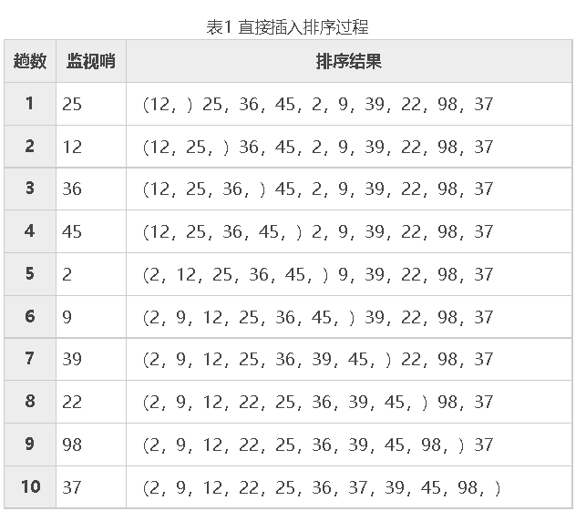

# c编程思想
# thinking of C 

## 预先完成上一部分 选择 循环 函数 数组的编程练习

## 1 C语言三个数从小到大排序/输出

任意输入 3 个整数，编程实现对这 3 个整数由小到大进行排序。  
实现过程：  
(1)定义数据类型，本实例中 a、b、c、t 均为基本整型。  

(2) 使用输入函数获得任意 3 个值赋给 a、b、c。  

(3) 使用 if 语句进行条件判断，如果 a 大于 b，则借助于中间变量 t 互换 a 与 b 值， 依此类推比较 a 与 c、b 与 c，最终结果即为 a、b、c 的升序排列。  

(4) 使用输出函数将 a、b、c 的值依次输出。  

(5) 程序的代码如下：  

```cpp
#include <stdio.h>
int main()
{
    int a,b,c,t;    /*定义4个基本整型变量a、b、c、t*/
    printf("Please input a,b,c:\n");    /*双引号内的普通字符原样输出并换行*/
    scanf("%d,%d,%d",&a,&b,&c);    /*输入任意3个数*/
    if(a>b)    /*如果a大于b,借助中间变量t实现a与b值的互换*/
    {
        t = a;
        a = b;
        b = t;
    }
    if(a>c)    /*如果a大于c,借助中间变景t实现a与c值的互换*/
    {
        t = a;
        a = c;
        c = t;
    }
    if(b>c)    /*如果b大于c,借助中间变量t实现b与c值的互换*/
    {
        t = b;
        b = c;
        c = t;
    }
    printf("The order of the number is:\n");
    printf("%d,%d,%d",a,b,c);    /*输出函数顺序输出a、b、c的值*/
    return 0;
}
```
运行结果：  
```
Please input a,b,c:
5,3,9
The order of the number is:
3,5,9
```

本实例使用 scanf("%d%d%d",&a,&b,&c); 从键盘中获得任意 3 个数。在输入数据时，在两个数据之间以一个或多个空格间隔，也可以用 Enter 健、Tab 键，不能用逗号作为两个数据间的分隔符。 如果用格式输入函数 scanf("％d,％d,%d",&a,&b,&c) 输入数据，两个数据之间要用“,”做间隔。  


## 2 猴子吃桃问题

猴子吃桃问题：猴子第一天摘下若干个桃子，当即吃了一半，还不过瘾，又多吃了一个。第二天早上又将第一天剩下的桃子吃掉一半，有多吃了一个。以后每天早上都吃了前一天剩下的一半零一个。到第 10 天早上想再吃时，发现只剩下一个桃子了。编写程序求猴子第一天摘了多少个桃子。  
实现过程：  
(1) 定义 day、x1、x2 为基本整型，并为 day 和 x2 赋初值 9 和 1。  

(2) 使用 while 语句由后向前推出第一天摘的桃子数。  

(3) 输出结果。  

(4) 程序代码如下：  

```cpp
#include <stdio.h>
int main()
{
    intday,x1,x2;    /*定义 day、x1、x2 3 个变董为基本整型*/
    day=9;
    x2=1;
    while(day>0)
    {
        x1=(x2+1)*2;    /*第一天的桃子数是第二天桃子数加1后的2倍*/
        x2=x1;
        day--;    /*因为从后向前推所以天数递减*/

    }
    printf("the total is %d\n",x1);    /* 输出桃子的总数*/
    return 0;
}
```

运行结果：  
the total is 1534   

本实例的思路基本上是先找出变量间的关系，也就是要明确第一天桃数和第二天桃子数之间的关系，即第二天桃子数加 1 的 2 倍等于第一天的桃子数。  

## 3 百钱买百鸡（百钱百鸡，百鸡问题）  

中国古代数学家张丘建在他的《算经》中提出了一个著名的“百钱买百鸡问题”，鸡翁一，值钱五，鸡母一，值钱三，鸡雏三，值钱一，百钱买百鸡，问翁、母、雏各几何？  
实现过程：  
(1) 使用 for 语句对 3 种鸡的数嫌在事先确定好的范围内进行穷举并判断，对满足条件的 3 种鸡的数量按指定格式输出，否则进行下次循环。  

(2) 程序代码如下：  

```cpp
#include <stdio.h>
int main()
{
    int cock,hen,chick;   /*定义变童为基本整型*/

    for(cock=0;cock<=20;cock++)   /*公鸡范围在 0~20 之间*/

    for(hen=0;hen<=33;hen++)   /*母鸡范围在 0~33 之间*/

    for(chick=3;chick<=99;chick++)   /*小鸡范围在 3~99 之间*/

    if(5*cock+3*hen+chick/3==100)   /*判断钱数是否等于 100*/

    if(cock+hen+chick==100)   /*判断购买的鸡数是否等于 100*/

    if(chick%3==0)   /*判断小鸡数是否能被 3 整除*/

    printf("公鸡：%d，母鸡：%d，小鸡：%d\n",cock,hen,chick);

    return 0;
}
```

运行结果：  
```
公鸡：0，母鸡：25，小鸡：75
公鸡：4，母鸡：18，小鸡：78
公鸡：8，母鸡：11，小鸡：81
公鸡：12，母鸡：4，小鸡：84
```

根据题意设公鸡、母鸡和雏鸡分别为 cock、hen 和 chick，如果 100 元全买公鸡，那么最多能买 20 只，所以 cock 的范围是大于等于 0 且小于等于 20；如果全买母鸡，那么最多能买 33 只，所以 hen 的范围是大于等于 0 且小于等于 33；如果 100 元钱全买小鸡，那么最多能买 99 只（根据题意小鸡的数量应小于 100 且是 3 的倍数）。  

在确定了各种鸡的范围后进行穷举并判断，判断的条件有以下 3 点：  
(1) 所买的 3 种鸡的钱数总和为 100。  
(2) 所买的 3 种鸡的数量之和为 100。  
(3) 所买的小鸡数必须是 3 的倍数。  

## 4 渔夫打鱼晒网问题

如果一个渔夫从 2011 年 1 月 1 日开始每三天打一次渔，两天晒一次网，编程实现当输入 2011 1 月 1 日以后的任意一天，输出该渔夫是在打渔还是在晒网。  
实现过程：  
(1) 自定义函数 leap()，用来判断输入的年份是否是闰年。  

(2) 自定义函数 number()，用来计算输入日期距 2011 年 1 月 1 日共有多少天。  

(3) main() 函数作为程序的入口函数，在 main() 函数中调用上面两个函数。程序代码如下：  

```cpp
#include <stdio.h>
int leap(int a) /*自定义函数leap()用来指定输入的年份是否为闰年*/
{
    if (a%4==0&&a%100!=0||a%400==0)    /* 闰年判定条件 */
        return 1;    /*是闰年返回1*/
    else
        return 0;    /*不是闰年返回O*/
}

int number(int year,int month,int day)    /*自定义函数 number() 计算输入日期距2011年1月1日共有多少天*/
{
    int sum = 0, i, j, k;
    int a[12]={31,28,31,30,31,30,31,31,30,31,30,31};    /*数组a存放平年每月的天数*/
    int b[12]={31,29,31,30,31,30,31,31,30,31,30,31};    /*数组b存放闰年每月的天数*/

    if(leap(year)==1)    /*判断是否为闰年*/
        for(i=0;i<month-1;i++)
        sum+=b[i];    /*是闰年，累加数组b前m-1个月份的天数*/
    else
        for(i=0;i<month-1;i++)
        sum+=a[i];    /*不是闰年，累加数组a前m-1个月份的天数*/
    for(j=2011;j<year;j++)
    if (leap(j)==i)
        sum+=366;    /*2011年到输入的年份是闰年的加366*/
    else
        sum+=365;    /*2011年到输入的年份不是闰年的加365*/
    sum+=day;    /*将前面累加的结果加上日期，求出总天数*/
    return sum;    /*返回计算的天数*/
}

int main()
{
    int year,month,day,n;
    printf("请输入年月日\n");
    scanf("%d%d%d",&year,&month,&day);    /*输入年月日*/
    n=number(year,month,day);    /*调用函数 number()*/
    if((n%5)<4&&(n%5)>0)    /*余数是1或2或3时说明在打渔，否则在晒网*/
        printf("%d：%d：%d 打鱼\n",year,month,day);
    else
        printf("%d：%d：%d 晒网\n",year,month,day);
    return 0;
}
```
运行结果：  
```
请输入年月日
2011 1 4
2011：1：4 晒网
```

技术要点：  
本实例主要有以下两个技术要点：  

(1) 判断输入的年份（2011 年以后包括 2011 年）是否为闰年，这里自定义函数 leap() 来进行判断。该函数的核心内容就是闰年的判断条件即能被 4 整除但不能被 100 整除，或能被 400 整除。  

(2) 求输入日期距 2011 年 1 月 1 日有多少天。首先判断 2011 年距输入的年份有多少年，这其中有多少年是闰年就将 sum 加多少个 366，有多少年是平年便将 sum 加上多少个 365。  

其次要将 12 个月每月的天数存到数组中，因为闰年 2 月份的天数有别于平年，故采用两个数组 a 和 b 分别存储。若输入年份是平年，月份为 m 时就在前面累加日期的基础上继续累加存储着平年每月天数的数组的前 m-1 个元素，将累加结果加上输入的日期便求出了最终结果。闰年的算法类似。  

## 5 希尔排序算法

用希尔排序法对一组数据由小到大进行排序，数据分别为 69、56、12、136、3、55、46、 99、88、25。  
实现过程：  
(1)自定义函数 shsort()，实现希尔排序。  

(2) main() 函数作为程序的入口函数。程序代码如下：  

```cpp
#include <stdio.h>
int shsort(int s[], int n)    /* 自定义函数 shsort()*/
{
    int i,j,d;
    d=n/2;    /*确定固定增虽值*/
    while(d>=1)
    {
        for(i=d+1;i<=n;i++)    /*数组下标从d+1开始进行直接插入排序*/
        {
            s[0]=s[i];    /*设置监视哨*/
            j=i-d;    /*确定要进行比较的元素的最右边位置*/
            while((j>0)&&(s[0]<s[j]))
            {
                s[j+d]=s[j];    /*数据右移*/
                j=j-d;    /*向左移d个位置V*/
            }
            s[j + d]=s[0];    /*在确定的位罝插入s[i]*/
        }
        d = d/2;    /*增里变为原来的一半*/
    }
return 0;
}

int main()
{
    int a[11],i;    /*定义数组及变量为基本整型*/
    printf("请输入 10 个数据：\n");
    for(i=1;i<=10;i++)
    scanf("%d",&a[i]);    /*从键盘中输入10个数据*/
    shsort(a, 10);    /* 调用 shsort()函数*/
    printf("排序后的顺序是：\n");
    for(i=1;i<=10;i++)
    printf("%5d",a[i]);    /*输出排序后的数组*/
    printf("\n");
    return 0;
}
```

运行结果：  
```
请输入 10 个数据：
69 56 12 136 3 55 46 99 88 25
排序后的顺序是：
    3   12   25   46   55   56   69   88   99  136
```
技术要点：  
希尔排序是在直接插入排序的基础上做的改进，也就是将寒排序的序列按固定增量分成若干组，等距者在同二组中，然后再在组内进行直接插入排序。这里面的固定增量从 n/2 开始，以后每次缩小到原来的一半。  

## 6 冒泡排序算法

用冒泡排序法对任意输入的 10 个数按照从小到大的顺序进行排序。  
实现过程：  
(1) 通过两个 for 循环实现冒泡排序的全过程，外层 for 循环决定冒泡排序的趟数，内层 for 循环决定每趟所进行两两比较的次数。  

(2) 程序代码如下：  
```cpp
#include <stdio.h>
int main()
{
    int i,j,t,a[11];    //定义变量及数组为基本整型
    printf("请输入10个数：\n");
    for(i=1;i<11;i++)
        scanf("%d",&a[i]);    //从键盘中输入10个数
    for(i=1;i<10;i++)    //变量i代表比较的趟数
        for(j=1;j<11-i;j++)    //变最j代表每趟两两比较的次数
            if(a[j]>a[j+1])
            {
                t=a[j];    //产利用中间变童实现两值互换
                a[j]=a[j+1];
                a[j+1]=t;
            }
            printf("排序后的顺序是：\n");
            for(i=1;i<=10;i++)
                printf("%5d",a[i]);    //将胃泡排序后的顺序输出
        printf("\n");
    return 0;
}
```
运行结果：
```
请输入10个数：
66 32 23 45 25 5 15 69 46 37
排序后的顺序是：
    5   15   23   25   32   37   45   46   66   69
```
技术要点：  
本实例要求用冒泡法对 10 个数由小到大进行排序，冒泡法的基本思路是，如果要对 n 个数进行冒泡排序，那么要进行 n-1 趟比较，在第 1 趟比较中要进行 n-j 次两两比较，在第 j 趟比较中要进行 n-j 次两两比较。从这个基本思路中就会发现，趟数决定了两两比较的次数，这样就很容易将两个 for 循环联系起来了。  

## 7 直接插入排序算法
插入排序是把一个记录插入到已排序的有序序列中，使整个序列在插入该记录后仍然有序。插入排序中较简单的种方法是直接插入排序，其插入位置的确定方法是将待插入的记录与有序区中的各记录自右向左依次比较其关键字值的大小。本实例要求使用直接插入排序法将数字由小到大进行排序。  
实现过程：  
(1) 自定义一个函数，实现直接插入排序，在本实例中，我们自定义该函数为 insort()。  

(2) main() 函数为程序的入口函数。程序代码如下：  

```cpp
#include <stdio.h>
int insort(int s[], int n)    /* 自定义函数 insort()*/
{
    int i,j;
    for(i=2;i<=n;i++)    //数组下标从2开始，s[0]做监视哨，s[1]一个数据无可比性
    {
        s[0]=s[i];    //给监视哨陚值
        j=i-1;    //确定要比较元素的最右边位黄
        while(s[0]<s[j])
        {
            s[j+1]=s[j];    //数据右移
            j--;    //产移向左边一个未比较的数
        }
        s[j+1]=s[0];    //在确定的位置插入s[i]
    }
    return 0;
}

int main()
{
    int a[11],i;    //定义数组及变量为基木整甩
    printf("请输入10个数据：\n");
    for (i =1;i<=10;i++)
        scanf("%d",&a[i]);    //接收从键盘输入的10个数据到数组a中
    printf("原始顺序：\n");
    for(i=1;i<11;i++)
        printf("%5d",a[i]);    //将未排序前的顺序输出
    insort(a,10);    //调用自定义函数 insort()
    printf("\n 插入数据排序后顺序：\n");
    for(i=1;i<11;i++)
        printf("%5d",a[i]); //将排序后的数组输出
    printf("\n");
    return 0;
}
```

运行结果：  
```
请输入10个数据：
25 12 36 45 2 9 39 22 98 37
原始顺序：
   25   12   36   45    2    9   39   22   98   37
插入数据排序后顺序：
    2    9   12   22   25   36   37   39   45   98
```

技术要点：  
本实例算法过程如表 1 所示。  

原始顺序：25 12 36 45 2 9 39 27 98 37  

  

本算法中使用了监视哨，主要是为了避免数据在后移时丢失。  

## 8 快速排序算法

用快速排序法对一组数据由小到大进行排序，数据分别为 99、45、12、36、69、22、62、 796、4、696。  
实现过程：  
(1)自定义一个函数 qusort()，实现快速排序。  

(2) main() 函数为程序的入口函数。程序代码如下：  

```cpp
#include <stdio.h>
int qusort(int s[],int start,int end)    //自定义函数 qusort()
{
    int i,j;    //定义变量为基本整型
    i=start;    //将每组首个元素赋给i
    j = end;    //将每组末尾元素赋给j
    s[0]=s[start];    //设置基准值
    while(i<j)
    {
        while(i<j&&s[0]<s[j])
        j--;    //位置左移
        if(i<j)
        {
            s[i]=s[j];    //将s[j]放到s[i]的位置上
            i++;    //位置右移
        }
        while(i<j&&s[i]<=s[0])
            i++;    //位置左移
        if(i<j)
        {
            s[j]=s[i];    //将大于基准值的s[j]放到s[i]位置
            j--;    //位置左移
        }
    }
    s[i]=s[0];    //将基准值放入指定位置
    if (start<i)
        qusort(s,start,j-1);    //对分割出的部分递归调用qusort()函数
    if (i<end)
        qusort(s,j+1,end);
    return 0;
}

int main()
{
    int a[11], i;    //定义数组及变量为基本整型
    printf("请输入10个数：\n");
    for(i=1;i<=10;i++)
        scanf("%d",&a[i]);    //从键盘中输入10个要进行排序的数
    qusort(a,1,10);    //调用qusort()函数进行排序
    printf("排序后的顺序是：\n");
    for(i=1;i<=10;i++)
        printf("%5d",a[i]);    //输出排好序的数组
    printf("\n");
    return 0;
}
```

运行结果：  
```
请输入10个数：
99 45 12 36 69 22 62 796 4 696
排序后的顺序是：
    4   12   22   36   45   62   69   99  696  796
```

技术要点：  
快速排序是冒泡排序的一种改进，主要的算法思想是在待排序的 n 个数据中取第一个数据作为基准值，将所有记录分为 3 组，使第一组中各数据值均小于或等于基准值，第二组做基准值的数琚，第三组中各数据值均大于或等于基准值。这便实现了第一趟分割，然后再对第二组和第兰组分别重复上述方法，依次类推，直到每组中只有一个记录为止。  

## 9 选择排序算法

用选择排序法对一组数据由小到大进行排序，数据分别为 526、36、2、369、56、45、78、92、125、52。  
实现过程：  
(1) 程序中用到T两个 for 循环语句。第一个 for 循环是确定位置的，该位置是存放每次从待排序数列中经选择和交换后所选出的最小数。第二个 for 循环是实现将确定位置上的数与后面待排序区间中的数进行比较的。  

(2) 程序代码如下：  

```cpp
#include <stdio.h>
int main()
{
    int i,j,t,a[11];    //定义变量及数组为基本整型
    printf("请输入10个数：\n");
    for(i=1;i<11;i++)
        scanf("%d",&a[i]);    //从键盘中输入要排序的10个数字
    for(i=1;i<=9;i++)
        for (j=i+1;j<=10;j++)
            if(a[i]>a[j])    //如果前一个数比后一个数大，则利用中间变量t实现两值互换
            {
                t=a[i];
                a[i]=a[j];
                a[j]=t;
            }
    printf("排序后的顺序是：\n");
    for(i=1;i<=10;i++)
        printf("%5d", a[i]);    //输出排序后的数组
    printf("\n");
    return 0;
}
```

运行结果：  
```
请输入10个数：
526 36 2 369 56 45 78 92 125 52
排序后的顺序是：
    2   36   45   52   56   78   92  125  369  526
```
技术要点：  
选择排序的基本算法是从待排序的区间中经过选择和交换后选出最小的数值存放到 a[0] 中，再从剩余的未排序区间中经过选择和交换后选出最小的数值存放到 a[1] 中，a[1] 中的数字仅大于 a[0]，依此类推，即可实现排序。  

## 10 归并排序算法

用归并排序法对一组数据由小到大进行排序，数据分别为 695、458、362、789、12、 15、163、23、2、986。  
实现过程：  
(1) 自定义函数 merge()，实现一次归并排序。  

(2) 自定义函数 merge_sort()，实现归并排序。  

(3) 程序代码如下：  

```cpp
#include <stdio.h>
int merge(int r[],int s[],int x1,int x2,int x3)    //自定义实现一次归并样序的函数
{
    int i,j,k;
    i=x1;    //第一部分的开始位置
    j=x2+1;  //第二部分的开始位置
    k=x1;
    while((i<=x2)&&(j<=x3))    //当i和j都在两个要合并的部分中时
        if(r[i]<=r[j])    //筛选两部分中较小的元素放到数组s中
        {
            s[k] = r[i];
            i++;
            k++;
        }
        else
        {
            s[k]=r[j];
            j++;
            k++;
        }
        while(i<=x2)    //将x1〜x2范围内未比较的数顺次加到数组r中
            s[k++]=r[i++];
        while(j<=x3) //将x2+l〜x3范围内未比较的数顺次加到数组r中
            s[k++]=r[j++];
    return 0;
}

int merge_sort(int r[],int s[],int m,int n)
{
    int p;
    int t[20];
    if(m==n)
        s[m]=r[m];
    else
    {
        p=(m+n)/2;
        merge_sort(r,t,m,p);    //递归调用merge_soit()函数将r[m]〜r[p]归并成有序的t[m]〜t[p]
        merge_sort(r,t,p+1,n);    //递归一调用merge_sort()函数将r[p+l]〜r[n]归并成有序的t[p+l]〜t[n]
        merge(t,s,m,p,n);    //调用函数将前两部分归并到s[m]〜s[n】*/
    }
    return 0;
}

int main()
{
    int a[11];
    int i;
    printf("请输入10个数：\n");
    for(i=1;i<=10;i++)
        scanf("%d",&a[i]);    //从键盘中输入10个数
    merge_sort(a,a,1,10);    //调用merge_sort()函数进行归并排序
    printf("排序后的顺序是：\n");
    for(i=1;i<=10;i++)
        printf("%5d",a[i]);    //输出排序后的数据
    printf("\n");
    return 0;
}
```

