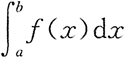

# c编程思想
# thinking of C 

## 预先完成上一部分 选择 循环 函数 数组的编程练习

## 1 C语言三个数从小到大排序/输出

任意输入 3 个整数，编程实现对这 3 个整数由小到大进行排序。  
实现过程：  
(1)定义数据类型，本实例中 a、b、c、t 均为基本整型。  

(2) 使用输入函数获得任意 3 个值赋给 a、b、c。  

(3) 使用 if 语句进行条件判断，如果 a 大于 b，则借助于中间变量 t 互换 a 与 b 值， 依此类推比较 a 与 c、b 与 c，最终结果即为 a、b、c 的升序排列。  

(4) 使用输出函数将 a、b、c 的值依次输出。  

(5) 程序的代码如下：  

```cpp
#include <stdio.h>
int main()
{
    int a,b,c,t;    /*定义4个基本整型变量a、b、c、t*/
    printf("Please input a,b,c:\n");    /*双引号内的普通字符原样输出并换行*/
    scanf("%d,%d,%d",&a,&b,&c);    /*输入任意3个数*/
    if(a>b)    /*如果a大于b,借助中间变量t实现a与b值的互换*/
    {
        t = a;
        a = b;
        b = t;
    }
    if(a>c)    /*如果a大于c,借助中间变景t实现a与c值的互换*/
    {
        t = a;
        a = c;
        c = t;
    }
    if(b>c)    /*如果b大于c,借助中间变量t实现b与c值的互换*/
    {
        t = b;
        b = c;
        c = t;
    }
    printf("The order of the number is:\n");
    printf("%d,%d,%d",a,b,c);    /*输出函数顺序输出a、b、c的值*/
    return 0;
}
```
运行结果：  
```
Please input a,b,c:
5,3,9
The order of the number is:
3,5,9
```

本实例使用 scanf("%d%d%d",&a,&b,&c); 从键盘中获得任意 3 个数。在输入数据时，在两个数据之间以一个或多个空格间隔，也可以用 Enter 健、Tab 键，不能用逗号作为两个数据间的分隔符。 如果用格式输入函数 scanf("％d,％d,%d",&a,&b,&c) 输入数据，两个数据之间要用“,”做间隔。  


## 2 猴子吃桃问题

猴子吃桃问题：猴子第一天摘下若干个桃子，当即吃了一半，还不过瘾，又多吃了一个。第二天早上又将第一天剩下的桃子吃掉一半，有多吃了一个。以后每天早上都吃了前一天剩下的一半零一个。到第 10 天早上想再吃时，发现只剩下一个桃子了。编写程序求猴子第一天摘了多少个桃子。  
实现过程：  
(1) 定义 day、x1、x2 为基本整型，并为 day 和 x2 赋初值 9 和 1。  

(2) 使用 while 语句由后向前推出第一天摘的桃子数。  

(3) 输出结果。  

(4) 程序代码如下：  

```cpp
#include <stdio.h>
int main()
{
    intday,x1,x2;    /*定义 day、x1、x2 3 个变董为基本整型*/
    day=9;
    x2=1;
    while(day>0)
    {
        x1=(x2+1)*2;    /*第一天的桃子数是第二天桃子数加1后的2倍*/
        x2=x1;
        day--;    /*因为从后向前推所以天数递减*/

    }
    printf("the total is %d\n",x1);    /* 输出桃子的总数*/
    return 0;
}
```

运行结果：  
the total is 1534   

本实例的思路基本上是先找出变量间的关系，也就是要明确第一天桃数和第二天桃子数之间的关系，即第二天桃子数加 1 的 2 倍等于第一天的桃子数。  

## 3 百钱买百鸡（百钱百鸡，百鸡问题）  

中国古代数学家张丘建在他的《算经》中提出了一个著名的“百钱买百鸡问题”，鸡翁一，值钱五，鸡母一，值钱三，鸡雏三，值钱一，百钱买百鸡，问翁、母、雏各几何？  
实现过程：  
(1) 使用 for 语句对 3 种鸡的数嫌在事先确定好的范围内进行穷举并判断，对满足条件的 3 种鸡的数量按指定格式输出，否则进行下次循环。  

(2) 程序代码如下：  

```cpp
#include <stdio.h>
int main()
{
    int cock,hen,chick;   /*定义变童为基本整型*/

    for(cock=0;cock<=20;cock++)   /*公鸡范围在 0~20 之间*/

    for(hen=0;hen<=33;hen++)   /*母鸡范围在 0~33 之间*/

    for(chick=3;chick<=99;chick++)   /*小鸡范围在 3~99 之间*/

    if(5*cock+3*hen+chick/3==100)   /*判断钱数是否等于 100*/

    if(cock+hen+chick==100)   /*判断购买的鸡数是否等于 100*/

    if(chick%3==0)   /*判断小鸡数是否能被 3 整除*/

    printf("公鸡：%d，母鸡：%d，小鸡：%d\n",cock,hen,chick);

    return 0;
}
```

运行结果：  
```
公鸡：0，母鸡：25，小鸡：75
公鸡：4，母鸡：18，小鸡：78
公鸡：8，母鸡：11，小鸡：81
公鸡：12，母鸡：4，小鸡：84
```

根据题意设公鸡、母鸡和雏鸡分别为 cock、hen 和 chick，如果 100 元全买公鸡，那么最多能买 20 只，所以 cock 的范围是大于等于 0 且小于等于 20；如果全买母鸡，那么最多能买 33 只，所以 hen 的范围是大于等于 0 且小于等于 33；如果 100 元钱全买小鸡，那么最多能买 99 只（根据题意小鸡的数量应小于 100 且是 3 的倍数）。  

在确定了各种鸡的范围后进行穷举并判断，判断的条件有以下 3 点：  
(1) 所买的 3 种鸡的钱数总和为 100。  
(2) 所买的 3 种鸡的数量之和为 100。  
(3) 所买的小鸡数必须是 3 的倍数。  

## 4 渔夫打鱼晒网问题

如果一个渔夫从 2011 年 1 月 1 日开始每三天打一次渔，两天晒一次网，编程实现当输入 2011 1 月 1 日以后的任意一天，输出该渔夫是在打渔还是在晒网。  
实现过程：  
(1) 自定义函数 leap()，用来判断输入的年份是否是闰年。  

(2) 自定义函数 number()，用来计算输入日期距 2011 年 1 月 1 日共有多少天。  

(3) main() 函数作为程序的入口函数，在 main() 函数中调用上面两个函数。程序代码如下：  

```cpp
#include <stdio.h>
int leap(int a) /*自定义函数leap()用来指定输入的年份是否为闰年*/
{
    if (a%4==0&&a%100!=0||a%400==0)    /* 闰年判定条件 */
        return 1;    /*是闰年返回1*/
    else
        return 0;    /*不是闰年返回O*/
}

int number(int year,int month,int day)    /*自定义函数 number() 计算输入日期距2011年1月1日共有多少天*/
{
    int sum = 0, i, j, k;
    int a[12]={31,28,31,30,31,30,31,31,30,31,30,31};    /*数组a存放平年每月的天数*/
    int b[12]={31,29,31,30,31,30,31,31,30,31,30,31};    /*数组b存放闰年每月的天数*/

    if(leap(year)==1)    /*判断是否为闰年*/
        for(i=0;i<month-1;i++)
        sum+=b[i];    /*是闰年，累加数组b前m-1个月份的天数*/
    else
        for(i=0;i<month-1;i++)
        sum+=a[i];    /*不是闰年，累加数组a前m-1个月份的天数*/
    for(j=2011;j<year;j++)
    if (leap(j)==i)
        sum+=366;    /*2011年到输入的年份是闰年的加366*/
    else
        sum+=365;    /*2011年到输入的年份不是闰年的加365*/
    sum+=day;    /*将前面累加的结果加上日期，求出总天数*/
    return sum;    /*返回计算的天数*/
}

int main()
{
    int year,month,day,n;
    printf("请输入年月日\n");
    scanf("%d%d%d",&year,&month,&day);    /*输入年月日*/
    n=number(year,month,day);    /*调用函数 number()*/
    if((n%5)<4&&(n%5)>0)    /*余数是1或2或3时说明在打渔，否则在晒网*/
        printf("%d：%d：%d 打鱼\n",year,month,day);
    else
        printf("%d：%d：%d 晒网\n",year,month,day);
    return 0;
}
```
运行结果：  
```
请输入年月日
2011 1 4
2011：1：4 晒网
```

技术要点：  
本实例主要有以下两个技术要点：  

(1) 判断输入的年份（2011 年以后包括 2011 年）是否为闰年，这里自定义函数 leap() 来进行判断。该函数的核心内容就是闰年的判断条件即能被 4 整除但不能被 100 整除，或能被 400 整除。  

(2) 求输入日期距 2011 年 1 月 1 日有多少天。首先判断 2011 年距输入的年份有多少年，这其中有多少年是闰年就将 sum 加多少个 366，有多少年是平年便将 sum 加上多少个 365。  

其次要将 12 个月每月的天数存到数组中，因为闰年 2 月份的天数有别于平年，故采用两个数组 a 和 b 分别存储。若输入年份是平年，月份为 m 时就在前面累加日期的基础上继续累加存储着平年每月天数的数组的前 m-1 个元素，将累加结果加上输入的日期便求出了最终结果。闰年的算法类似。  

## 5 希尔排序算法

用希尔排序法对一组数据由小到大进行排序，数据分别为 69、56、12、136、3、55、46、 99、88、25。  
实现过程：  
(1)自定义函数 shsort()，实现希尔排序。  

(2) main() 函数作为程序的入口函数。程序代码如下：  

```cpp
#include <stdio.h>
int shsort(int s[], int n)    /* 自定义函数 shsort()*/
{
    int i,j,d;
    d=n/2;    /*确定固定增虽值*/
    while(d>=1)
    {
        for(i=d+1;i<=n;i++)    /*数组下标从d+1开始进行直接插入排序*/
        {
            s[0]=s[i];    /*设置监视哨*/
            j=i-d;    /*确定要进行比较的元素的最右边位置*/
            while((j>0)&&(s[0]<s[j]))
            {
                s[j+d]=s[j];    /*数据右移*/
                j=j-d;    /*向左移d个位置V*/
            }
            s[j + d]=s[0];    /*在确定的位罝插入s[i]*/
        }
        d = d/2;    /*增里变为原来的一半*/
    }
return 0;
}

int main()
{
    int a[11],i;    /*定义数组及变量为基本整型*/
    printf("请输入 10 个数据：\n");
    for(i=1;i<=10;i++)
    scanf("%d",&a[i]);    /*从键盘中输入10个数据*/
    shsort(a, 10);    /* 调用 shsort()函数*/
    printf("排序后的顺序是：\n");
    for(i=1;i<=10;i++)
    printf("%5d",a[i]);    /*输出排序后的数组*/
    printf("\n");
    return 0;
}
```

运行结果：  
```
请输入 10 个数据：
69 56 12 136 3 55 46 99 88 25
排序后的顺序是：
    3   12   25   46   55   56   69   88   99  136
```
技术要点：  
希尔排序是在直接插入排序的基础上做的改进，也就是将寒排序的序列按固定增量分成若干组，等距者在同二组中，然后再在组内进行直接插入排序。这里面的固定增量从 n/2 开始，以后每次缩小到原来的一半。  

## 6 冒泡排序算法

用冒泡排序法对任意输入的 10 个数按照从小到大的顺序进行排序。  
实现过程：  
(1) 通过两个 for 循环实现冒泡排序的全过程，外层 for 循环决定冒泡排序的趟数，内层 for 循环决定每趟所进行两两比较的次数。  

(2) 程序代码如下：  
```cpp
#include <stdio.h>
int main()
{
    int i,j,t,a[11];    //定义变量及数组为基本整型
    printf("请输入10个数：\n");
    for(i=1;i<11;i++)
        scanf("%d",&a[i]);    //从键盘中输入10个数
    for(i=1;i<10;i++)    //变量i代表比较的趟数
        for(j=1;j<11-i;j++)    //变最j代表每趟两两比较的次数
            if(a[j]>a[j+1])
            {
                t=a[j];    //产利用中间变童实现两值互换
                a[j]=a[j+1];
                a[j+1]=t;
            }
            printf("排序后的顺序是：\n");
            for(i=1;i<=10;i++)
                printf("%5d",a[i]);    //将胃泡排序后的顺序输出
        printf("\n");
    return 0;
}
```
运行结果：
```
请输入10个数：
66 32 23 45 25 5 15 69 46 37
排序后的顺序是：
    5   15   23   25   32   37   45   46   66   69
```
技术要点：  
本实例要求用冒泡法对 10 个数由小到大进行排序，冒泡法的基本思路是，如果要对 n 个数进行冒泡排序，那么要进行 n-1 趟比较，在第 1 趟比较中要进行 n-j 次两两比较，在第 j 趟比较中要进行 n-j 次两两比较。从这个基本思路中就会发现，趟数决定了两两比较的次数，这样就很容易将两个 for 循环联系起来了。  

## 7 直接插入排序算法
插入排序是把一个记录插入到已排序的有序序列中，使整个序列在插入该记录后仍然有序。插入排序中较简单的种方法是直接插入排序，其插入位置的确定方法是将待插入的记录与有序区中的各记录自右向左依次比较其关键字值的大小。本实例要求使用直接插入排序法将数字由小到大进行排序。  
实现过程：  
(1) 自定义一个函数，实现直接插入排序，在本实例中，我们自定义该函数为 insort()。  

(2) main() 函数为程序的入口函数。程序代码如下：  

```cpp
#include <stdio.h>
int insort(int s[], int n)    /* 自定义函数 insort()*/
{
    int i,j;
    for(i=2;i<=n;i++)    //数组下标从2开始，s[0]做监视哨，s[1]一个数据无可比性
    {
        s[0]=s[i];    //给监视哨陚值
        j=i-1;    //确定要比较元素的最右边位黄
        while(s[0]<s[j])
        {
            s[j+1]=s[j];    //数据右移
            j--;    //产移向左边一个未比较的数
        }
        s[j+1]=s[0];    //在确定的位置插入s[i]
    }
    return 0;
}

int main()
{
    int a[11],i;    //定义数组及变量为基木整甩
    printf("请输入10个数据：\n");
    for (i =1;i<=10;i++)
        scanf("%d",&a[i]);    //接收从键盘输入的10个数据到数组a中
    printf("原始顺序：\n");
    for(i=1;i<11;i++)
        printf("%5d",a[i]);    //将未排序前的顺序输出
    insort(a,10);    //调用自定义函数 insort()
    printf("\n 插入数据排序后顺序：\n");
    for(i=1;i<11;i++)
        printf("%5d",a[i]); //将排序后的数组输出
    printf("\n");
    return 0;
}
```

运行结果：  
```
请输入10个数据：
25 12 36 45 2 9 39 22 98 37
原始顺序：
   25   12   36   45    2    9   39   22   98   37
插入数据排序后顺序：
    2    9   12   22   25   36   37   39   45   98
```

技术要点：  
本实例算法过程如表 1 所示。  

原始顺序：25 12 36 45 2 9 39 27 98 37  

  

本算法中使用了监视哨，主要是为了避免数据在后移时丢失。  

## 8 快速排序算法

用快速排序法对一组数据由小到大进行排序，数据分别为 99、45、12、36、69、22、62、 796、4、696。  
实现过程：  
(1)自定义一个函数 qusort()，实现快速排序。  

(2) main() 函数为程序的入口函数。程序代码如下：  

```cpp
#include <stdio.h>
int qusort(int s[],int start,int end)    //自定义函数 qusort()
{
    int i,j;    //定义变量为基本整型
    i=start;    //将每组首个元素赋给i
    j = end;    //将每组末尾元素赋给j
    s[0]=s[start];    //设置基准值
    while(i<j)
    {
        while(i<j&&s[0]<s[j])
        j--;    //位置左移
        if(i<j)
        {
            s[i]=s[j];    //将s[j]放到s[i]的位置上
            i++;    //位置右移
        }
        while(i<j&&s[i]<=s[0])
            i++;    //位置左移
        if(i<j)
        {
            s[j]=s[i];    //将大于基准值的s[j]放到s[i]位置
            j--;    //位置左移
        }
    }
    s[i]=s[0];    //将基准值放入指定位置
    if (start<i)
        qusort(s,start,j-1);    //对分割出的部分递归调用qusort()函数
    if (i<end)
        qusort(s,j+1,end);
    return 0;
}

int main()
{
    int a[11], i;    //定义数组及变量为基本整型
    printf("请输入10个数：\n");
    for(i=1;i<=10;i++)
        scanf("%d",&a[i]);    //从键盘中输入10个要进行排序的数
    qusort(a,1,10);    //调用qusort()函数进行排序
    printf("排序后的顺序是：\n");
    for(i=1;i<=10;i++)
        printf("%5d",a[i]);    //输出排好序的数组
    printf("\n");
    return 0;
}
```

运行结果：  
```
请输入10个数：
99 45 12 36 69 22 62 796 4 696
排序后的顺序是：
    4   12   22   36   45   62   69   99  696  796
```

技术要点：  
快速排序是冒泡排序的一种改进，主要的算法思想是在待排序的 n 个数据中取第一个数据作为基准值，将所有记录分为 3 组，使第一组中各数据值均小于或等于基准值，第二组做基准值的数琚，第三组中各数据值均大于或等于基准值。这便实现了第一趟分割，然后再对第二组和第兰组分别重复上述方法，依次类推，直到每组中只有一个记录为止。  

## 9 选择排序算法

用选择排序法对一组数据由小到大进行排序，数据分别为 526、36、2、369、56、45、78、92、125、52。  
实现过程：  
(1) 程序中用到T两个 for 循环语句。第一个 for 循环是确定位置的，该位置是存放每次从待排序数列中经选择和交换后所选出的最小数。第二个 for 循环是实现将确定位置上的数与后面待排序区间中的数进行比较的。  

(2) 程序代码如下：  

```cpp
#include <stdio.h>
int main()
{
    int i,j,t,a[11];    //定义变量及数组为基本整型
    printf("请输入10个数：\n");
    for(i=1;i<11;i++)
        scanf("%d",&a[i]);    //从键盘中输入要排序的10个数字
    for(i=1;i<=9;i++)
        for (j=i+1;j<=10;j++)
            if(a[i]>a[j])    //如果前一个数比后一个数大，则利用中间变量t实现两值互换
            {
                t=a[i];
                a[i]=a[j];
                a[j]=t;
            }
    printf("排序后的顺序是：\n");
    for(i=1;i<=10;i++)
        printf("%5d", a[i]);    //输出排序后的数组
    printf("\n");
    return 0;
}
```

运行结果：  
```
请输入10个数：
526 36 2 369 56 45 78 92 125 52
排序后的顺序是：
    2   36   45   52   56   78   92  125  369  526
```
技术要点：  
选择排序的基本算法是从待排序的区间中经过选择和交换后选出最小的数值存放到 a[0] 中，再从剩余的未排序区间中经过选择和交换后选出最小的数值存放到 a[1] 中，a[1] 中的数字仅大于 a[0]，依此类推，即可实现排序。  

## 10 归并排序算法

用归并排序法对一组数据由小到大进行排序，数据分别为 695、458、362、789、12、 15、163、23、2、986。  
实现过程：  
(1) 自定义函数 merge()，实现一次归并排序。  

(2) 自定义函数 merge_sort()，实现归并排序。  

(3) 程序代码如下：  

```cpp
#include <stdio.h>
int merge(int r[],int s[],int x1,int x2,int x3)    //自定义实现一次归并样序的函数
{
    int i,j,k;
    i=x1;    //第一部分的开始位置
    j=x2+1;  //第二部分的开始位置
    k=x1;
    while((i<=x2)&&(j<=x3))    //当i和j都在两个要合并的部分中时
        if(r[i]<=r[j])    //筛选两部分中较小的元素放到数组s中
        {
            s[k] = r[i];
            i++;
            k++;
        }
        else
        {
            s[k]=r[j];
            j++;
            k++;
        }
        while(i<=x2)    //将x1〜x2范围内未比较的数顺次加到数组r中
            s[k++]=r[i++];
        while(j<=x3) //将x2+l〜x3范围内未比较的数顺次加到数组r中
            s[k++]=r[j++];
    return 0;
}

int merge_sort(int r[],int s[],int m,int n)
{
    int p;
    int t[20];
    if(m==n)
        s[m]=r[m];
    else
    {
        p=(m+n)/2;
        merge_sort(r,t,m,p);    //递归调用merge_soit()函数将r[m]〜r[p]归并成有序的t[m]〜t[p]
        merge_sort(r,t,p+1,n);    //递归一调用merge_sort()函数将r[p+l]〜r[n]归并成有序的t[p+l]〜t[n]
        merge(t,s,m,p,n);    //调用函数将前两部分归并到s[m]〜s[n】*/
    }
    return 0;
}

int main()
{
    int a[11];
    int i;
    printf("请输入10个数：\n");
    for(i=1;i<=10;i++)
        scanf("%d",&a[i]);    //从键盘中输入10个数
    merge_sort(a,a,1,10);    //调用merge_sort()函数进行归并排序
    printf("排序后的顺序是：\n");
    for(i=1;i<=10;i++)
        printf("%5d",a[i]);    //输出排序后的数据
    printf("\n");
    return 0;
}
```

运行结果：  
```
请输入10个数：
695 458 362 789 12 15 163 23 2 986
排序后的顺序是：
    2   12   15   23  163  362  458  695  789  986
```

技术要点：  
归并是将两个或多个存序记录序列合并成一个有序序列。归并方法有多种，一次对两个有序记录序列进行归并，称为路归并排序，也有三路归并排序及多路归并排序。本实例是二路归并排序，基本方法如下：  

(1) 将 n 个记录看成是 n 个长度为 1 的有序子表。  

(2) 将两两相邻时有序无表进行归并。  

(3) 重复执行步骤 (2) 直到归并成一个长度为 n 的有序表。  

## 11 二分查找算法，折半查找算法

本实例采用二分查找法查找特定关键字的元素。要求用户输入数组长度，也就是有序表的数据长度，并输入数组元素和査找的关键字。程序输出查找成功与否，以及成功时关键字在数组中的位置。例如，在有序表 11、13、18、 28、39、56、69、89、98、122 中査找关键字为 89 的元素  
实现过程：  
(1) 自定义函数 binary_search()，实现二分査找。  

(2) main() 函数作为程序的入口函数。程序代码如下：  

```cpp
#include <stdio.h>
int binary_search(int key,int a[],int n) //自定义函数binary_search()
{
    int low,high,mid,count=0,count1=0;
    low=0;
    high=n-1;
    while(low<high)    //査找范围不为0时执行循环体语句
    {
        count++;    //count记录査找次数
        mid=(low+high)/2;    //求中间位置
        if(key<a[mid])    //key小于中间值时
            high=mid-1;    //确定左子表范围
        else if(key>a[mid])    //key 大于中间值时
            low=mid+1;    //确定右子表范围
        else if(key==a[mid])    //当key等于中间值时，证明查找成功
        {
            printf("查找成功!\n 查找 %d 次!a[%d]=%d",count,mid,key);    //输出査找次数及所査找元素在数组中的位置
            count1++;    //count1记录查找成功次数
            break;
        }
    }
    if(count1==0)    //判断是否查找失敗
        printf("查找失敗!");    //査找失敗输出no found
    return 0;
}

int main()
{
    int i,key,a[100],n;
    printf("请输入数组的长度：\n");
    scanf("%d",&n);    //输入数组元素个数
    printf("请输入数组元素：\n");
    for(i=0;i<n;i++)
        scanf("%d",&a[i]);    //输入有序数列到数组a中
    printf("请输入你想查找的元素：\n");
    scanf("%d",&key);    //输入要^找的关键字
    binary_search(key,a,n);    //调用自定义函数
    printf("\n");
    return 0;
}
```
运行结果：  
```
请输入数组的长度：
10
请输入数组元素：
11 13 18 28 39 56 69 89 98 122
请输入你想查找的元素：
89
查找成功!
查找 2 次!a[7]=89
```

技术要点：  
二分査找就是折半查找，其基本思想是：首先选取表中间位置的记录，将其关键字与给定关键字 key 进行比较，若相等，则査找成功；若 key 值比该关键字值大，则要找的元素一定在右子表中，则继续对右子表进行折半查找：若 key 值比该关键宇值小，则要找的元素一定在左子表中，继续对左子表进行折半査找。如此递推，直到査找成功或査找失败（或査找范围为 0）。  

## 12 分块查找算法，索引顺序查找算法
例如，采用分块查找法在有序表 11、12、18、28、39、56、69、89、96、122、135、146、156、256、298 中查找关键字为 96 的元素。  

査找特定关键字元素个数为 15，要求用户输入有序表各元素，程序输出査找成功与否，若成功，还显示元素在有序表中的位罝。  
实现过程：  
(1)定义结构体 index，用于存储块的结构，并定义该结构体数组 index_table。  

(2)自定义函数 block_search()，实现分块查找。  

(3) main() 函数作为程序的入口函数。程序代码如下：  

```cpp
#include <stdio.h>
struct index    //定义块的结构
{
    int key;    //块的关键字
    int start;    //块的起始值
    int end;    //块的结束值
}index_table[4];    //定义结构体数组

int block_search(int key,int a[])    //自定义实现分块查找
{
    int i,j;
    i=1;
    while(i<=3&&key>index_table[i].key)    //确定在哪个块中
        i++;
    if(i>3)    //大于分得的块数，则返回0
        return 0;
    j=index_table[i].start;    //j等于块范围的起始值
    while(j<=index_table[i].end&&a[j]!=key)    //在确定的块内进行顺序查找
        j++;
    if(j>index_table[i].end)    //如果大于块范围的结束值，则说明没有要査找的数，j置0
        j = 0;
    return j;
}

int main()
{
    int i,j=0,k,key,a[16];
    printf("请输入15个数：\n");
    for(i=1;i<16;i++)
        scanf("%d",&a[i]);    //输入由小到大的15个数
    for(i=1;i<=3;i++)
    {
        index_table[i].start=j+1;    //确定每个块范围的起始值
        j=j+1;
        index_table[i].end=j+4;    //确定每个块范围的结束值
        j=j + 4;
        index_table[i].key=a[j];    //确定每个块范围中元素的最大值
    }
    printf("请输入你想査找的元素：\n");
    scanf("%d",&key);    //输入要查询的数值
    k=block_search(key,a);    //调用函数进行杳找
    if(k!=0)
        printf("查找成功，其位置是：%d\n",k);    //如果找到该数，则输出其位置
    else
        printf("查找失败!");    //若未找到，则输出提示信息
    return 0；
}

```
运行结果：  
```
请输入15个数：
11 12 18 28 39 56 69 89 96 122 135 146 156 256 298
请输入你想査找的元素：
96
查找成功，其位置是：9
```

技术要点：  
分块査找也称为索引顺序査找，要求将待查的元素均匀地分成块，块间按大小排序，块内不排序，所以要建立一个块的最大（或最小）关键字表，称为索引表。  

本实例中将给出的 15 个数按关键字大小分成了 3 块，这 15 个数的排列是一个有序序列，也可以给出无序序列，但必须满足分在第一块中的任意数都小于第二块中的所有数，第二块中的所有数都小于第三块中的所有数。当要査找关键字为 key 的元素时，先用顺序杳找在已建好的索引表中查出 key 所在的块中，再在对应的块中顺序查找 key，若 key 存在，则输出其相应位置，否则输出提示信息。  

## 13 求n的阶乘（n!）

从键盘输入一个数，求出这个数的阶乘，即 n!。
算法思想  
首先要清楚阶乘定义，所谓 n 的阶乘，就是从 1 开始乘以比前一个数大 1 的数，一直乘到 n，用公式表示就是：1×2×3×4×…×(n-2)×(n-1)×n=n!  

具体的操作:利用循环解决问题，设循环变量为 i，初值为 1，i 从 1 变化到 n；依次让 i 与 sum 相乘，并将乘积赋给 sum。  
① 定义变量 sum，并赋初值 1。  
② i 自增 1。  
③ 直到 i 超过 n。  
程序代码  

```cpp
#include <stdio.h>
int main()
{
    int i,n;
    double sum=1;
    scanf("%d",&n);
    for(i=1;i<=n;i++)
        sum=sum*i;
    printf("%d!=%lf",n,sum);
    printf("\n");
    return 0;
}
```

调试运行结果  
输入 5，对应的阶乘输出情况如下所示；  
```
5
5!=120.000000
```

输入20，对应的阶乘输出情况如下所示：  
```
20
20!=2432902008176640000.000000
```

总结  
① 由于阶乘一般较大，会超出整型甚至是长整型所能表示的范围，因此定义变量时就不能定义为整型，而应该考虑双精度数。  

② 实训中定义了一个双精度型的变量，用来存放结果。因此在输出时应注意双精度数的输出格式。  

## 14 判断三角形的类型

根据输入的三角形的三条边判断三角形的类型，并输出其面积和类型。   
算法思想  
首先判断其两边之和是否大于第三边，若大于则判断可以构成三角形，再进一步判断该三角形是什么三角形，并计算这个三角形的面积；否则不能构成三角形。  

① 从键盘输入三角形的三条边。  
  
② 判断两边之和是否大于第三边。  

③ 若条件成立则判断可构成三角形，计算其面积，并判断其类型；否则判断其不能构成三角形。  

④ 在类型判断中首先判断其是否三边相等，条件成立则判断其为等边三角形；否则判断其是否有两边相等，条件成立则判断其为等腰三角形；否则判断其是否有两边的平方和等于第三边的平方，条件成立则判断其为直角三角形；否则判断其为普通三角形。  
程序代码  

```cpp
#include <stdio.h>
#include <math.h>
int main()
{
    float a,b,c;
    float s,area;
    printf("请输入三角形的三条边:\n");
    scanf("%f,%f,%f",&a,&b,&c);
    if(a+b>c&&b+c>a&&a+c>b)
    {
        s=(a+b+c)/2;
        area=(float)sqrt(s*(s-a)*(s-b)*(s-c));
        printf("三角形的面积是：%f\n" ,area);
        if(a==b&&a==c)
            printf("三角形是等边三角形\n");
        else if(a==b||a==c||b==c)
            printf("三角形是等腰三角形\n");
        else if((a*a+b*b==c*c)||(a*a+c*c==b*b)||(b*b+c*c==a*a))
            printf("三角形是直角三角形\n");
        else
            printf("三角形是普通三角形\n");
    }
    else
        printf("不能构成三角形\n");
    return 0;
}
```

调试运行结果  
输入为 3，3，3 时，对应的输出情况如下所示：  
```
请输入三角形的三条边:
3,3,3
三角形的面积是：3.897114
三角形是等边三角形
```

输入为 3，4，5 时，对应的输出情况如下所示：  
```
请输入三角形的三条边:
3,4,5
三角形的面积是：6.000000
三角形是直角三角形
```

## 15 水仙花数，阿姆斯特朗数

阿姆斯特朗数也就是俗称的水仙花数，是指一个三位数，其各位数字的立方和等于该数本身。例如：153=13+53+33，所以 153 就是一个水仙花数。求出所有的水仙花数。  
算法思想  
对于阿姆斯特朗数问题，根据水仙花数的定义，需要分离出个位数、十位数和百位数。然后按其性质进行计算并判断，满足条件则打印输出，否则不打印输出。  

因此，阿姆斯特朗数问题可以利用循环语句解决。设循环变量为 i，初值为 100，i 从 100 变化到 1000；依次判断条件是否成立，如果成立则输出，否则不输出。  

算法思想具体如下：  
① 分离出个位数，算术表达式为：j=i%10。  
② 分离出十位数，算术表达式为：k=i/10%10。  
③ 分离出百位数，算术表达式为：n=i/100。  
④ 判断条件是否成立。若是，执行步骤 ⑤；若不是，执行步骤 ⑥。  
⑤ 打印输出结果。  
⑥ i 自增 1。  
⑦ 转到 ① 执行，直到 i 等于 1000。  

其判断的条件为：j*j*j+k*k*k+n*n*n==i。  
程序代码  

```cpp
#include <stdio.h>
int main()
{
    int i,j,k,n;
    for(i=100;i<1000;i++)
    {
        j=i%10;
        k=i/10%10;
        n=i/100;
        if(j*j*j+k*k*k+n*n*n==i)
            printf("%5d\n",i);
    }
    return 0;
}
```

调试运行结果  
所有的阿姆斯特朗数，如下所示：  
```
  153
  370
  371
  407
```
总结  
实训中需注意的是在分离个位数、十位数和百位数时，算术运算符的选择。要清楚每一种算术运算符的运算规则和结合性，再根据题意选择合适的算术运算符进行运算。在本实例中使用了除法运算符“/”和求余运算符（模运算符）“％”。  

在程序中由于循环体的语句不止一句，因此我们在使用时必须用“{}”括起来，组成复合语句进行使用。在程序中应把复合语句看成是单条语句而不是多条语句，复合语句内的各条语句都必须以分号“;”结尾；此外，在括号“}”外不能加分号。一般复合语句用于要执行某段特殊功能的程序如 for 语句、if 语句或 while 语句等。  

## 16 最大公约数和最小公倍数

从键盘输入两个正整数 a 和 b，求其最大公约数和最小公倍数。  
算法思想  
利用格式输入语句将输入的两个数分别赋给 a 和 b，然后判断 a 和 b 的关系，如果 a 小于 b，则利用中间变量 t 将其互换。再利用辗转相除法求出最大公约数，进而求出最小公倍数。最后用格式输出语句将其输出。  
程序代码  

```cpp
#include <stdio.h>
int main()
{
    int a,b,c,m,t;
    printf("请输入两个数:\n");
    scanf("%d%d",&a,&b);
    if(a<b)
    {
        t=a;
        a=b;
        b=t;
    }
    m=a*b;
    c=a%b;
    while(c!=0)
    {
        a=b;
        b=c;
        c=a%b;
    }
    printf("最大公约数是:\n%d\n",b);
    printf("最小公倍数是:\n%d\n",m/b);
}
```

调试运行结果  
当输入的两个数为 15 和 65 时，打印出的结果如下所示：  
```
请输入两个数:
15 65
最大公约数是:
5
最小公倍数是:
195
```

当输入的两个数为 16 和 72 时，打印出的结果如下所示：  
```
请输入两个数:
16 72
最大公约数是:
8
最小公倍数是:
144
```

总结  
实例中用到了辗转相除法来求最大公约数。在求最小公倍数时要清楚最大公约数和最小公倍数的关系，即两数相乘的积除以这两个数的最大公约数就是最小公倍数。  

## 17 求自然底数e，求自然对数的底e

自然底数 e=2.718281828…，e 的计算公式如下：
e=1+1/1!+1/2!+1/3!+…  
要求当最后一项的值小于 10-10 时结束。  
算法思想  
使用循环实现累加求和，并在求和后计算下一项所对应的阶乘。  

① 用循环语句 while 进行循环控制。判断条件为 1/n>10-10；条件成立则执行 ②，条件不成立执行 ⑤；  
② 计算求和 e+=1/n；  
③ i 自增 1；  
④ 计算下一项所对应的阶乘：n=i*n；  
⑤ 结束循环，打印输出结果。  
程序代码  

```cpp
#include <stdio.h>
int main()
{
    float e=1.0,n=1.0;
    int i=1;
    while(1/n>1e-10)
    {
        e+=1/n;
        i++;
        n=i*n;
    }
    printf("e的值是：%f\n",e);
    return 0;
}
```

调试运行结果   
自然底数 e 的计算调试运行结果如下所示：  
`e的值是：2.718282`


## 18 小写转大写，小写字母转换成大写字母

在 C 语言中区分字母的大小写，利用 ASCII 码中大写字母和小写字母之间的转换关系（差值为 32），可以将小写字母转换为大写字母。编写程序实现，从键盘上输入一个小写字母，按回车键，程序将该小写字母转换为大写字母，并输出其 ASCII 值。  
算法思想  
由于大写字母与小写字母之间的差值为 32，因此小写字母转换为大写字母的方法就是将小写字母的 ASCII 码值减去 32，便可得到与之对应的大写字母。  

利用 getchar 函数从键盘上输入一个小写字母，并将其赋给一个字符变量 a；然后将 a—32 的值赋给字符变量 b；最后进行输出，输出时先输出字母，再将字母以整数形式输出。其具体步骤如下：  

① 定义两个字符变量 a、b；  
② a=get char()；  
③ b=a—32；  
④ 打印输出。  
程序代码  

```cpp
#include <stdio.h>
int main()
{
    char a,b;
    printf("输入一个小写字母:\n");
    a=getchar();
    b=a-32;
    printf("转换后的字母为：%c，%d\n",b,b);
    return 0;
}
```

调试运行结果  
输入小写字母 c 时，转换后的大写字母及所对应的 ASCII 值如下所示：  
```
输入一个小写字母:
c
转换后的字母为：C，67
```

输入小写字母 m 时，转换后的大写字母及所对应的 ASCII 值如下所示：  
```
输入一个小写字母:
m
转换后的字母为：M，77
```
总结  
① 实例内容要求对 ASCII 码有所了解。知道小写字母和大写字母之间的差值为 32。  

② getchar 函数的功能是从键盘上输入一个字符。其一般形式为“getchar()”。通常把输入的字符赋予一个字符变量，构成赋值语句，如：char c;或c=getchar();  

③ 使用 getchar 函数还应注意几个问题：
getchar 函数只能接收单个字符，输入数字也按字符处理。输入多于一个字符时，只接收第一个字符。  
使用 getchar 函数前必须包含文件“stdio.h”。  

## 19 回文素数

任意的整数，当从左向右读与从右向左读是相同的，且为素数时，称为回文素数。求 1000 以内的所有回文素数。    
算法思想  
实例的重点是判断一个数是否是回文素数。要输出 1000 以内的所有回文素数，首先应判断这个数是否是素数；如果是，再进一步判断这个数是两位数还是三位数，若是两位数，则需判断个位数和十位数是否相同；若是三位数，则需判断个位数和百位数是否相同。若相同，则判断为回文素数，否则继续下次判断。  

① 定义一个函数 sushu，其作用是判断一个数是否是素数。  
② 对判断为素数的数，再判断其是否是两位数。
    若是两位数，再判断其个位数和十位数是否相同，若相同则打印输出；若不相同，则执行④；若不是两位数，则执行③。  
③ 若是三位数，则判断其个位数和百位数是否相同。若相同，则打印输出；若不相同，则执行 ④。  
④ 循环控制变量 i 自增 1。  
⑤ 直到 i 自增至 1000 结束。  
程序代码   

```cpp
#include <stdio.h>
int sushu(int i)
{
    int j;
    if(i<=1)
        return 0;
    if(i==2)
        return 1;
    for(j=2;j<i;j++)
    {
        if(i%j==0)
            return 0;
        else if(i!=j+1)
            continue;
        else
            return 1;
    }
}

int main()
{
    int i;
    for(i=10;i<1000;i++)
        if(sushu(i)==1)
            if(i/100==0)
            {
                if(i/10==i%10)
                    printf("%5d",i);
                if(i%5==0)
                    printf("\n");
            }
            else
                if(i/100==i%10)
                    printf("%5d",i);
                if(i%5==0)
                    printf("\n");
    return 0;
}
```

调试运行结果  
1000 以内所有的回文素数调试运行结果如下所示：  
```
  11  101  131  151  181  191  313  353  373  383  727  757  787  797  919  929
```
总结  
① 程序由 main() 函数和 sushu() 函数组成，main() 函数调用 sushu() 函数，整型变量 i 为函数参数。当 sushu () 执行完后，返回到主函数中继续执行被调函数后面的语句。  

② 函数调用语句由函数名、实际参数加上分号“;”组成。其一般形式为“函数名(实际参数表);”。执行函数语句就是调用函数体并把实际参数赋予函数定义中的形式参数，然后执行被调函数体中的语句，求取函数值。  

## 20 判断闰年，即判断年份是否为闰年

实例要求从键盘输入任意年份的整数 N，通过程序运行判断该年份是否为闰年。  
算法思想  
判断任意年份是否为闰年，需要满足以下条件中的任意一个：  
① 该年份能被 4 整除同时不能被 100 整除；  
② 该年份能被400整除。  

本实例中使用嵌入式 if-else 语句。  
程序代码  

```cpp
#include <stdio.h>
int main()
{
    int year,a;
    printf("请输人年份：\n");
    scanf("%d",&year);
    if(year%400==0)
        a=1;
    else
    {
        if(year%4==0&&year%100!=0)
            a=1;
        else
            a=0;
    }
    if(a==1)
    {
        printf("%d 此年是闰年\n",year);
    }
    else
    {
        printf("%d 此年非闰年\n",year);
    }
    return 0;
}
```

调试运行结果  
提示输入年份，如果该年份满足上述条件，则系统输出“此年是闰年”，反之输出“此年非闰年”。  

在本实例中，输入年份为 1995 时，因为是非闰年，所以输出的下一行为“1995此年非闰年”，如下所示：  
```
请输人年份：
1995
1995 此年非闰年
```

输入年份为 1996 时，因为是闰年，所以输出的下一行为“1996此年是闰年”，如下所示：  
```
请输人年份：
1996
1996 此年是闰年
```


## 21 矩阵转置

本实例是利用数组解决线性代数中的矩阵转置问题。  

设有一矩阵为 m×n 阶（即 m 行 n 列），第 i 行 j 列的元素是 a(i,j)，需要将该矩阵转置为 n×m 阶的矩阵，使其中元素满足 b(j,i)=a(i,j)。  
算法思想  
由数学知识可知，将第一个矩阵的所有元素绕着一条从第一行第一列出发的右下角 45° 的射线做镜面反转，即可得到该矩阵的转置。
程序代码  

```cpp
#include <stdio.h>
int main()
{
    int i,j,i1,j1,a[101][101],b[101][101];
    printf("please input the number of rows(<=100)\n");
    scanf("%d",&i1);
    printf("please input the number of columns(<=100)\n");
    scanf("%d",&j1);
    printf("please input the element\n");
    for(i=0;i<i1;i++)
        for(j=0;j<j1;j++)
            scanf("%d",&a[i][j]);
    printf("array a：\n");
    for(i=0;i<i1;i++)
    {
        for(j=0;j<j1;j++)
            printf("\t%d",a[i][j]);
        printf("\n");
    }
    for(i=0;i<i1;i++)
        for(j=0;j<j1;j++)
            b[j][i]=a[i][j];
    printf("array b：\n");
    for(i=0;i<j1;i++)
    {
        for(j=0;j<i1;j++)
            printf("\t%d",b[i][j]);
        printf("\n");
    }
    return 0;
}
```

调试运行结果  
在本实例中，需要自定义第一个数组（程序中的数组即代表数学中的矩阵），也就是需要转置运算的数组 A，定义分三个步骤进行:第一步，定义该数组的行数；第二步，定义该数组的列数；第三步，定义该数组的元素，然后被定义的数组经过程序的运算，输出转置后的数组 B。程序的运行结果如下所示：  
```
please input the number of rows(<=100)
3
please input the number of columns(<=100)
4
please input the element
1 2 3 4 5 6 7 8 9 10 11 12
array a：
        1       2       3       4
        5       6       7       8
        9       10      11      12
array b：
        1       5       9
        2       6       10
        3       7       11
        4       8       12
```
总结  
在本实例中，主要运用了二维数组，二维数组的使用说明如下：  

① 二维数组的第一个下标表示行数，第二个下标表示列数，每个下标都是从 0 开始；  

② 类型说明符、数组名和常量表达式的意义与一维数组相同；  

③ 二维数组的元素在内存中是“按行存放”，即在内存中先顺序存放第一行的元素，再存放第二行的元素，以此类推；  

④ 可以把二维数组看作一种特殊的一维数组，其特殊之处在于它的每一个元素又是一维数组。  

## 22 兔子生兔子问题

假设一对兔子的成熟期是一个月，即一个月可长成成兔，那么，如果每对成兔每个月都生一对小兔，一对新生的小兔从第二个月起就开始生兔子，试问从一对兔子开始繁殖，以后每个月会有多少对兔子？  
程序代码  

```cpp
#include <stdio.h>
int main()
{
    int i,tu1,tu2,tu3,m;
    tu1=1;
    tu2=1;
    printf("请输入月份数\n");
    scanf("%d",&m);
    if(m==1||m==2)
    {
        printf("有一对兔子");
    }
    else if(m>2)
    {
        for(i=3;i<=m;i++)
        {
            tu3=tu1+tu2;
            tu1=tu2;
            tu2=tu3;
        }
        printf("%d 月的兔子数为：%d\n",m,tu3);
    }
    return 0;
}
```

调试运行结果  
执行程序时，会提示输入月份，当输入 12 时，显示这个月的兔子数目，运行结果如下所示：  
```
请输入月份数
12
12 月的兔子数为：144
```

总结  
(1) 实例分析  
循环的嵌套是指在一个循环体内又包含了另一个完整的循环。循环的嵌套执行过程是外循环执行一次，内循环执行一次，在内循环结束后，再执行下一次外循环，如此反复，直到外循环结束。  

(2) 循环的嵌套注意事项：  
① 循环必须完全包含内循环，不能交叉；  
② 在多重循环中，各层循环的循环控制变量不能同名；  
③ 在多重循环中，并列循环的循环控制变量名可以相同，也可以不同。  

## 23 狼追兔子问题

一只兔子躲进了 10 个环形分布的洞的某一个，狼在第一个洞没有找到兔子，就隔一个洞，到第三个洞去找，也没有找到，就隔两个洞，到第六个洞去找，以后每次多隔一个洞 去找兔子……这样下去，结果一直找不到兔子，请问：兔子可能躲在哪个洞中？  
算法思想  
对于本实例中提到的问题，虽然是“兔子可能躲在哪个洞中”，但是在考虑算法时，需要知道的是狼会去哪个洞找兔子，狼第一次去的洞是第一个（表示为 pos1），第二次去的是第三个（pos3），把它去的洞的代码用数字表示出来，可以推导出狼去的洞的代码是： `pos(i+1)=pos(i)+i+1`。  

由题目可知，狼没有找到兔子，因此该算法会一直持续下去。除此之外，还需要注意的是，在 10 个洞之后，比如狼去找第十五个洞，但第十五个洞是不存在的，因此我们用 15 对 10 求余，得到的数字才是洞的标示。  
程序代码  

```cpp
#include <stdio.h>
int main()
{
    int i;
    bool pos[10]={0};
    int lang=0;
    for(i=0;i<100;i++)
    {
        pos[lang]=true;
        lang++;
        lang+=i;
        lang=lang%10;
    }
    for(i=0;i<10;i++)
        if(!pos[i])
            printf("兔子可能在第%d洞中\n",i+1);
    return 0;
}
```

调试运行结果  
通过上面的算法分析，狼在找兔子的过程中，为了达到找到兔子的目的，同时为了设计需要，增加了循环次数，最终程序的结果如下所示：  
```
兔子可能在第3洞中
兔子可能在第5洞中
兔子可能在第8洞中
兔子可能在第10洞中
```

总结  
(1) 一维数组定义时需要注意的规则：  
     ① 数组名的命名规则遵守标识符的命名规则。  
     ② 常量表达式指出数组的长度，当长度为 n 时，即数组为 n 个元素，数组元素下标范围只能是 0~（n—1），即数组中第一个元素的下标为 0，数组中最后一个元素的下标应该是（n—1）。  
     ③ 常量表达式可以包含常量和符号常量，但是不能包含变量。  
     ④ 在定义数组的说明中，可以有多个数组说明符，用逗号隔开即可。  

(2) 一维数组的引用说明：  
     ① 数组下标可以是整型常量、整型变量或者整型表达式，初始值为 0。  
     ② 一个数组元素引用的实质就是一个变量名的引用，每一个数组元素代表内存中的一个存储单元，具有与相同类型单个变量一样的属性，可以对它进行赋值且参与各种运算，一个数组占有一段连续的存储单元。  
     ③ 在 C 语言中，数组不能作为一个整体参加数据运算，只能对单个元素进行计算。  


## 24 谁家孩子跑得最慢

张、王、李三家各有三个小孩。一天，三家的九个孩子在一起比赛短跑，规定不分年龄大小，跑第一得 9 分，跑第二得 8 分，依次类推。比赛结果显示各家的总分相同，且这些孩子没有同时到达终点的，也没有一家的两个或三个孩子获得相连的名次。已知获第一名的是李家的孩子，获第二名的是王家的孩子。获得最后一名的是谁家的孩子？  
算法思想  
按题目的条件，共有 1+2+3+…+9=45 分，每家孩子的得分应为 15 分。根据题意可知，获第一名的是李家的孩子，获第二名的是王家的孩子，则可推出：获第三名的一定是张家的孩子。由“这些孩子没有同时到达终点的”可知：名次不能并列，由“没有一家的两个或三个孩子获得相连的名次”可知：第四名不能是张家的孩子。  
程序代码  

```cpp
#include <stdio.h>
int score[4][4];
int main()
{
    int i,j,k,who;
    score[1][1]=7;
    score[2][1]=8;
    score[3][1]=9;
    for(i=4;i<6;i++)
        for(j=4;j<7;j++)
            for(k=4;i!=j&&k<7;k++)
                if(k!=i&&k!=j&&15-i-score[1][1]!=15-j-score[2][1]
                             &&15-i-score[1][1]!=15-k-score[3][1]
                             &&15-j-score[2][1]!=15-k-score[3][1])
                {
                    score[1][2]=i;score[1][3]=15-i-7;
                    score[2][2]=j;score[2][3]=15-j-8;
                    score[3][2]=k;score[3][3]=15-k-9;
                }
                for(who=0,i=1;i<=3;i++,printf("\n"))
                    for(j=1;j<=3;j++)
                    {
                        printf("%d",score[i][j]);
                        if(score[i][j]==1)
                            who=i;
                    }
                    if(who==1)
                        printf("最后一名是张家孩子\n");
                    else if(who==2)
                        printf("最后一名是王家孩子\n");
                    else
                        printf("最后一名是李家孩子\n");
                    return 0;
}
```

调试运行结果  
根据算法思想，通过程序的运行得到结果如下所示：  
```
753
861
942
最后一名是王家孩子
```

总结  
本实例主要运用了二维数组的引用和循环的嵌套。二维数组元素的引用形式为“数组名[下标1][下标2]”。例如“a[1][2]”其下标是可以大于或者等于 0 的整型常量、整型变量或者整型表达式。  

引用二维数组元素时，下标不要越界，也就是说下标值需要从 0 开始，但不要超过行、列的范围。  

## 25 获取矩阵的最大值及其下标

本实例要求使用二维数组将一个 3×4 的矩阵中所有元素的最大值及其下标获取，通过该程序，掌握二维数组的引用知识。  
算法思想  
针对本实例，有两个步骤需要编写程序完成：第一个步骤是求矩阵元素的最大值，可以通过相邻的元素大小比较，最终获取最大值；第二个步骤是针对获取到的元素最大值，求该元素的下标。  

二维数组元素的一般表示方法为：“数组名[下标][下标]”。对于二维数组，下标变量和数组说明在表示形式上是一样的，比如在本例中，有语句：int a[3][4]; a[3][4]=2/3;  

上述语句中“a[3][4]”是完全不同的两个概念，第一个语句中的“a[3][4]”用来定义一个数组，而第二个语句中的“a[3][4]”是一个双下标变量。  

程序代码  

```cpp
#include <stdio.h>
int main()
{
    int a[3][4],i,j,max,max_i=0,max_j=0;
    for(i=0;i<3;i++)
        for(j=0;j<4;j++)
            scanf("%d",&a[i][j]);
    max=a[0][0];
    for(i=0;i<3;i++)
        for(j=0;j<4;j++)
            if(a[i][j]>max)
            {
                max=a[i][j];
                max_i=i;
                max_j=j;
            }
            printf("max=a[%d][%d]=%d\n",max_i,max_j,max);
            return 0;
}
```

调试运行结果  

本实训的程序主要完成了两个功能：一是通过一个二次循环输入该二维数组的所有元素；二是将输入元素按照相邻关系进行比较，最终得到最大值和这个最大值的下标。如果输入数组是：1 2 3 4 5 6 7 99 9 10 11 12。则最终输出结果如下所示：  
```
1 2 3 4 5 6 7 99 9 10 11 12
max=a[1][3]=99
```

## 26 统计单词个数，单词个数算法

在实际生活中经常会遇到一个问题：写英语作文时，常常要求满足一定的字数。在以往，要么我们一个一个地数；要么我们估算一行的单词数，然后用行数进行估算。  

第一种方法太费时，若是长篇大论，那几乎是不可能统计的；而第二种方法不太准确。这就给我们留下了一个问题：如何又快、又准确地统计一篇英文文章中的单词数？  
算法思想  
要解决这个问题，最自然的算法是，读取文章的所有内容，然后一个单词一个单词地统计，然而，我们在这里遇到了一个难题：程序看不懂英文，如何知道什么是一个单词，什么不是一个单词呢？似乎在这里遇到了障碍，可是，如果换个角度思考问题，也许会柳暗花明又一村：文章中的单词都是用空格间隔开的，换句话说，单词数=空格数+1。  

程序不认识单词，但是程序认识空格啊！这样，整个问题实际上转换成了统计文章中的空格数。  

有了这样的问题转换思路，整个问题就简单多了。可以先按照这个思路自己实现，也可以直接看下面的代码实现。  
程序代码  

```cpp
#include <stdio.h>
int main()
{
    printf("输入一行字符：\n");
    char ch;
    int i,count=0,word=0;
    while((ch=getchar())!='\n')
        if(ch==' ')
            word=0;
        else if(word==0)
        {
            word=1;
            count++;
        }
    printf("总共有 %d 个单词\n",count);
    return 0;
}
```

调试运行结果  
根据程序提示，分别输入“I love China”和“I love Xichang College”两个字符串代码， 程序统计单词后输出结果分别如下所示：  
```
输入一行字符：
I Love China
总共有 3 个单词

输入一行字符：
I Love Xichang College
总共有 4 个单词
```
总结  
本实例展示了如何对字符数组进行操作，类型为字符型的数组称为字符数组，C 语言中没有专门的字符串变量，但是有字符数组串常量，所以字符串常量的存储是通过对字符数组的操作来完成的。

## 27 字符串加密和解密算法

在本实例中要求设计一个加密和解密算法。在对一个指定的字符串加密之后，利用解密函数能够对密文解密，显示明文信息。加密的方式是将字符串中每个字符加上它在字符串中的位置和一个偏移值 5。以字符串“mrsoft”为例，第一个字符“m”在字符串中的位置为 0，那么它对应的密文是“'m'+0+5"，即 r。  
算法思想  
在 main() 函数中使用 while 语句设计一个无限循环，并定义两个字符数组，用来保存，明文和密文字符串，在首次循环中要求用户输入字符串，进行将明文加密成密文的操作， 之后的操作则是根据用户输入的命令字符进行判断，输入 1 加密新的明文，输入 2 对刚加密的密文进行解密，输入 3 退出系统。  
程序代码  

```cpp
#include <stdio.h>
#include <string.h>
int main()
{
    int result=1;
    int i;
    int count=0;
    char Text[128]={'\0'};
    char cryptograph[128]={'\0'};
    while(1)
    {
        if(result==1)
        {
            printf("请输入要加密的明文：\n");
            scanf ("%s",&Text);
            count=strlen(Text);
            for(i=0;i<count;i++)
            {
                cryptograph[i]=Text[i]+i+5;
            }
            cryptograph[i]='\0';
            printf("加密后的密文是：%s\n",cryptograph);
        }
        else if(result==2)
        {
            count=strlen(Text);
            for(i=0;i<count;i++)
            {
                Text[i]=cryptograph[i]-i-5;
            }
            Text[i]='\0';
            printf("解密后的明文是：%s\n",Text);
        }
        else if(result==3)
        {
            break;
        }
        else
        {
            printf("请输入正确的命令符：\n");
        }
        printf("输入1加密新的明文，输入2对刚加密的密文进行解密，输入3退出系统：\n");
        printf("请输入命令符：\n");
        scanf("%d",&result);
    }
    return 0;
}
```

调试运行结果  
本实例中，输入了 I love Xichang College 字符串作为例证，因此输出是多个加密后的字符串，结果如下所示：  
```
请输入要加密的明文：
I Love Xichang College
加密后的密文是：N
输入1加密新的明文，输入2对刚加密的密文进行解密，输入3退出系统：
请输入命令符：
请输入要加密的明文：
加密后的密文是：Qu}m
输入1加密新的明文，输入2对刚加密的密文进行解密，输入3退出系统：
请输入命令符：
请输入要加密的明文：
加密后的密文是：]ojpjxr
输入1加密新的明文，输入2对刚加密的密文进行解密，输入3退出系统：
请输入命令符：
请输入要加密的明文：
加密后的密文是：Hustnqp
输入1加密新的明文，输入2对刚加密的密文进行解密，输入3退出系统：
请输入命令符：
```

总结   
字符串的加密和解密方法一直被广泛应用，最常见的无非是 MD5 散列函数。本实例中的算法比较简单，只是在原值基础上相加对应值即可。MD5 略微复杂，是为了确保信息传输完整、一致而设计的杂凑算法之一，是杂凑算法的基本原理。   

## 27 输出等腰三角形

本实例要求从键盘输入任意整数 n，通过程序运行输出对应高度为 n 的等腰三角形。    
算法思想  
① 设计以高度 n 为参数的一个函数，函数返回值为空，在函数体中实现等腰三角形的打印；图形的最终打印需要利用二层循环设计实现。  

② 图形共输出 n 行，外循环变量 i 表示 n 行的输出，循环变量的变化范围为 `0~(n—1)`。  

③ 循环变量 j 表示每一行的“*”号输出。由于每一行的输出不同，第 j 行输出空格的个数为 (n—i)，第 j 行输出“*”号的个数为`（2*i+1)`。控制“*”号输出的内循环变量 j 的变化范围为 `0~(2*i)`。  

④ 在主函数中输入 n 作为实参，调用定义函数，打印等腰三角形。  

程序代码  

```cpp
#include <stdio.h>
int trangle(int n)
{
    int i,j;
    for(i=0;i<n;i++)
    {
        for(j=0;j<=n-i;j++)
            putchar(' ');
        for(j=0;j<=2*i;j++)
            putchar('*');
        putchar('\n');
    }
    return 0;
}

int main()
{
    int n;
    printf("Enter n：");
    scanf("%d",&n);
    printf("\n");
    trangle(n);
    return 0;
}
```

调试运行结果  
当 n 取值为 8 时，打印出的等腰三角形如下所示： 

```
Enter n：8

         *
        ***
       *****
      *******
     *********
    ***********
   *************
  ***************
当 n 取值为 20 时，打印出的等腰三角形如下所示：
Enter n：20

                     *
                    ***
                   *****
                  *******
                 *********
                ***********
               *************
              ***************
             *****************
            *******************
           *********************
          ***********************
         *************************
        ***************************
       *****************************
      *******************************
     *********************************
    ***********************************
   *************************************
  ***************************************

```

## 28 约瑟夫环问题

编号为 1，2，3，…，n 的 n 个人围坐一圈，任选一个正整数 m 作为报数上限值，从第一个人开始按顺时针方向报数，报数到 m 时停止，报数为 m 的人出列。从出列人的顺时针方向的下一个人开始又从 1 重新报数，如此下去，直到所有人都全部出列为止。  
算法思想  
每个人的编号存放在一个数组 a 中，主函数中决定人数的个数以及报数的上限值 m，设计一个函数实现对应的操作。函数的形参有整型数组 a、整数 n 和 m，n 用来接收传递的人数，m 用来接收报数上限，函数的返回值为空；函数体中输出出列人的顺序。  

函数中利用循环访问数组中 n 个元素，每次访问元素，设定内循环连续访问 m 个元素，元素访问的下标为 k，访问到第 m 个元素时，如果元素不是 0，此时输出元素 a[k]，再设定 a[k] 为 0，继续访问后面的元素。  

主函数中设定数组 a，从键盘输入 n 和 m，利用循环产生 n 的位置序号存放到数组 a 中，调用函数实现相应的操作。  
程序代码  

```cpp
#include <stdio.h>
#define N 100
int josef(int a[],int n,int m)
{
    int i,j,k=0;
    for(i=0;i<n;i++)
    {
        j=1;
        while(j<m)
        {
            while(a[k]==0)
            k=(k+1)%n;
            j++;
            k=(k+1)%n;
        }
        while(a[k]==0)
        k=(k+1)%n;
        printf("%d ",a[k]);
        a[k]=0;
    }
    return 0;
}

int main()
{
    int a[100];
    int i,j,m,n;
    printf("input n and m：");
    scanf("%d%d",&n,&m);
    for(i=0;i<n;i++)
        a[i]=i+1;
    printf("\n output：\n");
    josef(a,n,m);
    printf("\n");
    return 0;
}
```

调试运行结果  
15 个人围坐在一起，报数上限为 4 时的出列顺序如下所示：  
```
input n and m：15 4

output：
4 8 12 1 6 11 2 9 15 10 5 3 7 14 13

100 个人围坐在一 起，报数上限为 9 时的出列顺序如下所示：
input n and m：100 9

output：
9 18 27 36 45 54 63 72 81 90 99 8 19 29 39 49 59 69 79 89 100 11 22 33 44 56 67
78 91 2 14 26 40 52 65 77 92 4 17 32 47 61 75 88 5 21 37 53 70 85 1 20 38 57 74
94 12 31 51 73 95 15 41 62 84 7 34 60 86 13 43 71 98 30 66 97 35 76 10 50 93 42
83 28 87 48 6 68 46 23 3 96 16 25 64 55 58 24 80 82
```

总结  

① 程序由 main() 函数和 josef() 函数组成，main() 函数调用 josef() 函数，用数组名作为函数参数，在主函数和被调用函数中分别定义数组。主函数执行到 josef(a，n，m) 语句时，将数组 a 的首元素的地址传递给形参数组 a，程序转去执行 josef()，形参数组 a 中的元素发生逆序排列，则实参数组 a 也随之改变，当 josef() 执行完后，返回到主函数中继续执行被调函数后面的语句。  

② 实例中定义函数 josef() 解决问题的难点有两个:一是如何求下一个出圈的人的位置；二是此人出圈后对这个人的位置如何处理。从第一个人开始报数，报到 m 时，此人出圈，设定变量 j，每次统计出圈的人数，当出圈人数到 m 时，重新开始统计。n 个人围坐一圈，可看作环状，设定 k 表示出圈人的下标，则出圈人的下标的计算可用“(k+l)%n”表示。对于第二个问题，首先将出圈人的位置打印输出，然后将其位置元素设置为 0。  

③ 数组名作函数参数时，要求在被调用函数和调用函数中分别定义数组，且形参和实参必须是类型相同的数组。实参和形参数组是指向同一段地址空间的，当主函数执行时，这段空间由实参数组控制，当被调用函数执行时，这段空间由形参数组使用，被调函数执行结束后，该空间又交回给实参数组。  

用数组名作为函数参数时，形参与实参之间的传递方式为地址传递，因此，形参数组的改变会影响实参数组的内容。  

C 编译系统对形参数组的大小不做检查，只是将实参数组的首地址传给形参数组，所以形参数组可以不用指定大小。如实例中被调用函数的首部定义为 void josef(int a[]， int n，int m)，其中的整型数组 a 的定义为 int a[]，没有给出数组的具体大小。  

④ 一维数组名、多维数组名都可以作为函数的参数，进行地址传递。  

## 30 整数逆序输出

将一个从键盘输入的整数存放到一个数组中，通过程序的运行按照数组中的逆序输出该整数，利用递归的方法解决问题。  
算法思想  
设计函数实现数据的逆序存放，设定形参数组接收实参数组的地址，来存储数据的每一位。函数体采用递归的方式解决问题，因此考虑递归进行的条件。例如，把数据 n 存放到数组 s 中，若 n 是一位数，则存放 n 到数组中；若 n 不是一位数，则存放 n/10 到数组中。  

问题解决的难点在于找到数据的存放地址，通过不断地取余和整除 10 来得到数据的每一位。为了实现数据的逆序存放，每一次整除 10 的时候，同时把存放数据的数组地址后移，这样得到的第一位数存放在数组的最后一位……通过依次前移，即递归的回归，实现整个数据的存放。通过函数 convert() 实现字符串中的数字的逆序转换。  
程序代码  

```cpp
#include <stdio.h>
int convert(char s[],int n)
{
    int i;
    if((i=n/10)!=0)
         convert(s+1,i);
    *s=n%10+'0';
    return 0;
}

int main()
{
    int num;
    char str[10]=" ";
    printf("input integer data：");
    scanf("%d",&num);
    convert(str,num);
    printf("output string：\n");
    puts(str);
    return 0;
}
```

调试执行结果  
当输入整数为 123456789 时，其程序运行结果如下所示：  
```
input integer data：123456789
output string：
987654321
```

当输入整数为 654321789 时，逆序转换输出结果如下所示：  
```
input integer data：654321789
output string：
987123456
```
总结  

数组名代表数组中第一个元素的地址，数组的地址就是数组的指针，每个元素的地址就是每个元素的指针。数组元素在内存中是连续存放的，相对于普通变量，用指针指向数据元素操作更简便。  

一维数组的数组名代表了数组的首地址，即数组的指针，但数组名是常量指针，其值是不可改变的，可以定义一个指针变量指向数组名。当定义了指针后，对于数组元素的引用既可以使用下标，又可以使用指针。  

## 31 三色旗问题

有一根绳子，上面有红、白、蓝三种颜色的旗子。绳子上旗子的颜色并没有顺序，现在要对旗子进行分类，按照蓝色、白色、红色的顺序排列。只能在绳子上进行移动，并且一次只能调换两面旗子，怎样移动才能使旗子移动的次数最少？  
算法思想  
旗子在绳子上移动，而且一次只能调换两面旗子，因此只要保证在移动旗子时，从绳子的开头开始，遇到蓝色旗子向前移动，遇到白色旗子则留在中间，而遇到红色的旗子则向后移动。要使移动次数最少，可以使用三个指针 b、w、r 分别作为蓝旗、白旗和红旗的指针。  

若 w 指针指向的当前旗子为白色，则 w 指针增加 1，表示白旗部分增加一面。若 w 指针指向的当前旗子为蓝色，则将 b 指针与 w 指针所指向的旗子交换，同时 b 指针与 w 指针都增加 1，表示蓝旗和白旗部分都多了一个元素。若 w 指针指向的当前旗子为红色，则将 w 指针与 r 指针所指向的旗子交换，同时 r 指针减 1，即 r 指针向前移动，未处理的部分减 1。刚开始时，r 指向绳子中最后一个旗子，之后 r 指针不断前移，当其位于 w 指针之前，即 r 的值小于 w 的值时，全部旗子处理完毕，可以结束比较和移动旗子操作。  

在程序中通过宏定义用大写字母 'B' 'W' 'R' 分别代表蓝色、白色和红色；字符数组 “char color[]”表示绳子上的各种颜色的旗子；旗子移动时通过一个 while 循环判断移动过程是否结束，在 while 循环中根据旗子的不同颜色进行不同的处理。  
程序代码  

```cpp
#include <stdio.h>
#include <stdlib.h>
#include <string.h>
#define BLUE 'B'
#define WHITE 'W'
#define RED 'R'
#define swap(x,y){char temp;\
        temp=color[x];\
        color[x]=color[y];\
        color[y]=temp;}

int main()
{
    char color[]={'R','W','B','W','W','B','R','B','W','R','\0'};
    int w=0;
    int b=0;
    int r=strlen(color)-1;
    int i;

    for(i=0;i<strlen(color);i++)
        printf("%c ",color[i]);
    printf("\n");
    while(w<=r)
    {
        if(color[w]==WHITE)
            w++;
        else
        {
            if(color[w]==BLUE)
            {
                swap(b,w);
                b++;
                w++;
            }
            else
            {
                while(w<r&&color[r]==RED)
                    r--;
                swap(r,w);
                    r--;
            }
        }
    }
    for(i=0;i<strlen(color);i++)
        printf("%c ",color[i]);
    printf("\n");
    return 0;
}
```

调试运行结果  
交换前旗子颜色排列顺序及按顺序最少次数移动旗子后的排列顺序如下所示：  
```
R W B W W B R B W R
B B B W W W W R R R
```

总结   
在该实例中，分别用语句“int w=0;”“int b = 0;”“int r=strlen(color)-1;”定义并初始化白旗、蓝旗、红旗的指针 w、b、r。在交换不同颜色旗子时，通过旗子的指针实现交换函数 swap 的功能。  


## 32 求定积分

利用梯形法计算定积分  
  
其中， f(x)=x3+3x2-x+2。  

算法思想  
根据定积分的定义分析可得：`[x0,x1]，[x1,x2]，···，[xn-1,xn]`，将定积分的区间 [a,b] 分成 n 个子区间，其中：  

  

若右边的极限存在，其极限值即为定积分的值。理论上区间分得越细，越逼近定积分实际的值，一般采用梯形法近似计算定积分的值，把区间 [a,6] 划分成 n 等份，则任意第 f 个小梯形的面积为 `(上底+下底)×高/2`，`si=H×[f(xi)-1)+f(xi)]/2`，其中 `xi+1=a+(i+1)×H；xi=a+i×H；H=(b-a)/n`。该实例问题实际上转换为求 n 等份梯形的面积累计和。  
程序代码  

```cpp
#include <stdio.h>
#include <math.h>

float collect(float s,float t,int m,float (*p)(float x));
float fun1(float x);
float fun2(float x);
float fun3(float x);
float fun4(float x);

int main()
{
    int n,flag;
    float a,b,v=0.0;
    printf("Input the count range(from A to B)and the number of sections.\n");
    scanf("%f%f%d",&a,&b,&n);
    printf("Enter your choice：'1' for fun1,'2' for fun2,'3' for fun3,'4' for fun4==>");
    scanf("%d",&flag);
    if(flag==1)
        v=collect(a,b,n,fun1);
    else if(flag==2)
        v=collect(a,b,n,fun2);
    else if(flag==3)
        v=collect(a,b,n,fun3);
    else
        v=collect(a,b,n,fun4);
    printf("v=%f\n",v);
    return 0;
}

float collect(float s,float t,int n,float (*p)(float x))
{
    int i;
    float f,h,x,y1,y2,area;
    f=0.0;
    h=(t-s)/n;
    x=s;
    y1=(*p)(x);
    for(i=1;i<=n;i++)
    {
        x=x+h;
        y2=(*p)(x);
        area=(y1+y2)*h/2;
        y1=y2;
        f=f+area;
    }
    return (f);
}

float fun1(float x)
{
    float fx;
    fx=x*x-2.0*x+2.0;
    return(fx);
}

float fun2(float x)
{
    float fx;
    fx=x*x*x+3.0*x*x-x+2.0;
    return(fx);
}

float fun3 (float x)
{
    float fx;
    fx=x*sqrt(1+cos(2*x));
    return(fx);
}

float fun4(float x)
{
    float fx;
    fx=1/(1.0+x*x);
    return(fx);
}
```

调试运行结果  
程序运行结果如下所示：  
```
Input the count range(from A to B)and the number of sections.
0 1 100
Enter your choice：'1' for fun1,'2' for fun2,'3' for fun3,'4' for fun4==>2
v=2.750073
```

总结  
① 定义 collect() 函数时，函数的首部 “float collect(float s,float t,int n,float (*p)(float x))” 中的 “float (*p)(float x)” 表示 p 是指向函数的指针变量，该函数的形参为实型。在 main() 函数的 if 条件结构中调用 collect() 函数时，除了将 a，b，n 作为实参传给 collect 的形参 s，n，t 外，还必须将函数名 fun1，fun2，fun3，fun4 作为实参将其入口地址传递给 collect() 函数中的形参 p。  

② 函数也是有地址的，函数名作为函数的首地址。可以定义一个指向函数的指针变量，将函数入口地址赋予指针变量，然后通过指针变量调用函数，这样的指针变量即称为指向函数的指针。  

③ 函数指针也是指针变量，可以实现指针变量的运算，但不能进行算术运算，因为函数指针的移动是毫无意义的，不同于数组指针变量，加减一个整数可以使指针指向后面或前面的数组元素。  

④ 在函数调用中 “(* 指针变量名)” 两边的括号不可少，其中此处为一种表示符号，而不是求值运算。  

## 33 求空间两点之间的距离

定义一个表示三维空间点坐标的结构类型，通过函数求空间上任意两点之间的距离。  
算法思想  
空间内任意点的坐标有三个，分别为 x 轴方向、y 轴方向、z 轴方向，设定结构体 point，包括三个成员 x、y、z，都为双精度类型。  

定义一个函数 dist 用于计算空间上两点的距离，函数返回值也为 double 类型，函数的参数为结构体 point 的两个变量。  
程序代码  

```cpp
#include <stdio.h>
#include <math.h>
struct point
{
    float x;
    float y;
    float z;
};

float dist(struct point p1,struct point p2)
{
    float x,y,z;
    float d;
    x=fabs(p1.x-p2.x);
    y=fabs(p1.y-p2.y);
    z=fabs(p1.z-p2.z);
    d=sqrt(x*x+y*y+z*z);
    return d;
}

int main()
{
    struct point p1,p2;
    printf("Enter point1：");
    scanf("%f,%f,%f",&p1.x,&p1.y,&p1.z);
    printf("Enter point2：");
    scanf("%f,%f,%f",&p2.x,&p2.y,&p2.z);
    printf("distance: %f\n",dist(p1,p2));
    return 0;
}
```

