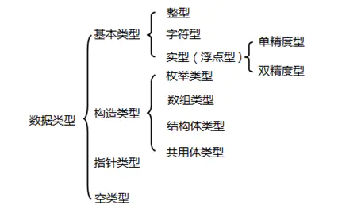
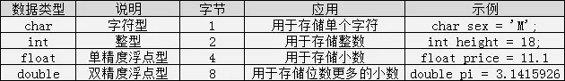
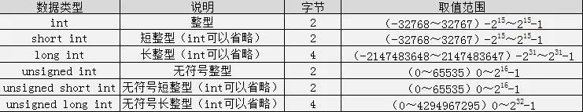

# 仙女的C语言复习材料

一、C语言的结构
1、Hello world
简单来说，一个C程序就是由若干头文件和函数组成。

```cpp
#include<stdio.h>    //包含头文件
/*
 *主函数
*/  
int  main(){
    printf("Hello World");  
    return 0;
}
```
`#include <stdio.h>`就是一条预处理命令，它的作用是通知C语言编译系统在对C程序进行正式编译之前需做一些预处理工作。

函数就是实现代码逻辑的一个小的单元。

注：在最新的C标准中，main函数前的类型为int而不是void。

2、主函数
一个C程序有且只有一个主函数，即main函数。主函数就是C语言中的唯一入口。

3、编写规范
1.一个说明或一个语句占一行，例如：包含头文件、一个可执行语句结束都需要换行；

2.函数体内的语句要有明显缩进，通常以按一下Tab键为一个缩进；

3.括号要成对写，如果需要删除的话也要成对删除；

4.当一句可执行语句结束的时候末尾需要有分号；

5.代码中所有符号均为英文半角符号。

4、注释
```cpp
#include<stdio.h>    //包含头文件
/*
 *主函数
*/  
int  main(){
    printf("Hello World");  
    return 0;
}
```
如上面两种注释//和 /**/。

5、标识符
编程时给变量或者函数起的名字就是标识符，就好比我们慕课网的每一位童鞋都有姓名，姓名就是这位童鞋的标识符。C语言的标识符是不可以随便起名字的，必须遵守一定的规则。

C 语言规定，标识符可以是字母(A～Z，a～z)、数字(0～9)、下划线_组成的字符串，并且第一个字符必须是字母或下划线。在使用标识符时还有注意以下几点：

1.标识符的长度最好不要超过8位，因为在某些版本的C中规定标识符前8位有效，当两个标识符前8位相同时，则被认为是同一个标识符。

2.标识符是严格区分大小写的。例如Imooc和imooc 是两个不同的标识符。

3.标识符最好选择有意义的英文单词组成做到"见名知意"，不要使用中文。

4.标识符不能是C语言的关键字。

6、基本数据类型
在我们玩游戏的时候，游戏中的角色是有类型的，有敏捷型、力量型、法术型等等。同样C语言中的数据也是有类型的，C语言中，数据类型可分为：基本数据类型，构造数据类型，指针类型，空类型四大类。如图所示：

  


这里我们先给大家讲解基本数据类型中最简单也是最常用的整型、实型与字符型。

  


整型数据是指不带小数的数字。生活中有很多信息适合使用整型数据来表示，比如：人的年龄、班级的人数、书的总页数等等。因此整型的类型比较多：

  


注：int、short int、long int是根据编译环境的不同，所取范围不同。而其中short int和long int至少是表中所写范围，但是int在表中是以16位编译环境写的取值范围。另外

c语言int的取值范围在于他占用的字节数 ，不同的编译器，规定是不一样。ANSI标准定义int是占2个字节，TC是按ANSI标准的，它的int是占2个字节的。但是在VC里，一个int是占4个字节的。

浮点数据是指带小数的数字。生活中有很多信息适合使用浮点型数据来表示，比如：人的体重(单位：公斤)、商品价格、圆周率等等。因为精度的不同又分为3种：